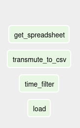
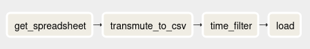

## Brief intro

Hello and welcome to this Airflow tutorial. 

The main point is to introduce you to the quintessential aspects of Airflow in a very practical way, with docker.

A readme with instructions on how to get everything up and running without docker will be provided, but no support, at all, will be given.

I very-ultra-mega-giga-tera-peta highly recommend you to not attempt to install airflow locally. 

git clone from this repo, cd to it's folder in your machine and read the readme: https://github.com/brurucy/airflow-training-public

now, click [here](localhost:8080/) in order to get to the airflow GUI.

---

## What is Airflow?
Let us start by defining airflow on a more meta level, since despite the fact that it sounds very simple, dataflow orchestrator, it doesn't give a proper clue on what it actually does.

Airflow is an intermediate-level tool, that is, it expects you to have some experience with pretty much all data engineering steps, since it's essentially a glue over all of them.

One important thing to take notice is that no data processing happens in airflow, so there's no ~~need for~~ fault tolerance on anything whatsover.

The dataflow is organized as a DAG, Directed Acyclic Graph, with data engineering tasks as nodes, and dependency relationships with edges. Dependency relationships are simple to grasp. If task 1 depends on task 2, then task 2 has to succeed, however, "success" doesn't have to mean that it has been succesfully completed. It can mean that it hasn't been skipped, for instance.

Acyclicity might be the dataflow's least obvious aspect. It has to be an acyclic graph because it cannot handle situations in which tasks might have complex or ambiguous cycles, such as when two tasks might be co dependent and their resolution isn't clear.

---
## What can and can't it do?

In short, Airflow allows you to define data engineering workflows as a DAG. These workflows can have tasks that are run in a specified time and in parallel. 

Airflow does not provide any built-in workflow versioning, it does not have anything specific or special for streaming tasks nor any tools for actually dealing with data in any way.

The reason as to why Airflow does not support streaming is that there are no obvious behavior rules that could be set so that the airflow scheduler could deterministically check if it has been completed or not.

## Airflow architecture

Airflow has three main components:
* Web server - nice GUI with access to the logs and most of Airflow's functionality, such as stopping and clearning DAGs.
* Scheduler - Puts the DAGs to action by coordinating the work to be done
* Workers - do the job assigned by the scheduler.

## The DAG - I
DAGs are written entirely in Python, and have a considerable number of idiosyncrasies. In fact, I'd go as far as to warn anyone thinking of dabbling with airflow to skip the documentation and go straight for the source code. It is very understandable and self explanatory.

The first thing to do is to instance the dag. A common practice is to declare a dictionary with default arguments such as start date, concurrency and schedule interval.

For instance:

```python

default_args_dict = {
    'start_date': airflow.utils.dates.days_ago(0),
    'concurrency': 1,
    'schedule_interval': None,
    'retries': 1,
    'retry_delay': datetime.timedelta(minutes=5),
}

first_dag = DAG(
    dag_id='first_dag',
    default_args=default_args_dict,
    catchup=False,
)
```
An important, and of questionable design, part of airflow, is the relationship between the start date and the schedule interval.

For instance, just by looking at the code, when do you expect the first task run to happen once you start the dag?

If you thought it would **start** at the moment of **start**_date, you thought wrong~~, haha~~, for as it will actually start on start_date + schedule_interval.

There are ~~more than 8000 thousand~~ many questions on stack overflow about this quirkiness, so, don't join them.

Another critical aspect is of catchup. In case you tried to run a DAG, for the first time, with a start date of let's say, 1 month ago, and a schedule interval of 5 minutes, then airflow would generate 8640 runs, which is the amount of 5 minute intervals within a month.

This is very relevant because at some point, you will surely turn the DAG off for whatever reason; Maybe the ETL process inscribed unto it is wrong, needs changing or whatever.

In case you didn't put `catchup=False` you will be in for a treat next time you start it, since airflow will re-run the DAG for $n$ schedule intervals between when you turned it off and the moment of turning it on again. It's easy to see as to how this could become a massive disaster. An example would be of having a DAG task that boots up a generic vm in order to do some processing in it. It could lead to an insane number of vms being booted up that would surely cost a lot of ~~dollars, euros, pounds, pesos or whatever your currency is~~ money.

Let's say that you are a very clever person with extrasensory capabilities and turned catchup off. Now, your tech lead has decided to completely change the etl process, and asked you to migrate not only the dag, but all data that has passed through it. ~~believe me or not, this happens much more often than you'd expect~~

Since you turned catchup off, there are no shanenigans you can pull off that would result in the dag being rerun as you wanted.

Luckily, airflow has a recipe for that, and it's called backfilling. You can call the command `backfill -s START_DATE -e END_DATE dag_id` from the cli, and it will rerun any dag with the specified dates, and that way you can very effortlessly satisfy your tech lead's needs. 

## The DAG - II

Most of the stuff in default_args will be propagated to all tasks. A more real-life-and-non-trivial example of what could be in default args are callbacks.

Let's say that you would like to be warned in case ~~shit~~ something bad happens. Maybe a very important ETL process is contained in there, and no downtime, at all, is acceptable. 

So you decide to implement a `slack webhook callback` where your bot will take the airflow context, at the time of failure, and then post it on a channel, possibly waking you up in the middle of your beauty sleep.

We can define it, very simply, as follows:

```python
default_args = {
    'owner': 'airflow',
    'start_date': datetime.datetime(2020, 8, 7, 12, 10, 5),
    'retries': 0,
    'on_failure_callback': task_fail_slack_alert,
}
```
With a message somehow like this:
```python
def task_fail_slack_alert(context):
    slack_msg = """
            :red_circle: Task Failed <@U01735GUB9C>
            *Task*: {task}  
            *Dag*: {dag} 
            *Execution Time*: {exec_date}  
            *Log Url*: {log_url} 
            """.format(
        task=context.get('task_instance').task_id,
        dag=context.get('task_instance').dag_id,
        ti=context.get('task_instance'),
        exec_date=context.get('execution_date'),
        log_url=context.get('task_instance').log_url,
    )
```
In this case we take only one argument: context.

The task context is a magical element that is always available during runtime, and allows access to multiple variables such as the **task** execution date, the previous task execution date and statuses about the run. It is especially useful during callbacks and logging.

We could send the message to slack with the following bit of code, that would also be within the `task_fail_slack_alert` function:

```python
failed_alert = SlackWebhookOperator(
        task_id='slack_failure_alert',
        http_conn_id='slack_connection',
        message=slack_msg,
        username='airflow',
        icon_url='https://airflow.apache.org/_images/pin_large.png',
        channel='#airflow-warnings',
        dag=dag)
    return failed_alert.execute(context=context)
```

Do not try to understand everything that is going on, since operators were not introduced yet, however, believe me, that all we are doing is defining a task, that accesses Slack's incoming webhooks API, and then executing this task.

An important, and non-trivial fact, is that the airflow `context` leans heavily on the usage of closures, so attention must be paid in order for the code to not look too unpythonic or cryptic. It's also worth pointing out that callbacks must always be given as function objects. Do not put () there. 

## The DAG - III

Recapping our first DAG's default_args_dict definition:
```python
default_args_dict = {
    'start_date': airflow.utils.dates.days_ago(0),
    'concurrency': 1,
    'schedule_interval': None,
    'retries': 1,
    'retry_delay': datetime.timedelta(minutes=5),
}
```
The start date is defined in a weird way. 

We are calling the function `airflow.utils.dates.days_ago(0)` that dynamically gets the datetime and sets it to be the current date. Airflow has a series of utility functions that aid you with tasks that might require some more specific knowledge.

In short, the `util.dates` series of functions translate the given datetime into crontab expressions. 

Cron is, probably, the first job scheduler for *nix systems, and airflow is very often used as a step-up for when cron jobs just don't cut anymore. 

Crontab is a file where we write commands for cron. It's similar in point to the DAG, which we must write so that the airflow scheduler can figure out the order, sequence and time to run the tasks.

The catch is how dates are defined in cron, which isn't very intuitive, so, please take note of this [website](https://crontab.guru/#0_0_*_*_*) that allows you to test out, and see, the logic of crontab's datetime mechanism.

It's not considered to be good practice to use these `utils.dates` functions, since it's very easy to make non-obvious mistakes due to non-obvious behavior, due to how some things in airflow are called at runtime, and others at dag-load time.

For instance, let's say that you want to run something with 1 week intervals, starting from today. Naively, you might use the `utils.dates.days_ago(0)` function, and set schedule_inteval to be 7 days long. 

Surprisingly, your dag will never actually run, since it'll never detect that a week-long interval has passed because `utils.dates.days_ago(0)` moves along the time, but the initial `utils.dates.days_ago(0) + schedule_interval` doesn't. This is very confusing, so, just trust me.

Now, one of the least relevant, but still worth mentioning, tidbits about airflow, is how it uses the [pendulum](https://pendulum.eustace.io/docs/#introduction) library. The only thing you need to know, is that Pendulum replaces python's datetime with more timezone-aware ones. It's completely drop in, so you will not notice anything.

You might be wondering what's the point of being able to declare the schedule interval with `timedelta` instead of cron expressions, and the point is that cron expressions can be quite limiting. It's not a good idea to run airflow jobs with very small schedule intervals, such as subminute, but in case you want to do that, it is possible, just not with cron expressions.

## The DAG - IV

Having all the basics about the DAG down, we can now check out other arguments which might be of use.

* `max_active_runs`: maximum amount of concurrent dag runs. Let's say that you want to run some ETL process in 1 hour intervals, however the process itself might take slightly longer than 1 hour. You can postpone the next run to only start when the previous has been finished by setting `max_active_runs = 1`
* `is_paused_upon_creation`: when creating a dag and putting it in the dagbag, it is enabled by default. It's good to have in mind that that behavior can be modified.
* `end_date`: everything that has a start, has an end. This argument is of **utmost importance** once you start to use Airflow in a very advanced level, and you generate DAGs dynamically. You do not want dynamically generated DAGs to be hovering around forever.
* `orientation`: How would you want the graph view to be oriented? from left to right, default, right to left, up to down, and down to up.
* `on_success_callback`: Maybe you want to make logs about successful tasks. Airflow already logs everything, so this might be kind of useless, nevertheless, this also allows you to ping some external API and pass some more specific `context` options.

## Operators - I

Having had a throughout view of the DAG, it is now time to populate it with nodes. Operators are the nodes of the dag, and represent tasks. Whenever we add a DAG to the dagbag, all declared operators go through a sanity check in order to affirm that the DAG has no cycles or odd constructs.

The simplest, yet not useless, operator that there is, is the dummy:

```python

task_one = DummyOperator(
    task_id='get_spreadsheet',
    dag=first_dag,
    depends_on_past=False,
)

```

Operators are declared similarly as dags, and only require two arguments at first:

* `task_id` = unique id for the operator 
* `dag` = which dag does does this operator belong to? 

the `dag` argument might seem weird. We know that we write code to be run in airflow as a DAG, so shouldn't it be implicit that all operators within that file are within the defined DAG?

Not really, because there can be sub-dags. Sub dags are dags within dags, and are considered a bad practice, due to one of Airflow's biggest painpoints: deadlocks. 

Deadlocks happen when some subprocess stops everything downstream of it in a very non-obvious way. This is quite an "advanced" level Airflow worry so there's no need for us to talk about it except from a high-level standpoint.

Coming back to the dummy operator, it might seem that it does nothing. In fact, it indeed does nothing, within the context of whichever data processing might be happening, but it can be used to do two things:

* sketching a dag out
* trigger rule sorcery

More often than not we would like to visualize an ETL process in the least time-wasting manner as possible. There are a dozen of ways you could do that, such as google docs, hand-written notes, paint, google slides and so on. A better way of doing it, would be of directly sketching things out on Airflow.

At first, you can simply declare a bunch of dummy nodes with nothing but task ids in it:



Now, we can set up some relationships. We want to show that the ETL process starts with `get_spreadsheet`, then its format is transmuted to a proper csv on `transmute_to_csv`, which is then filtered by time, `time_filter` to be loaded somewhere,`load`.

The directed relationships are given by the edges, and are very easily defined as follows, written at the end of the DAG file:

```python

get_spreadsheet >> transmute_to_csv >> time_filter >> load

```

Will yield the following sequential configuration:



We can sketch virtually any combination of tasks which are runnable by airflow. 

Let's say that you have to create an ETL process entirely done in the cloud, and we define the following tasks:

* `dataproc_start` - we use the google CreateDataProc operator in order to start a dataproc cluster that will be used to run pyspark scripts.
* `submit_ingest_one` - next up we create a data processing step to submit a pyspark job that will ingest data from somewhere, and will also be processed further. However, we want to make it so that if this fails, then whatever comes next fails as well.
* `submit_ingest_two, submit_ingest_three` - the same as `submit_ingest_one` except no other process depends on it
* `coalesce` - after all tasks have finished their execution, we would like to turn off the cluster.

We could define that with the following edge configuration:

```python

dataproc_start >> [dataproc_ingest_one, dataproc_ingest_two, dataproc_ingest_three]
dataproc_ingest_one >> dataproc_create_clickout
[dataproc_create_clickout, dataproc_ingest_two, dataproc_ingest_three] >> end

```

many-to-one or one-to-many relationships are encoded as lists, so you can put to code that many nodes have an edge to one node as follows:

```python

[node_1, node_2, node_3] >> node_4

```

and one to many:

```python

node_1 >> [node_2, node_3, node_4]

```

 

A rule of thumb when dealing with airflow, is to not take things literally. 

The last argument in our operator definition is: `depends_on_past=False`. That's a very puzzling statement~~given we live in a universe where our data is encoded, as far as I'm aware of, in 3 spatial dimensions and a single time one. Can Airflow break space-time?~~ which if taken literally, might make it seem that the current task will run without any regard to what happened upstream. 

In reality, it means that if it failed **during the previous dag run** then it won't run this time. This is important because, as we've seen, airflow can have overlapping dag runs.

## Trigger Rules

The second point that we talked about, joining, requires a proper understanding of airflow's last elementary aspect, Trigger rules. Trigger rules are, in airflow-speech, a name for how should the node at the end of the edge behave when some exit status comes out of its parents.

We can see an example of that by coming back to `depends_on_past=False`. Our first assumption was that it would enable the node to carry on with the dag irrespective of its parents' runs being successes or failures. This sort of behavior is determined by trigger rules, and the default is to only proceed if all parents were successful.

Let us define a non-dummy operator, that runs a bash command:

```python

task_one = BashOperator(
    task_id='get_spreadsheet',
    dag=first_dag,
    bash_command="curl http://www.gerbode.net/spreadsheet.xlsx --output /usr/local/airflow/data/{{ds_nodash}}.xlsx",
    depends_on_past=False,
	trigger_rule='all_success'
)


```

There's quite a lot to unpack here, but it does look similar to what we have seen before.

* `bash_command`- in case you know bash, you have already figured it out that this works almost exactly as typing `bash -c "some command"`

Most of airflow's operators function in a similar way. 

* `PythonOperator` allows you to run Python code
* `BashOperator` allows you to run shell scripts
* `PostgreSQL` allows you to communicate with postgres instances.

If you take a look at the bash command:

```bash
bash_command="curl http://www.gerbode.net/spreadsheet.xlsx --output /usr/local/airflow/data/{{ds_nodash}}.xlsx"
```

There's something weird.

Let's take a closer look:

```bash

http://www.gerbode.net/spreadsheet.xlsx --output /usr/local/airflow/data/{{ds_nodash}}.xlsx

```

Even closer:

```
{{ds_nodash}}
```

That just doesn't look like actual bash.

This happens to be either something that you will love, or hate.  That's `jinja2` templating, and it's absolutely inescapable from just about everything in python, so in case you plan to become a professional pythonista, I'd highly recommend you to becoming a **jinja ninja**.

Nevertheless, all we need to know about jinja is that it allows us to access pretty much all runtime variables of airflow during runtime.

Whenever a bash command is executing, it will access the **airflow context** object, and get the date of execution without dash.

It'll turn it into something like this, before executing the command:

```bash

http://www.gerbode.net/spreadsheet.xlsx --output /usr/local/airflow/data/20200828.xlsx

```

There many variables that we can access from runtime with templating, such as:

* dag - the current dag object
* task - the current task object, as we've used in the slack example, where we got the logs, execution date and else.
* ds, execution date, next_ds execution dates. ds = current task execution date, previous task execution date, and next task execution date.

Now that we understand how to use templating, it's time to back and add a trigger rule. Trigger rules can be added to any operator with the argument `trigger_rule`, and there are quite a couple for you to choose from, out of which the following are easily exemplified:

* `all_success` - use this when you want everything to work in the most obvious way as possible, and whatever you are doing happens to be very linear.
* `all_done` - this is very often used whenever there's a cluster start or end job. For instance, let's say that irrespective of the parent tasks status, given that they have finished their execution, you would like this task to run anyways. It's commonly used to shut down a cluster.
* `none_failed` - is most often than not paired with the branching operator. Maybe you will need to send the data through a different path in the dag and thus it is acceptable to skip a chunk of it. If you want your dag execution to continue, you have to make it so that the parent tasks were either skipped or successfully completed.
* `all_failed` - ~~pair this one up with a callback so you can notify yourself of getting fired~~

## Operators - II

The last part we have to go over is both the briefest and most important, the Python Operator:

```python

task_one = PythonOperator(
    task_id='get_spreadsheet',
    dag=second_dag,
    python_callable=_get_spreadsheet,
    op_kwargs={
        "output_folder": "/usr/local/airflow/data",
        "epoch": "{{ execution_date.int_timestamp }}",
        "url": "http://www.gerbode.net/spreadsheet.xlsx"
    },
    trigger_rule='all_success',
    depends_on_past=False,
)


```

At first it might seem very similar to the bash operator, having `task_id`, `dag`, `trigger_rule` and `depends_on_past`, as pretty much any other operator, but it also has something which resembles the very first slack operator example: it takes a function as an input.

The python callable is where the python part of the python operator lies at, and it has a naming convention of adding underscore before the task_id:

```python

def _get_spreadsheet(epoch, url, output_folder):
    request.urlretrieve(url=url, filename=f"{output_folder}/{epoch}.xlsx")

```

The callable's arguments are given by the `op_kwargs` dictionary.

It's important to notice that you cannot use jinja templates inside the python callable. In fact, that's the whole point of op_kwargs. Not only does it allow you to specify the arguments to the callable, but also allows you to template these arguments.

## Appendex

pg_connection_default:

conn id: postgres_not_default

conn type: Postgres

host: postgres

schema: postgres

login: airflow

password: airflow

port: 5432

crontab website:

https://crontab.guru/#0_0_*_*_*