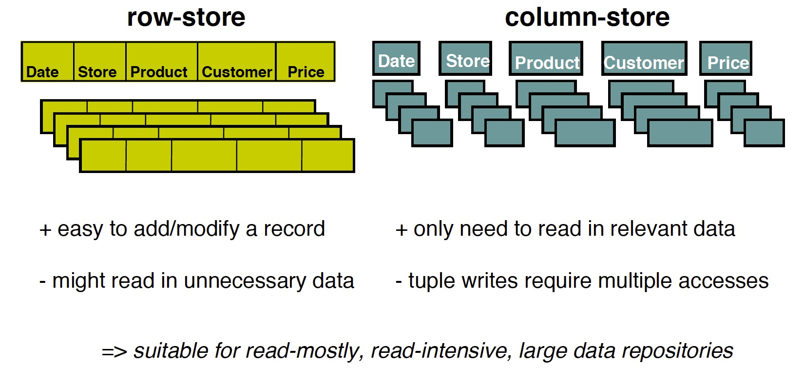
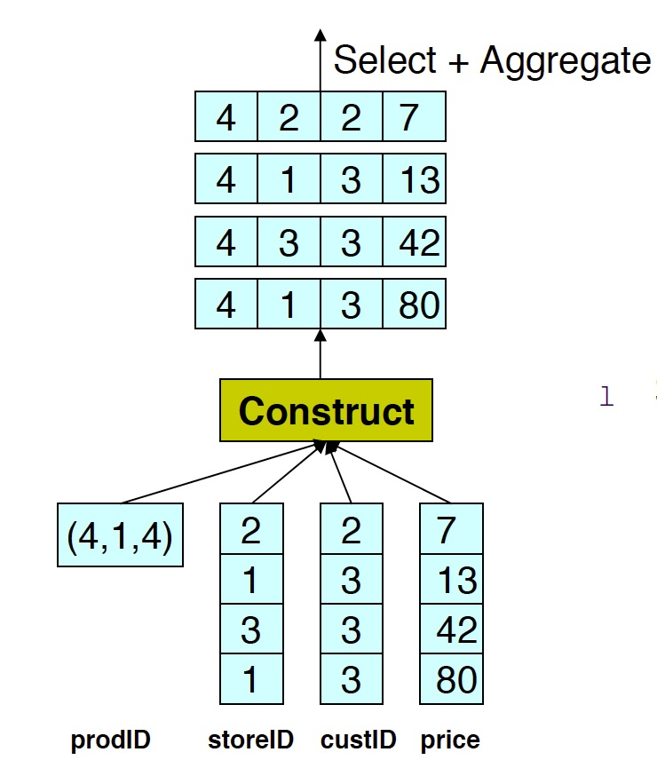
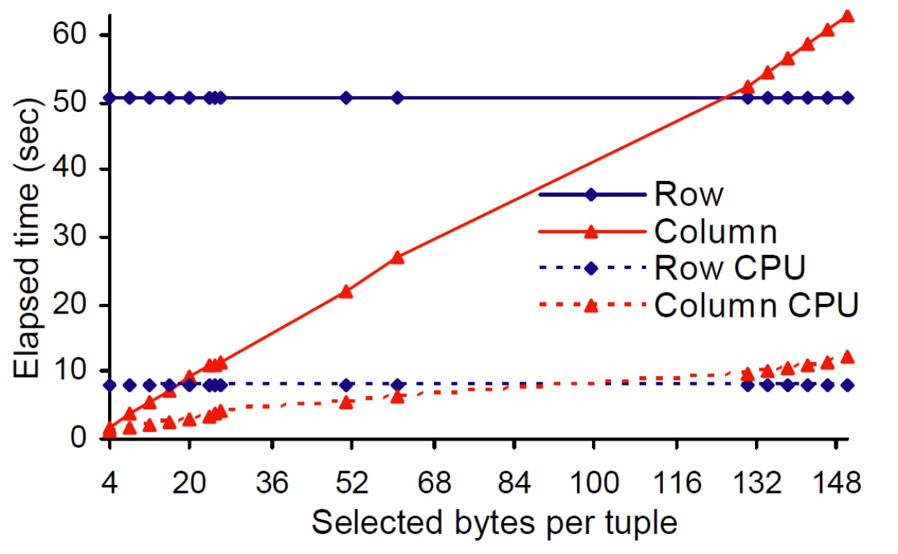
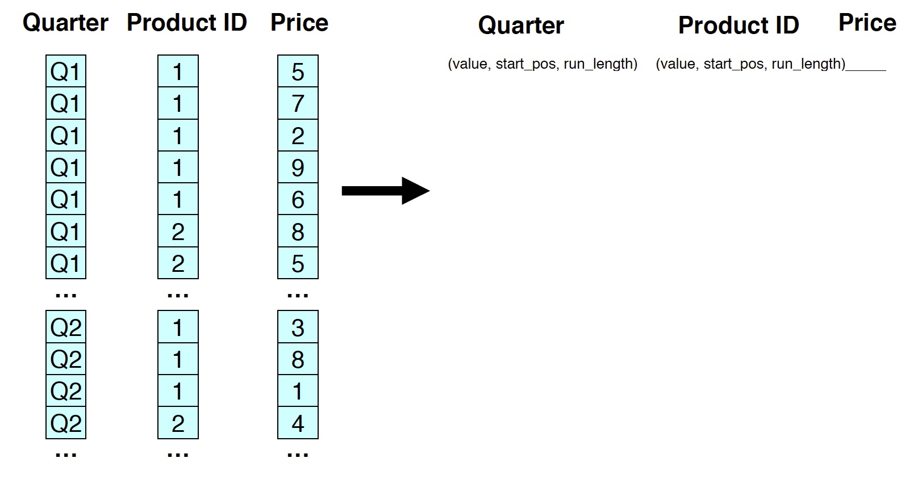
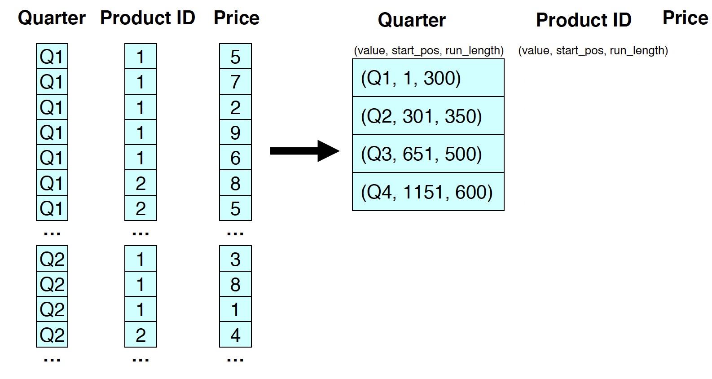
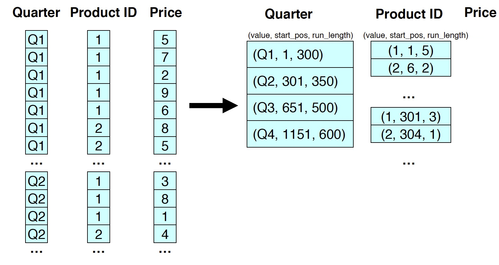
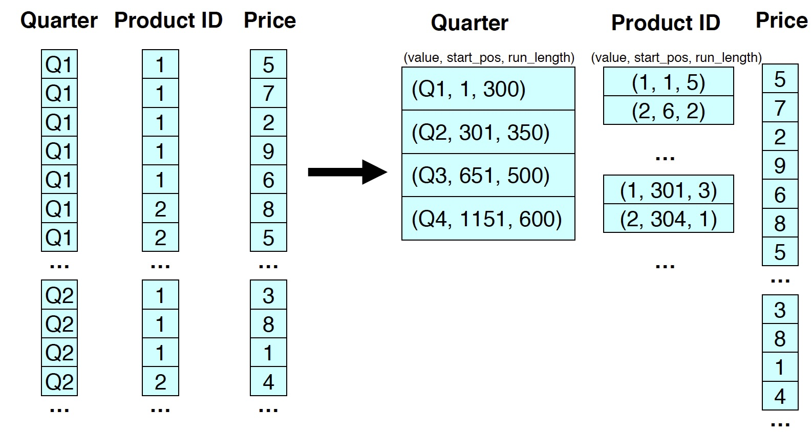

# Column Oriented Database

The approach to store and process data by column instead of row has its origin in analytics and business intelligence

Column-stores operating in a **shared-nothing** massively parallel processing architecture can be used to build high-performance applications.

The class of column-oriented stores, which sees in Google's BigTable it's first member, is seen less puristic, also subsuming datastores that integrate column- and row-orientation.

### Column storage

### Pros and Cons

[.column]

- Data compression
- Improved Bandwidth Utilization
- Improved Code Pipelining
- Improved cache locality

[.column]

- Increased Disk Seek[^70] Time
- Increased cost of Inserts
- Requires disk prefetching
- Adds tuple reconstruction costs

[^70]:  Seek time is the time taken for a hard disk controller to locate a specific piece of stored data

### Tuple Reconstruction

[source](http://nms.csail.mit.edu/~stavros/pubs/vldb2006.pdf)

^ 
- Large prefetch hidesdisk seeks in columns.
- As expected, the row store is insensitive to projectivity (since it reads all data anyway), and therefore its curve remains flat. 
- The column store, however, performs better most of the time, as it reads less data.
- The column store starts performing worse than the row store when it is selecting more than 85% of a tuple’s size

## Compression

- Increased column-store opportunities
    - Higher data value locality in column stores
    - Can use extra space to store multiple copies of data in different sort orders
    - Techniques such as run length encoding far more useful

 
**Extra Available**[Paper Summary](http://citeseerx.ist.psu.edu/viewdoc/download?doi=10.1.1.296.6581&rep=rep1&type=pdf)

### Example (String): Run-Length Encoding
    
> aaaabbbbbbbbbbbbbcccccccdddddddeeeeeddddd
  
> 4a13b7c7d5e5f

### Example (DB): Run-Length Encoding

### Compression: Run-Length Encoding

### Compression: Run-Length Encoding

### Compression: Run-Length Encoding

## List of Databases

- **[[Cassandra]]**
- Vertica
- SybaseIQ
- C-Store
- BigTable/[[HBASE]]
- MonetDB
- LucidDB

