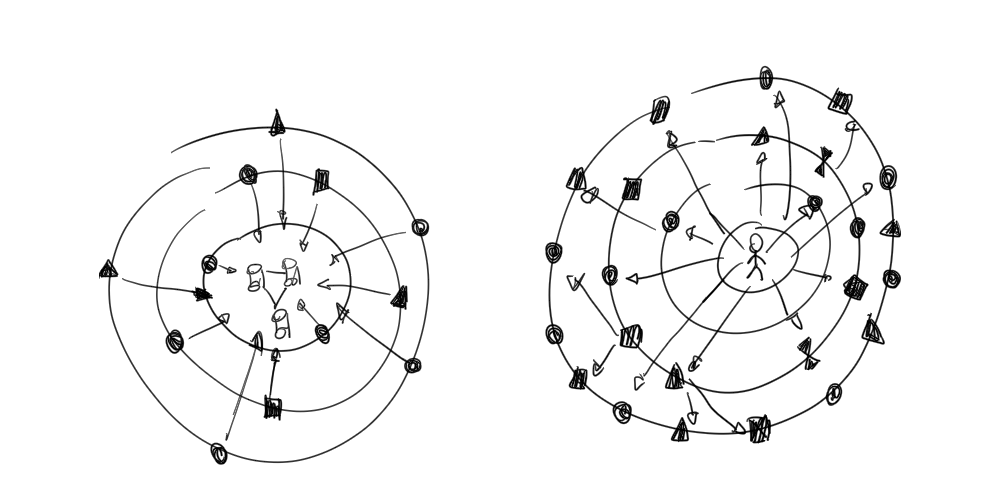

# Dagsthul on Edge Computing

## Organizers

- [[Angela Bonifati]]
- [[Martin Strohbach]]
- [[Ruben Mayer]]

## Topic: [[Edge Computing]]

## Invitee

- Salvatore Distefano #stream and #edge
- Ganesh Ananthanarayanan #edge 
- Monica Wachowicz  #stream and #edge
- Mahadev Satyanarayanan #edge (top)
- Paris Carbone #stream (also friend )

### Friends

- Alessandro Margara
- Emanuele Della Valle
- Femke
- Vasia

## Notes

The abundance of IoT and mobile devices is causing a paradigm shift. The edges of the computing network are rapidly going at the center of the attention. As vast data streams are continuously generated, the bandwidth for gathering these data is often insufficient. On the other hand, mobile device and sensors show growing computational capabilities. 

In such scenario, the best practice changes from *gathering the data to the data center (left)* to *pushing the computation as close as possible to the source (right)*. Although the idea is very simple, it is revolutionary in principle.  In fact, it simultaneously unveils new opportunities but requires to face new challenges.

In particular, the infrastructure becomes part of the systems. However, the environment in decentralised by design and, thus, not homogeneous, nor reliable, nor synergic (i.e., the devices are not necessarily design to cooperate and data/system integration is not granted). Moreover, a single system that does a first step towards a the Edge Computing original vision is still missing.

Perhaps, the silver bullet is actually a unicorn, and a layered solution that uniforms and orchestrates the various devices is more adequate.

Therefore, we believe that the following fundamental questions shall be answered:

- Q1:  what is on the top level of this hierarchical solution?
	- programming models, query languages, data visualizations
	- interaction style (declarative/imperative)
	- goal: analytics, BI, AI?
- Q2: what is on the bottom of this hierarchical solution:	
	- the network? the bare metal edge device? a container? an operator in the physical plan of the workload?
- Q3: What and how many layers are in between? 
	- this relates to data integration (Pay as you go) and cost models.
	- data management 
	- Also naming and discovery of sources

Additionally, an orthogonal question raises about the business  models and opportunities. 

In this regards, the seminar will focus on following these key topics:

- Programming Models and Abstractions
- Deployment Models 
- Data Management and Analytics

Although it is premature to speak about benchmarking, performance assessment is in the scope of the seminar, which can build on the lessons learned in the fields of stream and graph processing and IoT.

