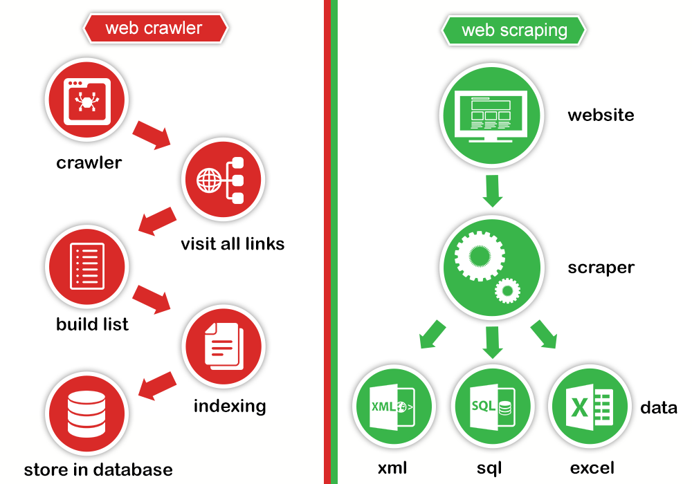

---
aliases: [Data scraping]
---

### Definition

**Data Crawling** means dealing with large data sets where you develop your crawlers (or bots) which crawl to the deepest of the web pages. 

**Data scraping**, on the other hand, refers to **retrieving information** from any source (not necessarily the web).

---

<<[World Wide Web](World%20Wide%20Web.md)

---
### Crawler vs Scraper

[.column]

A crawler gets web pages -- i.e., given a starting address (or set of starting addresses) and some conditions (e.g., how many links deep to go, types of files to ignore) it downloads whatever is linked to from the starting point(s).

[.column]

A scraper takes pages that have been downloaded or, in a more general sense, data that's formatted for display, and (attempts to) extract data from those pages, so that it can (for example) be stored in a database and manipulated as desired.

---

---
### Robot.txt

Many sites include a file named [robots.txt](http://www.robotstxt.org/orig.html) in their root (i.e. having the URL `http://server/robots.txt`) to specify how (and if) crawlers should treat that site -- in particular, it can list (partial) URLs that a crawler should not attempt to visit. These can be specified sseparately per crawler (user-agent) if desired.

