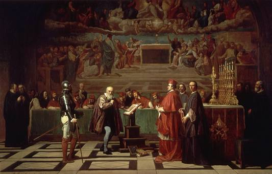
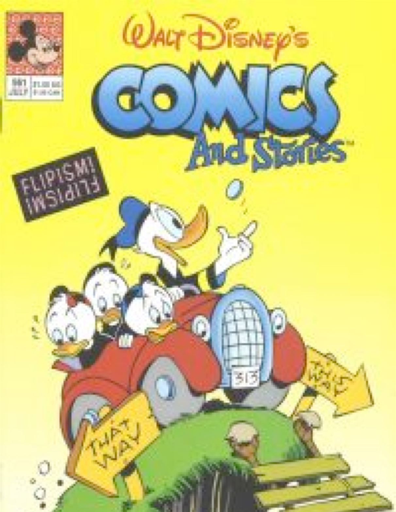
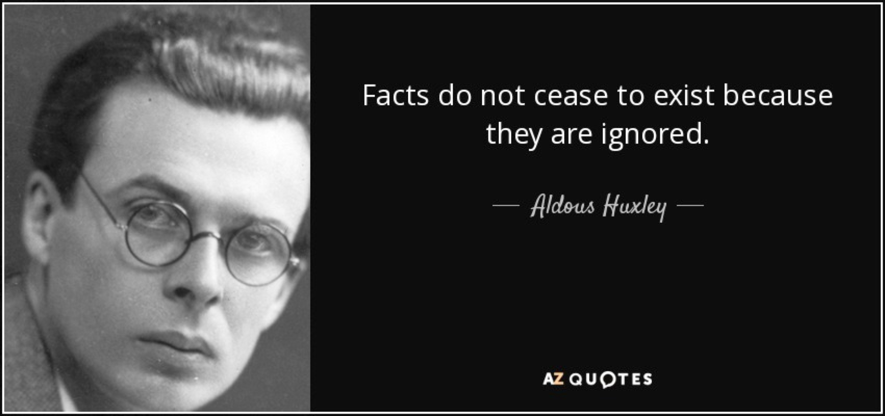
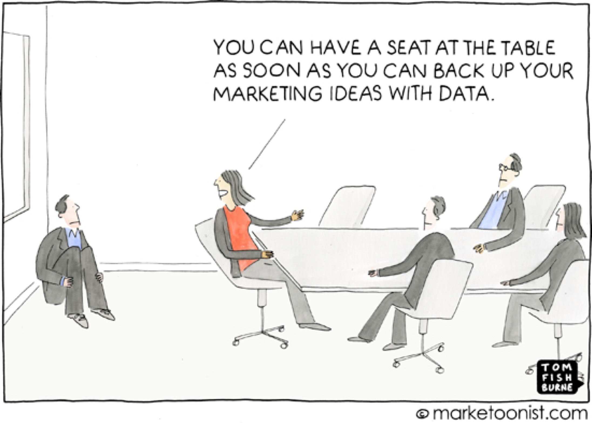

footer:  Emanuele Della Valle - emanuele.dellavalle@p![[Processing and Querying.png]]olimi.it - @manudellavalle - [http://emanueledellavalle.org](http://emanueledellavalle.org)
slidenumbers: true
slide-transition: fadeThroughColor(#ffffff)
# Data-driven Decision Making for Data-driven Organiza5ons 

### Taking Decisions 
In many organizations decisions are made by "questionable" methodologies such as 
- Highest Paid Person Opinion (HiPPO) - 
- Flipism (all decisions are made by flipping a coin) 

### Taking Decisions: HiPPO vs Flippism

### Taking Decisions:  

### Taking Decisions (cont.) 
- In many organizations decisions are made by "questionable" methodologies such as 
	- Highest Paid Person Opinion (HiPPO) 
	- Flipism (all decisions are made by flipping a coin) 
- This could have been the right approach in the '70s ... 
	- See the "Theory of Bounded Rationality" by Herbert Simons 

### Taking Decisions (cont.) 

### Taking Decisions (cont.) 
- In many organizations decisions are made by "questionable" methodologies such as 
	- Highest Paid Person Opinion (HiPPO) 
	- Flipism (all decisions are made by flipping a coin) 
- This could have been the right approach in the '70s ... 
	- See the "Theory of Bounded Rationality" by Herbert Simons 
	- ... but in the Digital Era one can dream of data-driven organization 

### Taking Decisions: data-driven organization !

### Data-Driven Decisions 
**Decisions** no longer have to be made in the dark or based on gut instinct; they can be based on** evidence, experiments** and more **accurate** forecasts. 
																										-- McKinsey 
### Data-driven organiza/ons 
- perform better 
	-  The data shows where they can streamline their processes 
-  are operationally more predictable 
	-  Data insights fuel current and future decision making 
-  are more profitable 
	-  Constant improvements and better predictions help to outsmart the competition and improve innovation. 

### The Moneyball case 
Winning 20 consecutive games by building a team of undervalued talent by using data science to scouting and analyzing players. 

### Credits 
- [Becoming a data-driven organiza?on The what, why and how. SAS, 2018 ](https://www.sas.com/en_us/whitepapers/becoming-data-driven-organiza?on-109150.html)
- [The Age Of Analytics: Competing In A Data-driven World. McKinsey, 2016](http://www.mckinsey.com/business-func?ons/mckinsey-analy?cs/our-insights/the-age-of-analy?cs-compe?ng-in-a-data-driven-world )