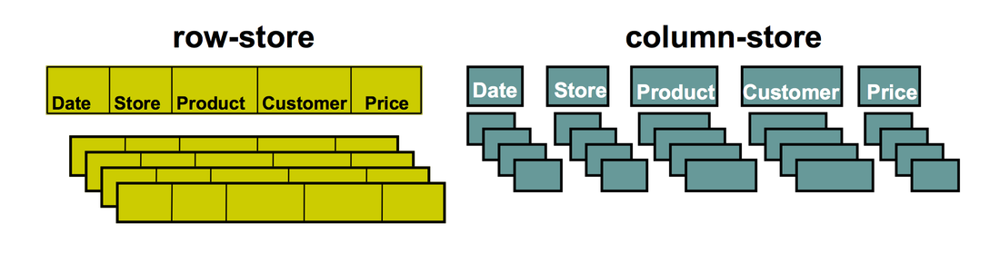

# Data Modeling for Data Warehouses

- Works in phases related to the aforementioned levels of abstractions
- Less diversity in the data model, usually relational in the form of a star schema (also known as dimensional modeling[^41]).
- Redundancy and incompleteness are not avoided, fact tables often have over 100 columns, sometimes several hundreds.
- Optimized for OLAP

^ 
- The data model of a data warehouse is most commonly relational, because SQL is generally a good fit for analytic queries.
- Do not associate SQL with analytic, it depends on the data modeling. 

[^41]: Ralph Kimball and Margy Ross: The Data Warehouse Toolkit: The Definitive Guide to Dimensional Modeling, 3rd edition. John Wiley & Sons, July 2013. ISBN: 978-1-118-53080-1

### A Star is Born

[.column]

[.column]

### A Star is Born

[.column]

[.column]

### Dimensional Modelling

Four-Step Dimensional Design Process

1. Select the business process.
2. Declare the grain.
3. Identify the dimensions.
4. Identify the facts.

[Mandatory Read](http://www.kimballgroup.com/wp-content/uploads/2013/08/2013.09-Kimball-Dimensional-Modeling-Techniques11.pdf)

^ 
- **Business processes** are crtical activities that your organization performs, e.g., registering students for a class.
- The **grain** establishes exactly what a single fact table row represents.  Three common grains categorize all fact tables: transactional, periodic snapshot, or accumulating snapshot. 
- **Dimensions** provide contex to business process events, e.g.,  who, what, where, when, why, and how. 
- :wq
- **Facts** are the measurements that result from a business process event and are almost always numeric. 

### Dimensional Modelling: Fact Table

A **fact table** contains the numeric measures produced by an operational measurement event in the real world. 

A **single fact** table row has a one-to-one relationship to a measurement event as described by the fact table’s grain.

A **surrogate key** is a unique identifier that you add to a table to support star schema modeling. By definition, it's not defined or stored in the source data

### Dimensional Modelling: Dimension Table

Dimension tables contain the descriptive attributes used by BI applications for filtering and grouping the facts. 

Every dimension table has a single **primary key** column , which is embedded as a foreign key in any associated fact table.

### The 5/10 Essential Rules of Dimensional Modeling (Read)[^42]

1. Load detailed atomic data into dimensional structures.
2. Structure dimensional models around business processes.
3. Ensure that every fact table has an associated date dimension table.
4. Ensure that all facts in a single fact table are at the same grain or level of detail.
5. Resolve many-to-many relationships in fact tables.

### The 10/10 Essential Rules of Dimensional Modeling (Read)[^42]

6. Resolve many-to-one relationships in dimension tables.
7.  Store report labels and filter domain values in dimension tables.
8.  Make certain that dimension tables use a surrogate key.
9.  Create conformed dimensions to integrate data across the enterprise.
10. Continuously balance requirements and realities to deliver a DW/BI solution that’s accepted by business users and that supports their decision-making.

[^42]:https://www.kimballgroup.com/2009/05/the-10-essential-rules-of-dimensional-modeling/

### The Traditional RDBMS Wisdom Is (Almost Certainly) All Wrong[^43]

[^43]: Source with slides: [The Traditional RDBMS Wisdom Is (Almost Certainly) All Wrong,” presentation at EPFL, May 2013](http://slideshot.epfl.ch/play/suri_stonebraker)

### A note on Storage

- Data warehouse typically interact with OLTP database to expose one or more OLAP system. 
- Such OLAP system adopt storage optimized for analytics, i.e., Column Oriented
- The column-oriented storage layout relies on each column file containing the rows in the same order.
- Not just relational data, e.g., Apache Parquet

