# Data Modeling for Databases

- Works in phases related to the aforementioned levels of abstractions[^31]
- Uses different data models depending on the need:
	- Relational, Graph, Document...
- Tries to avoid two major pitfalls:
	- **Redundancy**: A design should not repeat information
	- **Incompleteness**:  A design should not make certain aspects of the enterprise difficult or impossible to model
- Optimized for OLTP
	
[^31]: Also known as Database Design

^ The biggest problem with redundancy is that information may become inconsistent in case of update

---

Before, let's refresh

---

###

## Relational Database

A relational database consists of…
-  a set of relations (tables)
- a set of integrity constraints

If the database satisfies all the constraints we said it is in a valid state.

An important distinction regards the **database schema**, which is the logical design of the database, and the **database instance**, which is a snapshot of the data in the database at a given instant in time.

## Relational Model [^32]

A formal mathematical basis for databases based on set theory and first-order predicate logic

Underpins of SQL 

[^32]: Extra Read [Codd, Edgar F. "A relational model of data for large shared data
banks." Communications of the ACM 13.6 (1970): 377-38z](https://course.ccs.neu.edu/cs3200sp18s3/ssl/readings/codd.pdf)

### Relation

> Relation R is a set of tuples (d1, d2, ..., dn), where each element dj is a member of Dj, a data domain.

 

> A Data Domain refers to all the values which a data element may contain, e.g., N.

Note that in the relational model the **term relation is used to refer to a table**, while the term **tuple is used to refer to a row**

^ In mathematical terms, a tuple indicates a sequence of values. 
A relationship between n values is represented mathematically by an n-tuple of values, that is, a tuple with n values, which corresponds to a row in a table.

---

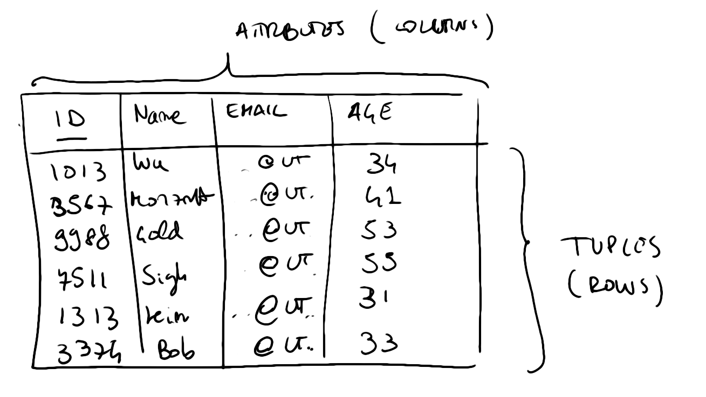

---

### Relation Schema

-  corresponds to the notion of **type** in programming languages
-  consists of a list of **attributes** and their corresponding domains
-  a **relation instance** corresponds to the programming-language no- tion of a value of a variable

---

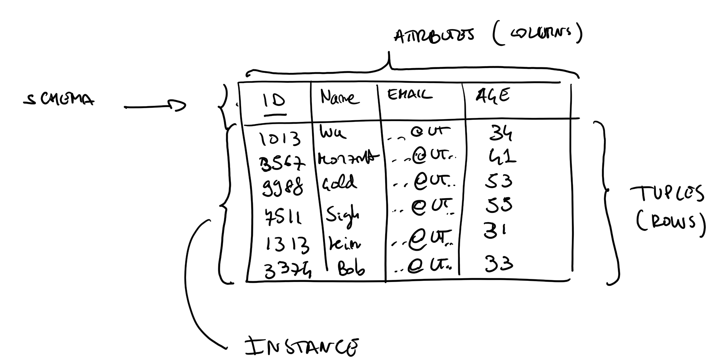

### Keys

- A **superkey** is a set of one or more attributes that, taken collectively, allow us to identify uniquely a tuple in the relation
- **candidate keys** are  superkeys for which no proper subset is a superkey
-  primary key is the chosen candidate key
-  foreign key is s set of attributes from a referenced relation.

^ If K is a superkey, then so is any superset of K

---

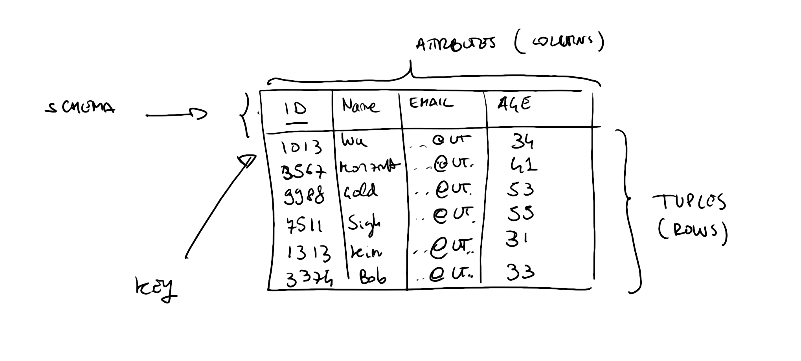

---

### [[Relational Algebra]] (On Practice)

is a procedural language consisting of a six basic operations that take one or two relations as input and produce a new relation as their result:

- select: σ
- project: ∏
- union: ∪
- set difference: –
- Cartesian product: x
- rename: ρ

^ Question: What is an algebra?

---
### Two Sets
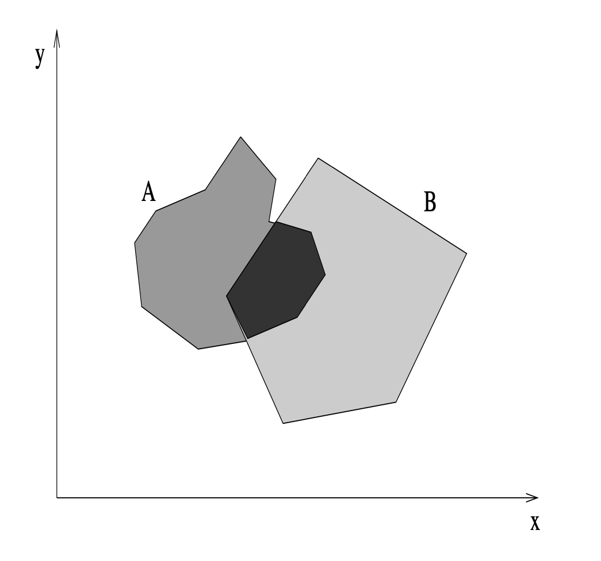

---

### Intersection

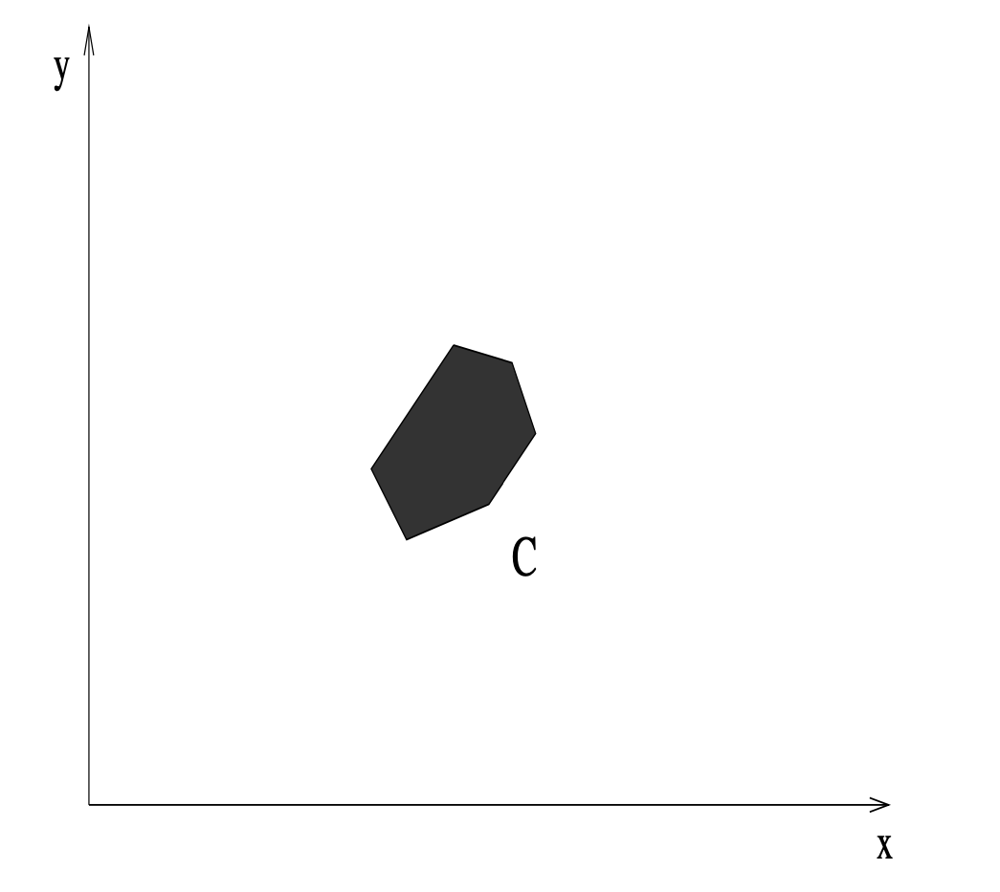

---
### Difference
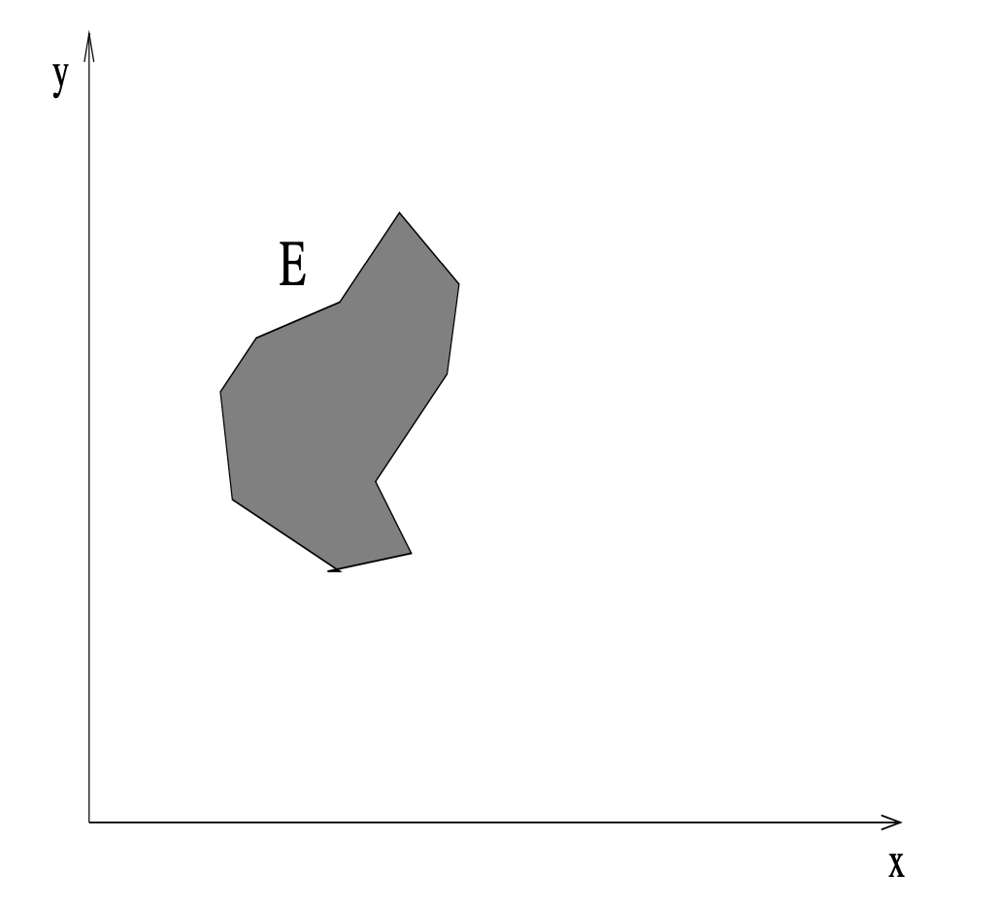

---
### Union

---

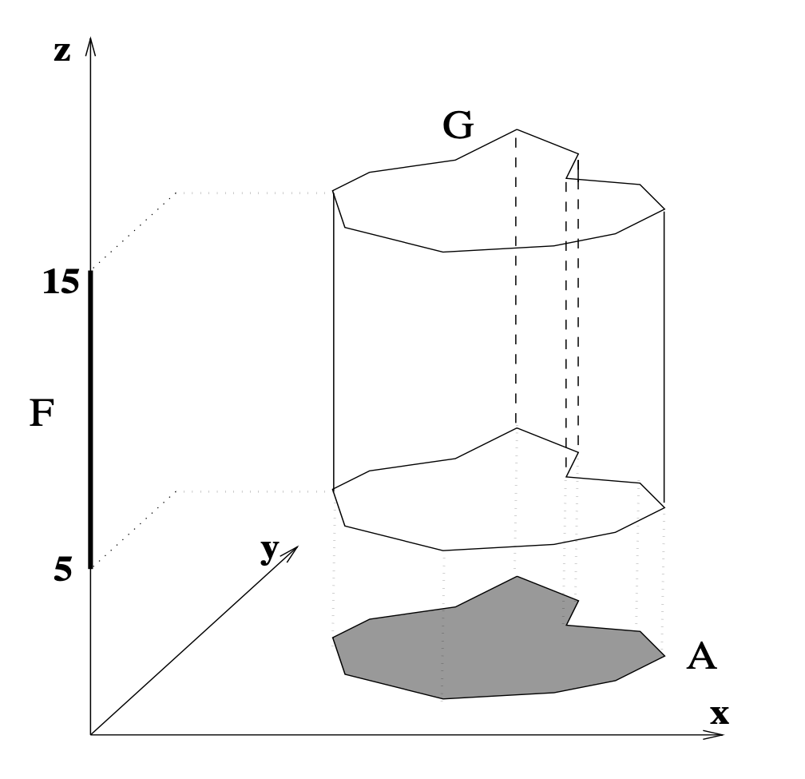

---
### Projection

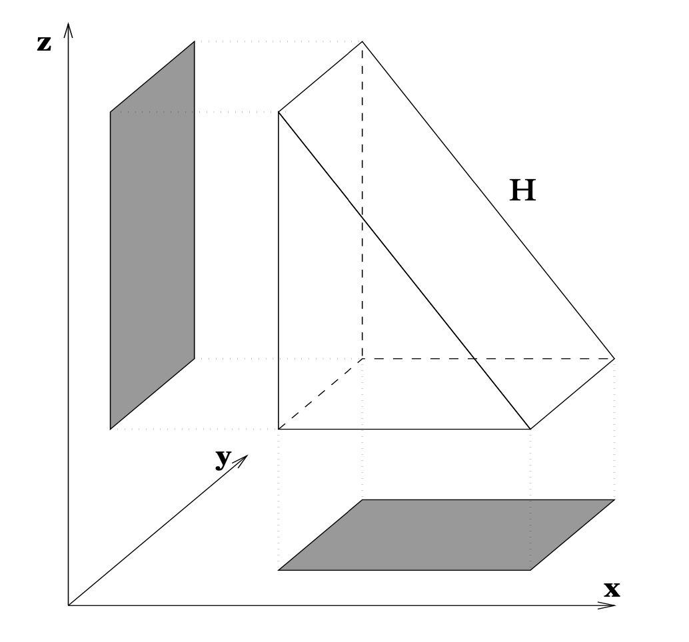

---
### Selection
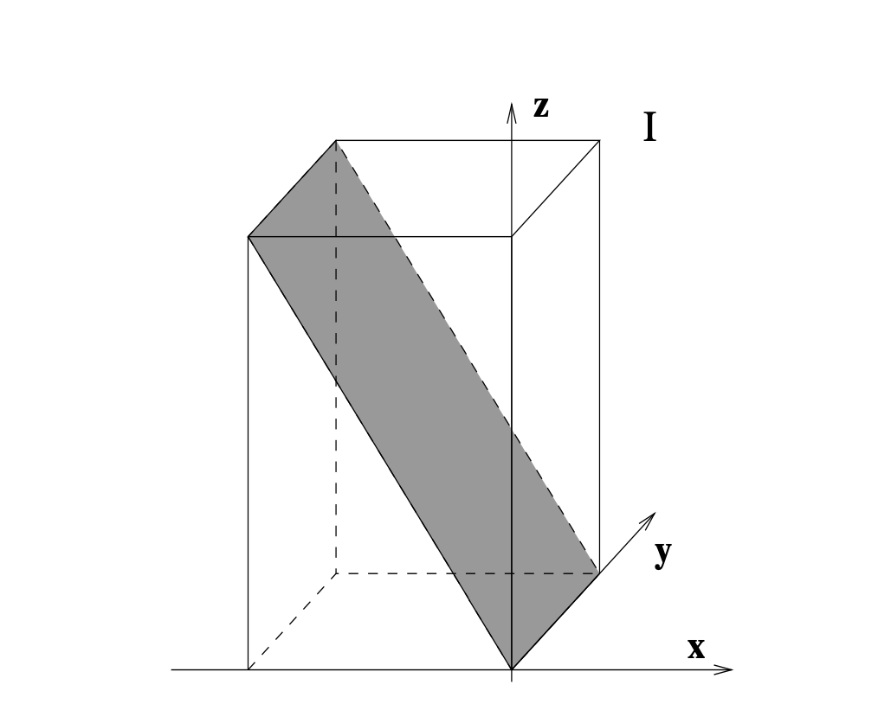

---

### Natural JOIN
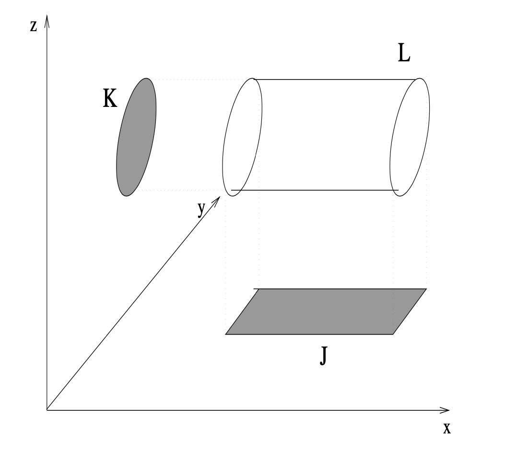

---

## Entity-Relationship (ER) Model

- Outputs a conceptual schema.
- The ER data model employs three basic concepts: 
	- entity sets
	- relationship sets and 
	- attributes.
- It is also associated with diagrammatic representation [try out](https://erdplus.com/)

### Entities And Entity Sets

An entity can be any object in the real world that is distinguishable from all other objects.

An **entity set** contains entities of the same type that share the same properties, or attributes. 

NB We work at *set* level

^ Ask the students
Examples of entities:
	- University
	- Department
	- Persons
	- Courses
- Examples of entity sets
	- Professors and Students 
	- Data Science coruses: curriculms

---
#### Syntax

^ fields are what we call attribtues

### Relationships and  Relationship Sets

A **relationship** is an association among several entities. 

 A **relationship set** is a set of relationships of the same type.

^
Examples of entities:
	- advisor
	- attendee
	- enrollment

### Intution

---
#### Syntax

^^ ER works under the assumption that  most relationship sets in a database system are binary. Relationships between more than two entity sets are rare. 

### Attributes and Values

 attributes. Attributes are descriptive properties possessed by each member of an entity set. 
 
 Each entity has a **value** for each of its attributes. 
 
 Also relationshis may have attributes called **descriptive attributes**. 

### Intution

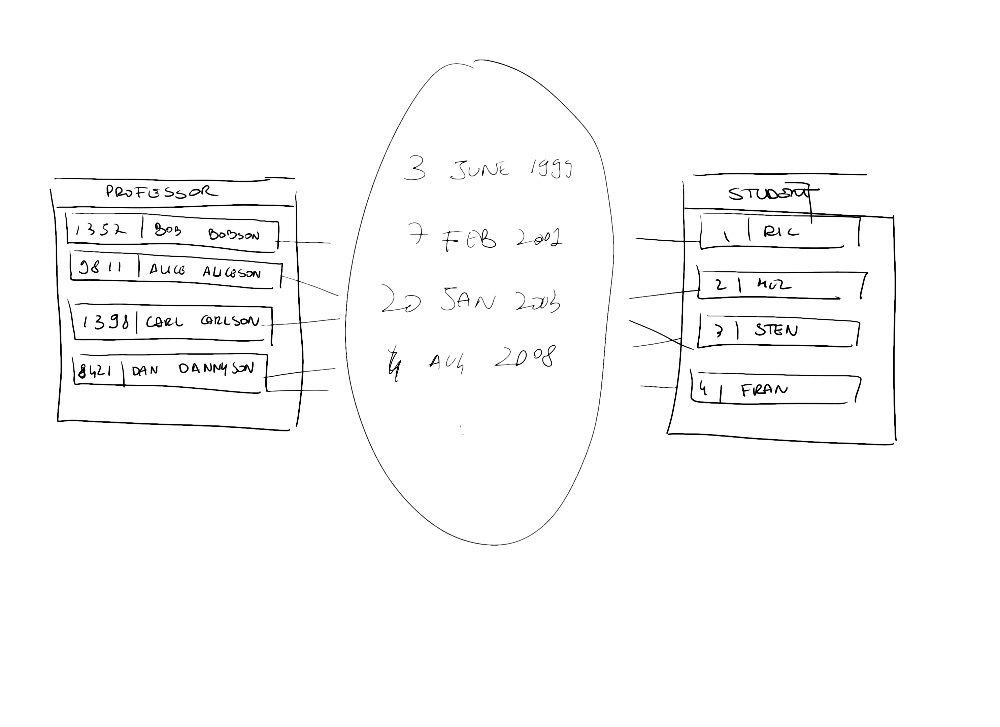

---
#### Syntax

### Cardinality

For a binary relationship set the mapping cardinality must be one of the following types:
- One to one 
- One to many
- Many to one 
- Many to many 

---
#### Cardinality Visualized
- (a) One to One
- (b) One to Many

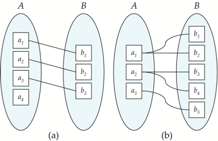

---
#### Cardinality Visualized

- (a) Many to One
- (b) Many to Many

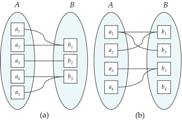

### University of Tartu Example

[source](https://www.ut.ee/sites/default/files/styles/ut_content_width/public/tu_struktuurijoonis_2020_eng_0.png?itok=7l0q6cxg)

---
#### One to Many

A (full) professor has one office
an office hosts one full professor

---
#### One to Many

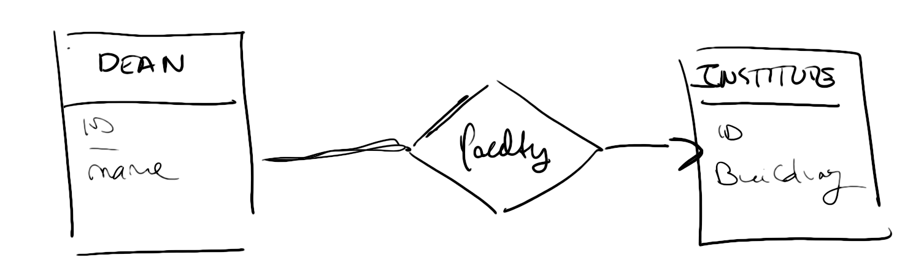

A Dean is associated with many institutes
An Institute has only one dean

---
#### Many to One

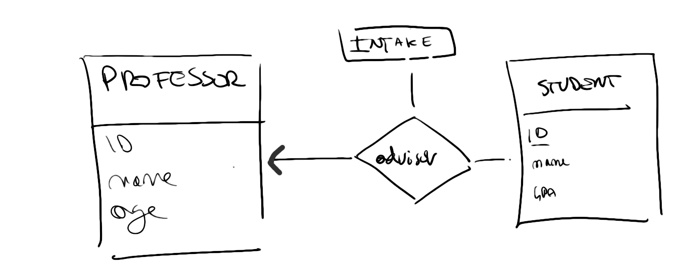

A professor advises many students but a student has only one advisor.

^ Many students share the same advisor but they only have one.

---
#### Many to Many

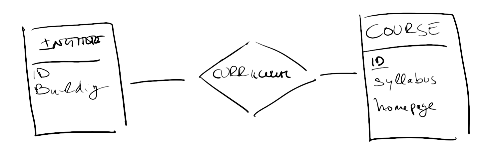

A course is associated to many insitute in the context of a curriculum
An institute offers many courses within a curriculum

###  Keys 

- Provide a way to specify how entities and  relations are distinguished.  
- *Primary key* for Entity Sets
	- By definition, individual entities are distinct (set)
	- From database perspective, the differences among them must be expressed in terms of their attributes
- *Primary Key* for Relationship Sets
	- We use the individual  primary keys of the entities in the relationship set.
	- The choice depends on the mapping cardinality of the relationship set.

---
#### Choice of Primary key for Binary Relationship

- One-to-one relationships. The primary key of either one of the participating entity sets forms a minimal superkey, and either one can be chosen as the primary key.
- One-to-Many relationships and Many-to-one relationships
	- The primary key of the “Many” side is a minimal superkey and is used as the primary key.
- Many-to-Many relationships:   
	- The preceding union of the primary keys is a minimal superkey and is chosen  as the primary key.

---
#### Weak Entity Sets

- A weak entity set is one whose existence is dependent on another entity,
called its **identifying entity**

-  A weak entity set is one whose existence is dependent on another entity,
called its identifying entity

### Summary of Symbols

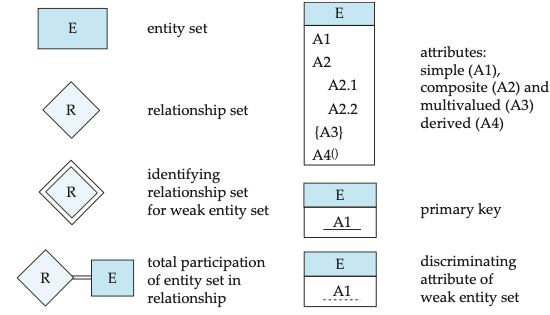

---

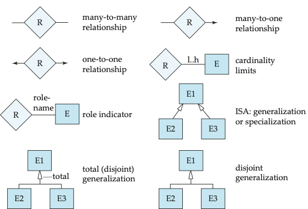

### From ER to Relational Model

- Entity and relationship sets can be expressed as relation
schemas that represent the contents of the database.

- A database which conforms to an E-R diagram can be represented by a
collection of schemas.

--- 
####  Reduction of Entities

- For each **entity** set there is a unique schema with the same name

- Each schema has a number of columns (generally corresponding to
attributes), which have unique names

Professor(<u>ID</u>,Name,Age)
Student(<u>ID</u>,Name,GPA)

^ Weak entities set becomes a relation that includes a column for the primary
key of the identifying entity.

--- 
####  Reduction of Relationships

[.column]

- For each **relationship** set there is a unique schema with the same name

- A **many-to-many** relationship (figure) is represented as a schema with attributes for the primary keys of the two participating entity sets, and any descriptive attributes of the relationship set. 

[.column]

Curriculum(<u>Institute\_ID</u>,<u>Course\_ID</u>)

---
#### Reduction of Relationships

- **Many-to-one** and one-to-many** relationship  can be represented by adding an extra attribute to the "many" side

- For **one-to-one** relationship, either side can be chosen to act as the "many" side

### Normalisation 

- Typically decomposes tables to avoid redundancy
- Spans both logical and physical database design
- Aims at **improving** the database design

---

#### Goals

- Make the schema informative
- Minimize information duplication
- Avoid modification anomalies
- Disallow spurious tuples

--- 

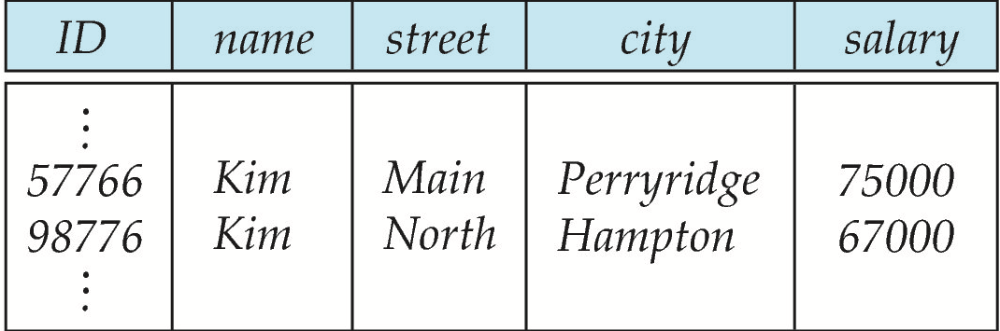

---

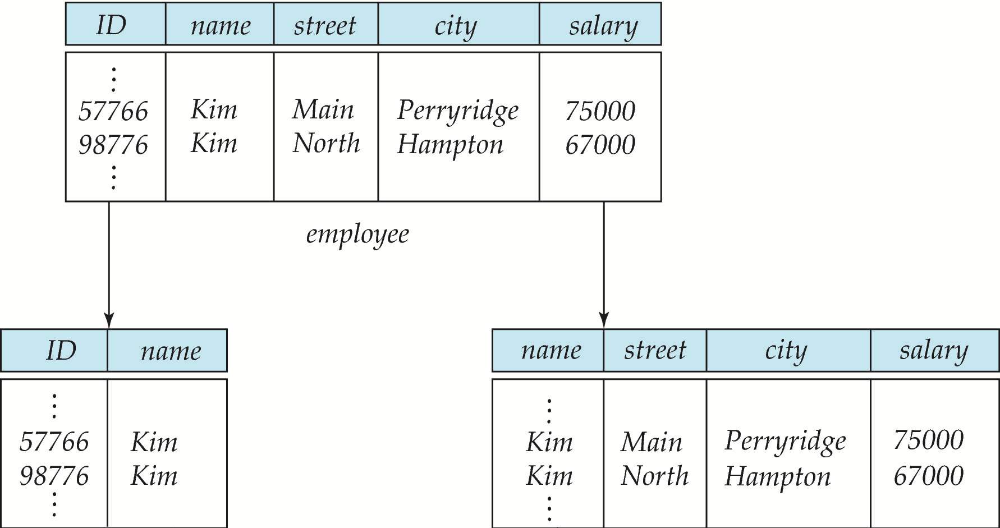

---

---
### Normal Forms (Refresh)

- First Normal Form (1NF) 
	- A table has only atomic valued clumns.
	- Values stored in a column should be of the same domain
	- All the columns in a table should have unique names.
	-  And the order in which data is stored, does not matter.
- Second Normal Form (2NF)
	- A table is in the First Normal form and every non-prime attribute is fully functional dependent[^33] on the primary key
- Third Normal Form (3NF)
	- A table is in the Second Normal form and every non-prime attribute is non-transitively dependent on every key
	
	[^33]: $$X \rightarrow Y, \forall A \in X ((X -{A}) \nrightarrow Y)$$

---

### Modeling for Database: A note on Storage

- Storage is laid out in a row-oriented fashion
- For relational this is as close as the the tabular representation
- All the values from one row of a table are stored next to each other. 
- This is true also for some NoSQL (we will see it again)
	- Document databases stores documents a contiguous bit sequence 
