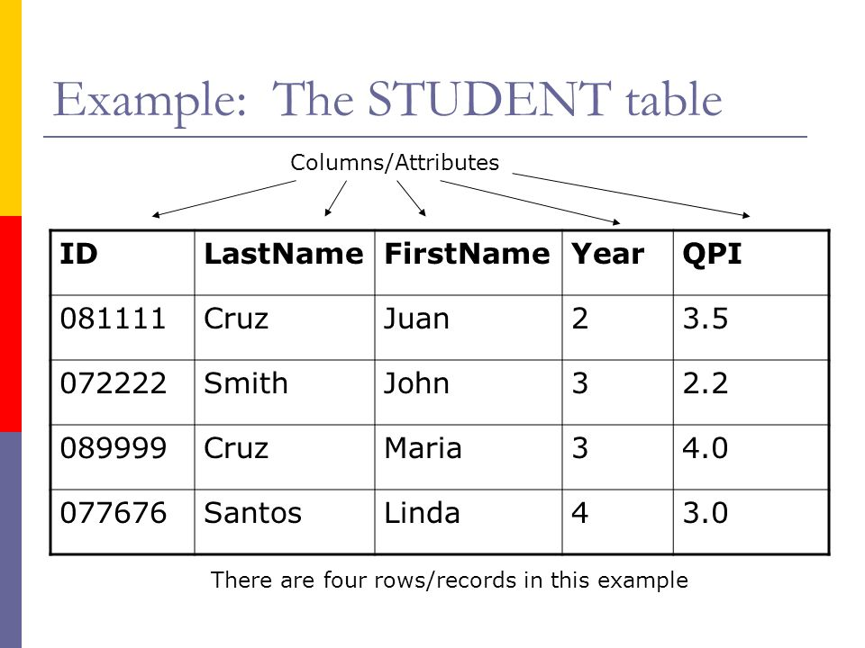
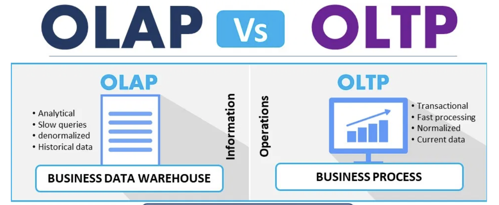

# Data Modeling

It is the process of defining the structure of the data for the purpose of communicating[^11] or to develop an information systems[^12].

[^11]: between functional and technical people to show data needed for business processes

[^12]: between components of the information system, how data is stored and accessed.

###  What is a data model? 

A data model represents the structure and the integrity of the data elements of a (single) applications [2](x-bdsk://DBLP:journals/sigmod/SpynsMJ02) 

Data models provide a framework for data to be used within information systems by giving specific definitions and formats.

The literature of data management is rich of data models that aim at providing increased expressiveness to the modeler and capturing a richer set of semantics.

--- 

<br>

> Data models are perhaps the most important part of developing software. They have such a profound effect not only on how the software is written, but also on how we think about the problem that we are solving[^13].
> --Martin Kleppmann

[^13]:[Designing Data-Intensive Applications](https://dataintensive.net/)

# Any Example?



---


# Level of Data Modeling

**Conceptual**: The data model defines *WHAT* the system contains.

^ Conceptual model is typically created by Business stakeholders. The purpose is to organize, scope and define business concepts and rules. Definitions are most important this level.

**Logical**: Defines *HOW* the system should be implemented regardless of the DBMS. 

^ Logical model is typically created by Data Architects. The purpose is to developed technical map of rules and data structures. Business rules, relationships, attribute become visible. Conceptual definitions become metadata.

**Physical**: This Data Model describes *HOW* the information system will be implemented using a specific technology [^14].

^ Physical model is typically created by DBA and developers. The purpose is actual implementation of the database. Trade-offs are explored by in terms of data structures and algorithms.


[^14]: [physical](https://www.databass.dev/)

### A Closer Look[^15]


[^15]: [slides](https://www.slideshare.net/Dataversity/data-modeling-for-big-data) & [video](https://www.dataversity.net/ldm-webinar-data-modeling-big-data/) by Donna Burbank

^ The variety of data available today encourages the design and development of dedicated data models and query languages that can improve both BI as well as the engineering process itself.

---


---

### Conceptual

- Semantic Model (divergent)
	- Describes an enterprise in terms of the language it uses (the jargon).
	- It also tracks inconsistencies, i.e., semantic conflicts 

- Architectural Model (convergent)
	- More fundamental, abstract categories across enterprise 


### Logical 

Already bound to a technology, it typically refers already to implementation details

- Relational
- Hierarchical
- Key-Value
- Object-Oriented
- Graph

^ Since it has a physical bias, you might be tempted to confuse this with the physical model, but this is wrong. 

### Physical

The physical level describes how data are **Stored** on a device.

- Data formats
- Distribution
- Indexes
- Data Partitions
- Data Replications

<br>

...an you are in the Big Data World

### A Question


> Why should you, ~~an application developer~~ a data engineer, care how the database handles storage and retrieval internally?
--Martin Kleppmann

I mean, you’re probably not going to implement your own storage engine from scratch...

---
### The Students


---
### But...
- You do need to select a storage engine that is appropriate for your application, from the many that are available
- You need to tune a storage engine to perform well on your kind of workload
- You are going to experiment with different access patterns and data formats

Therefore, you must have a rough idea of what the storage engine is doing under the hood 

---
### Also the Students


## Data Formats

- In memory, data are kept in objects, structs, lists, arrays, hash tables, trees, and so on. These data structures are optimized for efficient access and manipulation by the CPU (typically using pointers).
- On Disk (or over the network), data are encoded into a self-contained sequence of bytes (for example, a JSON document). 

### Encoding and decoding

Encoding is the  translation from the in-memory representation to a byte sequence (also known as serialization or marshalling)

Decoding is the reverse translation from the byte sequence to a memory layout (also known as parsing, deserialization, unmarshalling)

The encoding is often tied to a particular programming language, and reading the data in another language is very difficult

### Memory vs Disk

Data layout is much less important in memory than on disk. 

An efficient disk-resident data structure must allow quick access to it, i.e., find a way to serialize and deserialize data rapidly and in a compacted way.

In general, pointers do not make sense outside memory, thus the sequence-of-bytes representation looks quite different from the data structures that are normally used in memory.

### Popular (textual) File Formats

JSON 
- has a schema
-	cannot distinguish between  integers and floating-point numbers
- have good support for Unicode character string
- do not support sequences of bytes without a character encoding
XML
- has a schema
-  cannot distinguish between a number and a string 
- have good support for Unicode character string
- do not support sequences of bytes without a character encoding
CSV
-  cannot distinguish between a number and a string 
-  does not have any schema

### Avro

Avro is a binary encoding format that uses a schema to specify the structure of the data being encoded.

Avro's encoding consists only of values concatenated together, and the
there is nothing to identify fields or their datatypes in the byte sequence.

---
#### Avro Schema Definition
<br>
<br>

```python
record Person {     
 string userName;
 union { null, long } favoriteNumber = null;     
 array<string>        interests; 
}
```

---
#### Example


[Source](https://www.oreilly.com/library/view/designing-data-intensive-applications/9781491903063/ch04.html)

---
#### Encoding and Decoding

- Encoding requires the writer's schema
- Decoding requires the reader’s schema.
- Avro does not require that the writer’s schema and the reader’s schema are the same, they only need to be **compatible**

---
#### Schema Evolution Rules 

- If the code reading the data encounters a field that appears in the writer’s schema but not in the reader’s schema, it is ignored. 
- If the code reading the data expects some field, but the writer’s schema does not contain a field of that name, it is filled in with a default value declared in the reader’s schema.

---
#### Compatibility
- forward compatibility: there is a new version of the writer's schema and an old version of the reader's schema
- backwards compatibility: there is a new version of the reader's schema and an old version of the writer's schema

### Worth Mentioning[^13]

- Apache Thrift and Protocol Buffers are binary encoding libraries	
	-  require a schema for any data that is encoded.
	-  come with a code generation tool that takes a schema definitions to reproduce the  schema in various programming languages

[.column]
```c
struct Person {   
		1: required string userName,   
		2: optional i64    favoriteNumber,
		3: optional list<string> interests 
}
```

[.column]
```c
message Person {
	required string user_name       = 1;     
	optional int64  favorite_number = 2;     
	repeated string interests       = 3; 
}
```

## Distribution


### CAP Theorem (Brewer’s Theorem)

It is impossible for a distributed computer system to simultaneously provide all three of the following guarantees:

- **Consistency**: all nodes see the same data at the same time
- **Availability**: Node failures do not prevent other survivors from continuing to operate (a guarantee that every request receives a response whether it succeeded or failed)
- **Partition tolerance**: the system continues to operate despite arbitrary partitioning due to network failures (e.g., message loss)

A distributed system can satisfy any two of these guarantees at the same time but not all three.

---


### The network is not reliable

In a distributed system, **a network (of networks) ** failures can, and will, occur.

#### We cannot neglect Partition Tolerance

The remaining option is choosing between **Consistency** and **Availability**. 

--- 
#### We cannot neglect Partition Tolerance
Not necessarily in a mutually exclusive manner:
	
- CP:  A partitioned node returns
	- the correct value
	- a timeout error or an error, otherwise
- AP: A partitioned node returns the most recent version of the data, which could be stale.
	
## Indexing

- Indices are critical for efficient processing of queries in (any kind of) databases.
- basic idea is trading some computational cost for space, i.e., materialize a convenient data structure to answer a set of queries.
- The caveat is that we must maintain indexes up-to-date upon changes

^ 
- Without indices, query cost will blow up quickly making the database unusable
- databases don’t usually index everything by default

### Basics Terms
	
- Ordered indices. Based on a sorted ordering of the values.
- Hash indices. Using an hash-function that assigns values across a range of buckets.

- Primary Index: denotes an index on a primary key
- Secondary Index: denotes an index on non primary values


## Data Replication

> Replication means keeping a copy of the same data on multiple machines that are connected via a network


### Reasons for Replication

- Increase data locality
- Fault tolerance
- Concurrent processing (read queries)

^ 
- To keep data geographically close to your users (and thus reduce access latency)
- To allow the system to continue working even if some of its parts have failed (and thus increase availability) 
- To scale out the number of machines that can serve read queries (and thus increase read throughput)

### Approaches

- Synchronous vs Asynchronous Replication
	- The advantage of synchronous replication is that the follower is guaranteed to have an up-to-date copy 
	- The advantage of asynchronous replication is that follower's availability is not a requirement (cf CAP Theorem)

- Leader - Follower (Most common cf Kafka)


### Leaders and Followers

- One of the replicas is designated as the leader
- Write requests go to the leader
- leader sends data to followers for replication
- Read request may be directed to leaders or followers


---


Source is [^13]

### Caveats

<br>
<br>
Only one: handling changes to replicated data is extremely hard.

## Data Partitioning (Sharding)

 > breaking a large database down into smaller ones

^ For very large datasets, or very high query throughput, that is not sufficient

### Reasons for Partitioning

- The main reason for wanting to partition data is scalability[^13]

^ 
- Different partitions can be placed on different nodes in a shared-nothing cluster
- Queries that operate on a single partition can be independently executed. Thus, throughput can be scaled by adding more nodes.


### What to know 

- If some partitions have more data or queries than others the partitioning is **skewed**
- A partition with disproportionately high load is called a **hot spot**
- For reaching maximum scalability (linear) partitions should be balanced

Let's consider some partitioning strategies, for simplicity we consider Key,Value data.

### Partitioning Strategies

- **Round-robin** randomly assigns new keys to the partitions. 
	- Ensures an even distribution of tuples across nodes; 
- **Range partitioning** assigns a contiguous key range to each node. 
	- Not necessarily balanced, because data may not be evenly distributed
- **Hash partitioning** uses a hash function to determine the target partition. 	- If the hash function returns i, then the tuple is placed 
 
# Let's take a step back
[.header: #ffffff]
[.text: #ffffff]


--- 

# To the future

[.header: #ffffff]
[.text: #ffffff]


^ Joke Explained: because we will discuss *Processing* later

# Let's Talk about Workloads



^ 
- **OLTP** systems are usually expected to be **highly available** and to process transactions with low latency, since they are often critical to the operation of the business.
- **OLAP** queries are often written by business analysts, and feed into reports that help the management of a company make better decisions (business intelligence).

### Online Transactional Processing

Because these applications are interactive, the access pattern became known as **online**

**Transactional** means allowing clients to make low-latency reads and writes—as opposed to batch processing jobs, which only run periodically (for example, once per day).

### Refresh on ACID Properties

- ACID, which stands for Atomicity, Consistency, Isolation, and Durability[^11]
- **Atomicity** refers to something that cannot be broken down into smaller parts.
	- It is not about concurrency (which comes with the I)
- **Consistency** (overused term), that here relates to the data *invariants* (integrity would be a better term IMHO)
- **Isolation** means that concurrently executing transactions are isolated from each other.
	- Typically associated with serializability, but there weaker options.
- **Durability** means (fault-tolerant) persistency of the data, once the transaction is completed.

- 
^ The terms was coined in 1983 by Theo Härder and Andreas Reuter [^16]

[^16]: Theo Härder and Andreas Reuter: “Principles of Transaction-Oriented Database Recovery,” ACM Computing Surveys, volume 15, number 4, pages 287–317, December 1983. doi:10.1145/289.291

### Online Analytical Processing

An OLAP system allows a data analyst to look at different cross-tabs on the same data by interactively selecting the attributes in the cross-tab

Statistical analysis often requires grouping on multiple attributes.

### Example[^121]

Consider this is a simplified version of the sales fact table joined with the dimension tables, and many attributes removed (and some renamed)

sales (item_name, color, clothes_size, quantity) 

---
|item_name|color|clothes_size|quantity|
|-----------|----------|----------|----------|
|dress|dark|small|2
|dress|dark|medium|6
|...|...|...|...|
|pants|pastel|medium|0
|pants|pastel|large|1
|pants|white|small|3
|pants|white|medium|0
|shirt|white|medium|1
|...|...|...|...|
|shirt|white|large|10
|skirt|dark|small|2
|skirt|dark|medium|5
|...|...|...|...|

### Cross-tabulation of sales by item name and color

||dark|pastel|white|total
|----|----|----|----|----|
|skirt  | 8 | 35 | 10 |53|
|dress|20|11   |5    |36|
|shirt  |22|4    |46 |72|
|pants|23|42  |25| 90|
|total  |73|92  |102| 267|

columns header: color
rows header: item name

###  Data Cube[^121]

- It is the generalization of a Cross-tabulation


### Cheat Sheet of OLAP Operations[^17]

- **Pivoting**: changing the dimensions used in a cross-tab
	- E.g. moving colors to column names
- **Slicing**: creating a cross-tab for fixed values only
	- E.g fixing color to white and size to small
	- Sometimes called dicing, particularly when values for multiple
dimensions are fixed.
- **Rollup**: moving from finer-granularity data to a coarser granularity
 	- E.g. aggregating away an attribute
	- E.g. moving from aggregates by day to aggregates by month or year
- **Drill down**: The opposite operation - that of moving from coarser granularity data to finer-granularity data

[^17]: Database System Concepts Seventh Edition Avi Silberschatz  Henry F. Korth, S. Sudarshan McGraw-Hill ISBN 9780078022159 [link](https://www.db-book.com/db7/slides-dir/PDF-dir/ch11.pdf)


### Summary OLTP vs OLAP[^13]

| Property | OLTP | OLAP |
|----------|----------|----------|
|Main read pattern| Small number of records per query, fetched by key |Aggregate over large number of records |
|Main write pattern| Random-access, low-latency writes from user input| Bulk import (ETL) or event stream |
|Primarily used by| End user/customer, via web application| Internal analyst, for decision support|
|What data represents| Latest state of data (current point in time)| History of events that happened over time |
|Dataset size |Gigabytes to terabytes |Terabytes to petabytes|

---

[[Data Modeling for Databases]]

[[Data Modeling for Data Warehouses]]

[[Data Modeling for Big Data]]	

## Summary of Data Modeling Techniques 

According to Len Silverston (1997) only two modeling methodologies stand out, top-down and bottom-up.


### Data Modeling Techniques[^18]

- **Entity-Relationship (ER) Modeling**[^19] prescribes to design model encompassing the whole company and describe enterprise business through Entities and the relationships between them	
		-   it complies with 3rd normal form
		-   tailored for OLTP

- **Dimensional Modeling** (DM)[^110] focuses on enabling complete requirement analysis while maintaining high performance when handling large and complex (analytical) queries
	-  The star model and the snowflake model are examples of DM
	-  tailored for OLAP
 
- **Data Vault  (DV) Modeling**[^111] focuses on data integration trying to take the best of ER 3NF and DM
		-  emphasizes establishment of an auditable basic data layer focusing on data history, traceability, and atomicity
		-  one cannot use it directly for data analysis and decision making
- **Domain Driven Design**[^112]  focuses on designing software based on the underlying domain.
	- promotes the usage of an ubiquitus languageo help communication between software developers and domain experts.
	- replaces the conceptual level for NOSQL

[^18]: [source](https://dzone.com/articles/a-comparison-of-data-modeling-methods-for-big-data)
[^19]: by Bill Inmon
[^110]: Ralph Kimball, book ‘The Data Warehouse Toolkit — The Complete Guide to Dimensional Modeling"
[^111]: [https://en.wikipedia.org/wiki/Data_vault_modeling](https://en.wikipedia.org/wiki/Data_vault_modeling)
[^112]: Evans, Eric. Domain-driven design: tackling complexity in the heart of software. Addison-Wesley Professional, 2004.


