# Data Modeling

It is the process of defining the structure of the data for the purpose of communicating[^11] or to develop an information systems[^12].

[^11]: between functional and technical people to show data needed for business processes

[^12]: between components of the information system, how data is stored and accessed.

###  What is a data model? 

A data model represents the structure and the integrity of the data elements of a (single) applications [2](x-bdsk://DBLP:journals/sigmod/SpynsMJ02) 

Data models provide a framework for data to be used within information systems by giving specific definitions and formats.

The literature of data management is rich of data models that aim at providing increased expressiveness to the modeler and capturing a richer set of semantics.

--- 

<br>

> Data models are perhaps the most important part of developing software. They have such a profound effect not only on how the software is written, but also on how we think about the problem that we are solving[^13].
> --Martin Kleppmann

[^13]:[Designing Data-Intensive Applications](https://dataintensive.net/)

## Any Example?


---


## Level of Data Modeling

**Conceptual**: The data model defines *WHAT* the system contains.

^ Conceptual model is typically created by Business stakeholders. The purpose is to organize, scope and define business concepts and rules. Definitions are most important this level.

**Logical**: Defines *HOW* the system should be implemented regardless of the DBMS. 

^ Logical model is typically created by Data Architects. The purpose is to developed technical map of rules and data structures. Business rules, relationships, attribute become visible. Conceptual definitions become metadata.

**Physical**: This Data Model describes *HOW* the information system will be implemented using a specific technology [^14].

^ Physical model is typically created by DBA and developers. The purpose is actual implementation of the database. Trade-offs are explored by in terms of data structures and algorithms.


[^14]: [physical](https://www.databass.dev/)

### A Closer Look[^15]


[^15]: [slides](https://www.slideshare.net/Dataversity/data-modeling-for-big-data) & [video](https://www.dataversity.net/ldm-webinar-data-modeling-big-data/) by Donna Burbank

^ The variety of data available today encourages the design and development of dedicated data models and query languages that can improve both BI as well as the engineering process itself.

---


---

### Conceptual

- Semantic Model (divergent)
	- Describes an enterprise in terms of the language it uses (the jargon).
	- It also tracks inconsistencies, i.e., semantic conflicts 

- Architectural Model (convergent)
	- More fundamental, abstract categories across enterprise 


### Logical 

Already bound to a technology, it typically refers already to implementation details

- Relational
- Hierarchical
- Key-Value
- Object-Oriented
- Graph

^ Since it has a physical bias, you might be tempted to confuse this with the physical model, but this is wrong. 

### Physical

The physical level describes how data are **Stored** on a device.

- Data formats
- Distribution
- Indexes
- Data Partitions
- Data Replications

<br>

...an you are in the Big Data World

### A Question


> Why should you, ~~an application developer~~ a data engineer, care how the database handles storage and retrieval internally?
--Martin Kleppmann

I mean, you’re probably not going to implement your own storage engine from scratch...

---
### The Students


---
### But...
- You do need to select a storage engine that is appropriate for your application, from the many that are available
- You need to tune a storage engine to perform well on your kind of workload
- You are going to experiment with different access patterns and data formats

Therefore, you must have a rough idea of what the storage engine is doing under the hood 

---
### Also the Students


## Data Formats

- In memory, data are kept in objects, structs, lists, arrays, hash tables, trees, and so on. These data structures are optimized for efficient access and manipulation by the CPU (typically using pointers).
- On Disk (or over the network), data are encoded into a self-contained sequence of bytes (for example, a JSON document). 

### Encoding and decoding

Encoding is the  translation from the in-memory representation to a byte sequence (also known as serialization or marshalling)

Decoding is the reverse translation from the byte sequence to a memory layout (also known as parsing, deserialization, unmarshalling)

The encoding is often tied to a particular programming language, and reading the data in another language is very difficult

### Memory vs Disk

Data layout is much less important in memory than on disk. 

An efficient disk-resident data structure must allow quick access to it, i.e., find a way to serialize and deserialize data rapidly and in a compacted way.

In general, pointers do not make sense outside memory, thus the sequence-of-bytes representation looks quite different from the data structures that are normally used in memory.

### Popular (textual) File Formats

JSON 
- has a schema
-	cannot distinguish between  integers and floating-point numbers
- have good support for Unicode character string
- do not support sequences of bytes without a character encoding
XML
- has a schema
-  cannot distinguish between a number and a string 
- have good support for Unicode character string
- do not support sequences of bytes without a character encoding
CSV
-  cannot distinguish between a number and a string 
-  does not have any schema

### Avro

Avro is a binary encoding format that uses a schema to specify the structure of the data being encoded.

Avro's encoding consists only of values concatenated together, and the
there is nothing to identify fields or their datatypes in the byte sequence.

---
#### Avro Schema Definition
<br>
<br>

```python
record Person {     
 string userName;
 union { null, long } favoriteNumber = null;     
 array<string>        interests; 
}
```

---
#### Example


[Source](https://www.oreilly.com/library/view/designing-data-intensive-applications/9781491903063/ch04.html)

---
#### Encoding and Decoding

- Encoding requires the writer's schema
- Decoding requires the reader’s schema.
- Avro does not require that the writer’s schema and the reader’s schema are the same, they only need to be **compatible**

---
#### Schema Evolution Rules 

- If the code reading the data encounters a field that appears in the writer’s schema but not in the reader’s schema, it is ignored. 
- If the code reading the data expects some field, but the writer’s schema does not contain a field of that name, it is filled in with a default value declared in the reader’s schema.

---
#### Compatibility
- forward compatibility: there is a new version of the writer's schema and an old version of the reader's schema
- backwards compatibility: there is a new version of the reader's schema and an old version of the writer's schema

### Worth Mentioning[^13]

- Apache Thrift and Protocol Buffers are binary encoding libraries	
	-  require a schema for any data that is encoded.
	-  come with a code generation tool that takes a schema definitions to reproduce the  schema in various programming languages

[.column]
```c
struct Person {   
		1: required string userName,   
		2: optional i64    favoriteNumber,
		3: optional list<string> interests 
}
```

[.column]
```c
message Person {
	required string user_name       = 1;     
	optional int64  favorite_number = 2;     
	repeated string interests       = 3; 
}
```

## Distribution


### CAP Theorem (Brewer’s Theorem)

It is impossible for a distributed computer system to simultaneously provide all three of the following guarantees:

- **Consistency**: all nodes see the same data at the same time
- **Availability**: Node failures do not prevent other survivors from continuing to operate (a guarantee that every request receives a response whether it succeeded or failed)
- **Partition tolerance**: the system continues to operate despite arbitrary partitioning due to network failures (e.g., message loss)

A distributed system can satisfy any two of these guarantees at the same time but not all three.

---


### The network is not reliable

In a distributed system, **a network (of networks) ** failures can, and will, occur.

#### We cannot neglect Partition Tolerance

The remaining option is choosing between **Consistency** and **Availability**. 

--- 
#### We cannot neglect Partition Tolerance
Not necessarily in a mutually exclusive manner:
	
- CP:  A partitioned node returns
	- the correct value
	- a timeout error or an error, otherwise
- AP: A partitioned node returns the most recent version of the data, which could be stale.
	
## Indexing

- Indices are critical for efficient processing of queries in (any kind of) databases.
- basic idea is trading some computational cost for space, i.e., materialize a convenient data structure to answer a set of queries.
- The caveat is that we must maintain indexes up-to-date upon changes

^ 
- Without indices, query cost will blow up quickly making the database unusable
- databases don’t usually index everything by default

### Basics Terms
	
- Ordered indices. Based on a sorted ordering of the values.
- Hash indices. Using an hash-function that assigns values across a range of buckets.

- Primary Index: denotes an index on a primary key
- Secondary Index: denotes an index on non primary values


## Data Replication

> Replication means keeping a copy of the same data on multiple machines that are connected via a network


### Reasons for Replication

- Increase data locality
- Fault tolerance
- Concurrent processing (read queries)

^ 
- To keep data geographically close to your users (and thus reduce access latency)
- To allow the system to continue working even if some of its parts have failed (and thus increase availability) 
- To scale out the number of machines that can serve read queries (and thus increase read throughput)

### Approaches

- Synchronous vs Asynchronous Replication
	- The advantage of synchronous replication is that the follower is guaranteed to have an up-to-date copy 
	- The advantage of asynchronous replication is that follower's availability is not a requirement (cf CAP Theorem)

- Leader - Follower (Most common cf Kafka)


### Leaders and Followers

- One of the replicas is designated as the leader
- Write requests go to the leader
- leader sends data to followers for replication
- Read request may be directed to leaders or followers


---


Source is [^13]

### Caveats

<br>
<br>
Only one: handling changes to replicated data is extremely hard.

## Data Partitioning (Sharding)

 > breaking a large database down into smaller ones

^ For very large datasets, or very high query throughput, that is not sufficient

### Reasons for Partitioning

- The main reason for wanting to partition data is scalability[^13]

^ 
- Different partitions can be placed on different nodes in a shared-nothing cluster
- Queries that operate on a single partition can be independently executed. Thus, throughput can be scaled by adding more nodes.


### What to know 

- If some partitions have more data or queries than others the partitioning is **skewed**
- A partition with disproportionately high load is called a **hot spot**
- For reaching maximum scalability (linear) partitions should be balanced

Let's consider some partitioning strategies, for simplicity we consider Key,Value data.

### Partitioning Strategies

- **Round-robin** randomly assigns new keys to the partitions. 
	- Ensures an even distribution of tuples across nodes; 
- **Range partitioning** assigns a contiguous key range to each node. 
	- Not necessarily balanced, because data may not be evenly distributed
- **Hash partitioning** uses a hash function to determine the target partition. 	- If the hash function returns i, then the tuple is placed 
 
### Let's take a step back
[.header: #ffffff]
[.text: #ffffff]


--- 

### To the future

[.header: #ffffff]
[.text: #ffffff]


^ Joke Explained: because we will discuss *Processing* later

## Let's Talk about Workloads


^ 
- **OLTP** systems are usually expected to be **highly available** and to process transactions with low latency, since they are often critical to the operation of the business.
- **OLAP** queries are often written by business analysts, and feed into reports that help the management of a company make better decisions (business intelligence).

### Online Transactional Processing

Because these applications are interactive, the access pattern became known as **online**

**Transactional** means allowing clients to make low-latency reads and writes—as opposed to batch processing jobs, which only run periodically (for example, once per day).

### Refresh on ACID Properties

- ACID, which stands for Atomicity, Consistency, Isolation, and Durability[^11]
- **Atomicity** refers to something that cannot be broken down into smaller parts.
	- It is not about concurrency (which comes with the I)
- **Consistency** (overused term), that here relates to the data *invariants* (integrity would be a better term IMHO)
- **Isolation** means that concurrently executing transactions are isolated from each other.
	- Typically associated with serializability, but there weaker options.
- **Durability** means (fault-tolerant) persistency of the data, once the transaction is completed.

- 
^ The terms was coined in 1983 by Theo Härder and Andreas Reuter [^16]

[^16]: Theo Härder and Andreas Reuter: “Principles of Transaction-Oriented Database Recovery,” ACM Computing Surveys, volume 15, number 4, pages 287–317, December 1983. doi:10.1145/289.291

### Online Analytical Processing

An OLAP system allows a data analyst to look at different cross-tabs on the same data by interactively selecting the attributes in the cross-tab

Statistical analysis often requires grouping on multiple attributes.

### Example[^121]

Consider this is a simplified version of the sales fact table joined with the dimension tables, and many attributes removed (and some renamed)

sales (item_name, color, clothes_size, quantity) 

---
|item_name|color|clothes_size|quantity|
|-----------|----------|----------|----------|
|dress|dark|small|2
|dress|dark|medium|6
|...|...|...|...|
|pants|pastel|medium|0
|pants|pastel|large|1
|pants|white|small|3
|pants|white|medium|0
|shirt|white|medium|1
|...|...|...|...|
|shirt|white|large|10
|skirt|dark|small|2
|skirt|dark|medium|5
|...|...|...|...|

### Cross-tabulation of sales by item name and color

||dark|pastel|white|total
|----|----|----|----|----|
|skirt  | 8 | 35 | 10 |53|
|dress|20|11   |5    |36|
|shirt  |22|4    |46 |72|
|pants|23|42  |25| 90|
|total  |73|92  |102| 267|

columns header: color
rows header: item name

###  Data Cube[^121]

- It is the generalization of a Cross-tabulation


### Cheat Sheet of OLAP Operations[^17]

- **Pivoting**: changing the dimensions used in a cross-tab
	- E.g. moving colors to column names
- **Slicing**: creating a cross-tab for fixed values only
	- E.g fixing color to white and size to small
	- Sometimes called dicing, particularly when values for multiple
dimensions are fixed.
- **Rollup**: moving from finer-granularity data to a coarser granularity
 	- E.g. aggregating away an attribute
	- E.g. moving from aggregates by day to aggregates by month or year
- **Drill down**: The opposite operation - that of moving from coarser granularity data to finer-granularity data

[^17]: Database System Concepts Seventh Edition Avi Silberschatz  Henry F. Korth, S. Sudarshan McGraw-Hill ISBN 9780078022159 [link](https://www.db-book.com/db7/slides-dir/PDF-dir/ch11.pdf)


### Summary OLTP vs OLAP[^13]

| Property | OLTP | OLAP |
|----------|----------|----------|
|Main read pattern| Small number of records per query, fetched by key |Aggregate over large number of records |
|Main write pattern| Random-access, low-latency writes from user input| Bulk import (ETL) or event stream |
|Primarily used by| End user/customer, via web application| Internal analyst, for decision support|
|What data represents| Latest state of data (current point in time)| History of events that happened over time |
|Dataset size |Gigabytes to terabytes |Terabytes to petabytes|

---

[[Data Modeling for Databases]]

[[Data Modeling for Data Warehouses]]

[[Data Modeling for Big Data]]	

## Summary of Data Modeling Techniques 

According to Len Silverston (1997) only two modeling methodologies stand out, top-down and bottom-up.


### Data Modeling Techniques[^18]

- **Entity-Relationship (ER) Modeling**[^19] prescribes to design model encompassing the whole company and describe enterprise business through Entities and the relationships between them	
		-   it complies with 3rd normal form
		-   tailored for OLTP

- **Dimensional Modeling** (DM)[^110] focuses on enabling complete requirement analysis while maintaining high performance when handling large and complex (analytical) queries
	-  The star model and the snowflake model are examples of DM
	-  tailored for OLAP
 
- **Data Vault  (DV) Modeling**[^111] focuses on data integration trying to take the best of ER 3NF and DM
		-  emphasizes establishment of an suitable basic data layer focusing on data history, traceability, and atomicity
		-  one cannot use it directly for data analysis and decision making
- **Domain Driven Design**[^112]  focuses on designing software based on the underlying domain.
	- promotes the usage of an ubiquitous language help communication between software developers and domain experts.
	- replaces the conceptual level for NOSQL

[^18]: [source](https://dzone.com/articles/a-comparison-of-data-modeling-methods-for-big-data)
[^19]: by Bill Inmon
[^110]: Ralph Kimball, book ‘The Data Warehouse Toolkit — The Complete Guide to Dimensional Modeling"
[^111]: [https://en.wikipedia.org/wiki/Data_vault_modeling](https://en.wikipedia.org/wiki/Data_vault_modeling)
[^112]: Evans, Eric. Domain-driven design: tackling complexity in the heart of software. Addison-Wesley Professional, 2004.


# Data Modeling for Databases

- Works in phases related to the aforementioned levels of abstractions[^31]
- Uses different data models depending on the need:
	- Relational, Graph, Document...
- Tries to avoid two major pitfalls:
	- **Redundancy**: A design should not repeat information
	- **Incompleteness**:  A design should not make certain aspects of the enterprise difficult or impossible to model
- Optimized for OLTP
	
[^31]: Also known as Database Design

^ The biggest problem with redundancy is that information may become inconsistent in case of update

---

Before, let's refresh

---

###

## Relational Database

A relational database consists of…
-  a set of relations (tables)
- a set of integrity constraints

If the database satisfies all the constraints we said it is in a valid state.

An important distinction regards the **database schema**, which is the logical design of the database, and the **database instance**, which is a snapshot of the data in the database at a given instant in time.


## Relational Model [^32]

A formal mathematical basis for databases based on set theory and first-order predicate logic

Underpins of SQL 


[^32]: Extra Read [Codd, Edgar F. "A relational model of data for large shared data
banks." Communications of the ACM 13.6 (1970): 377-38z](https://course.ccs.neu.edu/cs3200sp18s3/ssl/readings/codd.pdf)

### Relation

> Relation R is a set of tuples (d<sub>1</sub>, d<sub>2</sub>, ..., d<sub>n</sub>), where each element d<sub>j</sub> is a member of D<sub>j</sub>, a data domain.

<br>

> A Data Domain refers to all the values which a data element may contain, e.g., N.

Note that in the relational model the **term relation is used to refer to a table**, while the term **tuple is used to refer to a row**

^ In mathematical terms, a tuple indicates a sequence of values. 
A relationship between n values is represented mathematically by an n-tuple of values, that is, a tuple with n values, which corresponds to a row in a table.

---


---

### Relation Schema

-  corresponds to the notion of **type** in programming languages
-  consists of a list of **attributes** and their corresponding domains
-  a **relation instance** corresponds to the programming-language no- tion of a value of a variable

---


### Keys

- A **superkey** is a set of one or more attributes that, taken collectively, allow us to identify uniquely a tuple in the relation
- **candidate keys** are  superkeys for which no proper subset is a superkey
-  primary key is the chosen candidate key
-  foreign key is s set of attributes from a referenced relation.

^ If K is a superkey, then so is any superset of K

---


---

### [[Relational Algebra]] (On Practice)

is a procedural language consisting of a six basic operations that take one or two relations as input and produce a new relation as their result:

- select: σ
- project: ∏
- union: ∪
- set difference: –
- Cartesian product: x
- rename: ρ

^ Question: What is an algebra?

---
### Two Sets


---

### Intersection


---
### Difference


---
### Union


---


---
### Projection


---
### Selection


---

### Natural JOIN


---

## Entity-Relationship (ER) Model

- Outputs a conceptual schema.
- The ER data model employs three basic concepts: 
	- entity sets
	- relationship sets and 
	- attributes.
- It is also associated with diagrammatic representation [try out](https://erdplus.com/)

### Entities And Entity Sets

An entity can be any object in the real world that is distinguishable from all other objects.


An **entity set** contains entities of the same type that share the same properties, or attributes. 


NB We work at *set* level

^ Ask the students
Examples of entities:
	- University
	- Department
	- Persons
	- Courses
- Examples of entity sets
	- Professors and Students 
	- Data Science coruses: curriculms

---
#### Syntax


^ fields are what we call attribtues

### Relationships and  Relationship Sets

A **relationship** is an association among several entities. 

 A **relationship set** is a set of relationships of the same type.

^
Examples of entities:
	- advisor
	- attendee
	- enrollment

### Intution


---
#### Syntax


^^ ER works under the assumption that  most relationship sets in a database system are binary. Relationships between more than two entity sets are rare. 

### Attributes and Values

 attributes. Attributes are descriptive properties possessed by each member of an entity set. 
 
 Each entity has a **value** for each of its attributes. 
 
 Also relationshis may have attributes called **descriptive attributes**. 

### Intution


---
#### Syntax


### Cardinality

For a binary relationship set the mapping cardinality must be one of the following types:
- One to one 
- One to many
- Many to one 
- Many to many 

---
#### Cardinality Visualized
- (a) One to One
- (b) One to Many


---
#### Cardinality Visualized

- (a) Many to One
- (b) Many to Many


### University of Tartu Example


[source](https://www.ut.ee/sites/default/files/styles/ut_content_width/public/tu_struktuurijoonis_2020_eng_0.png?itok=7l0q6cxg)

---
#### One to Many


A (full) professor has one office
an office hosts one full professor

---
#### One to Many


A Dean is associated with many institutes
An Institute has only one dean

---
#### Many to One


A professor advises many students but a student has only one advisor.

^ Many students share the same advisor but they only have one.

---
#### Many to Many


A course is associated to many insitute in the context of a curriculum
An institute offers many courses within a curriculum

###  Keys 

- Provide a way to specify how entities and  relations are distinguished.  
- *Primary key* for Entity Sets
	- By definition, individual entities are distinct (set)
	- From database perspective, the differences among them must be expressed in terms of their attributes
- *Primary Key* for Relationship Sets
	- We use the individual  primary keys of the entities in the relationship set.
	- The choice depends on the mapping cardinality of the relationship set.

---
#### Choice of Primary key for Binary Relationship

- One-to-one relationships. The primary key of either one of the participating entity sets forms a minimal superkey, and either one can be chosen as the primary key.
- One-to-Many relationships and Many-to-one relationships
	- The primary key of the “Many” side is a minimal superkey and is used as the primary key.
- Many-to-Many relationships:   
	- The preceding union of the primary keys is a minimal superkey and is chosen  as the primary key.

---
#### Weak Entity Sets

- A weak entity set is one whose existence is dependent on another entity,
called its **identifying entity**

-  A weak entity set is one whose existence is dependent on another entity,
called its identifying entity


### Summary of Symbols


---


### From ER to Relational Model

- Entity and relationship sets can be expressed as relation
schemas that represent the contents of the database.

- A database which conforms to an E-R diagram can be represented by a
collection of schemas.

--- 
####  Reduction of Entities

- For each **entity** set there is a unique schema with the same name

- Each schema has a number of columns (generally corresponding to
attributes), which have unique names


Professor(<u>ID</u>,Name,Age)
Student(<u>ID</u>,Name,GPA)

^ Weak entities set becomes a relation that includes a column for the primary
key of the identifying entity.

--- 
####  Reduction of Relationships

[.column]

- For each **relationship** set there is a unique schema with the same name

- A **many-to-many** relationship (figure) is represented as a schema with attributes for the primary keys of the two participating entity sets, and any descriptive attributes of the relationship set. 

[.column]


Curriculum(<u>Institute\_ID</u>,<u>Course\_ID</u>)

---
#### Reduction of Relationships

- **Many-to-one** and one-to-many** relationship  can be represented by adding an extra attribute to the "many" side

- For **one-to-one** relationship, either side can be chosen to act as the "many" side


### Normalisation 

- Typically decomposes tables to avoid redundancy
- Spans both logical and physical database design
- Aims at **improving** the database design

---

#### Goals

- Make the schema informative
- Minimize information duplication
- Avoid modification anomalies
- Disallow spurious tuples

--- 


---


---


---
### Normal Forms (Refresh)

- First Normal Form (1NF) 
	- A table has only atomic valued clumns.
	- Values stored in a column should be of the same domain
	- All the columns in a table should have unique names.
	-  And the order in which data is stored, does not matter.
- Second Normal Form (2NF)
	- A table is in the First Normal form and every non-prime attribute is fully functional dependent[^33] on the primary key
- Third Normal Form (3NF)
	- A table is in the Second Normal form and every non-prime attribute is non-transitively dependent on every key
	
	[^33]: $$X \rightarrow Y, \forall A \in X ((X -{A}) \nrightarrow Y)$$

---

### Modeling for Database: A note on Storage

- Storage is laid out in a row-oriented fashion
- For relational this is as close as the the tabular representation
- All the values from one row of a table are stored next to each other. 
- This is true also for some NoSQL (we will see it again)
	- Document databases stores documents a contiguous bit sequence 

# Data Modeling for Data Warehouses

- Works in phases related to the aforementioned levels of abstractions
- Less diversity in the data model, usually relational in the form of a star schema (also known as dimensional modeling[^41]).
- Redundancy and incompleteness are not avoided, fact tables often have over 100 columns, sometimes several hundreds.
- Optimized for OLAP

^ 
- The data model of a data warehouse is most commonly relational, because SQL is generally a good fit for analytic queries.
- Do not associate SQL with analytic, it depends on the data modeling. 

[^41]: Ralph Kimball and Margy Ross: The Data Warehouse Toolkit: The Definitive Guide to Dimensional Modeling, 3rd edition. John Wiley & Sons, July 2013. ISBN: 978-1-118-53080-1

### A Star is Born

[.column]


[.column]


### A Star is Born

[.column]


[.column]


### Dimensional Modelling

Four-Step Dimensional Design Process

1. Select the business process.
2. Declare the grain.
3. Identify the dimensions.
4. Identify the facts.


[Mandatory Read](http://www.kimballgroup.com/wp-content/uploads/2013/08/2013.09-Kimball-Dimensional-Modeling-Techniques11.pdf)

^ 
- **Business processes** are crtical activities that your organization performs, e.g., registering students for a class.
- The **grain** establishes exactly what a single fact table row represents.  Three common grains categorize all fact tables: transactional, periodic snapshot, or accumulating snapshot. 
- **Dimensions** provide contex to business process events, e.g.,  who, what, where, when, why, and how. 
- :wq
- **Facts** are the measurements that result from a business process event and are almost always numeric. 

### Dimensional Modelling: Fact Table

A **fact table** contains the numeric measures produced by an operational measurement event in the real world. 

A **single fact** table row has a one-to-one relationship to a measurement event as described by the fact table’s grain.

A **surrogate key** is a unique identifier that you add to a table to support star schema modeling. By definition, it's not defined or stored in the source data

### Dimensional Modelling: Dimension Table

Dimension tables contain the descriptive attributes used by BI applications for filtering and grouping the facts. 

Every dimension table has a single **primary key** column , which is embedded as a foreign key in any associated fact table.


### The 5/10 Essential Rules of Dimensional Modeling (Read)[^42]

1. Load detailed atomic data into dimensional structures.
2. Structure dimensional models around business processes.
3. Ensure that every fact table has an associated date dimension table.
4. Ensure that all facts in a single fact table are at the same grain or level of detail.
5. Resolve many-to-many relationships in fact tables.

### The 10/10 Essential Rules of Dimensional Modeling (Read)[^42]

6. Resolve many-to-one relationships in dimension tables.
7.  Store report labels and filter domain values in dimension tables.
8.  Make certain that dimension tables use a surrogate key.
9.  Create conformed dimensions to integrate data across the enterprise.
10. Continuously balance requirements and realities to deliver a DW/BI solution that’s accepted by business users and that supports their decision-making.

[^42]:https://www.kimballgroup.com/2009/05/the-10-essential-rules-of-dimensional-modeling/


### The Traditional RDBMS Wisdom Is (Almost Certainly) All Wrong[^43]


[^43]: Source with slides: [The Traditional RDBMS Wisdom Is (Almost Certainly) All Wrong,” presentation at EPFL, May 2013](http://slideshot.epfl.ch/play/suri_stonebraker)

### A note on Storage

- Data warehouse typically interact with OLTP database to expose one or more OLAP system. 
- Such OLAP system adopt storage optimized for analytics, i.e., Column Oriented
- The column-oriented storage layout relies on each column file containing the rows in the same order.
- Not just relational data, e.g., Apache Parquet


# Data Modeling for Big Data

 

^ The Data Landscape: Variety is the Driver

### From data to analysis and execution

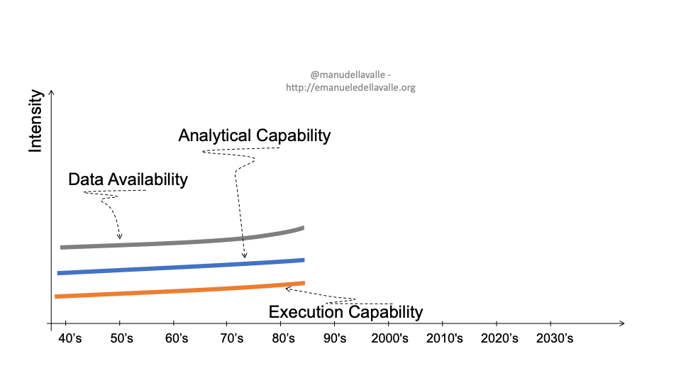


### The appearance of the “Big Data”

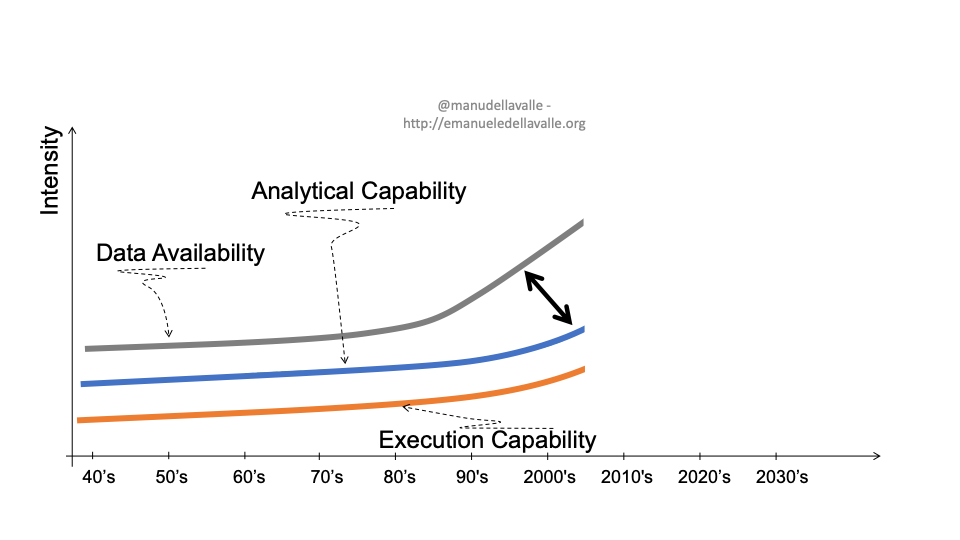


### Big Data Vs [Lanely]


### A Growing Trend


[source](https://www.elderresearch.com/blog/42-v-of-big-data)

### The Data Landscape

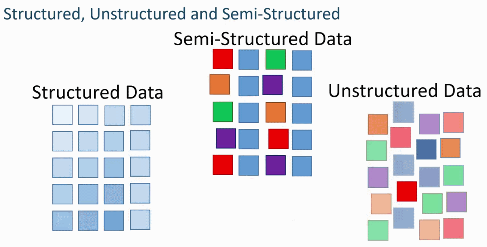

^ Structured data are organized and labeled according to a precise model (e.g., relational data)
^ Unstructured data, on the other hand, are not constrained (e.g., text, video, audio)
^ In between, there are many form of semi-structured data, e.g., JSON and XML, whose models do not impose a strict structure but provide means for validation. 

### Traditional Data Modelling Workflow

- Known as Schema on Write
- Focus on the modelling a schema that can accommodate all needs
- Bad impact on those analysis that were not envisioned


^
 - Extract Transform Load
 - Some analyses may no longer be performed because the data were lost at writing time,

---
## Schema on Read

- Load data first, ask question later
- All data are kept, the minimal schema need for an analysis is applied when needed
- New analyses can be introduced in any point in time


## Data Lakes


## Horizontal vs Vertical Scalability

[.footer: Curtesy of Emanuele Della Valle and Marco Brambilla]

### Introduction
[.footer: Curtesy of Emanuele Della Valle and Marco Brambilla]

- "Traditional" SQL system scale **vertically** (scale up)	- Adding data to a "traditional" SQL system may degrade its performances
	- When the machine, where the SQL system runs, no longer performs as required, the solution is to buy a better machine (with more RAM, more cores and more disk)
- Big Data solutions scale **horizontally** (scale out)
	- Adding data to a Big Data solution may degrade its performances
	- When the machines, where the big data solution runs, no longer performs as required, the solution is to add another machine

###  hardware
[.footer: Curtesy of Emanuele Della Valle and Marco Brambilla]

[.column]
#### Commodity

- CPU: 8-32 cores
- RAM: 16-64 GB
- Disk: 1-3 TB
- Network: 10 GE

[.column]
#### Appliance

- CPU: 576 cores 
- RAM: 24TB
- Disk: 360TB of SSD/rack
- Network: 40 Gb/second InfiniBand 

^ ORACLE EXADATA DATABASE MACHINE X6-8

### Vertical Scalability
[.footer: Curtesy of Emanuele Della Valle and Marco Brambilla]

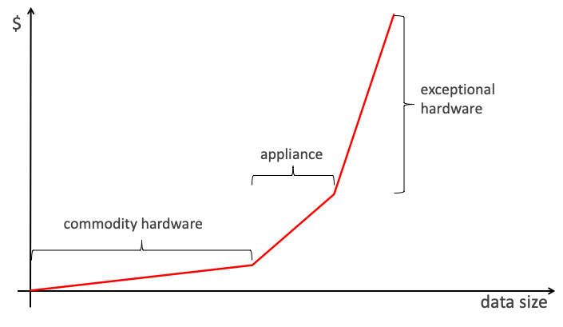


### Horizontal Scalability
[.footer: Curtesy of Emanuele Della Valle and Marco Brambilla]

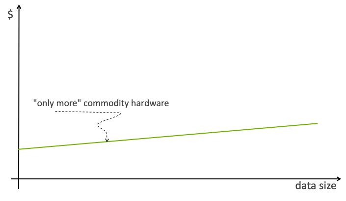

### Vertical vs Horizontal Scalability
[.footer: Curtesy of Emanuele Della Valle and Marco Brambilla]

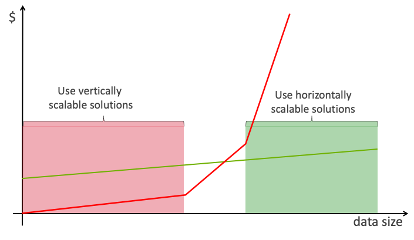


### Vertical vs Horizontal Scalability

[.footer: Curtesy of Emanuele Della Valle and Marco Brambilla]
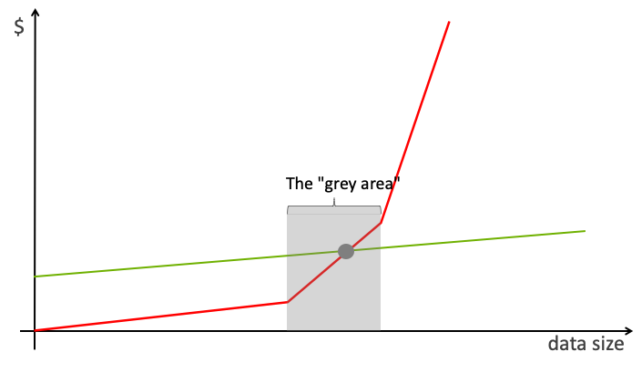


### Grey Area is Time-Dependent

[.footer: Curtesy of Emanuele Della Valle and Marco Brambilla]


### Big Data Storage

- Distributed File Systems, e.g., HDFS
- NoSQL Databases
- NewSQL Databases[^65] e.g., VoltDB
- Distributed Queues, e.g., Pulsar or Kafka

[^65]: a modern form of relational databases that aim for comparable scalability with NoSQL databases while maintaining the transactional guarantees made by traditional database systems

^ A distributed file system stores files across a large collection of machines while giving a single-file-system view to clients.

## Data Ingestion

- The process of importing, transferring and loading data for storage and later use 
- It involves loading data from a variety of sources
- It can involve altering and modification of individual files to fit into a format that optimizes the storage
- For instance, in Big Data small files are concatenated to form files of 100s of MBs and large files are broken down in files of 100s of MB

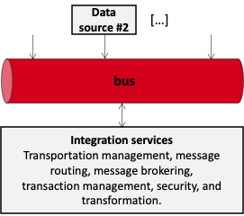

### We Will Talk About Distributed File Systems

A distributed file system stores files across a large collection of machines while giving a single-file-system view to clients.

- ![[HDFS]]


### Will Will Talk  About Distributed Message Queues

A distribured message quque stores file in a log an allos sequential reads. 

- ![[Apache Kafka]]


---

##  ~~ETL~~ [[Data Pipeline (Intro)]]

A data pipeline aggregates, organizes, and moves data to a destination for storage, insights, and analysis. 

Modern data pipeline generalize the notion of ETL (extract, transform, load) to include data ingestion, integration, and movement across any cloud architecture and add additional layers of resiliency against failure.

- [[Apache Airflow]]
- [[Kafka Streams]]
- [[KSQL]]

## [[Data Wrangling]]

The process of creating *reliable*  that can be analysed to generate valid actionable insights.

The central goal is to make data usable: to put data in a form that can be easily manipulated by analysis tools.

It includes understanding, cleansing, augmenting and shaping data.

^ Additional goals:
- ensure that data is responsive to the intended analyses
- ensure that data contain the necessary information, 
- ensure metadata that describe data are available
- ensure that data are sufficiently correct to support successful modeling and decision-making.

The results is data in the best format (e.g., columnar) for the analysis to perform.


# The Advent of NoSQL

### Quote time

> Google, Amazon, Facebook, and DARPA all recognized that when you scale systems large enough, you can never put enough iron in one place to get the job done (and you wouldn’t want to, to prevent a single point of failure). 
<br>
> Once you accept that you have a distributed system, you need to give up consistency or availability, which the fundamental transactionality of traditional RDBMSs cannot abide.
--[Cedric Beust](https://beust.com/weblog/2010/02/25/nosql-explained-correctly-finally/)

^  The name “NoSQL” is unfortunate, since it doesn’t actually refer to any particular technology—it was originally intended simply as a catchy Twitter hashtag for a meetup on open source, distributed, nonrelational databases in 2009 Cf Pramod J. Sadalage and Martin Fowler: NoSQL Distilled. Addison-Wesley, August 2012. ISBN: 978-0-321-82662-6

### The Reasons Behind

- **Big Data**: need for greater scalability than relational databases can easily achieve *in write*
- **Open Source:** a widespread preference for free and open source software 
- **Queryability**: need for specialized query operations that are not well supported by the relational model
- **Schemaless**:  desire for a more dynamic and expressive data model than relational

### Object-Relational Mismatch 

Most application development today is done in **object-oriented** programming languages

An **awkward translation** layer is required between the **objects** in the application code and the database model of **tables**, **rows**, and **columns**

Object-relational mapping (**ORM**) frameworks like **Hibernate** try to mild the mismatch, but they **can’t completely hide** the differences
 
---

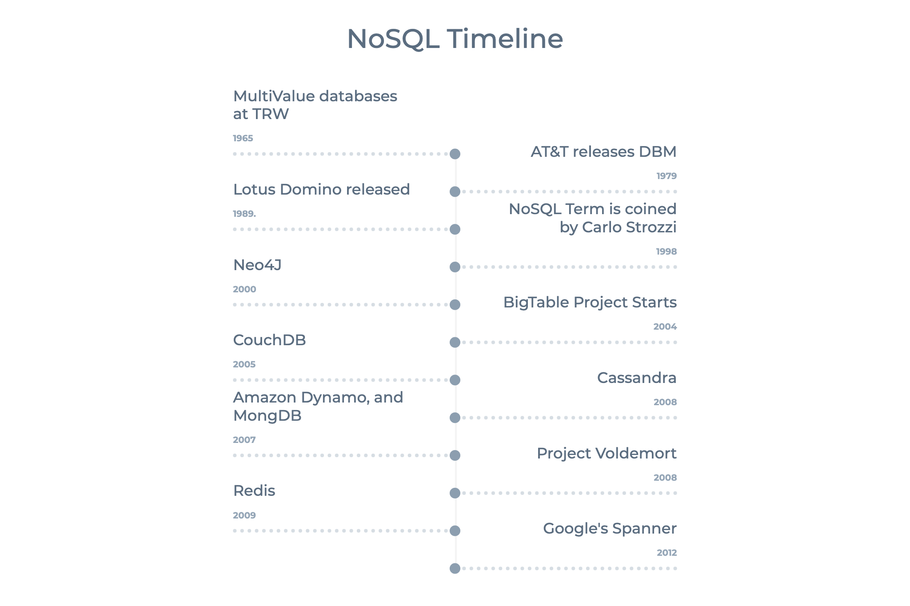

### NoSQL Familty


### Kinds of NoSQL (2/4)

NoSQL solutions fall into four major areas:

- **Key-Value Store**
	- A key that refers to a payload (actual content / data)
	- Examples: MemcacheDB, Azure Table Storage, Redis, HDFS

- **Column Store** 
	- Column data is saved together, as opposed to row data
	- Super useful for data analytics
	- Examples: Hadoop, Cassandra, Hypertable

### Kinds of NoSQL (4/4)

- **Document / XML / Object Store**
	- Key (and possibly other indexes) point at a serialized object
	- DB can operate against values in document
	- Examples: MongoDB, CouchDB, RavenDB

- **Graph Store**
	- Nodes are stored independently, and the relationship between nodes (edges) are stored with data
	- Examples: AllegroGraph, Neo4j

### You can also distinguish them

[.column]

- **Key/Value or ‘the big hash table’ (remember caching?)**
	- Amazon S3 (Dynamo)
	- Voldemort
	- Scalaris
	- MemcacheDB, 
	- Azure Table Storage, 
	- *Redis* $$\leftarrow$$
	- Riak

[.column]

- **Schema-less**
	- *MongoDB* $$\leftarrow$$
	- Cassandra (column-based)
	- CouchDB (document-based)
	- *Neo4J (graph-based)* $$\leftarrow$$
	- HBase (column-based) 

---

### NoSQL Complexity


---


^ a natural evolutionary path exists from simple key-value stores to the highly complicated graph databases, as shown in the following diagram:

### SQL vs (Not only SQL) NoSQL

|SQL databases| NoSQL  databases|
|----|-----|
| Triggered the need of relational databases  | Triggered by the storage needs of Web 2.0 companies such as Facebook,Google and Amazon.com|
| Well structured data| Not necessarily well structured – e.g., pictures, documents, web page description, video clips, etc.|
| Focus on data integrity|focuses on availability of data even in the presence of multiple failures|
| Mostly Centralized|spread data across many storage systems with a high degree of replication.|
| ACID properties should hold|ACID properties may not hold[^62]|

[^6 g2]: no properties at all???

## ACID vs. BASE properties[^61]

[^61]:Do you recall the CAP theorem? 🎩

---

### Rationale

- It’s ok to use stale data (Accounting systems do this all the time. It’s called “closing out the books.”) ; 
- It’s ok to give approximate answers
- Use resource versioning -> say what the data really is about – no more, no less
	- the value of x is 5 at time T


---

### CAP Theorem is a Trade-off, remember?

---


### BASE(Basically Available, Soft-State, Eventually Consistent)

- **Basic Availability**: fulfill request, even in partial consistency.
- **Soft State**: abandon the consistency requirements of the ACID model pretty much completely
- **Eventual Consistency**: delayed consistency, as opposed to immediate consistency of the ACID properties.[^67]
  - purely aliveness guarantee (reads eventually return the requested value); but
  - does not make safety guarantees, i.e.,
  - an eventually consistent system can return any value before it converges

[^67]: at some point in the future, data will converge to a consistent state; 

---
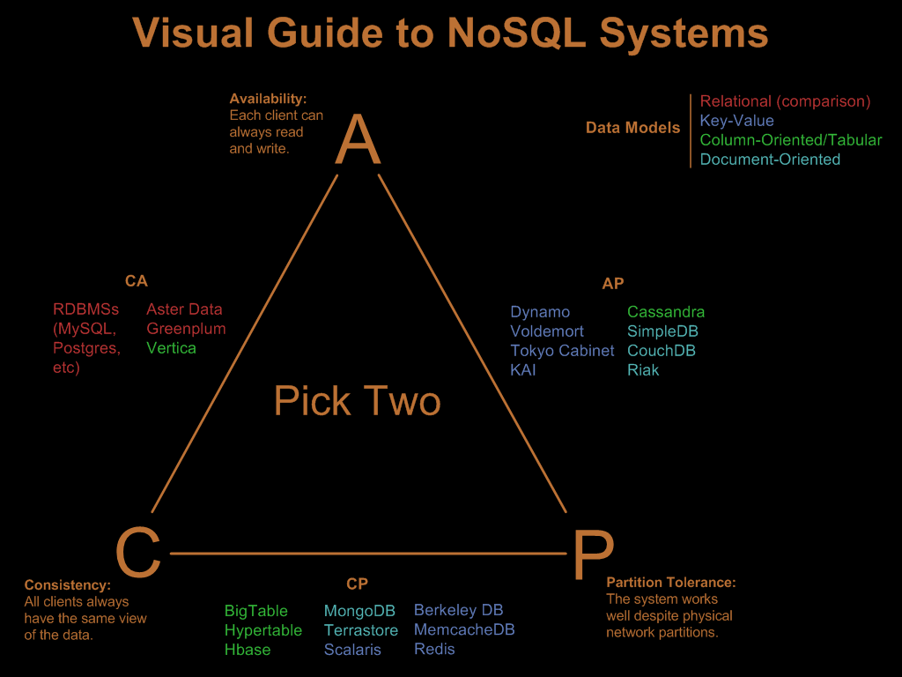

[.footer: [img](https://blog.nahurst.com/visual-guide-to-nosql-systems)]

### ACID vs. BASE trade-off

**No general answer** to whether your application needs an ACID versus BASE consistency model.

Given **BASE** ’s loose consistency, developers **need to** be more knowledgeable and **rigorous** about **consistent** data if they choose a BASE store for their application.

Planning around **BASE** limitations can sometimes be a major **disadvantage** when compared to the simplicity of ACID transactions.

A fully **ACID** database is the perfect fit for use cases where data **reliability** and **consistency** are essential.

# History of Data Models[^5]

--- 


[^5]: [by Ilya Katsov](https://highlyscalable.wordpress.com/2012/03/01/nosql-data-modeling-techniques/)

### Extra Reads


## Shall we rethink the three-layered modeling?


###  Data Modeling for Big Data

- **Conceptual Level** remains:
	- ER, UML diagram can still be used for no SQL as they output a model that encompasses the whole company.

- **Phsyical Level** remains: NoSQL solutions often expose internals for obtaining flexibility, e.g., 
	- Key-value stores API
	- Column stores
	- Log structures

- _Logical level no longer make sense. Schema on read focuses on the query side.__

## Domain Driven Design[^68]

Domain-Driven Design is a **language**- and **domain-centric** approach to software design for complex problem domains.

DDD promotes the reduction of the translation cost between business and technical terminology by developing an **ubiquitus language**  that embeds domain terminology into the software systems.

DDD consists of a collection of **patterns**, **principles**, and **practices** that allows teams to **focus** **on** the core **business** goals while **crafting** software.

[intro](https://martinfowler.com/bliki/DomainDrivenDesign.html)


[^68]:[book](https://www.amazon.com/gp/product/0321125215?ie=UTF8&tag=martinfowlerc-20&linkCode=as2&camp=1789&creative=9325&creativeASIN=0321125215)

### Domain Driven Design[^68]

Domain-Driven Design is a **language**- and **domain-centric** approach to software design for complex problem domains.

DDD promotes the reduction of the translation cost between business and technical terminology by developing an **ubiquitus language**  that embeds domain terminology into the software systems.

DDD consists of a collection of patterns, principles, and practices that allows teams to focus on the core t business goels while crafting software.


### Domain Driven Design 

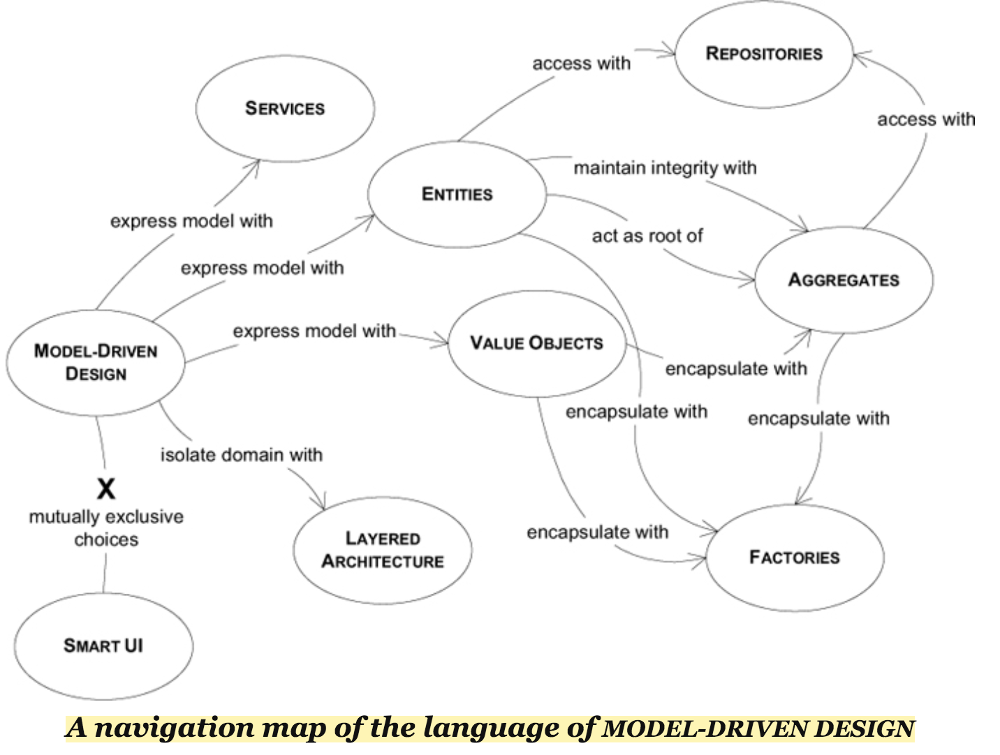

[source](http://tigerthinks.com/images/books/domain-driven-design-model-driven-design.png)


### Domain Driven Design

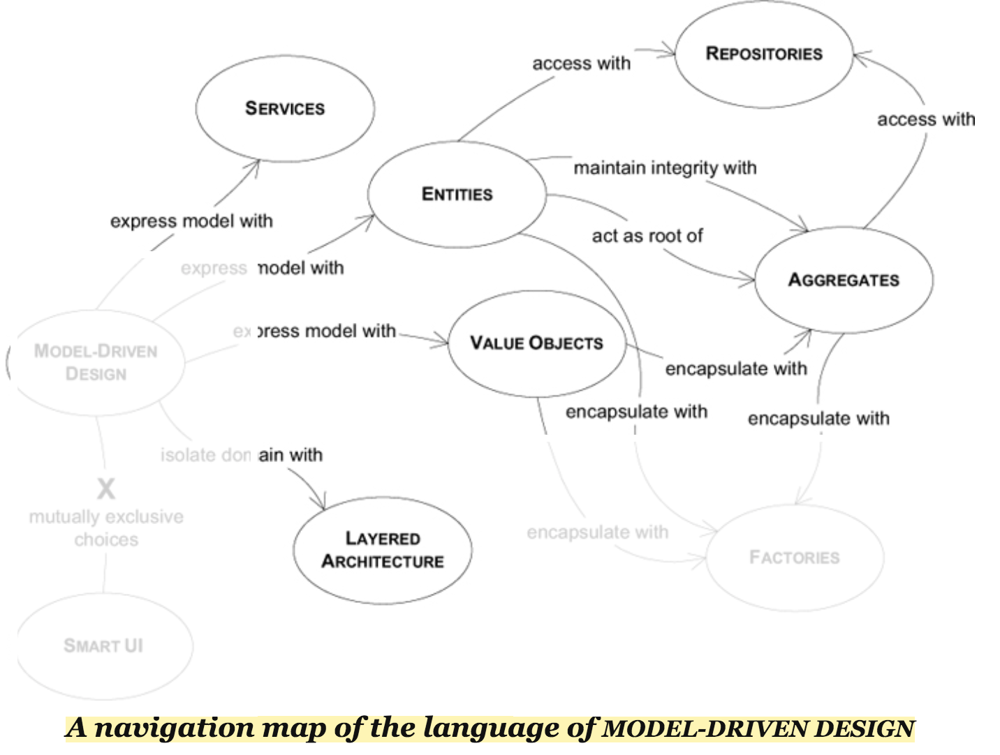

### Domain Driven Design

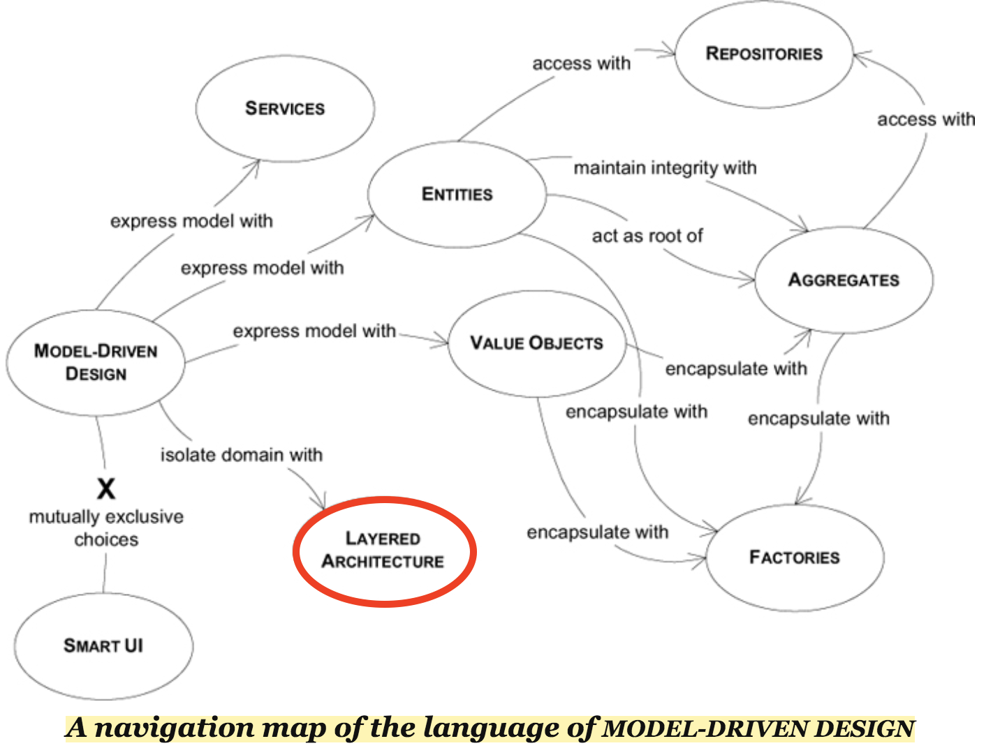

### The Layered Architecture


|Layer|Description|
|------|--------|
| Presentation Layer |Responsible for showing information to the user and interpreting the user’s commands. |
|Application Layer| Defines the jobs the software is supposed to do and directs the expressive domain objects to work out problems|
|Domain Layer |Responsible for representing concepts of the business, information about the business situation, and business rules. |
|Infrastructure Layer |Provide generic technical capabilities that support the higher layers: message sending for the application, persistence for the domain, drawing widgets for the UI, etc. |

### Entities

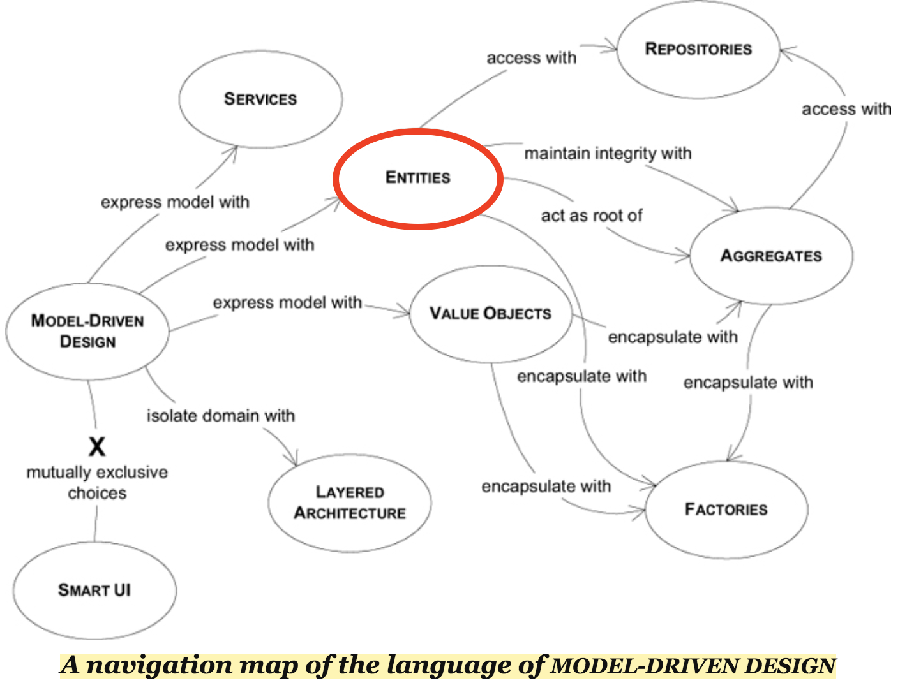

- Are objects defined primarily by their identity
- Their identities must be defined so that they can be effectively tracked. We care about *who* they are rather than *what* information they carry
- They have lifecycles may can radically change their form and content, while a thread of continuity must be maintained. 
- E.g., bank accounts, deposit transaction.


### Value Objects

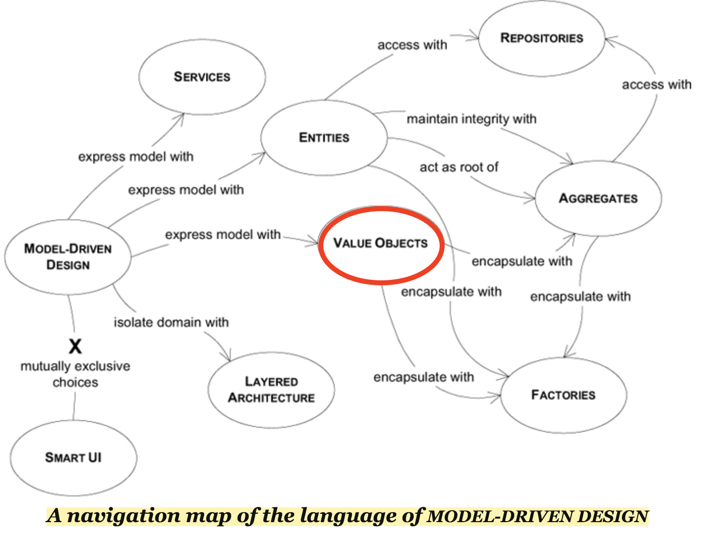

- Value Objects represent a descriptive aspect of the domain that has no conceptual identity. 
	- They are instantiated to represent elements of the design that we care about only for *what* they are, not *who* they are.
	- E.g.,  For example, street, city, and postal code shouldn’t be separate attributes of a Person object.

### Services

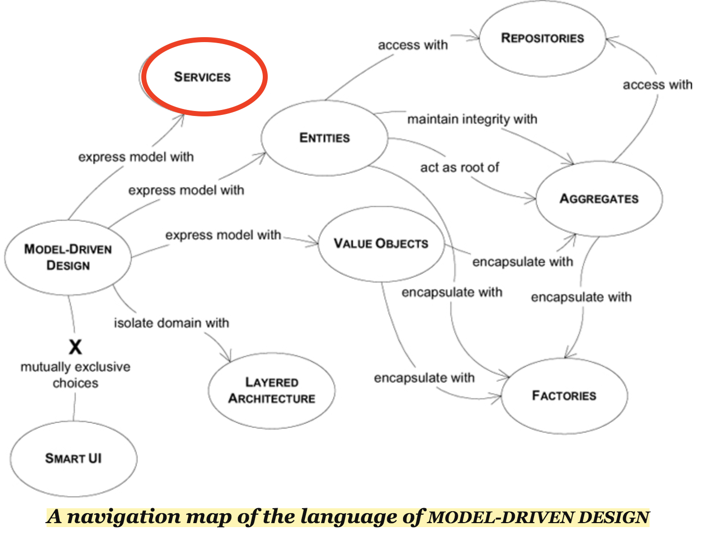

 - Services are operations offered as an interface that stands alone in the model, without encapsulating state as Entities and Value Objects do. 
 	- They are a common pattern in technical frameworks, but they can also apply in the domain layer.
 	- The name “service” is ment to emphasize the relationship with other objects. 
 
 
### The Lifecycle of a Domain Object

Every object has a lifecycle. It is **born**, it may go **through** various **states**, it eventually is either **archived** or **deleted**.

The problems fall into two categories:
- **Maintaining** **integrity** throughout the lifecycle
- **Preventing** the model from getting swamped by the **complexity** of managing the lifecycle.


### Aggregates and Repositories
The most important concepts for this are Aggregates and Repositories[^63]

[^63]: an Aggregate is always associated with one and only one Repository.

[.column]
**Aggregates** are a cluster of Entities and Value Objects that make sense domain-wise and are retrieved and persisted together.

E.g. A Car is an aggregate of wheel, engine, and the customer

[.column]

**Repositories** offer an interface to retrieve and persist aggregates, hiding lower level details from the domain. 

E.g. Sold cars catalogue


### Event Sourcing[^64]

- The fundamental idea of Event Sourcing is ensuring that every change to the state of an application is captured in an event object, 

- Event objects are immutable and stored in the sequence they were applied for the same lifetime as the application state itself.


[^64]: Martin Fowler, [link](https://martinfowler.com/eaaDev/EventSourcing.html)

### The Power of Events

Events are both a **fact** and a **notification**. 

They represent **something** that **happened** in the **real world** but include no expectation of any future action. 

They **travel** in only **one direction** and expect no response (sometimes called “fire and forget”), but one **may be “synthesized” from a subsequent event**.


---


---


---

