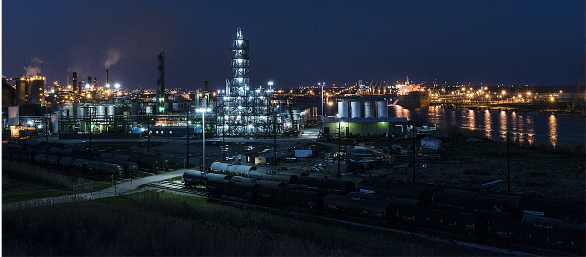
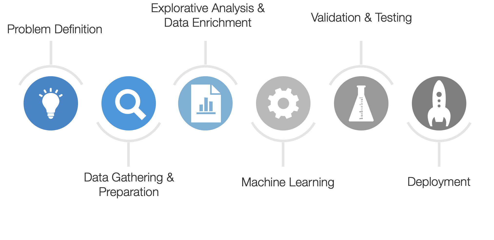
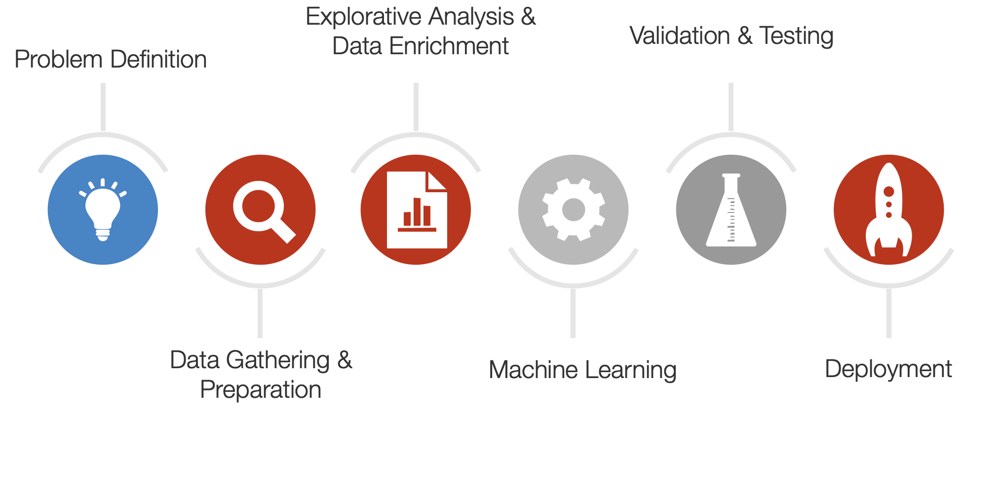
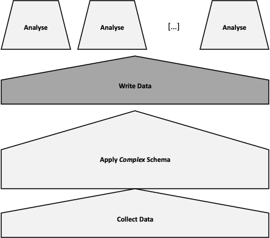
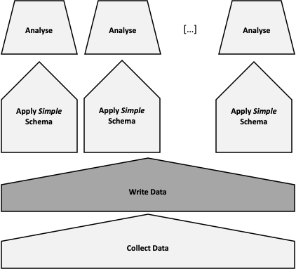
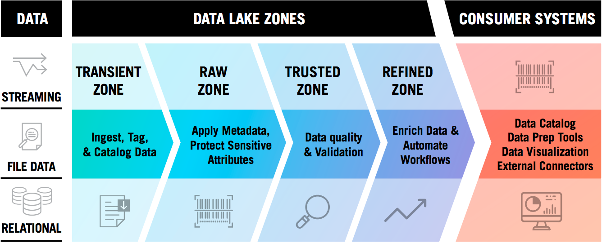
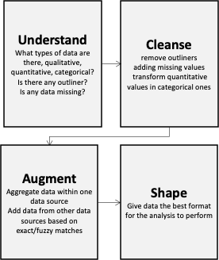

# Data Science vs Data Engineering Pipelines

## Data Science is...

...refining crude oil

^ 
- Discovering what we don’t know from data 
- Obtaining predictive, actionable insight from data
- Creating Data Products that have business impact now 
- Communicating relevant business stories from data 
- Building confidence in decisions that drive business value 

## Data Engineering is...

...build the refinery.

### Quote

> “A scientist can discover a new star, but he cannot make one. 
He would have to ask an engineerto do it for him.”
– Gordon Lindsay Glegg

## Data Analysis Pipeline

## Data Engineering Parts

## Recall

### Traditional Data Modelling Workflow

- Known as Schema on Write
- Focus on the modelling a schema that can accommodate all needs
- Bad impact on those analysis that were not envisioned

^
 - Extract Transform Load
 - Some analyses may no longer be performed because the data were lost at writing time,

---
## Schema on Read

- Load data first, ask question later
- All data are kept, the minimal schema need for an analysis is applied when needed
- New analyses can be introduced in any point in time

## Data Lakes (Conceptual View)

## Data Lakes (Physical View)

# So, what’s a logical architecture for a data engineering pipeline?

---

---

## [[Data Acquisition]]

- It is the process of collecting raw data from various silo databases or files and integrating it into a data lake on the data processing platform, e.g., Hadoop data lake.
- It involves loading data from a variety of sources
- It can involve altering and modification of individual files to fit into a format that optimizes the storage
- For instance, in Big Data small files are concatenated to form files of 100s of MBs and large files are broken down in files of 100s of MB

## [[Data Wrangling]]

The process of creating *reliable*  that can be analysed to generate valid actionable insights.

The central goal is to make data usable: to put data in a form that can be easily manipulated by analysis tools.

It includes understanding, cleansing, augmenting and shaping data.

^ Additional goals:
- ensure that data is responsive to the intended analyses
- ensure that data contain the necessary information, 
- ensure metadata that describe data are available
- ensure that data are sufficiently correct to support successful modeling and decision-making.

The results is data in the best format (e.g., columnar) for the analysis to perform.

##  ~~ETL~~ [[Data Pipelines]]

A data pipeline aggregates, organizes, and moves data to a destination for storage, insights, and analysis. 

Modern data pipeline generalize the notion of ETL (extract, transform, load) to include data ingestion, integration, and movement across any cloud architecture and add additional layers of resiliency against failure.

- [[Apache Airflow]]
- [[Kafka Streams]]
- [[KSQL]]

