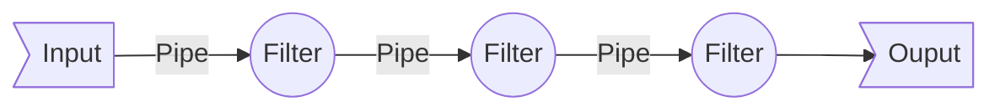

# Data Pipeline

A pipeline is a set of data processing elements connected in series, where the output of one element is the input of the next one. 

The elements of a pipeline are often executed in parallel or in time-sliced fashion; in that case, some amount of buffer **storage** is often inserted between elements.

## Data pipelines Then

The concept of a pipeline began from the good old Unix "Pipe" symbol (|). 

The output of one "process" (on left side of the pipe) to be given as "input" to another process (which was on the right side of the pipe).

### Elements of a Data Pipeline  

**Pipes** are connectors  which send data from one component (filter) to another.

**Filters** do actual data "processing" (transformation/cleansing/scrubbing/munging... whatever)

**Input** or **Source** is the actual data source (database output/text file/SQL resultset/raw text)

**Output** or **Sink** is the final output at the end of this chain.

## Big Data Pipeline[^1]

The big data world brings velocity, which forced a paradigm shift in data architectures.

Streaming data gave rise to some interesting data pipeline implementations. 

[^1]: henceforth referred as data pipelines only

### Basic Operations of Data Pipelines 

- access information of different data sources
- extract discrete data elements of the source data
- copy extracted data from a data source to another
- transform data 
	- correct errors in data elements extracted from source data
	- standardize data in data elements based on field type
- join or merge (in a rule-driven way) with other data sources
 
## Big Data Pipeline - Batch

[[MapReduce]]

[[FlumeJava]]

[[Apache Airflow]]

## Big Data Pipeline - Streaming

A data pipeline involves intermediate tasks, which encapsulates a process. 

Typically represented as Direct Acyclic Graphs (DAG)

Data pipelines open up the possibility of creating "workflows" which can help reuse, modularize and componentize data flows. 

### Apache Beam[^2]

[^2]: [link](https://beam.apache.org/documentation/programming-guide/)

### Kafka Streams

### KSQL

## Data pipeline components

- **Storage and Ingestion Layers**, e.g., HDFS
	- Storage layers nowadays typically support [[polyglot persistence]].
	- Message Buses that help move chunks of data (sometimes at blazing speeds) from one system to another, e.g., Kafka, RabbitMQ, Kinesis
	- Serialization Frameworks, e.g., Protocol Buffers, Avro,
- **(Event Stream) Processing frameworks**, e.g., Kafka Streams, Flink
	- JVM Based
	- SQL Based
- **Workflow Management Tools** that supervise the processes which run inside your data pipelines, e.g., Airflow, Luigi, Dagster
  	-  "orchestrating" systems
  	-  "choreographing" systems
- **Query layer**, e.g., NoSQL Datamarts
- **Analytics layer** (out of scope)

## Architectural Patterns

How to combine the components above?

[[Lambda architecture]]
[[Kappa architecture]]

## Data Virtualisation

	
## Anti Patterns
