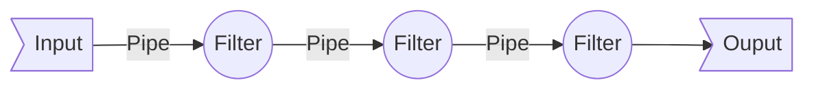

# Data Pipeline

A pipeline is a set of data processing elements connected in series, where the output of one element is the input of the next one. 

The elements of a pipeline are often executed in parallel or in time-sliced fashion; in that case, some amount of buffer **storage** is often inserted between elements.

# Data Pipeline

A data pipeline involves intermediate tasks, which encapsulates a process. 

Typically represented as Direct Acyclic Graphs (DAG)

Data pipelines open up the possibility of creating "workflows" which can help reuse, modularize and componentize data flows. 
## Unix Philosophy[^4]

The concept of a pipeline began from the good old Unix "Pipe" symbol (|). 

The output of one "process" (on left side of the pipe) to be given as "input" to another process (which was on the right side of the pipe).

[^4]: [Kafka, Samza and the Unix Philosophy of Distributed Data](https://martin.kleppmann.com/papers/kafka-debull15.pdf)

### Elements of a Data Pipeline  

**Pipes** are connectors  which send data from one component (filter) to another.

**Filters** do actual data "processing" (transformation/cleansing/scrubbing/munging... whatever)

**Input** or **Source** is the actual data source (database output/text file/SQL resultset/raw text)

**Output** or **Sink** is the final output at the end of this chain.

## Big Data[^1]

The big data world brings velocity and volume, which forced a paradigm shift in data architectures.

Streaming data gave rise to some interesting data pipeline implementations.

[^1]: henceforth referred as data pipelines only

### Basic Operation of Data Pipelines 

- store schema and access information of different data sources
- extract discrete data elements of the source data
- copy extracted data from a data source to another
- transform data 
	-  correct errors in data elements extracted from source data
	- standardize data in data elements based on field type
- join or merge (in a rule driven way) with other data sources

## Big Data Pipeline - Batch

[[MapReduce]]

[[FlumeJava]]

[[Apache Airflow]]

