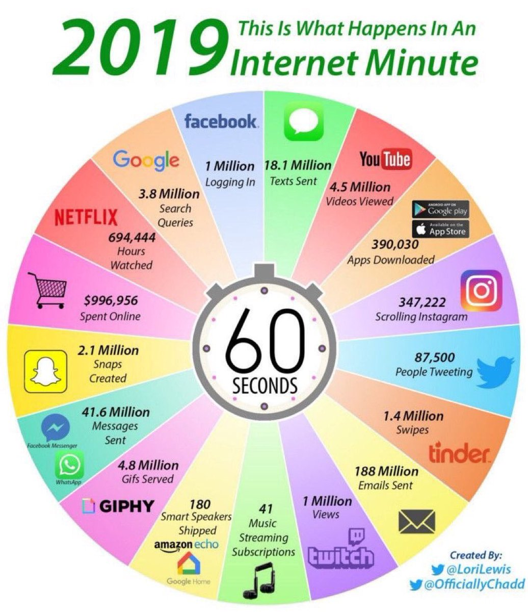
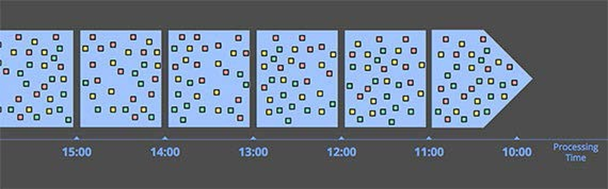
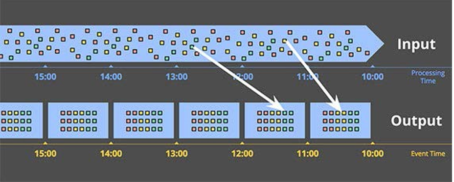
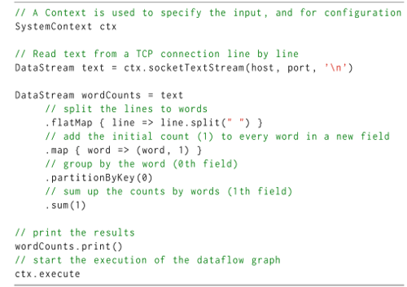

# Data Velocity

---

---

---

---

### Data Volume & Velocity

[.column]
Nowadays, we produce massive amount of data.

Moreover, we do not just produce a lot of data. We also do data at very high rates. 
Thus, aside of Data Volume another critical issue is data velocity.

Data velocity represents the speed at which data are consumed and insights are produced.

[.column]

### Review on Batch Processing

We have addressed the Volume aspect of big Data

-  Static large data sets

-  Partitioned across different nodes

-  Processing jobs eventually terminate

Processing technologies
-  MapReduce (Hadoop)
-  HDFS
-  Spark
-  Hive

### What is A Stream?

A stream is an unbounded sequence of data. Typically it is modeled as a sequence of pairs $$(o,i)$$, where $$o$$ is an document/tuple/graph and $$i$$ is a timestamp.

$$(o1,1), (o2,2), (o3,3), (o4,4),(o5,5), (oi,i) .....$$

### What for?

Three interesting characteristics distinguish streams from ther data:

-  Unbounded data, i.e., infinite
-  Data are ordered, typically time-wise.
-  Data are shared in active way, i.e., push model vs pull. is controlled by the source

### Where are the streams?
 

Several sources share data in a streaming form.

-  Stream from clusters, e.g., traces, metrics, and logs.
-  Stream from social media, e.g., Twitter feeds.
-  Stream from news, e.g., GDELT and Google news.
-  Stream from sensor networks, e.g., from smart cities.

### How to Process Streams?

Due to the *unbounded* nature of stream, traditional processing techniques are not adequate. 
Moreover, stream analysis typically has strict time constrains.

Thus, **Stream processing** requires a paradigm shift, i.e., 
from data at rest and post-hoc analyses, to process data **in-motion** and in-motion insights.

### Who needs Stream Processing?

In many applications domains, the limits of traditional
data processing infrastructures are challenged:
-  Electronic trading
-  Network monitoring
-  Fraud detection
-  Social network analysis
-  IoT Applications
  - Smart cities
  - Smart grid

### 8 Requirements for Big Streaming[^1]

[.column]

-  Keep the data moving
  -  Prefer active (push) data sharing
-  Declarative Access
  -  E.g., streamSQL, CQL
-  Handle imperfections
  -  Late, missing, unordered items
-  Predictable outcomes
  -  Consistency, event-time processing

[.column]

-  Integrate stored and streaming data
  -  Hybrid stream and batch
-  Data safety and availability
  -  Fault tolerance
-  Partitioning and Scaling
  -  Distributed processing
-  Instantaneous response
  -  Low latency

### Stream Processing State of the Art

[.column] 

Stream Analytics (SA)

-  Obtain aggregates over streaming data within time boundaries

Event Processing (EP)

-  Interested in sequences of event, called composite events, defined using regular expressions

[.column] 

 

### 4 Dimensions to Consider

Five dimensions are important when considering stream processing engines for big data.

[.column]

- Notions of Time
- Continuous Processing
- Architectural View
- Fault Tolerance
- Programming Model

[.column]

### Different Notions of Time (1/2)
In the SP literature, many notion of time have been proposed. For sake of simplicity, we use the nomenclature suggested by Tyler Akidau [^2].
-  **Ingestion time**: the time at which a stream element arrives at the source of the application
-  **Processing time**: the time at which an operator in the processing pipeline reads the stream element
-  **Event time**: The original time at which the data was generated

NB: in the following we ignore ingestion time without loss of
generality.

### Different Notions of Time (2/2)

For both ingestion and processing time, the progress of time is
controlled by stream processing engine and the data ordering is strictly monotonic. 

On the other hand, event time is controlled by the source. Thus, the data ordering is only monotonic. Indeed, in event-time, it is possible to have late arriving elements and element occurring simultaneously.

Depending on the type of processing one needs to do, late arrivals may be taken into account.

### Event Time vs Processing Time (1/2)

Ideally, one would like the data to reach the system when they are generated in the real world.

However, this is *physically* not possible, due to the network delay.

Moreover, in a distributed system, where the components are connected to a *non-reliable* network, events can arrive late, i.e., out of order.

### Event Time vs Processing Time (2/2)

Image: Tyler Akidau

### Continuous Processing (1/2)

The infinite nature of streams requires a change of paradigm in the way we process data.

Continuous semantics: the results of a continuous query is the set of data that would be returned if the query were executed at every instant in time[^3].

### Continuous Processing (2/2)

[.column]

-  The Stream is filled with the elements of the answer that are produced and never changed;
-  The Store is filled with parts of the answer that may change in the future;
-  The Scratch is used to store data that are not part of the answer but are used to compute it;
-  The Throw is used to store unneeded tuples.

[.column]

Image: Tyler Akidau

### Dealing With Unboundedness: Window Operators

[.column]

-  Time windows
  -  Sliding
  -  Tumbling
-  Tuple windows
  -  Also called physical windows
-  Data-driven windows
  -  Session windows
-  Triggered by
  -  Event time, processing time, count

[.column]

Image: Tyler Akidau

### Time-Based Window Operator (1/2)

A time-based sliding window operator consists of two parameter $$W=P(omega,beta)$$ where:
-  $$\omega$$ represents the window width;
-  $$\beta$$ is called sliding parameter.

For each point in time, the time-based sliding window operator defines a set of windows.

$$\mathcal{W}=(<o,c>| c>o, |c-o|=omega, |o-o'|=|c-c'|=beta )$$

### Time-Based Window Operator (2/2)[^15]

### Time-Based Window Operator (2/2)[^15]

### Time-Based Window Operator (2/2)[^15]

### Time-Based Window Operator (2/2)[^15]

### Time-Based Window Operator (2/2)[^15]

### Time-Based Window Operator (2/2)[^15]

### Time-Based Window Operator (2/2)[^15]

### Windowing in Processing Time

-  elements' timestamps are controlled by the system
-  time progresses according to system's internal clock
-  no chance for out of order or late arrival

### Windowing in Processing Time[^16]

[^16]: Image: Tyler Akidau

### Windowing in Event Time

-  Windows are based on timestamp info in the stream

-  Buffering is needed to deal with late arrivals

-  Needs an external time progress indicator

### Windowing in Event Time[^16]

### Example Windowed Aggregation

### Architectural Approaches to Stream Processing (1/2)

On the one hand, the Information Flow Processing (IFP) architecture is an abstract schema defined by Cugola and Margara to survey the existing SP proposal[^4].

### Architectural Approaches to Stream Processing (2/2)

On the other hand, two SP architectures f had big industrial tractions include:

- The Lambda Architecture, which combines streaming and batch processing.
-  The Kappa Architecture, which relies on fault-tolerant stream log.

### Lambda Architecture[^17]

The lambda architecture is used when approximate results are needed quickly and more accurate results can come later. 

Moreover, it is suitable for cases where pure stream processing is not fault tolerant and more accurate results require to wait for late arrivals.

[^17]: Courtesy of Emanuele Della Valle/Marco Balduini

### Kappa Architecture[^17]

The Kappa architecture was designed to address the limitation of the lambda architecture. 

It leverages only a speed layer but it relies on a fault-tolerant stream storage, e.g., a distributed log. 

The Kappa architecture is simpler to maintain and less costly to operate than the lambda architecture.

### Kappa Architecture

### Programming with Streams

Stream processing frameworks hide execution details from the programmers, and manage them in the background.

There are different abstraction levels that a programmer can use to express streaming computations.

### SQL-like Languages For Stream Processing

Prominent batch-processing solutions provide SQL interfaces e.g., Hive,
PIG, SparkSQL. The reasons include the access to a wider audience and
all the benefits of declarative languages. Similarly, Stream Processing
systems are migrating towards SQL-like languages. Can you guess what
kind of extensions they have? Exactly! Window Operators!

### Continuous Query Language (1/2)

The infinite nature of streams requires a change of paradigm in the way
we process data. A first approach to this is given by the Continuous
Query Language (CQL)[^5]

CQL includes three families of operators that reconcile stream
processing with traditional relational algebra.
-  Stream-to-Relation operators
-  Relation-to-Relation operators
-  Relation-to-Stream operators

### Continuous Query Language (2/2)

### Programming with Streams: Functional APIs 

Stream Processing frameworks such as Kafka Streams and Flink offer
functional APIs to directly write streaming programs.

The use of the function abstraction operator ($lambda$-calculus)
provides a mechanism for the representation of Streaming Transformation
using higher-order function such as filter, maps, and flatmaps.

Functional APIs are still declarative. However, they give more freedom
to the developer who needs to design specialized operations, e.g.,
aggregations.

### Functional APIs
[.column]

-  Relies on standard functional terms (e.g., map, flatmap)

-  Hides the details about the underling computations;

-  Programmers need only specify what should be computed in terms of
  pipelines.

[.column]

### Functional APIs: Reference Model[^6]

### Programming with Streams: Dataflow                

-  As dataflow networks were the first type of streaming programs to
  appear in the literature.

-  A dataflow network represents a program as nodes and edges.

  -  nodes represent (continuous) computations

  -  edges represent data moving across nodes, i.e., streams.

  -  Nodes (operator) can only communicate with each other by their
    input and output connections.

-  Languages for dataflow programming offer programmers the primitives
  to implement custom business logic as topologies of nodes.

### Logical Dataflow Network

-  What programmer design is actually the logical dataflow plan.

-  However, a stream processing system distributes a dataflow graph
  across multiple machines.

-  The system is also responsible for managing the partitioning of
  data, the network communication, as well as program recovery in case
  of machine failure.

### Dataflow Programming: Physical Dataflow

-  Before execution, systems typically create several parallel
  instances of the same operator, which we refer to as tasks.

-  A system is able to scale out by distributing these tasks across
  many machines, akin to a MapReduce execution.

-  In dataflow programming, the programmers can control the degree of
  parallelism and, thus, part of the physical execution.

### Physical Dataflow Network

### Dataflow Programming: Stateful Operators

-  Unlike a simple operator such as $filter$, certain operators need to
  keep mutable state.

-  For instance, an operator that $Countc$ all the occurrence of a
  certain event must keep a state of the current counts.

-  In the the word counting example, counting the word occurrences
  received by an operator, requires storing the words received thus
  far along with their respective counts.

### The Dataflow Model

The model provides a framework to answer four questions:

-  What results are we computing?

-  Where in event-time are they computed?

-  When in processing time are they materialized?

-  How do results are reported ?

### The Dataflow Data Model

-  A `PCollection <T>` is a collection of data Type $T$

-  Maybe be bounded or unbounded in size

  -  Batch/Stream

-  Each element has an implicit timestamp

  -  Event time

-  Initially created from backing data stores

  -  File

  -  Stream source

### What: Transformations

`PTransforms` transform `PCollections` into other `PCollections`

### Where: Windowing Over Event-Time

### When in Processing Time?

-  Triggers control when results are materialized

  -  Watermark trigger

  -  Processing time trigger

  -  Count trigger

  -  Delta trigger (not supported by Dataflow)

-  Multiple triggers

  -  **Early**: useful to get early results, e.g., a 24-hours window

  -  **On**: At the window closure time

  -  **Late**: Responding to late arrivals

### Trigger at Watermark

### How to Refine Results?

-  How to relate results of multiple firing?

  -  Discarding

    -  Stateless, report the results for the latest firing only

  -  Accumulating

    -  Stateful, add to the previous result

  -  Accumulating and Retracting

    -  Remove the last update, put the new value

### Programming with Streams: Actor Model                

Starting from the seminal work of Hewitt et al., actors were thought as
a model for concurrency computing. This theory became the foundation of
several programming languages.

### Actors

[.column]

-  Actors are lightweight objects that encapsulate a *state* and a
  *behavior*.

-  They share no mutable state among them, and in fact the only way to
  communicate is through asynchronous message passing.

-  To manage the incoming messages, each actor has a mailbox.

[.column]

### Actor Model And Stream Processing Execution

Immutable state, no-sharing and asynchronous processing are common requirements for this Stream Processing systems, e.g., Flink or Storm. 

The asynchronous message-passing communication that governs actor interactions is a key feature that allows providing a loose-coupled architecture where blocking operators are avoided.

Indeed, these characteristics are particularly interesting for stream processing systems, especially for those where high scalability and parallel processing of streams are needed. 

### Actor Model: Partitioning

Partitioning strategies determine the allocation of records between the
parallel tasks of two connected logical operators.

-  **Random partitioning**: each output record of a task is shipped to
  a uniformly random assigned task of a receiving operator.
  distributing the workload evenly among tasks of the same operator.

-  **Broadcast partitioning**: send records to every parallel task of
  the next operator.

-  **Partitioning by key**: guarantees that records with the same key
  (e.g., declared by the user) are sent to the same par- allel task of
  consuming operators

-  **User defined partitioning functions**: (e.g., geo-partitioning or
  machine learning model selection ).

### Open-Source Systems Overview

### Large-Scale Data Stream Processing on Commodity Clusters

-  MapReduce and the development of open source software stacks for distributed data processing on commodity clusters (e.g., Apache
  Hadoop, Apache Spark) initially covered a major need for batch or
  offline data processing. However, low-latency and high-throughput
  computing emerged as an open problem.

-  Some of the first open source SPs for commodity clusters were
  `Yahoo! S4`[^7] and `Twitter Storm`[^8].

-  The more systems provide richer semantics and higher-level
  programming abstractions for data streams in order to simplify the
  writing of data stream analysis applications. Examples of such
  systems are `Apache Flink`[^9], `Beam`[^10] , `Samza`[^11], `Spark Streaming`[^12], `APEX`[^13], and `Kafka Streams`[^14].

### **The End**

[^1]: Stonebraker, Michael, Ugur Cetintemel, and Stan Zdonik. "*The 8 requirements of real-time stream processing*." ACM Sigmod Record 34.4 (2005): 42-47

  [^2]: Akidau, Tyler, et al. The dataflow model: a practical approach to balancing correctness, latency, and cost in massive-scale, unbounded, out-of-order data processing.(2015).

[^3]: Terry, Douglas, et al. "Continuous queries over append-only databases." Acm Sigmod Record 21.2 (1992): 321-330. 

[^4]: Cugola, Gianpaolo, and Alessandro Margara. "Processing flows of
  information: From data stream to complex event processing." ACM
  Computing Surveys (2012).

[^5]: Arasu, A., Babu, S., & Widom, J. (2006). The CQL continuous query
  language: semantic foundations and query execution. The VLDB
  Journal, 15(2), 121-142.

[^6]: Sax, Matthias J., et al. "Streams and tables: Two sides of the
  same coin." Proceedings of the International Workshop on Real-Time
  Business Intelligence and Analytics. 2018.

[^7]: [S4](http://incubator.apache.org/projects/s4.html)

[^8]: [Storm](http://storm.apache.org/)

[^9]: [Flink](https://flink.apache.org/)

[^10]: [Beam](https://beam.apache.org/)

[^11]: [Samza](http://samza.apache.org/)

[^12]: [SparkStreaming](https://spark.apache.org/streaming/)

[^13]: [Apex](https://apex.apache.org/)

[^14]: [Kafka Ssubtreams](https://kafka.apache.org/documentation/streams/)

[^15]: Courtesy of Emanuele Della Valle/Daniele Dell'Aglio
