footer:  Curtesy of Marco Brambilla (polimi)
slidenumbers: true
slide-dividers: ###
<!-- : #course, #topic, #LTAT.02.007 -->

[Reading](http://cidrdb.org/cidr2015/Papers/CIDR15_Paper2.pdf)

# Data Engineering
## Data Wrangling
#### LTAT.02.007
#### Ass Prof. Riccardo Tommasini
#### Assistants: Mohamed Ragab, Samuele Langhi, Hassan Elsaeeb
#### Curtesy of Marco Brambilla

- [https://courses.cs.ut.ee/2020/dataeng](https://courses.cs.ut.ee/2020/dataeng)
- [Forum]() 

---

### Conventional Definition of Data Quality

* __Accuracy__
  * The data was recorded correctly
* __Completeness__
  * All relevant data was recorded
* __Uniqueness__
  * Entities are recorded once
* __Timeliness__
  * The data is kept up to date(and time consistency is granted(
* __Consistency__
  * The data agrees with itself

### Problems …

* Unmeasurable
  * Accuracy and completeness are extremely difficult, perhaps impossible to measure
* Context independent
  * No accounting for what is important  Eg, if you are computing aggregates, you can tolerate a lot of inaccuracy
* Incomplete
  * What about interpretability, accessibility, metadata, analysis, etc
* Vague
  * The conventional definitions provide no guidance towards practical improvements of the data

---

# Isn’t data science sexy?

---
# When Data Is Wrong

### The skeptic approach

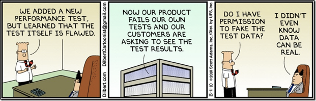

### The pragmatic approach

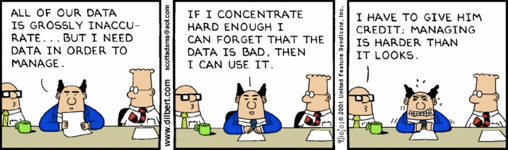

### The (pseudo) practioner approach
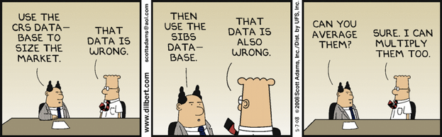

### Goal: Better Faster Cheaper!

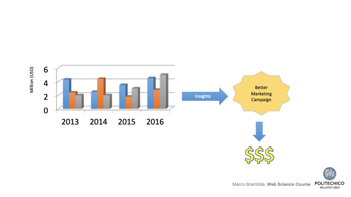

### The Vicious Cycle of Bad Data

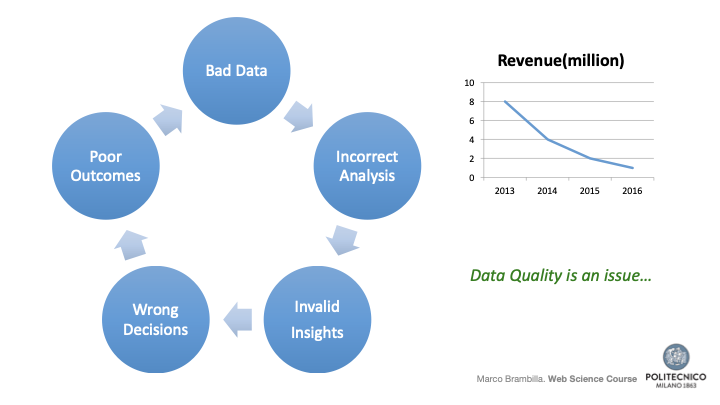

### Data Quality Issue

Gartner Report

By 2017, 33% of the largest global companies will experience an information crisis due to their inability to adequately value, govern and trust their enterprise information.

> If you torture the data long enough, it will confess to anything
> – Darrell Huff
																			
---

# Making a Wrong Right

---
### Data Wrangling is …

The process of transforming “raw” data into data that can be analyzed to generate valid actionable insights

Data scientists spend more timeon preparing data than on analyzing it.

### Data Wrangling  a.k.a.

Data Preprocessing
Data Preparation
Data Cleansing
Data Scrubbing
Data Munging
Data Fold, Spindle, Mutilate…
(good old ETL)

### Data Wrangling Steps

[.column]

- Iterative process
- Understand
- Explore
- Transform
- Augment
- Visualize

[.column]

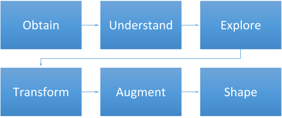

### What is Data Cleansing?

__Data cleansing__ or __data scrubbing__ is the act of __detecting and correcting (or removing corrupt or inaccurate records__) from a data set.

The term refers to identifying incomplete, incorrect, inaccurate, partial or irrelevant parts of the data and then replacing, modifying, filling in or deleting this dirty data.	

### Why is Data “Dirty” ?

[.column]

- Dummy Values
- Absence of Data
- Multipurpose Fields
- Cryptic Data
- Contradicting Data

[.column]

- Shared Field Usage
- Inappropriate Use of Fields
- Violation of Business Rules
- Non-Unique Identifiers
- Data Integration Problems

### Data Cleansing in Practice

Parsing

Correcting

Standardizing

Matching

Consolidating

### Parsing

Parsing locates and identifies individual data elements in the source files and then isolates these data elements in the target files

### Correcting

Corrects parsed individual data components using sophisticated data algorithms and secondary data sources

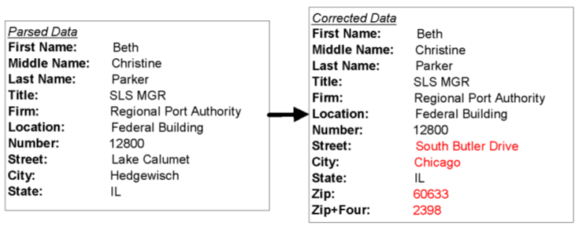

### Standardizing

Standardizing applies conversion routines to __transform data into its preferred (and consistent( format__ using both standard and custom business rules, as well as coherent measurement units,…

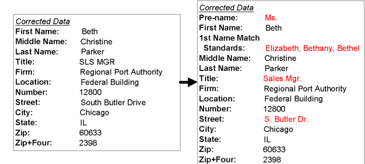

### Matching

Searching and __matching records__ within and across the parsed, corrected and standardized data based on predefined business rules to __eliminate duplications__ 

### Match Patterns

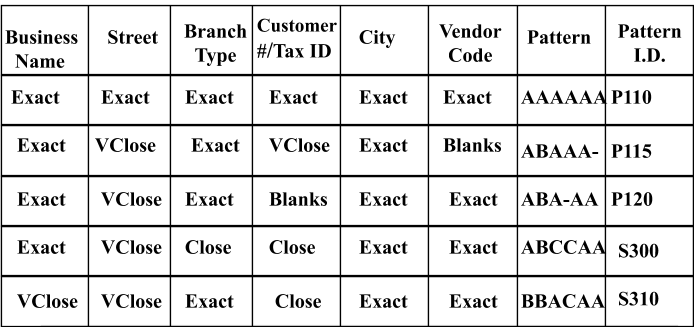

### Matching

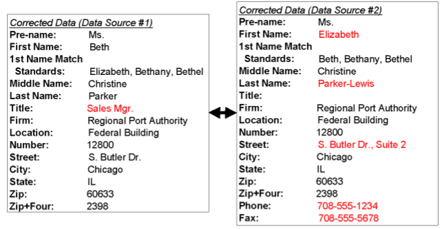

### Consolidating

Analyzing and __identifying relationships__ between matched records and consolidating/merging them into ONE representation

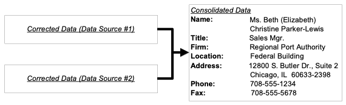

### Understanding Data: PDF

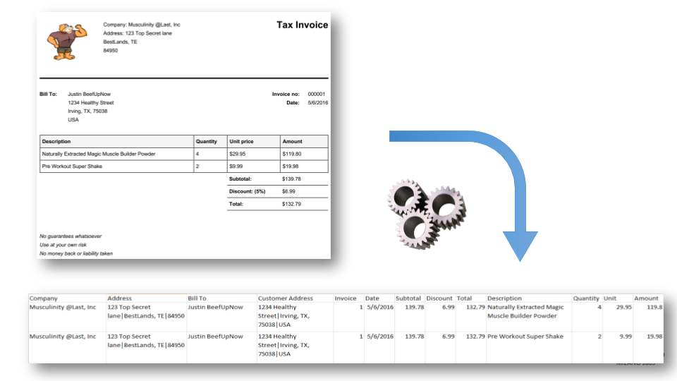

### Understanding Data: Free Text

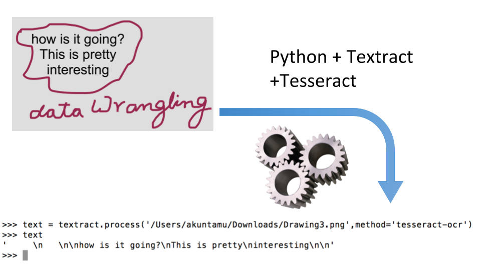

### Understanding Data: more

#### Unstructured

			> Looks like my V8 Chevy is running low on fuel Didn’t I fill up just the day before?

#### Structured

|Owner|Vehicle|Type|Fuel Level|Engine|Last Fill|
|-------|-------|-----|----------|------|--------|
|AK  |Chevy|Gas|5%|V8|05/04/16

---

### Understanding Data: more

Decode the following secret message:

$$DALDFWSFOEWRBOSDCALAXORDJFKMCO$$

↓

$$DAL~DFW~SFO~EWR~BOSDCA~LAX~ORD~JFK~MCO$$

### Data Munging

Potentiallylossytransformations applied to a piece of data or a file

Vague data transformation steps that are not yet completely clear

Eg, removing punctuation or html tags, data parsing, filtering, and transformation

---
# Semantics

[.column]
|???|
|:---:|
|75|
|80|
|65|
|55|
|67|
|78|
|88|
|90|
|45|
|58|
|69|
|80|
|110|

[.column]

### Semantics and Outliers
The value stands in the abnormal
	
|Age(Years)|
|:---:|
|75|
|80|
|65|
|55|
|67|
|78|
|88|
|90|
|45|
|58|
|69|
|80|
|110|

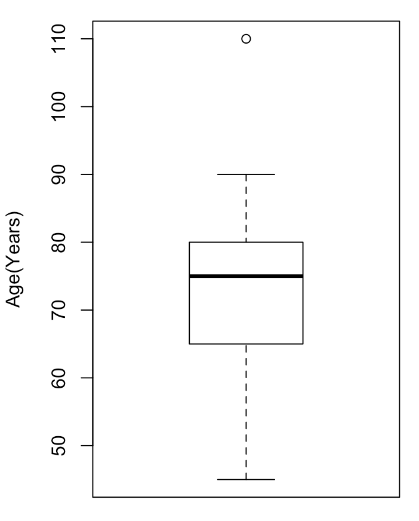

### Missing Data: Detection

__Overtly missing data__

- Match data specs against data - are all the attributes present?
- Scan individual records - are there gaps?
- Rough checks:  file sizes; \#files, \#records, or \#duplicates.
- Compare estimates (e.g., medians) with “expected” values and bounds.

^ more estimates are averages, frequencies
^ check at various levels of granularity since aggregates can be misleading

### Missing data: Detection (cont.)
__Hidden damage to data__

- Values are truncated or censored 

^	- check for spikes and dips in distributions and histograms

- Missing values and defaults are indistinguishable 

^ - too many missing values? metadata or domain expertise can help

- Errors of omission eg all calls from a particular area are missing 

^	- check if data are missing randomly or are localized in some way

### Missing Values: Random

- System failures
- Complete miss

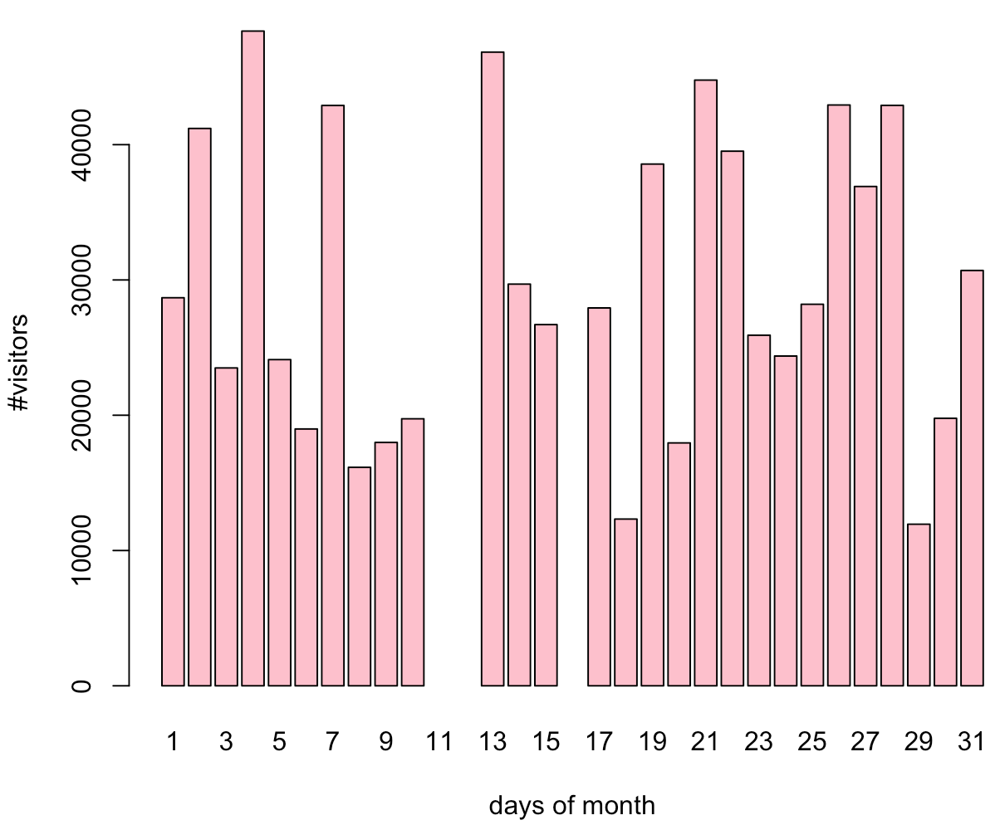

### Missing Values: Wrong Ingestion

[.column]
CSV to table / excel

Merged fields

Missing fields

[.column]
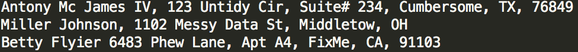

[^1]

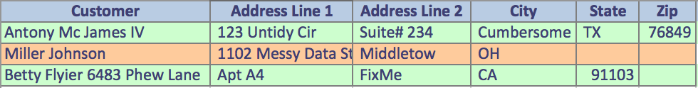

[^1]:Missing due to invalid data and ingestion

### Missing Values: Inapplicability

- Partial data by nature
- Remember to leave empty slots

### Imputing Values to Missing Data

- In federated data, between 30%-70% of the data points will have at least one missing attribute 
- data wastage if we ignore all records with a missing value
- Remaining data is seriously biased
- Lack of confidence in results
- Understanding pattern of missing data unearths data integrity issues

### Missing Value Imputation - 1

* Standalone imputation
  * Mean, median, other point estimates
  * Assume: Distribution of the missing values is the same as the non\-missing values
  * Does not take into account inter\-relationships
  * Introduces bias
  * Convenient, easy to implement

### Missing Value Imputation - 2

[.column]

* Better imputation \-  use attribute relationships
* Assume : all prior attributes are populated
* That is, _monotonicity_ in missing values

[.column]

|X1|X2|X3|X4|X5|	
|:---:|:---:|:----:|:---:|:----:|
10| 20| 35|   4| .
11| 18| 40|   2| .
19| 22| 22|  .  | .
09| 15|   .  |  . | .

### Missing Value Imputation –3

 * Two techniques
  * Regression (parametric)
  * Propensity score (non parametric)
  
### Regression method (parametric)

  * Use linear regression, sweep left\-to\-right
 
  $$X3=a+b*X2+c*X1;$$
  
  $$X4=d+e*X3+f*X2+g*X1$$
 
 and so on
  * X3 in the second equation is estimated from the first equation if it is missing

### Propensity Scores (nonparametric)
  * Let 
$$Y_j=1 = \begin{cases} 
				1~if~X_{ji}~is~missing; \\
                0~otherwise
		\end{cases}$$
				 

  * Estimate P(Yj=1) based on  X1through X1-jusing logistic regression
  * Group by propensity score P(Y1=1)
  * Within each group, estimate missing Xjs from known Xjs using approximate Bayesian bootstrap
  * Repeat until all attributes are populated

### Missing Value Imputation - 4

* Arbitrary missing pattern
  * Markov Chain Monte Carlo (MCMC(
  * Assume data is multivariate Normal,with parameter $$\Theta$$ 	
	  * (1) Simulate missing X, given $$\Theta$$  estimated from observed X ; 
	  * (2) Re-compute $$\Theta$$ using filled in X
  * Repeat until stable
  * Expensive: Used most often to induce monotonicity

^ __Note that imputed values are useful in aggregates but can’t be trusted individually__

### Censoring and Truncation

Well studied in Biostatistics, relevant to time dependent data e.g. duration

 _Censored_  \- Measurement is bounded but not precise eg Call duration > 20 are recorded as 20

 _Truncated_  \- Data point dropped if it exceeds or falls below a certain bound eg customers with less than 2 minutes of calling per month

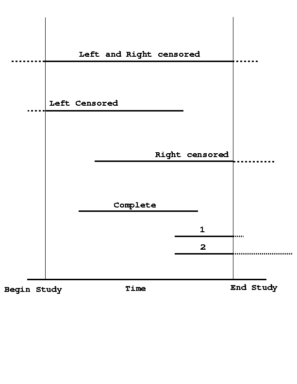

Censored time intervals

### Censoring/Truncation (cont.)

If censoring/truncation mechanism not known, analysis can be inaccurate and biased

But if you know the mechanism, you can mitigate the bias from the analysis

Metadata should record the existence as well as the nature of censoring/truncation

# 

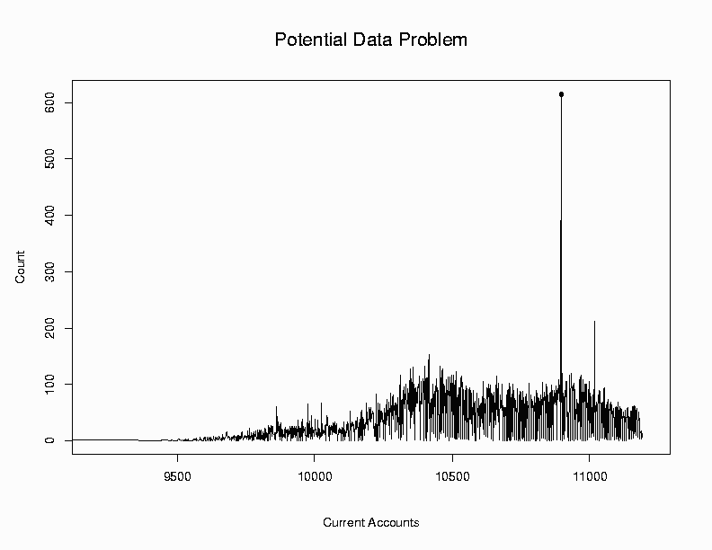

Spikes usually indicate censored time intervals

caused by resetting of timestamps to defaults

### Suspicious Data

Consider the data points

3, 4, 7, 4, 8, 3, 9, 5, 7, 6, 92

“92” is suspicious \- an  _outlier_ 

Outliers are potentially legitimate

Often, they are data or model glitches

Or, they could be a data miner’s dream, eg highly profitable customers

### Outliers

* Outlier – “departure from the expected”
* Types of outliers – defining “expected”
* Many approaches
  * Error bounds, tolerance limits – control charts
  * Model based – regression depth, analysis of residuals
  * Geometric
  * Distributional
  * Time Series outliers

### Control Charts

* Quality control of production lots
* Typically univariate: X\-Bar, R, CUSUM
* Distributional assumptions for charts not based on means eg R–charts
* Main steps (based on statistical inference(
  * Define “expected” and “departure” eg Mean and standard error based on sampling distribution of sample mean (aggregate(;
  * Compute aggregate each sample
  * Plot aggregates vs expected and error bounds
  * “Out of Control” if aggregates fall outside bounds

### An Example

(http://wwwitlnistgov/div898/handbook/mpc/section3/mpc3521htm(

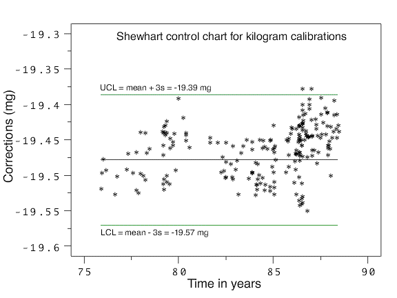

### Multivariate Control Charts - 1

* Bivariate charts:
  * based on bivariate Normal assumptions
  * component\-wise limits lead to Type I, II errors
* Depth based control charts (nonparametric(:
  * map n\-dimensional data to one dimension using depth egMahalanobis
  * Build control charts for depth
  * Compare against benchmark using depth eg Q\-Q plots of depth of each data set

Bivariate Control Chart

# 

### Multivariate Control Charts - 2

* Multiscale process control with wavelets:
  * Detects abnormalities at multiple scales as large wavelet coefficients
  * Useful for data with heteroscedasticity
  * Applied in chemical process control

### Model Fitting and Outliers

* Models summarize general trends in data
  * more complex than simple aggregates
  * eg linear regression, logistic regression focus on attribute relationships
* Data points that do not conform to well fitting models are _potential outliers_
* Goodness of fit tests (DQ for analysis/mining(
  * check suitableness of model to data
  * verify validity of assumptions
  * data rich enough to answer analysis/business question?

### Set Comparison and Outlier Detection

“Model” consists of partition based summaries

Perform nonparametric statistical tests for a rapid section\-wise comparison of two or more massive data sets

If there exists a baseline “good’’ data set, this technique can detect potentially corrupt sections in the test data set

### Types of data

* Categorical
* Qualitative
  * Subjective
* Quantitative
  * Discrete
  * Continuous

Color

Nice, Good, For birthday

6 balloons

Pressure 15 PSI,

139 m over sea level

* Categorical
* Qualitative
  * Subjective
* Quantitative
  * Discrete
  * Continuous

### Data Source Selection Criteria

Credibility

Completeness

Accurateness

Verifiability

Currency

Accessibility

Compliance

Cost

Legal issues

Security

Storage

Provenance

### Not all tables are created equal

Find total comedy movies in  all of 2014? \-> Not easy in current form

Find % of hit comedy movies in a 2015?

Very easy to add a new column

Very messy data

Variables in both rows and columns

Each row is complete

observation

Normalize to avoid duplication

Multiple Tables

Divided by Time

Combine all tables

accommodating

varying formats

### The “Key” (matching) problem

Keys are crucial in DB

Many DBs \-\-> Many keys

How to align?

Identification to a certain degree of accuracy likely\-identities

eg, same user match

### The “Duplicates” problem

Related to Key problem

Identification to certain degree of accuracy likely\-duplicates

eg, duplicate posts

Related to Key problem

Identification to certain degree of accuracy likely\-duplicates

### Lessons Learnt on Tables

(Multiple( variables in columns

Never values as columns\!

Shape may depend on convenience of queries

Matching identities and duplications are crucial in data science\!

Each observation is complete and atomic

Each variable belongs to (only\!( one column\!

### Schema-On-Write Vs Schema-On-Read

Traditional DBMSs enforced writing only data consistent with a pre\-designed schema

Today data modeling at design time is a luxury

In schema on read, data is applied to a plan or schema as it is pulled out of a stored location, rather than as it goes in

### Popular Open Source Tools

### Other Resources

### Commercial Vendors

### Trifacta Wrangler

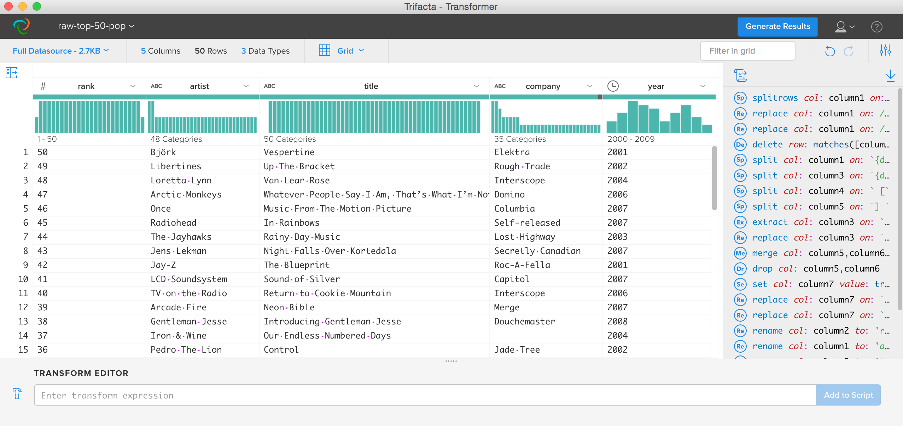

### Google’s Open Refine

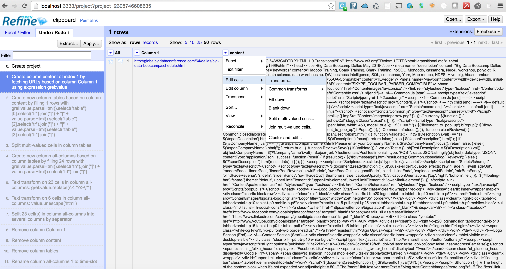

### Hands on Data Wrangling

* __Data Ingestion__
  * CSV
  * PDF
  * API/JSON
  * HTML Web Scraping
  * XLS, Access,…\!
* __Data Exploration__
  * Visual inspection
  * Graphing
* __Data Shaping__
  * Tidying Data

* __Data Cleansing__
  * Missing values
  * Format
  * Measurement Units
  * Outliers
  * Data Errors Per Domain
  * Fat Fingered Data
* __Data Augmenting__
  * Aggregate data sources
  * Fuzzy/Exact match

### R Libraries for Data Wrangling

  * stringr
  * dplyr
  * tidyr
  * readxl,xlsx
  * lubridate
  * gtools
  * plyr
  * rvest

### References – Web and Books

Web:

www2gbiforg/DataCleaningpdf

wwwwebopediacom/TERM/D/data\_cleansinghtml

Books:

Data Mining by Ian H Witten and Eibe Frank

Exploratory Data Mining and Data Quality by  Dasu and Johnson  (Wiley, 2004(

### References - Tools

Stanford Wranglerhttp://visstanfordedu/papers/wranglerhttp://visstanfordedu/wrangler

http://openrefineorg/

http://okfnlabsorg/

http://schoolofdataorg/

# Marco Brambilla,       @marcobrambi, marco.brambilla@polimi.it
http://datascience.deib.polimi.it

