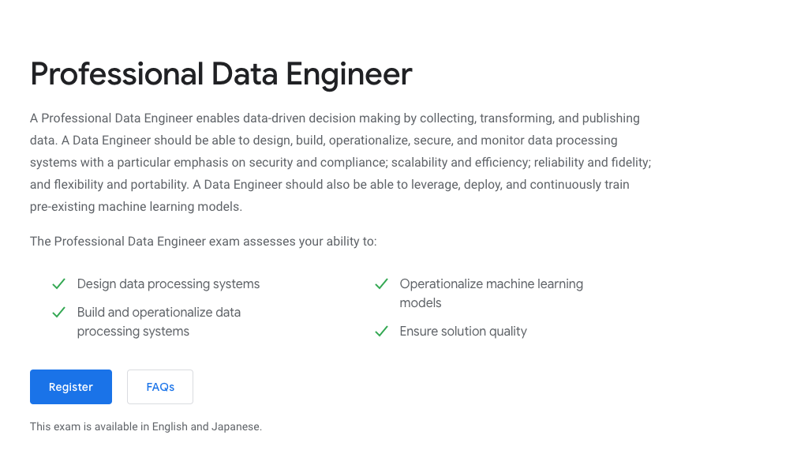
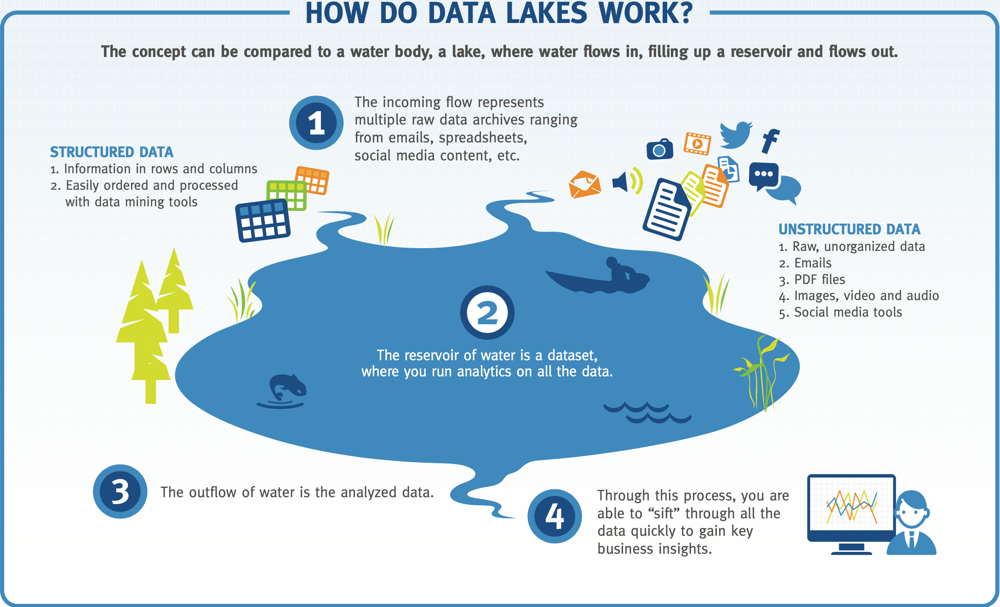

footer:  [Riccardo Tommasini](http://rictomm.me) - riccardo.tommasini@ut.ee - @rictomm - 
slidenumbers: true
<!-- : #course, #topic -->

# Data Engineering
#### LTAT.02.007
#### Ass Prof. Riccardo Tommasini
#### Assistants: Mohamed Ragab, Samuele Langhi, Hassan Elsaeeb
- [https://courses.cs.ut.ee/2020/dataeng](https://courses.cs.ut.ee/2020/dataeng)
- [Forum]() 

---
# Introduction

[[Data Driven Decision Making]] (by Emanuele Della Valle)

---

### [[Data Engineering]]

Data engineering is a set of operations aimed at creating interfaces and mechanisms for the flow and access of information[^0].

[^0]:[What is Data Engineering](https://medium.com/datadriveninvestor/what-is-data-engineering-explaining-the-data-pipeline-data-warehouse-and-data-engineer-role-1a4b182e0d16)

--- 
### The Data Engineer

 
 
A dedicated specialist that maintain data available and usable by others (Data Scientists).[^0]

Data engineers set up and operate the organization’s data infrastructure preparing it for further analysis by data analysts and scientists.[^0]

 Data engineering field could be thought of as a superset of business intelligence and data warehousing that brings more elements from software engineering.[^2] 
 
[^0]:[What is Data Engineering](https://medium.com/datadriveninvestor/what-is-data-engineering-explaining-the-data-pipeline-data-warehouse-and-data-engineer-role-1a4b182e0d16)
 
[^2]: [Source: The Rise of Data Engineer](https://www.freecodecamp.org/news/the-rise-of-the-data-engineer-91be18f1e603/)

---
### Roles in a Data Science Project[^5] 

[^5]: http://emanueledellavalle.org/slides/dspm/ds4biz.html#25 

---
### Netflix's Perspective[^3]

[^3]: [Netflix Innovation](https://netflixtechblog.com/notebook-innovation-591ee3221233)
 
 ---
###  The Knowledge Scientist[^4]

[^4]: [The Manifesto](https://www.knowledgescientist.org/)

---
 
<blockquote class="twitter-tweet">
Them: Can you just quickly pull this data for me?  Me: Sure, let me just:   SELECT * FROM some_ideal_clean_and_pristine.table_that_you_think_exists
&mdash; Seth Rosen (@sethrosen) <a href="https://twitter.com/sethrosen/status/1252291581320757249?ref_src=twsrc%5Etfw">April 20, 2020</a></blockquote> 

---
### Google's Two-Cents
 
 
 ---
[.background-color: #ffffff]

# Phylosophy of (Data) Sience
 

^ Nowdays we deal with a number of data from different domains.

[^7]: [Data as Fact](https://en.wikipedia.org/wiki/DIKW_pyramid#Data_as_fact)

--- 

# What is Data?	

---

---

### Oxford Dictionary

*Data \[uncountable, plural\] facts or information, especially when examined and used to find out things or to make decisions.* [^5]
[^5]:[Def](https://www.oxfordlearnersdictionaries.com/definition/english/data)

### Wikipedia
Data (treated as singular, plural, or as a mass noun) is any sequence of one or more symbols given meaning by specific act(s) of interpretation. [^6]

[^6]:[Data in Computing](https://en.wikipedia.org/wiki/Data_(computing)
---
[.background-color: #ffffff]

---
# Big Data 
--- 

### Refining Crude Oil

---

### Challenges [^Lanely2001]

<!-- Joke About Growing number of Vs -->

[^Lanely2001]:[Lanely2001](x-bdsk://laney20013d)
---
- [[Data Variety]] 
- [[Data Velocity]] 
- [[Data Volume]] 

---
###  Paradigm Shift

---
[.slide-transition: push(vertical, 0.3)]

---
[.slide-transition: push(vertical, 0.3)]

---
[.slide-transition: push(vertical, 0.3)]

---
[.slide-transition: push(vertical, 0.3)]

 
---
[.slide-transition: reveal(top)]

### Traditional Approach: Data Warehouse 

A data warehouse is a copy of transaction data specifically structured for query and analysis. — [Ralph Kimball](https://en.wikipedia.org/wiki/Ralph_Kimball)

A data warehouse is a subject-oriented, integrated, time-variant and non-volatile collection of data in support of management’s decision making process.-- [Bill Inmon](https://en.wikipedia.org/wiki/Bill_Inmon)

^ Data Warehouse are still relevant today and their maintenance is part of Data Engineers' resposibilities.
^ The warehouse is created with structure and model first before the data is loaded and it is called schema-on-write.

### Data Lake
A Data lake is a vast pool of raw data (i.e., data as thye are natively, unprocessed). A data lake stands out for its high agility as it isn’t limited to a warehouse’s fixed configuration. [^8]

[^8]:[ https://medium.com/datadriveninvestor/what-is-data-engineering]( https://medium.com/datadriveninvestor/what-is-data-engineering-explaining-the-data-pipeline-data-warehouse-and-data-engineer-role-1a4b182e0d16)

---

[Full Inforgraphic](./attachments/emc_understanding_data_lakes_infographic.pdf)

^ 
- In Data Lake, the raw data is loaded as-is, when the data is used it is given structure and it is called schema-on-read.
- Data Lake gives engineers the ability to easily change.

---

  

[.column]

- Use Structured Data
- Schema On Write
- Extract-Transform-Load Pipelines
- Priviledges Batch Processing

[.column]

 - Unstructured Data
- Schema on Read
- Uses ELT (Extract-Load-Transform) pipelines 
- Priviledges Stream Processing

### Thinking About Data Systems

---

# Conclusion
#### LTAT.02.007: [Website](https://courses.cs.ut.ee/2020/dataeng) and [Forum]() 
- **Ass Prof. Riccardo Tommasini**
- **Assistants: Mohamed Ragab, Samuele Langhi, Hassan Elsaeeb**

## Next on Data Engineering
- [[Data Modeling]]
	

	
	
	