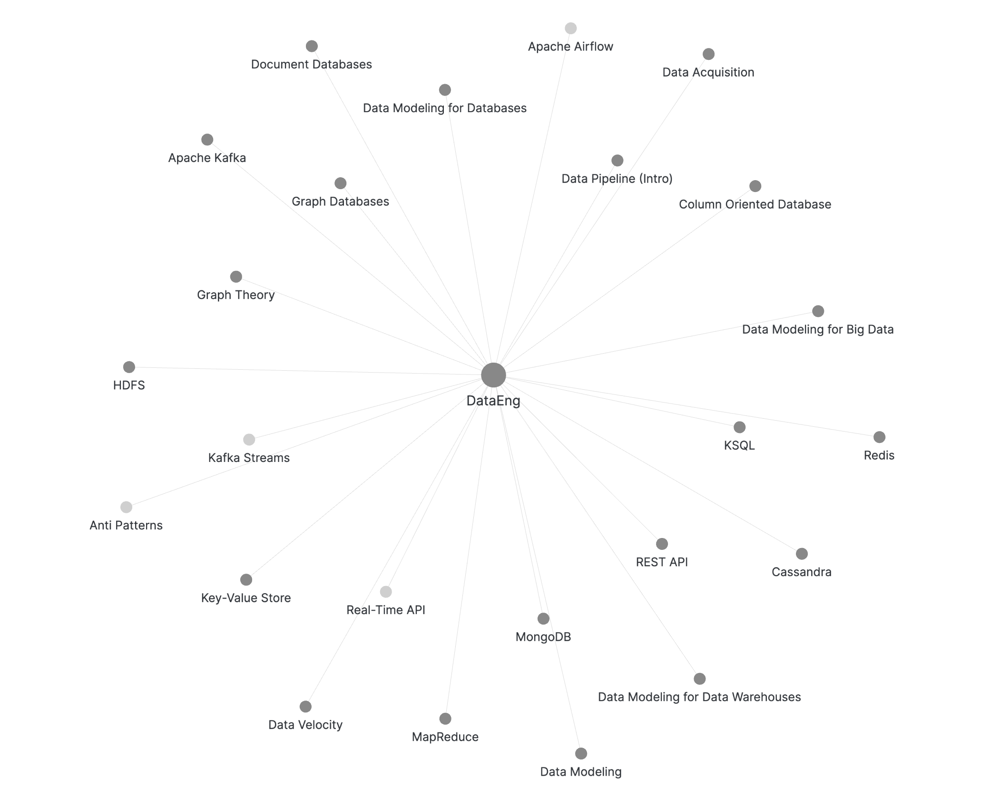

# [[Data Modeling]]

## [[Data Modeling for Databases]]

## [[Data Modeling for Data Warehouses]]

## [[Data Modeling for Big Data]]
 
## (NoSQL) Data Base Systems

### [[Key-Value Store]] with [[Redis]]

### [[Column Oriented Database]] with [[Cassandra]]

### [[Document Databases]] with [[MongoDB]]

### [[Graph Theory]] and [[Graph Databases]] 

# [[Data Pipeline (Intro)]]

## [[Data Acquisition]]

### [[REST API]] and [[Real-Time API | Beyond]]

### [[HDFS]]

### [[Apache Kafka]]

## Data Processing

### Batch Processing with [[MapReduce]]

### Modern Data Pipelines with [[Apache Airflow]]

### [[Streaming Data Engineering | Stream Processing]] with [[Kafka Streams]] and [[KSQL]]

### [[Anti Patterns]] in Data Processing

# [[Data Wrangling]]

## [[Basic Statistics]]

## [[Data Cleansing]]

## [[Data Augumentation]]

