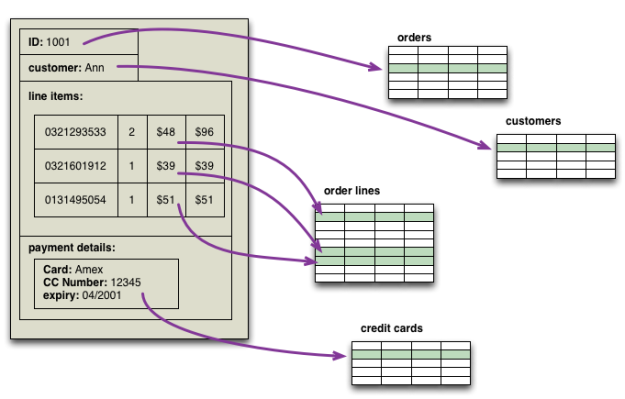
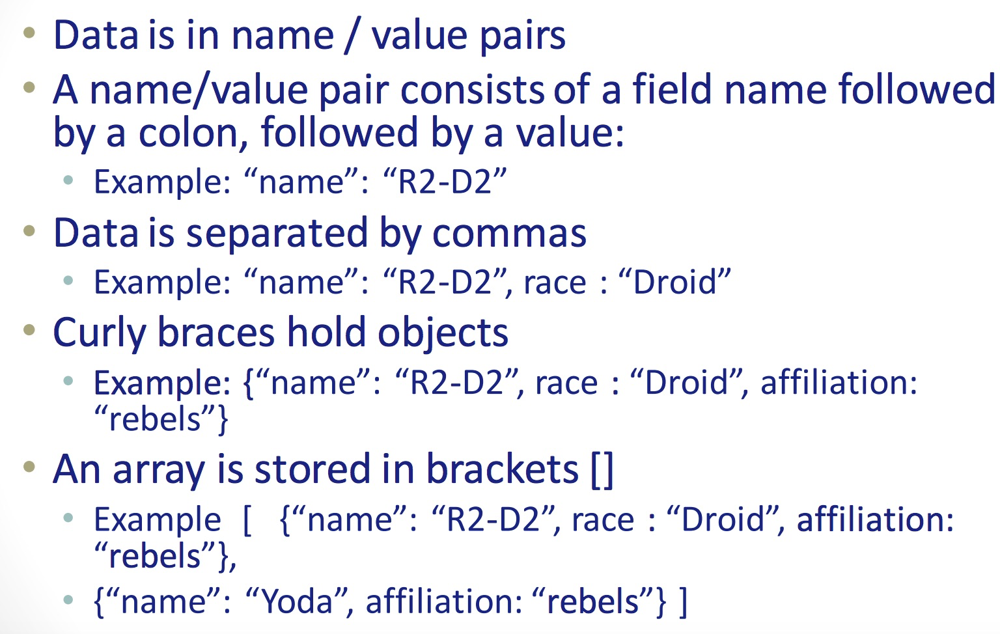
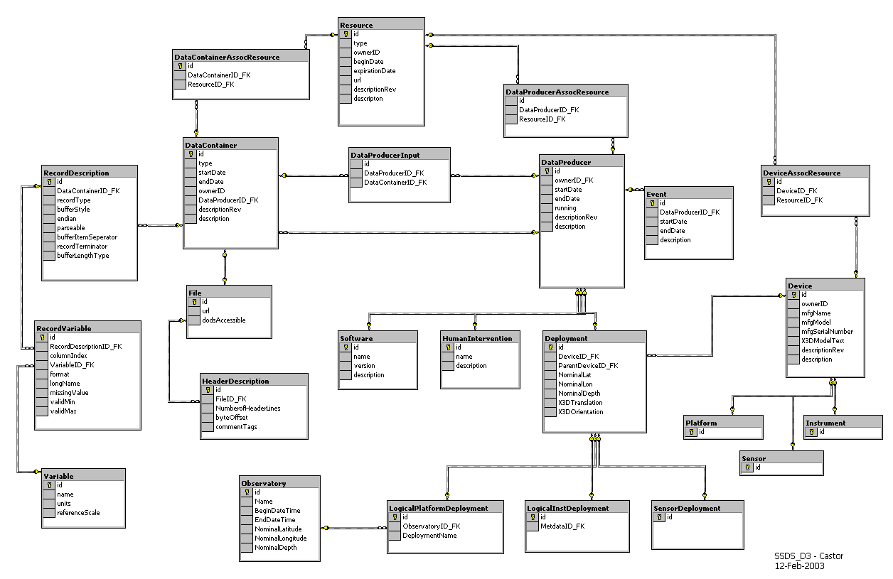

# Document Databases

### Why document-based?

* Handles Schema Changes Well (easy development)
* Solves Impedance Mismatch problem
* Rise of JSON
* python module: simplejson


	
### What is a document?


```javascript
{
	"business_id": "rncjoVoEFUJGCUoC1JgnUA",
	"full_address": "8466 W Peoria AvenSte 6nPeoria, AZ 85345",
	"open": true,
	"categories": ["Accountants", "Professional Services", "Tax Services",],
	"city": "Peoria",
	"review_count": 3,
	"name": "Peoria Income Tax Service",
	"neighborhoods": [],
	"longitude": -112.241596,
	"state": "AZ",
	"stars": 5.0,
	"latitude": 33.581867000000003,
	"type": "business":
}
```

### JSON Format



## Designing NoSQL Data Structures

- NoSQL data structures driven by application design.
  - Need to take into account necessary CRUD operations
- To embed or not to imbed. That is the question!
  - Rule of thumb is to imbed whenever possible.
- No modeling standards or CASE tools!

### Relational to Document




```json
	{
	"title" : "MongoDB",
	"contributors": [
		{   "name" : "Eliot Horowitz", 
			"email" :  "eliot@10gen.com" },
		{ "name" :   "Dwight Merriman"
		  "email" :  "dwight@10gen.com" } ],
	"model" : {
		"relational" : false,
		"awesome" : true }
	}
```

### A normalized structure


```json
{
  "_id"    : "First Post",
  "author" : "Rick",
  "text"   : "This is my first post."

}
```

```json
{
  "_id" : ObjectID(...),
  "post_id" : "First Post",
  "author" : "Bob",
  "text" : "Nice Post!"
}
```

### A (denormalized) embedded structure


```json
{

"_id" : "First Post",
"comments" : [
  { "author" : "Bob", 
    "text" : "Nice Post!"},
  { "author" : "Tom", 
    "text" : "Dislike!"}],
"comment_count" : 2
}
```

### A polymorphic structure

[.column]

- When all the documents in a collection are similarly, but not identically structured.
- Enables simpler schema migration.
- no more of custom \_field\_1
- Better mapping of object – oriented inheritance and polymorphism.

[.column]


```json
{
	"_id" : 1,
	"title": "Welcome",
	"url": "/",
	"type": "page",
	"content": "Welcome to my wonderful wiki."
}

{
	"_id": 3,
	"title": "Cool Photo",
	"url": "/photo.jpg",
	"type": "photo",
	"content": Binary(...)
}
```

### List of Systems

- **MongoDB**
- CouchDB
- OrientDB
