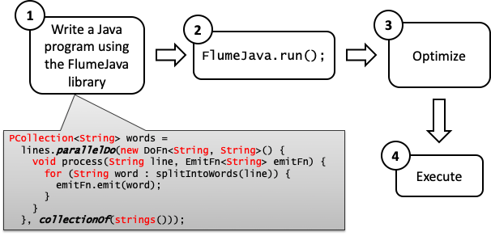
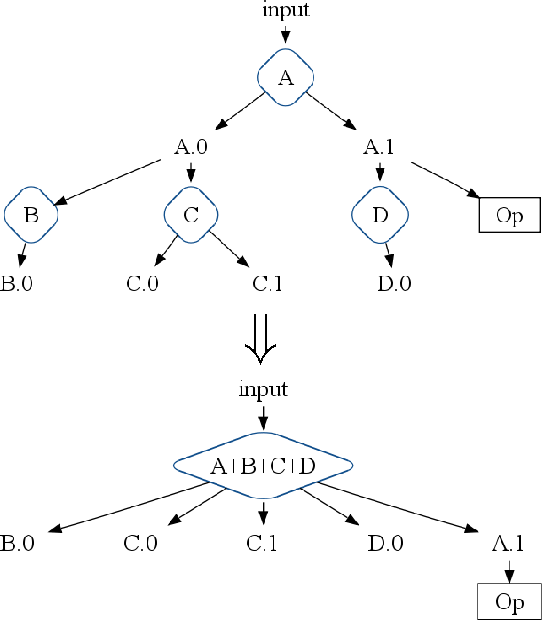
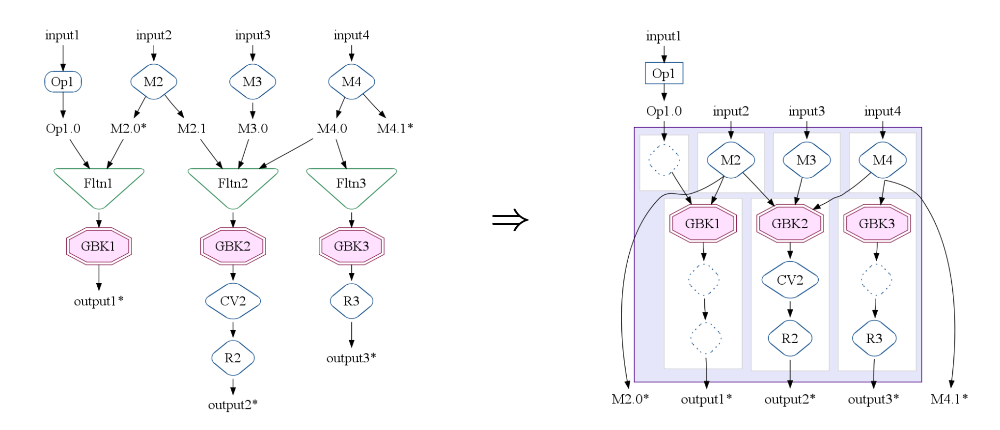

# FlumeJava[^1] 

[^1]: [paper](https://static.googleusercontent.com/media/research.google.com/en//pubs/archive/35650.pdf)

Easy, Efficient Data-Parallel Pipelines

### Problem

- MapReduce works well for computations that can be broken
down into a map step, a shuffle step, and a reduce step

- Many real-world computations require a chain of MapReduce works, e.g., graph analytics

- Additional coordination code chains together the separate MapReduce stages, requiring additional work to manage the intermediate results

### Solution

- FlumeJava is a new system that aims to support the development of data-parallel pipelines. 
-  abstract away the details of how data is represented, including whether the data is represented as an in-memory data structure
-  FlumeJava evaluation is lazy: The invocation of a parallel operation does not actually run the operation, but instead simply records the operation and its arguments in an internal execution plan graph structure.

### FlumeJava Workflow



## Core Abstractions

### Parallel Collections

- **PCollection**\<T\> a (possibly huge) immutable bag of elements of type T. If it has a well-defined order is called a Sequence

- **PTable**\<K, V\> represents a (possibly huge) immutable multi-map with keys of type K and values of type V.
	- In Java, PTable<K,V> is a subclass of PCollection<Pair<K,V>>

- **PObjects**\<T\> is a container for a single Java object of
type T that  acts much like a future. Like PCollections, PObjects can be either deferred or materialized, allowing them to be computed as results of deferred
operations in pipelines.

### Parallel Operations (Primitives)
	
- **parallelDo**() higher-order function that supports element-wise computation over an input PCollection\<T\>
- **groupByKey**()  converts a multi-map of type PTable\<K,V\> (which can have many key/value pairs with the same key) into a uni-map of type PTable<K, Collection\<V\>\> [^2]
- **combineValues**()  takes an input  PTable\<K, Collection\<V\>\> and an associative combining function on Vs, and returns a PTable\<K, V\> where each input collection of values has been combined into a single output value[^3] 
- **flatten**() takes a list of PCollection\<T\>s and returns a single PCollection\<T\>

[^2]:  captures the essence of the shuffle step of MapReduce.

[^3]: combineValues() is a special case of parallelDo(). The associativity of the combining function allows it to be implemented via a combination of a MapReduce combiner and a MapReduce reducer.

###  WordCount in Primitive FlumeJava

---
#### Sentences to Words
```java

PCollection<String> words = 
	lines.parallelDo(new DoFn<String,String>() {  
 		void process(String line, EmitFn<String> emitFn) {
			for (String word : splitIntoWords(line)) {
				emitFn.emit(word);
			}
		}
	}, collectionOf(strings()));
```

---
#### Words Occurrences

```java
PTable<String,Integer> wordsWithOnes =
	words.parallelDo(
		new DoFn<String, Pair<String,Integer>>() {
			void process(String word, 
				EmitFn<Pair<String,Integer>> emitFn) {
					emitFn.emit(Pair.of(word, 1));
			}
	}, tableOf(strings(), ints()));
```
---
#### Occurrences to Counts

```java
PTable<String,Collection<Integer>> gwOnes = wordsWithOnes.groupByKey();

PTable<String,Integer> wordCounts = gwOnes.combineValues(SUM_INTS);
```

### Derived operations
- **count**() takes a PCollection\<T\> and returns a PTable\<T, Integer\>
mapping each distinct element of the input PCollection to the
number of times it occurs. f parallelDo(), groupByKey(), and combineValues()

---
<br><br>

```java
PTable<String,Collection<Integer>> gwOnes = wordsWithOnes.groupByKey();
```

```java
PTable<String,Integer> wordCounts = gwOnes.combineValues(SUM_INTS);
```

OR

<br>

```java

PTable<String,Integer> wordCounts = words.count();

```

### Derived operations
- **count**() takes a PCollection\<T\> and returns a PTable\<T, Integer\>
mapping each distinct element of the input PCollection to the
number of times it occurs. f parallelDo(), groupByKey(), and combineValues()

- **join**() implements a kind of join over two or more PTables sharing a common key type.  When applied to a multi-map PTable\<K, V1\> and a multimap PTable\<K, V2\>, join() returns a uni-map PTable\<K,Tuple2\<Collection\<V1\>, Collection<V2\>\>\>

### Join

1. Apply **parallelDo**() to each input PTable\<K, Vi\> to
convert it into a common format of type PTable\<K,
TaggedUnion2\<V1,V2\>\>.
2. Combine the tables using **flatten**().
3. Apply **groupByKey**() to the flattened table to produce a
PTable\<K, Collection\<TaggedUnion2\<V1,V2\>\>\>.
4. Apply **parallelDo**() to the key-grouped table, converting
each Collection\<TaggedUnion2\<V1,V2\>\> into a Tuple2 of
a Collection\<V1\> and a Collection\<V2\>.
	
### Derived operations
- **count**() takes a PCollection\<T\> and returns a PTable\<T, Integer\>
mapping each distinct element of the input PCollection to the
number of times it occurs. f parallelDo(), groupByKey(), and combineValues()

- **join**() implements a kind of join over two or more PTables sharing a common key type.  When applied to a multi-map PTable\<K, V1\> and a multimap PTable\<K, V2\>, join() returns a uni-map PTable\<K,Tuple2\<Collection\<V1\>, Collection<V2\>\>\>
	
- **top**()  which takes a comparison function and a count N and returns the greatest N elements of its receiver PCollection according to the comparison function.

### MapShuffleCombineReduce  (MSCR)

- Transform combinations of the four primitives into single MapReduce

- Generalizes MapReduce
	- Multiple reducers/combiners
	- Multiple output per reducer
	- Pass-through outputs


^^
- MSCR generalizes MapReduce 
	- by allowing multiple reducers and combiners, 
	- by allowing each reducer to produce multiple outputs, 
	- by removing the requirement that the reducer must produce outputs with the same key as the reducer input, and 
	- by allowing pass-through outputs, thereby making it a better target for our optimizer.

## Optimizer

### Overall Optimizer Strategy

The optimizer performs a series of passes over the execution plan, with the overall goal to produce the fewest, most efficient MSCR operations in the final optimized plan.

- **Sink Flattens**. A Flatten operation can be pushed down through consuming ParallelDo operations by duplicating the ParallelDo before each input to the Flatten.
- **Lift CombineValues** operations. If a CombineValues operation immediately follows a GroupByKey operation the CombineValues is henceforth treated as a normal ParallelDooperation and subject to ParallelDo fusion.
- **Insert fusion blocks**. If two GroupByKey operations are connected by a producer-consumer chain of one or more ParallelDo operations, the optimizer must choose which ParallelDos should fuse “up” into the output channel of the  earlier GroupByKey, and which should fuse “down” into the input channel of the later GroupByKey
- **Fuse ParallelDos**

### ParallelDo Fusion

One of the simplest and most intuitive optimizations is ParallelDo producer-consumer fusion.

- **function composition**: one ParallelDo operation performs function f, and its result is consumed by another ParallelDo operation that performs function g. The two ParallelDo operations are replaced by a single multi-output ParallelDo that computes both f and g o f.

- **sibling fusion** when two or more ParallelDo operations read the same input they are fused into a single multi-output ParallelDo operation that computes the results of all the fused operations in a single pass over the input.



### Overall Optimizer Strategy

The optimizer performs a series of passes over the execution plan, with the overall goal to produce the fewest, most efficient MSCR operations in the final optimized plan.

- **Sink Flattens**. A Flatten operation can be pushed down through consuming ParallelDo operations by duplicating the ParallelDo before each input to the Flatten.
- **Lift CombineValues** operations. If a CombineValues operation immediately follows a GroupByKey operation the CombineValues is henceforth treated as a normal ParallelDooperation and subject to ParallelDo fusion.
- **Insert fusion blocks**. If two GroupByKey operations are connected by a producer-consumer chain of one or more ParallelDo operations, the optimizer must choose which ParallelDos should fuse “up” into the output channel of the  earlier GroupByKey, and which should fuse “down” into the input channel of the later GroupByKey
- **Fuse ParallelDos**
- **Fuse MSCRs**

### MSCR Fusion

An MSCR operation is produced from a set of related GroupByKey operations. 

In turn, GroupByKey operations are related if they consume the same inputs created by the same (fused) ParallelDo operations.

---



The resulting MSCR operation has 4 input channels and 5 output channels

^^ Figure shows how an example execution plan is fused into an MSCR operation:
- all three GroupByKey operations are related, and hence seed a single MSCR operation. 
	- GBK1 is related to GBK2 because they both consume outputs of ParallelDo M2.
	- GBK2 is related to GBK3 because they both consume PCollection M4.0. 
	- The ParallelDos M2, M3, and M4 are incorporated as MSCR input channels.
	- Each of the GroupByKey operations becomes a grouping output channel.
	- GBK2’s output channel incorporates the CV2 CombineValues operation. 
	- The R2 and R3 ParallelDos are also incorporated into output channels. 
	- An additional identity input channel is created for the input to GBK1 from non-ParallelDo Op1. 
	- Two additional pass-through output channels (shown as edges from mappers to outputs) are created for the M2.0 and M4.1 PCollections that are used after the MSCR. 

