# Graph Technologies

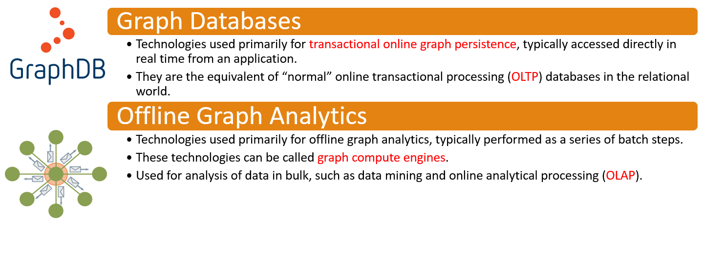

# Graph Databases

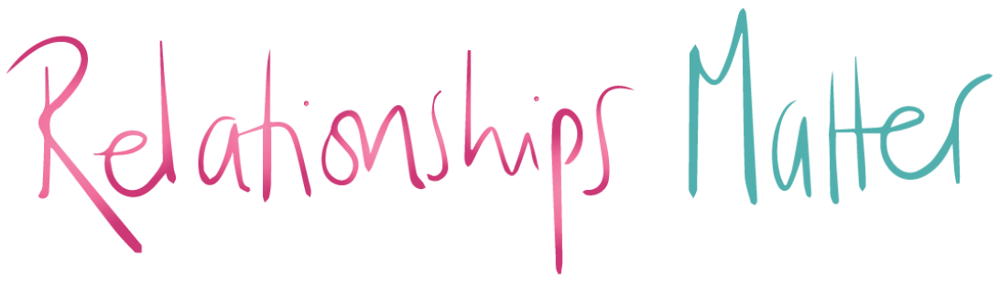

---

## Back to One Machine

- Graph Databases are tailored for OLTP workloads.

- Typically, you are interested in selecting the subset of your graph based on a condition and then operate on that.

- Most of them work in a centralized fashion

## The Case of Graph OLAP 

- OLAP queries over the entire graph will not be so efficient (why?)

- Graph OLAP algorithms are ofte **iterative**, and need to process the whole graph. 

- Hard to Scale out because graph are hard to partition

- If you're interested join our Spring courses LTAT.02.003 and LTAT.02.010

## Graph DBs VS. RDBMSs

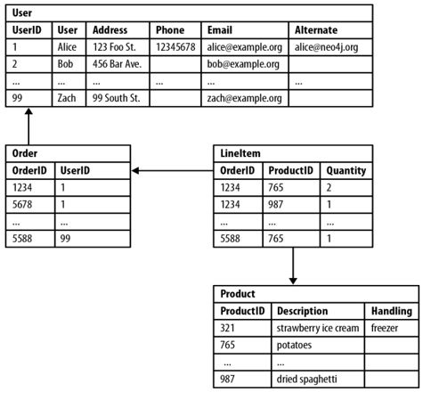

- RDBs are well fitted to find generice queries, thanks to the internal structure of the tables. 

- Aggregations over a complete dataset are "easy".

- However, Relational databases struggle with highly connected domains.


### Performance

<br>

In relational databases, the performance of join-intensive queries deteriorates as the dataset gets bigger. 

On the other hand, graph database performance tends to remain relatively constant, even as the dataset grows.

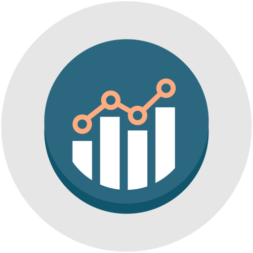

---


(Nope, indexes)

---

> **Clarke's Third Law**: Any sufficiently advanced technology is indistinguishable from magic.


### Agility

Despite their names though, relational databases are less suited for exploring relationships. Thus, the complexity is pushed on the query language.

In graph databses, relationships are first-class moreover, they have no schema. Thus,  API and query language are much simpler and agile.


### Flexibility

Changing schemas in Relational Databases may break queries and store procedures or require to change the integrity constraints.

Graphs are naturally additive, we can add new relationships or nodes without disturbing existing queries and application functionality.


### Graph DBs VS. NoSQL

- Are RelationalDB NoSQL?
	- In principles, yes. However they do not target OLAP...


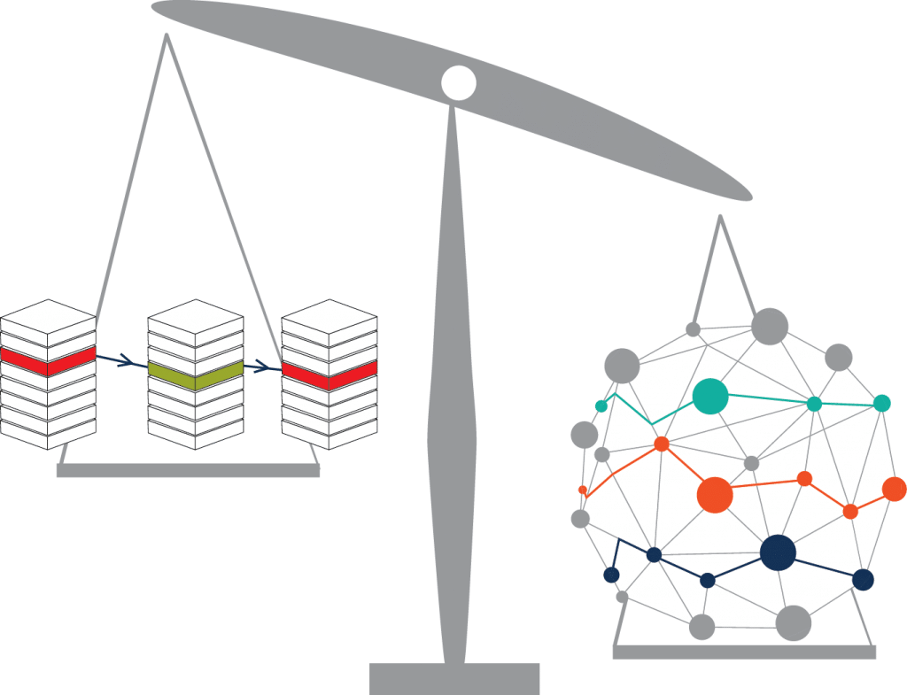

### Nosql also Lacks Relationships

- Most NOSQL databases whether key-value, document, or column oriented store sets of disconnected documents/values/columns.

- This makes it difficult to use them for connected data and graphs.

- One well-known strategy for adding relationships to such stores is to embed an aggregate's identifier inside the field belonging to another aggregate.

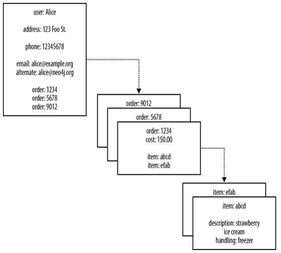

---


---


### Nosql also Lacks Relationships

- We can **join aggregates** at the application level

    - Seeing a reference to order: 1234 in the record beginning user: Alice, we infer a connection between user: Alice and order: 1234.
   
- Because there are no identifiers that "point" backward (the foreign aggregate "links" are not reflexive.

	- How to answer: *Who customers that bought a particular product?* 

-  Aggregates quickly becomes prohibitively expensive.
 
## Graph DBs embrace Relationships


---

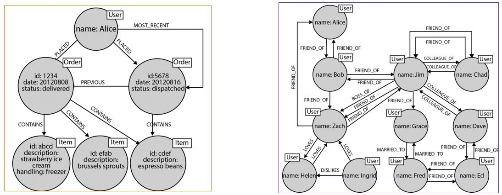

---
## Popularity of Graph DBs

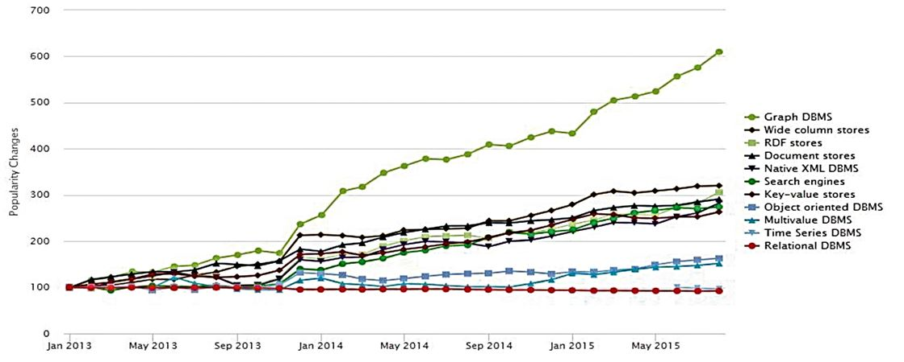

## Which one to choose?![^111]

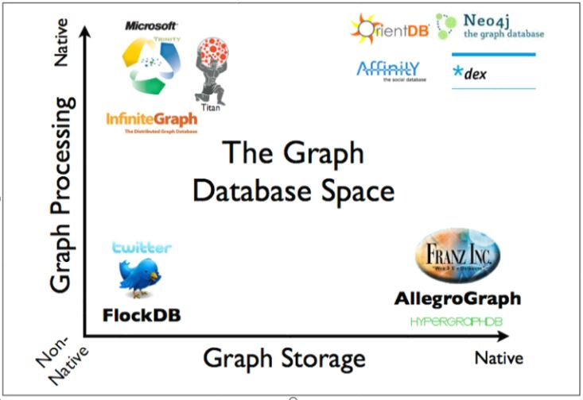


### Graph Storage and Processing

   - **Native Graph Storage** benefits traversal performance at the expense of making some queries that don't use traversals difficult or memory intensive.

   - **Non-Native graph storage**, e.g., usuing a relational backend, is purpose-built stack and can be engineered for performance and scalability. 

### Native Graph Processing 

A graph database has native processing capabilities if it uses index-free adjacency. 

A node directly references its adjacent nodes, acting as a micro-index for all nearby nodes.

With index-free adjacency, bidirectional joins are effectively precomputed and stored in the database as relationships[^1140].

[^1140]:It is cheaper and more efficient than doing the same task with indexes, because query times are proportional to the amount of the graph searched.

---


### Storage

Doubly Linked Lists in the Relationship Store


### Non-native processing

- A nonnative graph database engine uses (global) indexes to link nodes together, 

- Example:
	- To find Ali‐ ce’s friends we have first to perform an index lookup, at cost O(log n).

	- If we wanted to find out who is friends with Alice, we would have to one lookup for each node that is potentially friends with Alice. This makes the cost O(m log n).


---

### Neo4J Graph DB[^112]

- It supports ACID transactions
- It implements a Property Graph Model efficiently down to the storage level.
- It is useful for single server deployments to query over medium sized graphs due to using memory caching and compact storage for the graph.
- Its implementation in Java also makes it widely usable.
- It provides master-worker clustering with cache sharding for enterprise deployment.
- It uses Cypher as a declarative query language.


### AllegroGraph Semantic Graph DB[^114]

- AllegroGraph is a graph database and application framework for building Semantic Web applications.
- It can store data and meta-data as triples.
- It can query these triples through various query APIs like SPARQL (the standard W3C query language).
- It supports RDFS++ as well as Prolog reasoning with its built-in reasoner.
- AllegroGraph includes support for Federation, Social Network Analysis, Geospatial capabilities and Temporal reasoning.

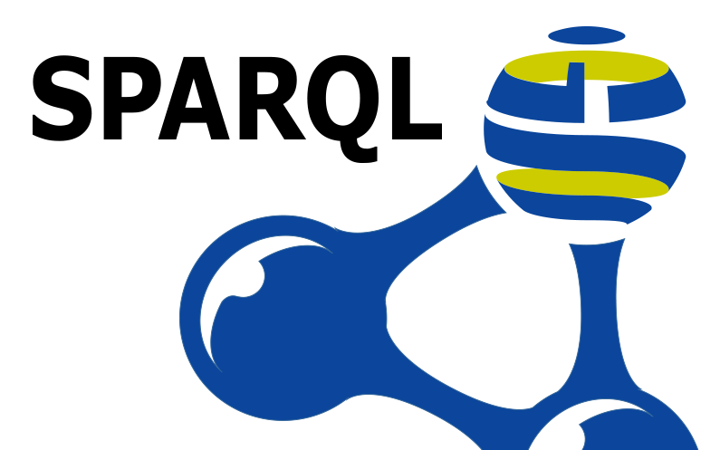

## Graph Data Models

- Two Popular Graph Data Models:

    - Edge-Labelled Graphs 

    - Property Attributed Graphs

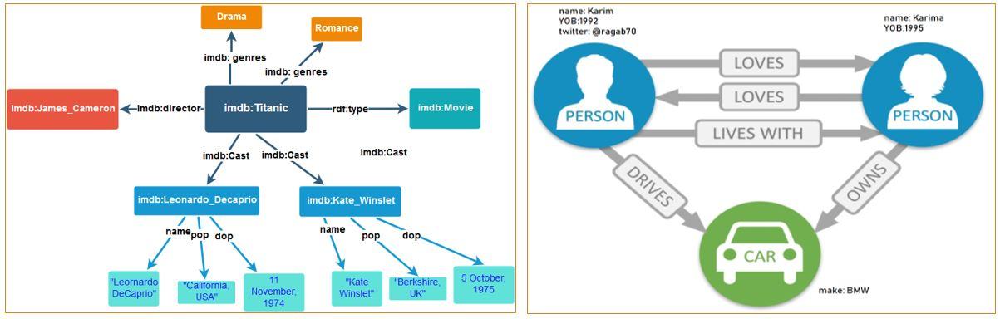

### Property Graphs Vs. Edge-Labelled Graphs

- Edge-Labelled Graphs are widely adopted in practice. E.g. Resource Description Framework (RDF) (Figure in the previous slide).

- However, it is often cumbersome to add information about the edges to an edge-labelled graph.

- For example, if we wished to add the source of information, for example, that the acts-in relations were sourced from the web-site IMDb.

- Adding new types of information to edges in an edge-labelled graph may thus require a major change to the graph's structure, entailing a significant cost.

### Property Graph Example

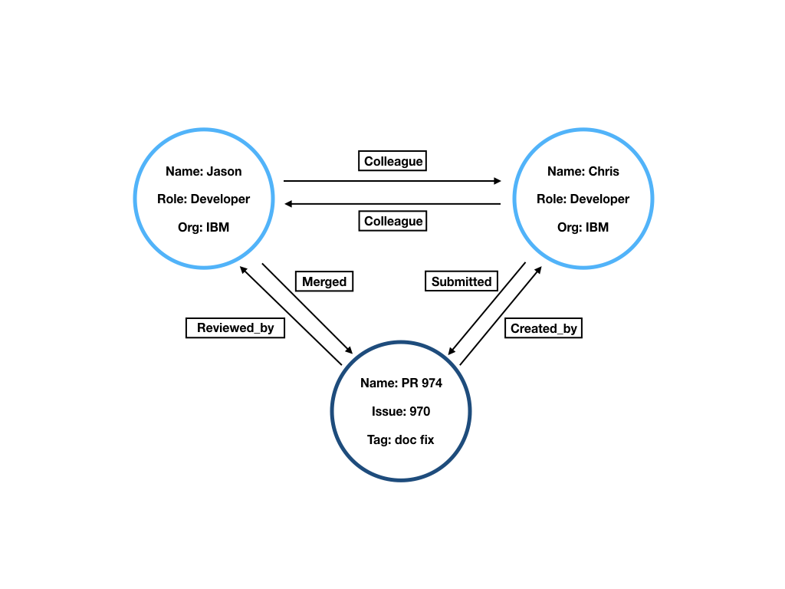

### Variations of the Property Graph Data Model (PGM)

- **Direction.** A property graph is a directed graph; the PGM defines edges as ordered pairs of vertices.

- **Multi-graph.** A property graph is a multi-graph; the PGM allows multiple edges between a given pair of vertices.

- **Simple graphs** (in contrast to multi-graphs) additionally require to be injective (one-to-one).

- **Labels.** A property graph is a multi-labeled graph; the PGM allows vertices and edges to be tagged with zero or more labels.

- **Properties.** A property graph is a key-value-attributed graph; the PGM allows vertices and edges to be enriched with data in the form of key-value pairs.

## Graph Query Languages

### How To Query Graph Databases!

- Although graphs can still be (and sometimes still are) stored in relational databases, the choice to use a graph database for certain domains has significant benefits in terms of querying.

- Where the emphasis shifts from joining various tables to specifying graph patterns and navigational patterns between nodes that may span arbitrary-length paths.

- A variety of graph database engines, graph data models, and graph query languages have been released over the past few years.

    - Examples of Graph DBs: Neo4j, OrientDB, AllegroGraph.

    - Graph data models: Property graphs, and edge labelled graphs and many other variations of them.

    - Different modern query languages also come to the scene such as Cypher, SPARQL, Gremlin and many more.


### Graph Query Languages Core Features

- Features:

    - Graph Patterns.

    - Navigational "Path" expressions.

    - Aggregation

    - Graph-to-Graph queries.

    - Path unwinding.

- Standardization:

    - (SPARQL/SPARQL 1.1) --- Yes

    - (Gremlin,G-Core,Gremlin,GraphQl,Cypher)--- No

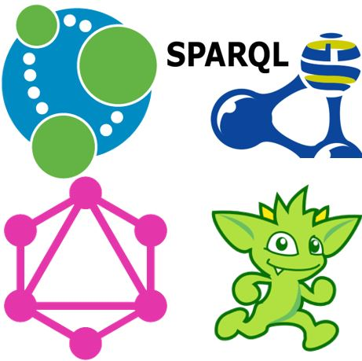


# Pattern Matching and Graph Navigation

## Graph Pattern Matching VS. Graph Navigational

- Graph query languages vary significantly in terms of style, purpose, and expressivity.
- However, they share a common conceptual core:
    - **Graph pattern matching** consists of a graph-structured query that should be matched against the graph database
		- e.g. find all triangles of friendships in a social network.
    - **Graph navigation** is a more flexible querying mechanisms that allows to navigate the topology of the data.
        - e.g find all friends-of-a-friend of some person in a social network.

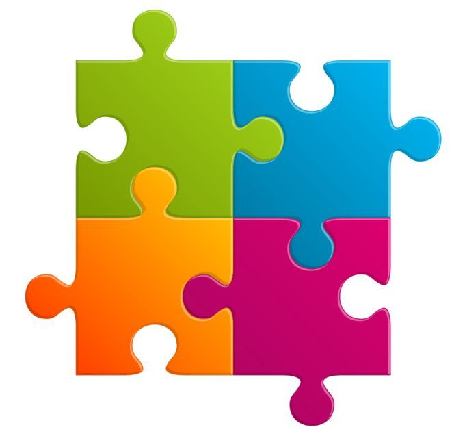

## Graph Pattern Matching 

For matching graph patterns we classified the main proposals for the semantics into two categories:

  - **Homomorphism-base**d: matching the pattern onto a graph with no restrictions.
  - **Isomorphism-based**: one of the following restrictions is imposed on a match:
       - **No-repeated-anything**: no part of a graph is mapped to two different variables.
       - **No-repeated-node**: no node in the graph is mapped to two different variables.
       - **No-repeated-edge**: no edges in the graph is mapped to two different variables.
 
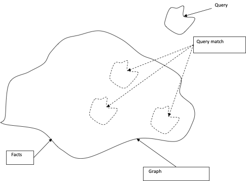 

### Basic Graph patterns VS. Complex Graph patterns

  - Basic Graph Patterns (BGPs) are just graph to match within the bigger graph database. BGPs are the core of any graph query language.

  - Complex Graph Patterns  (CGPs) extend BGPs with some additional query features such as UNION, Difference, Projection, Optional (aka left-outer-join), and Filters.


### CGPs Operators: Projection

   - Like `SELECT` in SQL, is used also to select project on specific outputs.

   - Example: retrieve only the names of actors who starred together in Unforgiven

### CGPs Operators:  Union

- Intended to merge the result of two queries

- Let $$Q1$$ and $$Q2$$ be two graph patterns. The union of $$Q1$$ and $$Q2$$ is a complex graph pattern whose evaluation is defined as the union of the evaluations.

- Example: *find the movies in which Clint Eastwood acted or which he directed*.

### CGPs Operators: Difference
- The difference of $$Q1$$ and $$Q2$$ is also a complex graph pattern whose evaluation is defined as the set of matches in the evaluation of $$Q1$$ that do not belong to the evaluation of $$Q2$$.

- Logically a form of **negation** 
- Example: * find the movies in which Clint Eastwood acted but did **not** direct*.

### CGPs Operators: Optional

- This feature is particularly useful when dealing with incomplete information, or in cases where the user may not know what information is available.

- Essentially a Left-join

- Example: *Find the information relating to the gender of users is incomplete but may still be interesting to the client, where available*.

### CGPs Operators: Filter

- Users may wish to restrict the matches of a cgp over a graph database G based on some of the intermediate values returned using, for example, inequalities, or other types of expressions.

- Equivalent to relational selection

- Example: *find all male actors that acted in a  Clint Eastwood's movie*


---

Or find all Leonardo Di Caprio's ex girlfriends that are were above 25 yo.


Hint: None

---
## Navigational (Path) Queries in Graphs

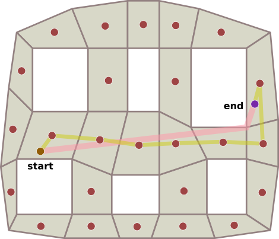

### Navigational Path Queries

- Graph patterns allow for querying graph databases in a bounded manner.

-  Navigational Path Queries provide a  more flexible querying mechanisms (yet more expensive) that allow to navigate the topology of the data.

- One example of such a query is to find all friends-of-a-friend of some person in a social network.


---

### Path under Set Semantics

- **Arbitrary paths**: All paths are considered. More specifically, all paths in G that satisfy the constraints of P are included in P (G).

- **Shortest paths**: In this case, P (G) is defined in terms of shortest paths only, that is, paths of minimal length that satisfy the constraint specified by P.

- **No-repeated-node paths**: In this case, P (G) contains all matching paths where each node appears once in the path; such paths are commonly known as simple paths. This interpretation makes sense in some practical scenarios; for example, when finding a route of travel, it is often not desired to have routes that come to the same place more than once.

- **No-repeated-edge paths**: Under this semantics, P (G) contains all matching paths where each edge appears only once in the path. The Cypher query language of the Neo4j engine currently uses this semantics.

### Output of Navigational Queries

- As hinted at previously, a user may have different types of questions with respect to the paths contained in the evaluation P(G), such as:

    - *Does there exist any such path*

    - *Is a particular path contained in P (G* )

    - *What are the pairs of nodes connected by a path in P (G)*

    - *What are (some of) the paths in P (G)*

- We can Categorize such questions by what they return as results:

    - Boolean --- (True / False) values.

    - Nodes --- are interested in the nodes connected by specific paths.

    - Paths --- some or all of the full paths are returned from P (G). Example:Some of the Shortest Paths.

    - Graphs --- is to offer a compact representation of the output as a graph

## Navigational Graph Patterns (NGPs)

- Combining path queries with basic graph patterns (BGPs) gives rise to navigational graph patterns (NGPs).

- In particular, this language allows to express that some edges in a graph pattern should be replaced by a path (satisfying certain conditions) instead of a single edge.

- Example: Persons and movies are connected , while a person can also have an author edge connecting it to an article.

- In such a database we might be interested in finding people with finite Erdos-Bacon number, that is, people who are connected to Kevin Bacon through co-stars relations and are connected to Paul Erdos through co-authorship relations.

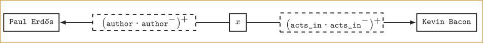

---

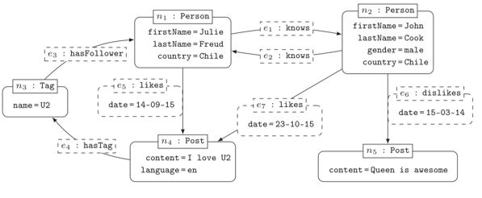

---

### Navigational Graph Patterns (NGPs)

- Coming back to the social network, we might be interested in finding all friends of friends of Julie that liked a post with a tag that Julie follows. The navigational graph pattern in this Figure expresses this query over our social graph.

- Extending Navigational Graph patterns with the complex operators of "Projection", "Optional", "Filter", "Union" and "Difference" give the rise to another new type of them: (cngps).

- Example: Let's call these results the "recommended posts" for Julie. Now consider a copy of the same pattern to find the recommended posts for John.

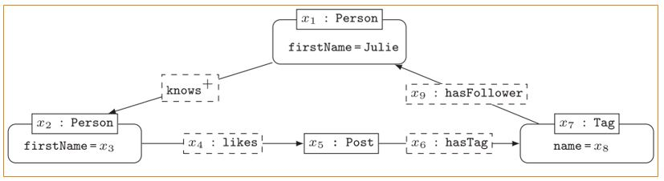

# Graph Query Languages In Action

- **Cypher** --- Property Graphs

- Gremlin--- Property Graphs

- GraphQL --- Edge-Labelled multi Graphs

- **SPARQL** --- Edge-Labelled Graphs RDF

- G-Core --- Property Graphs


## Cypher - The Neo4J DB Query Language

- Cypher is a declarative language for querying property graphs that uses "patterns" as its main building blocks.

- Cypher's declarative syntax provides a familiar way to match patterns of nodes and relationships in the graph.

- It is backed by several companies in the database space and allows implementors of databases and clients to freely benefit, use from and contribute to the development of the openCypher language.


### Graph Patterns in Cypher (Projection)

- Patterns are expressed syntactically following a "pictorial" intuition to encode nodes and edges with arrows between them.

- The following queries ask for co-stars of the *"Unforgiven"* movie. 

[.column]
```sql
MATCH (x:Person)-[:acts_in]->
	(m:Movie {title: "Unforgiven"})
		<-[:acts_in]-(y:Person)
RETURN x,y
```
[.column]
```sql

MATCH (x:Person)-[:acts_in]->(m:Movie 
	{title: "Unforgiven"})
(y:Person)-[:acts_in]->(m) 
RETURN x,y

```

^ In this case, we would also get the matches that send both x and y to the node of Clint Eastwood (and likewise to the node of Anna Levine).

### Comple Graph Patterns in Cypher: Union

```sql

MATCH (:Person 
	{name:"Clint Eastwood"})-[:acts_in]->(m:Movie)
RETURN m.title
UNION ALL 
MATCH (:Person 
	{name:"Clint Eastwood"})-[:directs]->(m:Movie)
RETURN m.title

```

### Comple Graph Patterns in Cypher: Difference

```sql

MATCH (p:Person)-[:acts_in]->(m:Movie 
	{title: "Unforgiven"})
WHERE NOT (p)-[:direct]->(m)
RETURN m.title

```

### Comple Graph Patterns in Cypher: Optional

```sql

MATCH (p:Person)-[:acts_in]->(m:Movie)
OPTIONAL MATCH (p)-[x]->(m)
WHERE type(x) <> "acts_in"
RETURN p.name, m.title, type(x)

```

### Navigational Queries in Cypher

- While not supporting full regular expressions, Cypher still allows transitive closure over a single edge label in a property graph.

- Since it is designed to run over property graphs, Cypher also allows the star to be applied to an edge property/value pair.

- **Example**: compute the friend-of-a-friend relation.  The following query selects pairs of nodes that are linked by a path completely labelled by knows. To do this, it applies the star operator * over the label knows .

```sql

MATCH (x:Person)-[:knows*]->(y:Person)
RETURN x,y

```

### Navigational Queries in Cypher

- Example 2. If we wanted to find friends of friends of Julie and return only the shortest witnessing path. This will return a single shortest witnessing path. If we wanted to return all shortest paths, then we could replace "shortestPath" with "allShortestPaths".

```sql

MATCH (x:Person {firstname:"Julie"}),
p = shortestPath( (x)-[:knows*]->(y:Person))
RETURN p

```
 
- Example 3. Coming back to the social network, if we want to find all friends of-friends of Julie that liked a post with a tag that Julie follows, we can use the following Cypher query:

```sql

MATCH (x:Person {firstname:"Julie"})-[:knows*]->(y:Person))
MATCH (y)-[:likes]->()->[:hasTag]->(z)
MATCH (z)-[:hasFollower]->(x)
RETURN y

```

### Navigational Queries Cypher

- Another interesting feature available in Cypher is the ability to return paths.

- Example 4. If we wanted to return all friends of friends of Julie in the graph, together with a path witnessing the friendship, then we can use:

```sql

MATCH p = (:Person name:"Julie")-[:knows*]->(x:Person)
RETURN x,p

```

- Result will be:

|x|p|
|-------|--------|
|Node[2]|[Node[1],:knows[1],Node[2]]|
|Node[1]|[Node[1],:knows[1],Node[2],:knows[2],Node[1]]|


## **SPARQL** - The RDF Query Language

- SPARQL is the standard query language of RDF and become official W3C recommendation since 2003.

- SPARQL is a pattern matching query language over the RDF graph. SPARQL queries contain a set of triple patterns (TPs), also known as Basic Graph Patterns (BGPs).

- Triple patterns are similar to RDF triple patterns, but each of the subject, predicate or object may be unbounded variable preceded by ("?") prefix.

- SPARQL mission is to bind those variable by matching the query patterns to triples in the RDF dataset.


### RDF Graphs

- RDF graphs are a special type of edge-labelled graph.

- The basic bloc is a triple ```<subject> <predicate> <object>```
	
- Nodes and edges are identified using URIs
	
- Obejcts can be literals (Numbers, strings)


### Anathomy of a SPARQL Query

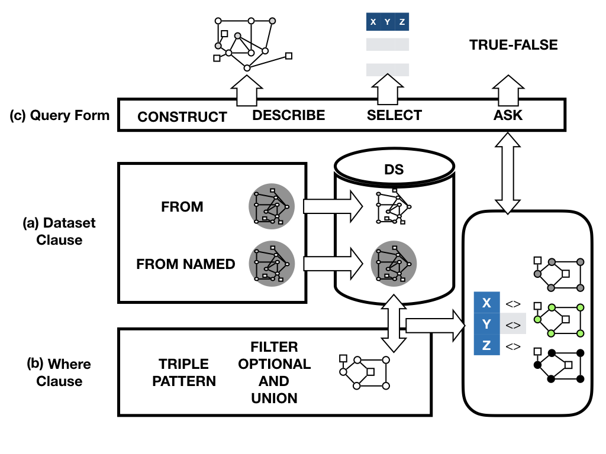

### SPARQL Graph Patterns

[.column]

Let us take a closer look at how graph patterns are applied in three practical query languages: SPARQL, Cypher, and Gremlin.

- SPARQL: Projection

    - The following SPARQL query represents a complex graph pattern that combines the basic graph pattern with a projection that asks to only return the co-stars and not the movie identifier.

[.column]

```SQL

PREFIX : <httpL//example.org#>
SELECT ?x ?y
WHERE { 
	?x :acts_in ?y ; 
	   :type :Person .
	?z :acts_in ?y ; 
	   :type :Person .
	?y :title "Unforgiven" ; 
	   :type :Movie .
	FILTER(?x!=?y)
}

```

|?x|?y|
|-----|-----|
|:Clint_Eastwood|:Anna_Levine|
|:Anna_Levine|:Clint_Eastwood|

---

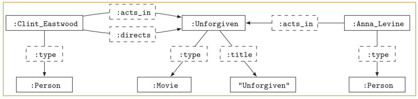


### Complex Graph Patterns in SPARQL (Union)

[.column]

 - This example of a union to find movies that Clint Eastwood has acted or directed in. 
 
[.column]

```SQL
SELECT ?x
WHERE { 
	{:Clint_Eastwood :acts_in ?x . }
	UNION
	{:Clint_Eastwood :directs ?x . }
}

```

|?x|
|---|
|:Unforgiven|

### Complex Graph Patterns in SPARQL (Difference)

[.column]
- SPARQL Difference We could use difference to ask for people who acted in the movie Unforgiven but who did not (also) direct.

[.column]

```SQL
SELECT ?x
WHERE { 
	{?x :acts_in :Unforgiven . }
	MINUS
	{?x :directs :Unforgiven . }
}

```

|?x|
|---|
|:Anna_Levin|

### Complex Graph Patterns in SPARQL (OPTIONAL)
[.column]

- SPARQL: Optional Using optional, we could ask for movies that actors have appeared in, and any other participation they had with the movie besides acting in it

[.column]

```SQL
SELECT ?x ?y ?z
WHERE { 
	{?x :acts_in ?y . }
	OPTIONAL
	{?x ?z ?y . 
		FILTER(?x != :acts_in) }
}
```


### Navigational Queries in Action: SPARQL

- Since Version 1.1 , SPARQL permits the use of property paths.

- SPARQL Property Paths are an extended form of regular expression.

- As a consequence, we can express any path query using SPARQL 1.1.

---
[.column]
#### Example 1
-  Consider the following SPARQL query to find all pairs of actors who have finite collaboration distance, we can use 

```SQL

SELECT ?x ?y
WHERE { ?x (:acts_in/acts_in*) ?y }

```

[.column]

#### Example 2
- Consider the following SPARQL query with a negated property-set. 
- This query will match :Unforgiven (the IRI) and "Unforgiven" (the title string) for ?y.

```SQL

SELECT ?y
WHERE { :Clint_Eastwood (!{rdf:type,:directs})* ?y }

```


### Navigational Queries in SPARQL

- Similarly, SPARQL can also express navigational graph patterns (ngps).

- **Example**: find all people with a finite Erdos-Bacon number can be expressed in SPARQL as in the query below, which is a conjunction of two RPQs, where the symbol "." denotes conjunction.
	
```SQL

SELECT ?x
WHERE { 
	?x (:acts_in/^:acts_in)* :Kevin_Bacon .
	?x (:author/^:author)* :Paul_Erdos .
}

```


### Navigational Queries in SPARQL

- Likewise, SPARQL can express complex navigational graph patterns (cngps).

- **Example**. We can express an RDF version of the query for the posts recommended to Julie but not to John as follows:


```SQL
SELECT ?x ?y ?z
WHERE { 
	{:Julie :knows+/:likes ?x ;
			:hasTag/:hasFollower :Julie . }
	MINUS
	{:John :knows+/:likes ?x ;
			:hasTag/:hasFollower :John . }
}
```

## Other Popular Query Languages.

- G-Core[^117]

    - Community effort between industry and academia to shape and standardize the future of graph query languages.

    - G-Core Features:

        - Composability: Graphs are inputs and outputs of the queries. Queries can be composed. The fact that G-CORE is closed on the PPG data model means that subqueries and views are possible.

        - Paths are First Class-Citizens: Paths can increase the expressivity of the language. G-Core extends graphs models with paths (PPG). Can have labels and prosperities.

        - Capture a core: Standards are difficult and politics, Take the successful functionalities with tractable evaluation of current languages as a base to develop


## Other Popular Query Languages.

- GraphQL also removes redundancy, Another restriction is type restrictions.

- The following Figure (left) shows an example GraphQL query over the domain (F, A, T) and the response is in the right.


## Graph Query Languages Features Comparison

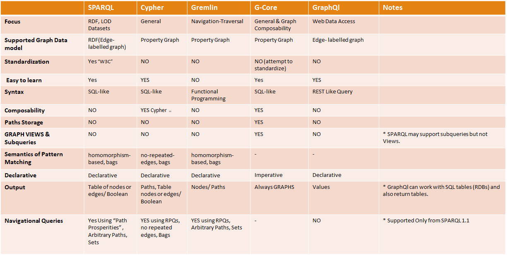


[^111]: Ian Robinson, Jim Webber, and Emil Eifrem. 2013. Graph Databases. O'Reilly Media, Inc.

[^112]: [url](https://neo4j.com)

[^113]: <http://titan.thinkaurelius.com/>

[^114]: <https://franz.com/agraph/allegrograph/>

[^115]: <https://docs.janusgraph.org/latest/gremlin.html>

[^116]: Sherif Sakr, Sameh Elnikety, and Yuxiong He. 2012. G-SPARQL: a hybrid engine for querying large attributed graphs. In Proceedings of the 21st ACM international conference on Information and knowledge management (CIKM '12)

[^117]: Angles, Renzo, et al. *G-CORE: A core for future graph query languages*. Proceedings of the 2018 International Conference on Management of Data. ACM, 2018.

[^118]: http://www.cs.cmu.edu/ pegasus/

[^119]: https://github.com/twitter/cassovary

[^1110]: http://uzh.github.io/signal-collect/

[^1111]: Kyrola, Aapo, Guy E. Blelloch, and Carlos Guestrin. *Graphchi: Large-scale graph computation on just a pc. -USENIX, 2012.

[^1112]: A. Roy, I. Mihailovic, and W. Zwaenepoel. 2013. X-Stream: Edge-centric graph processing using streaming partitions. In Proceedings of the 24th ACM Symposium on Operating Systems Principles (SOSP'13)

[^1113]: Nilakant, K., Dalibard, V., Roy, A., & Yoneki, E. (2014, June). *PrefEdge: SSD prefetcher for large-scale graph traversal*. In Proceedings of International Conference on Systems and Storage

[^1114]: Roy, A., Mihailovic, I., & Zwaenepoel, W. (2013, November). *X-stream: Edge-centric graph processing using streaming partitions*. In Proceedings of the Twenty-Fourth ACM Symposium on Operating Systems Principles

[^1115]: Roy, A., Bindschaedler, L., Malicevic, J., & Zwaenepoel, W. (2015, October). *Chaos: Scale-out graph processing from secondary storage*. In Proceedings of the 25th Symposium on Operating Systems Principles.

[^1116]: Y.Tian, A. Balmin, S. Andreas Corsten, S. Tatikond, and J. McPherson. 2013. *From \"Think Like a Vertex\" to \"Think Like a Graph.\" -Proc. VLDB Endow.

[^1117]: Y. Simmhan, A. Kumbhare, C. Wickramaarachchi, S. Nagarkar, S. Ravi, C. Raghavendra, and V. Prasanna. 2014. GoFFish: *A sub-graph centric framework for large-scale graph analytics*. In Proceedings of the Euro-Par 2014 Parallel Processing Conference.

[^1118]: Z. Khayyat, K. Awara, A. Alonazi, H. Jamjoom, D. Williams, and P. Kalnis. Mizan: a system for dynamic load balancing in large-scale graph processing. EuroSys, 2013.

[^1119]: http://infolab.stanford.edu/gps/

[^1120]: http://www.cse.cuhk.edu.hk/pregelplus/

[^1121]: http://dbs.uni-leipzig.de/en/research/projects/gradoop

[^1122]: Y. Low, J. Gonzalez, A. Kyrola, D. Bickson, C. Guestrin, and J. M. Hellerstein. *Distributed GraphLab: A Framework for Machine Learning in the Cloud*. PVLDB, 2012

[^1123]: https://giraph.apache.org/

[^1124]: <https://spark.apache.org/graphx/>

[^1125]: <https://www.w3.org/TR/rdf-sparql-query/>

[^1126]: Eugene Inseok Chong, Souripriya Das, George Eadon, and Jagannathan Srinivasan. *An efficient sql-based rdf querying scheme*. In Proceedings of the 31st international conference on Very large data bases, 2005

[^1127]: Thomas Neumann and Gerhard Weikum. *The rdf-3x engine for scalable management of rdf data*. The VLDB Journal, 2010

[^1128]: Weiss, Cathrin, Panagiotis Karras, and Abraham Bernstein. *Hexastore: sextuple indexing for semantic web data management*. Proceedings of the VLDB Endowment, 2008

[^1129]: Li Ma,et.al. *Rstar: An rdf storage and query system for enterprise resource management*. In Proceedings of the thirteenth ACM international conference on Information and knowledge management, 2004

[^1130]: Luis Galarraga. *Partout: a distributed engine for efficient RDF processing*. In Proceedings of the 23rd International Conference on World Wide Web,2014

[^1131]: M.Hammoud, D. A.Rabbou, R.Nouri, S.Beheshti, and S.Sakr. *Dream: Distributed Rdf Engine with Adaptive query planner and Minimal communication*. Proceedings of the VLDB 2015

[^1132]: Rohloff, Kurt, and Richard E. Schantz. *High-performance, massively scalable distributed systems using the MapReduce software framework: the SHARD triple-store*. Programming support innovations for emerging distributed applications. ACM, 2010.

[^1133]: Nikolaos Papailiou, Dimitrios Tsoumakos, Ioannis Konstantinou, Panagiotis Karras, and Nectarios Koziris. *H2rdf+: an efficient data management system for big RDF graphs*. In Proceedings of the 2014 ACM SIGMOD international conference on Management of data.

[^1134]: Olivier Cure, Hubert Naacke, Mohamed Amine Baazizi, and Bernd Amann. *HAQWA: a hash-based and query workload aware distributed RDF store*. In International Semantic Web Conference (Posters & Demos), 2015

[^1135]: Damien Graux, Louis Jachiet, Pierre Geneves, and Nabil Layaida. *Sparqlgx: Efficient distributed evaluation of Sparql with Apache Spark*. In International Semantic Web Conference, 2016.

[^1136]: Alexander Schatzle, Martin Przyjaciel-Zablocki, Simon Skilevic, and Georg Lausen. *S2rdf: Rdf querying with Sparql on Spark*. VLDB 2016

[^1137]: Alexander Schatzle, Martin Przyjaciel-Zablocki, Thorsten Berberich, and Georg Lausen. *S2x: graph-parallel querying of RDF with Graphx*. In Biomedical Data Management and Graph Online Querying, 2015

[^1138]: Gergo Gombos, Gabor Racz, and Attila Kiss. *Spar (k) ql: Sparql evaluation method on Spark Graphx*. In 2016 IEEE 4th International Conference on Future Internet of Things and Cloud Workshops (FiCloudW), 2016

[^1139]: Ramazan Ali Bahrami, Jayati Gulati, and Muhammad Abulaish. *Efficient processing of Sparql queries over GraphFrames*. In Proceedings of the International Conference on Web Intelligence, 2017


