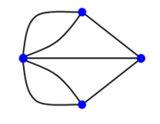
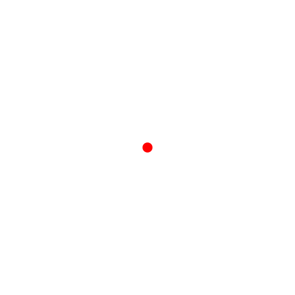
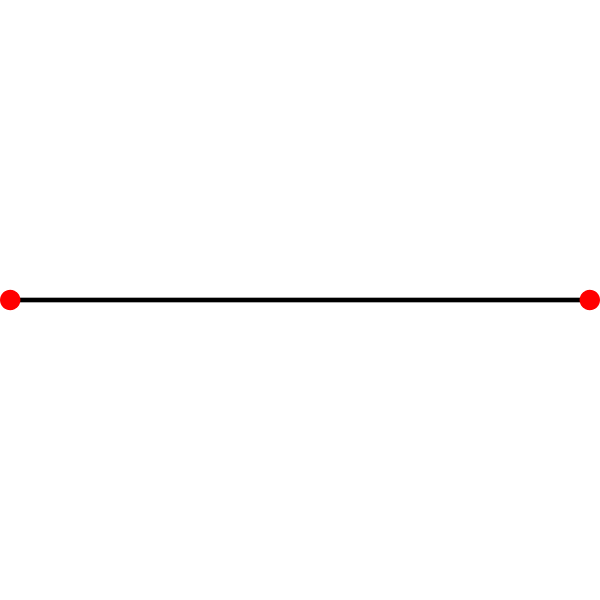
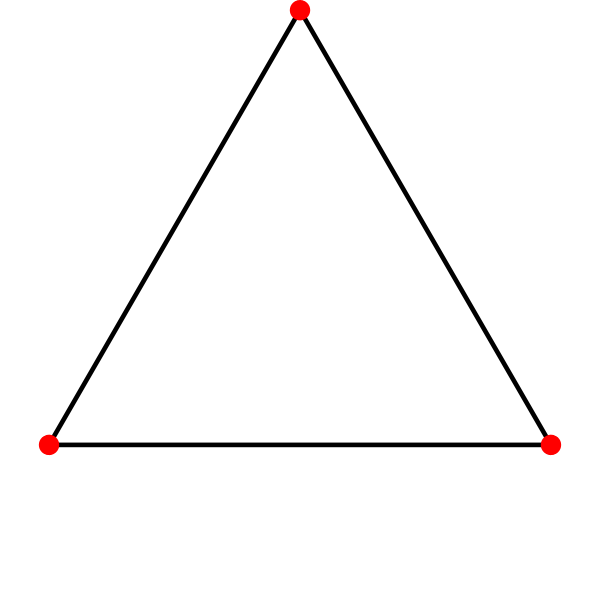
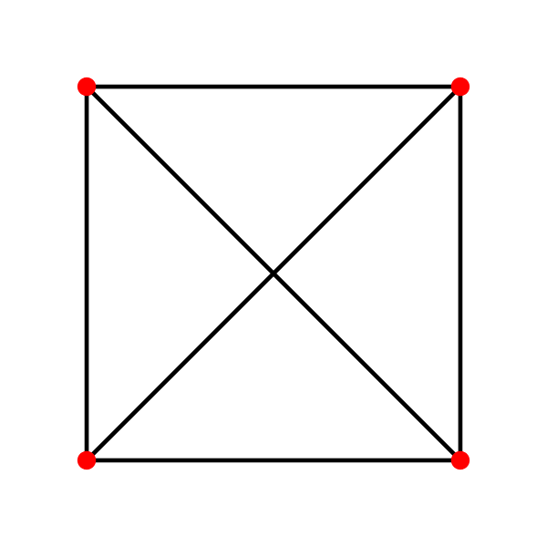
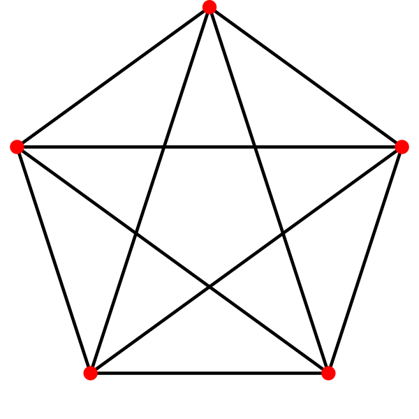
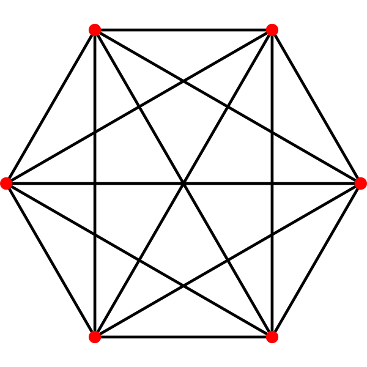
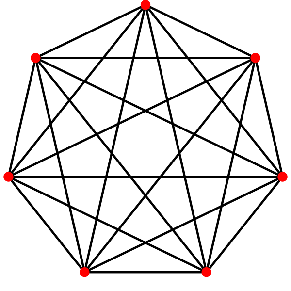
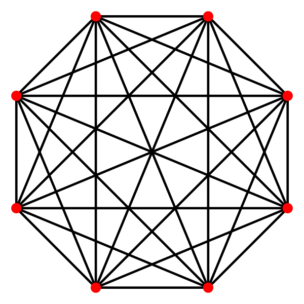
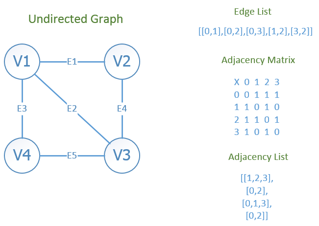

# History

Leonhard Euler's paper on "Seven Bridges of Königsberg", published in 1736.

## Famous problems

 - The traveling salesman problem: A traveling salesman is to visit a number of cities.
		 - how to plan the trip so every city is visited once and just once and the whole trip is as short as possible ?
 - Four color problem[^100] : using only four colors, color any map of countries in such a way as to prevent two bordering countries from having the same color.
	 - SOLVED ONLY 120 YEARS LATER!

[^100]:  Francis Guthrie,1852

## Other Examples of Graph Problems

- Cost of wiring electronic components
- Shortest route between two cities.
- Shortest distance between all pairs of cities in a road atlas.
- Matching / Resource Allocation
- Task scheduling
- Visibility / Coverage

## What is a Graph?

Informally a *graph* is a set of nodes joined by a set of lines or arrows.

### Graph

G is an ordered triple $$G:=(V, E, f)$$
  -  V is a set of nodes, points, or vertices.
  -  E is a set, whose elements are known as edges or lines.
  -  $$f$$ is a function
		-  maps each element of E
		-  to an unordered pair of vertices in V.

### Vertexes and Edges

- A Vertex is a Basic Element
	-  Drawn as a *node* or a *dot* .
	-  The *Vertex set of a graph *G* is usually denoted by *V*

- An edge is *set* of two elements ^2cb8a1
	-  Drawn as a line connecting two vertices, called end vertices, or endpoints.
	-  The edge set of G is usually denoted by E(G), or E.
	 
	 
### Example

V:={1,2,3,4,5,6}

E:=\{\{1,2\},\{1,5\},\{2,3\},\{2,5\},\{3,4\},\{4,5\},\{4,6\}\}

### Directed Graph (digraph)

Edges have directions, i.e.  an edge is an *ordered* pair of nodes

### Weighted graphs

are graphs for which each edge has an associated *weight*, usually given by a _weight function 

$$f_w$$ : $$E \rightarrow R $$ .

## Path

> A *path* is a sequence of vertices such that there is an edge from each vertex to its successor.

- A path is *simple* if each vertex is distinct.
- If there is  path *p* from *u* to *v* then we say *v* is **reachable** from *u* via *p* .

**Example**: Simple path from 1 to 5= [ 1, 2, 4, 5 ]

### Cycle

 - A path from a vertex to itself is called a *cycle* .
 - A graph is called *cyclic* if it contains a cycle;
  -  otherwise it is called *acyclic*

### Connectivity

 - A graph is *connected* if
  -  you can get from any node to any other by following a sequence of edges OR
  -  any two nodes are connected by a path.
 - A directed graph is _strongly connected_ if there is a directed path from any node to any other node.

### Sparsity/Density

A graph is *sparse* if $$|E|\approx |V|$$

A graph is *dense* if  $$|E|\approx |V^2|$$

### Degree

Number of edges incident on a node

E.g., the degree of **5** is 3.

### Degree (Directed Graphs)

In degree: Number of edges entering

Out degree: Number of edges leaving

Degree =indegree+outdegree

## Graph Types

### Bipartite graph

 - *V* can be partitioned into 2 sets $$V_1$$ and $$V_2$$ such that $$(u,v) \in E$$ implies
  -  either $$u \in V_1$$ and $$ v \in V_2$$
  -  or *$$v \in V_1$$ and $$ u \in V_2$$

 

### Complete Graph

[.column]

- Denoted $$K_n$$
- Every pair of vertices are adjacent
- Has n(n-1) edges

[.column]

### Planar Graph

- Can be drawn on a plane such that no two edges intersect
- $$K_4$$ is the largest complete graph that is planar

### Tree

Connected Acyclic Graph

Two nodes have *exactly* one path between them

## Hypergraph

 - Generalization of a graph,
  -  edges can connect any number of vertices.
 - Formally, an hypergraph is a pair (X,E) where
  -  X is a set of elements, called nodes or vertices, and
  -  E is a set of subsets of X, called hyperedges.
 - Hyperedges are arbitrary sets of nodes,
  -  contain an arbitrary number of nodes.

### Subgraph

 - Vertex and edge sets are subsets of those of G
  -  a *supergraph* of a graph G is a graph that contains G as a subgraph.

### Spanning subgraph

 - Subgraph G has the same vertex set as H.
  -  Possibly not all the edges
  -  "G spans H".

## Graph ADT

 - In computer science, a graph is an abstract data type (ADT)
 - that consists of
  -  a set of nodes and
  -  a set of edges
    -  establish relationships (connections) between the nodes.
 - The graph ADT follows directly from the graph concept from mathematics.

### Representation (Matrix)

 - Incidence Matrix
  -  E x V
  -  [edge, vertex] contains the edge's data
 - Adjacency Matrix
  -  V x V
  -  Boolean values (adjacent or not)
  -  Or Edge Weights

---

### Representation (List)

 - Edge List
  -  pairs (ordered if directed) of vertices
  -  Optionally weight and other data
 - Adjacency List

---

## Graph Algorithms

[.column]
 - Shortest Path
  -  Single Source
  -  All pairs (Ex. Floyd Warshall)
 - Network Flow
 - Matching
  -  Bipartite
  -  Weighted
 - Topological Ordering
 - Strongly Connected

[.column]

- Biconnected Component / Articulation Point
- Bridge
- Graph Coloring
- Euler Tour
- Hamiltonian Tour
- Clique
- **Isomorphism**
- Edge Cover
- Vertex Cover
- Visibility
