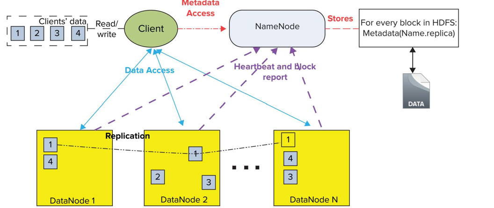
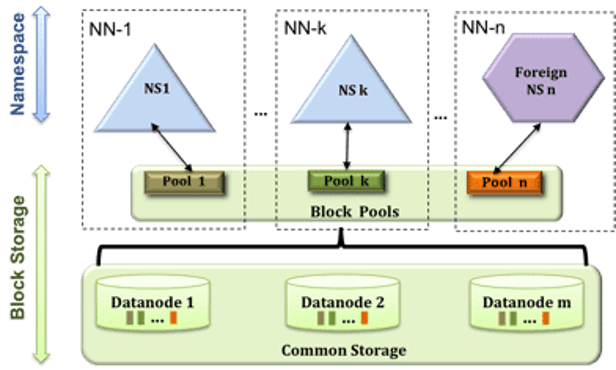
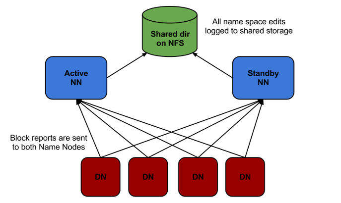

# Hadoop Distributed File System (HDFS)[^12]

-   Abstracts physical location (Which node in the cluster) from the application
-   Partition at ingestion time
-   Replicate for high-availability and fault tolerance

[^12]: Inspired by [Google File System](https://static.googleusercontent.com/media/research.google.com/en/archive/gfs-sosp2003.pdf)

### Design Objectives
   -   Partition and distribute a single file across different machines
   -   Favor larger partition sizes
   -   Data replication
   -   Local processing (as much as possible)

### Optimizations
   -   Reading sequentially versus (random access and writing)
   -   No updates on files
   -   No local caching

### HDFS Architecture[^13]

[^13]: Figure 2-1 in book Professional Hadoop Solutions

### HDFS Files
-   A single large file is partitioned into several blocks
    -   Size of either 64 MB or 128MB
    -   Compare that to block sizes on ordinary file systems
    -   This is why sequential access is much better as the disk will make less numbers of seeks

^ Question: What would be the costs/benefits if we use smaller block sizes?

### Data Node
- It  stores the received blocks in a local file system;
- It forwards that portion of data to the next DataNode in the list.
-   The operation is repeated by the next receiving DataNode until the last node in the replica set receives data.

### Name Node

-   A single node that keeps the metadata of HDFS
    -   Keeps the metedata in memory for fast access
    -   Periodically flushes to the disk (FsImage file) for durability
    -   Name node maintains a daemon process to handle the requests and to receive heartbeats from other data nodes

^
    -   In some high-availability setting, there is a secondary name node
	- As a name node can be accessed concurrently, a logging mechanism similar to databases is used to track the updates on the catalog.

### HDFS Federation
-   By default, HDFS has a single NameNode. What is wrong with that? If NameNode daemon process goes down, the cluster is inaccessible

-   A solution: HDFS Federation

    -   Namespace Scalability: Horizontal scalability to access meta data as to access the data itself
    -   Performance: Higher throughput as NameNodes can be queried concurrently
    -   Isolation: Serve blocking applications by different NameNodes
-   Is it more reliable?

### Writing to HDSF

-   When a client is writing data to an HDFS file, this data is first written to a local file.
-   When the local file accumulates a full block of data, the client consults the NameNode to get a list of DataNodes that are assigned to host replicas of that block.
-   The client then writes the data block from its local storage to the first DataNode in 4K portions.

### Writing a File to HDSF Cont.

-   This DataNode stores data locally without sending it any further
-   If one of the DataNodes fails while the block is being written, it is removed from the pipeline
-   The NameNode re-replicates it to make up for the missing replica caused by the failed DataNode
-   When a file is closed, the remaining data in the temporary local file is pipelined to the DataNodes
-   If the NameNode dies before the file is closed, the file is lost.

### Replica Placement

-   Replica placement is crucial for reliability of HDFS
    -   Should not place the replicas on the same rack
-   All decisions about placement of partitions/replicas are made by the NameNode
-   NameNode tracks the availability of Data Nodes by means of Heartbeats
    -   Every 3 seconds, NameNode should receive a heartbeat and a block report from each data node
    -   Block report allows verifying the list of stored blocks on the data node
    -   Data node with a missing heartbeat is declared dead, based on the catalog, replicas missing on this node are made up for through NameNode sending replicas to other available data nodes

### HDFS High-availability

-   Each NameNode is backedup with a slave other NameNode that keeps a copy of the catalog

-   The slave node provides a failover replacement of the primary NameNode

-   Both nodes must have access to a shared storage area

-   Data nodes have to send heartbeats and block reports to both the master and slave NameNodes.

