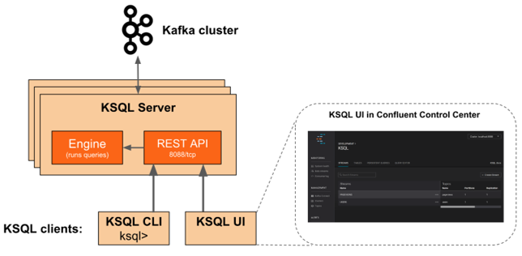
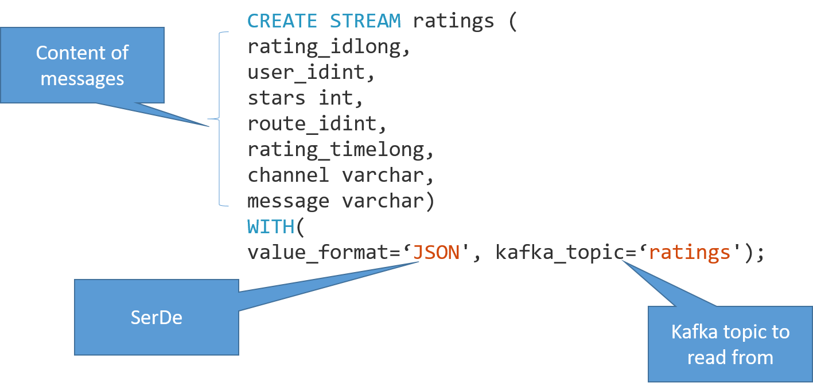

footer:  [Riccardo Tommasini](http://rictomm.me) - riccardo.tommasini@ut.ee - @rictomm - 
autoscale: true
slidenumbers: true
<!-- : #course, #topic -->

# KSQL

-   Brings SQL support to Kafka Streams

-   Streaming ETL

    -   DDL

    -   Querying

    -   Link streams to tables

        -   Don't confuse it with KStream and KTable
        
---



### Create Stream

Stream is KSQL's wrapper for the data in a Kafka topic

```sql
CREATE STREAM ratings (
rating_idlong,
user_idint,
stars int,
route_idint,
rating_timelong,
channel varchar,
message varchar)
WITH(
value_format='JSON', kafka_topic='ratings');
```

---



### Selecting From the Stream

```sql
SELECT *
FROM ratings
WHERE stars <= 2
AND lcase(channel) LIKE '%ios%'
AND user_id> 0
LIMIT 10;
```

### Selecting From the Stream

[.column]

<br>

```sql
SELECT *
FROM ratings
WHERE stars <= 2
AND lcase(channel) LIKE '%ios%'
AND user_id> 0
LIMIT 10;
```

[.column]

We can derive another stream based on the query result

$$\Downarrow$$

```sql
CREATE STREAM poor_ratings AS       
SELECT *
FROM ratings
WHERE stars <= 2
AND lcase(channel) LIKE '%ios%';
```

### Create Table

<br>

```sql
CREATE TABLE users ( uidint, name varchar, elite varchar)
WITH(Key= 'uid', value_format='JSON', kafka_topic='mysql-users');
```

### Enrich Stream with Table Data

<br>

```sql
CREATE STREAM vip_poor_ratings AS
SELECT uid, name, elite,
stars, route_id, rating_time, message
FROM poor_ratingsr LEFT JOIN users u ON r.user_id= u.uid
WHERE u.elite= 'P';
```

### Aggregation and Windowing

```sql
SELECT uid, name, count(*) as rating_count
FROM vip_poor_ratings
WINDOW TUMBLING(size 2 minutes)
GROUPBY uid, name;
```


### Conclusion
