footer:  [Riccardo Tommasini](http://rictomm.me) - riccardo.tommasini@ut.ee - @rictomm - 
autoscale: true
slidenumbers: true
<!-- : #course, #topic -->

# Kafka Streams

### Stream Processing with Kafka

-   As of version 0.10.0, Kafka streams library has been added to Kafka distribution

-   It is no longer just a distributed message broker

-   You can process messages in the different Kafka topics in real-time

-   You can produce new messages to (other) topics

### Kafka Streaming Library

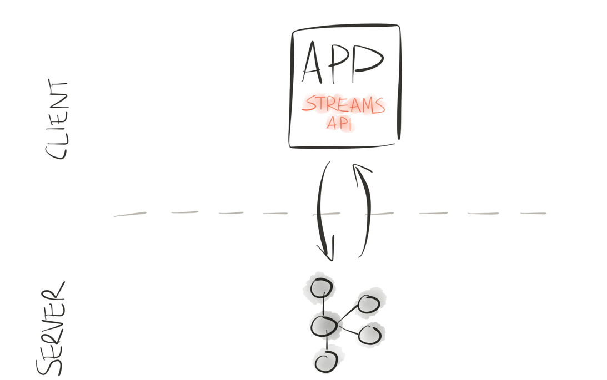

---


### Internally

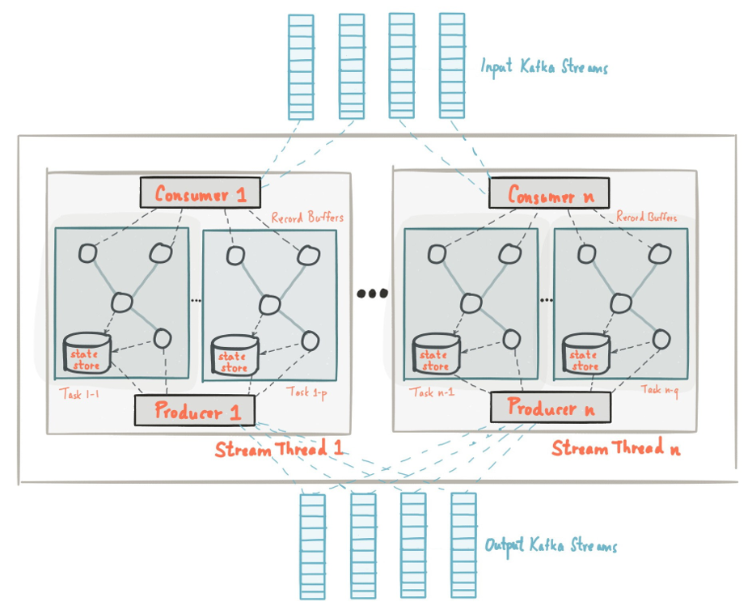

### Stream-Table Duality[^3]

-   Streams carry individual stateless events

    -   An individual event can represent a state change, e.g., for a table

-   Tables can be used as a state at a certain time (snapshot)

    -   Accumulation of the individual events (stateful)

-   See [event sourcing design pattern](https://martinfowler.com/eaaDev/EventSourcing.html)

### Stream-Table Duality

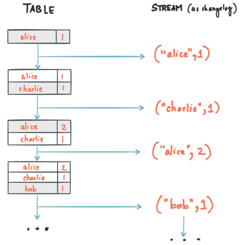

### Stream-Table Duality

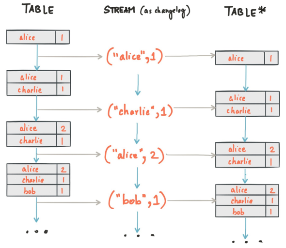

### KStream/KTable

-   KStream

    -   Record stream

    -   Each record describes an event in the real world

    -   Example: click stream

-   KTable

    -   Changelog stream

    -   Each record describes a change to a previous record

    -   Example: position report stream

-   In Kafka Streams:

    -   KTable holds a materialized view of the latest update per key as internal state

### Example

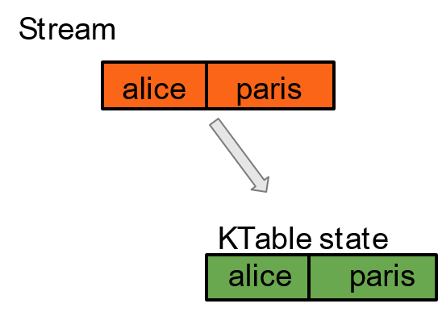

### Example

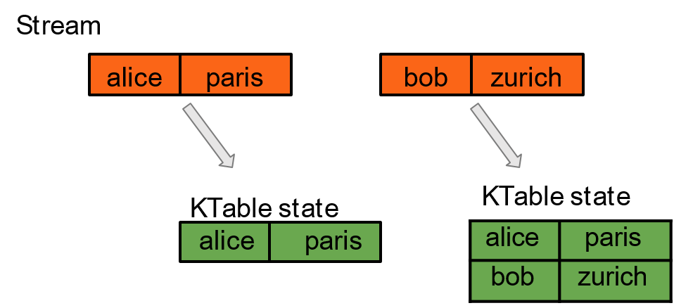

### Example

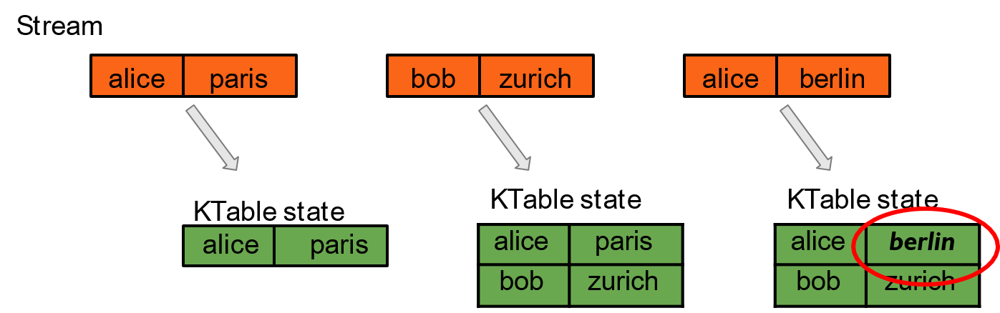

### Processor Topology

-   Close idea to Storm Topology
    -   DAG in General
-   Several topologies can be linked together
    -   Achievable via writing back to Kafka
<br>
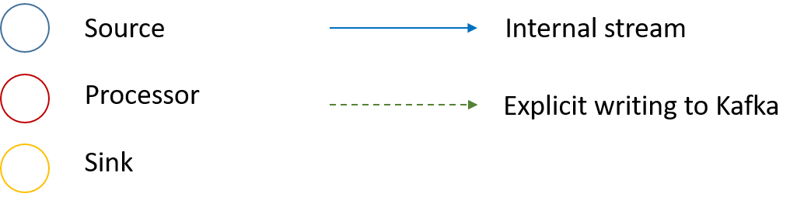


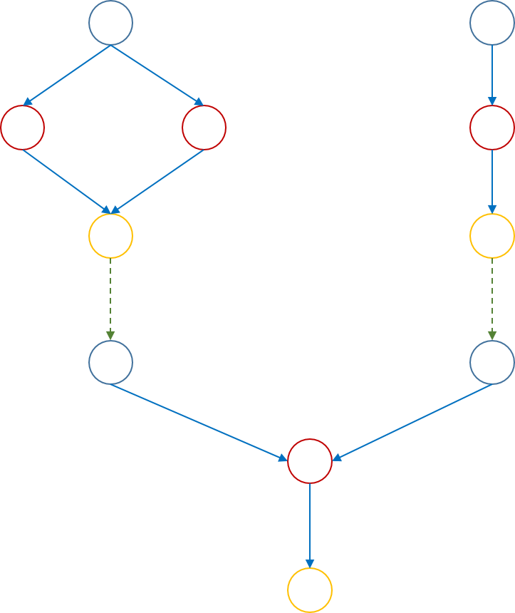


### Kafka Streams DSL

```java
KStream<..> stream1 = builder.stream("topic1");
KStream<..> stream2 = builder.stream("topic2");
KStream<..> joined = stream1.leftJoin(stream2, ...);
KTable<..> aggregated = joined.aggregateByKey(...);
aggregated.to("topic3");
```

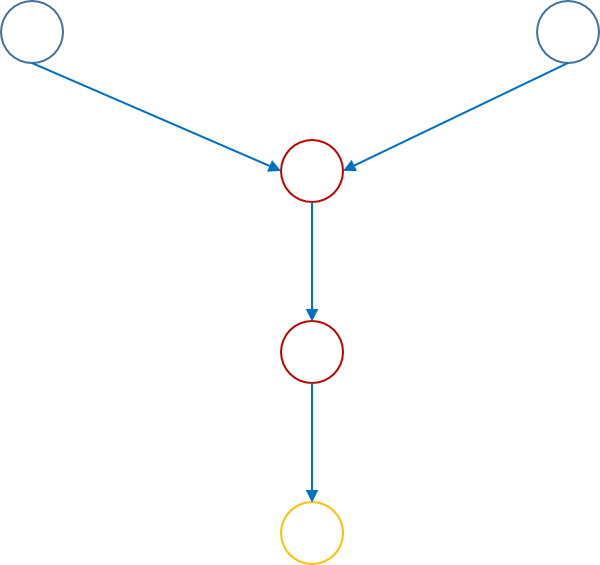

### Stateful Processing

-   Stateful processors
    -   Windowing
    -   Joins
    -   Aggregation
-   Kafka provides a configurable local state store
    -   Memory
    -   Disk

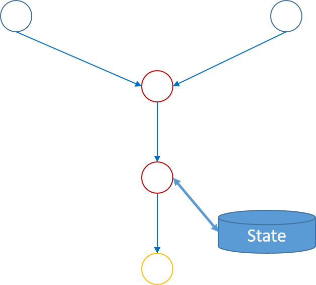

### Notions of Time

-   Recall we have
    -   Event time: when the data was actually generated
    -   Processing time: when the data was received/processed by the system
-   Kafka provides a uniform `Timestamp Extractor`

    -   Based on Kafka configuration `log.message.timestamp.type`, Kafka streams will read either the ingestion or the event time (default)

    -   You can still create your own extractor

### Windowing

-   Kafka Streams supports time-based windows only

    -   **Tumbling**

    -   Sliding (called hopping)

    -   Session

```java
KStream<String, GenericRecord> pageViews = ...;
// Count page views per window, per user, with tumbling windows of size 5 minutes
KTable<Windowed<String>, Long> windowedPageViewCounts = pageViews
.groupByKey(Grouped.with(Serdes.String(), genericAvroSerde))
.windowedBy(TimeWindows.of(Duration.ofMinutes(5))) .count();
```

### Windowing

-   Kafka Streams supports time-based windows only
    -   Tumbling
    -   **Sliding (called hopping)**
    -   Session

```java
KStream<String, GenericRecord> pageViews = ...;
// Count page views per window, per user, with hopping windows of size 5 minutes
// that advance every 1 minute
KTable<Windowed<String>, Long> windowedPageViewCounts = pageViews
.groupByKey(Grouped.with(Serdes.String(), genericAvroSerde))
.windowedBy(TimeWindows.of(Duration.ofMinutes(5).advanceBy(Duration.ofMinutes(1)))).count()
```

### Windowing

-   Kafka Streams supports time-based windows only
    -   Tumbling
    -   Sliding (called hopping)
    -   **Session**

```java
KStream<String, GenericRecord> pageViews = ...;
// Count page views per session, per user, with session windows that have
// an inactivity gap of 5 minutes
KTable<Windowed<String>, Long> sessionizedPageViewCounts = pageViews
.groupByKey(Grouped.with(Serdes.String(), genericAvroSerde))
.windowedBy(SessionWindows.with(Duration.ofMinutes(5))).count();
```

### Late Arrival

-   By default, Kafka streams emits an updated result for each newly arriving record
    -   No need for special handling for late arrival, simply a new result is emitted
    -   Window retention is a configuration parameter in Kafka, default is one day
    -   No watermark support
-   Some times, you need to receive one result at the end of the window
    -   You can do that in your code

```java
KGroupedStream<UserId, Event> grouped = ...;
grouped.windowedBy(TimeWindows.of(Duration.ofHours(1)).grace(Duration.ofMinutes(10)))
.count()
.suppress(Suppressed.untilWindowCloses(unbounded()))
.filter((windowedUserId, count) -> count < 3)
.toStream()
.foreach((windowedUserId, count) -> sendAlert(windowedUserId.window(),
windowedUserId.key(), count));
```


### Conclusion

[^1]: Slides are based on content from Cloudera and Confluent

[^3]: Matthias J. Sax, Guozhang Wang, Matthias Weidlich, Johann-Christoph Freytag. *Streams and Tables: Two Sides of the Same Coin*. BIRTE 2018: 1:1-1:10


### Systems Overview: [[Kafka Stream]]/KSQL-DB 

Kafka Stream is an open-source stream processing engine that enables
scalable data processing on top of Apache Kafka.

Kafka Stream programs make use of topics, on which they build two
further abstractions: Streams and Tables. Kafka Stream Programs consume
and produce data using a functional API. It is also possible to write
directly Dataflow topologies using the so called Processor API.
References:

Sax, Matthias J., et al. "Streams and tables: Two sides of the same
coin." Proceedings of the International Workshop on Real-Time Business
Intelligence and Analytics. 2018.

### Systems Overview: Kafka Stream/KSQL-DB 

KSQL-DB is a SQL engine built on top of Kafka Streams. SQL queries are
rewritten into Operator topologies and executed over the Kafka Cluster.

References:

Johan Desai. "KSQL: Streaming SQL Engine for Apache Kafka." EDBT.
2019.