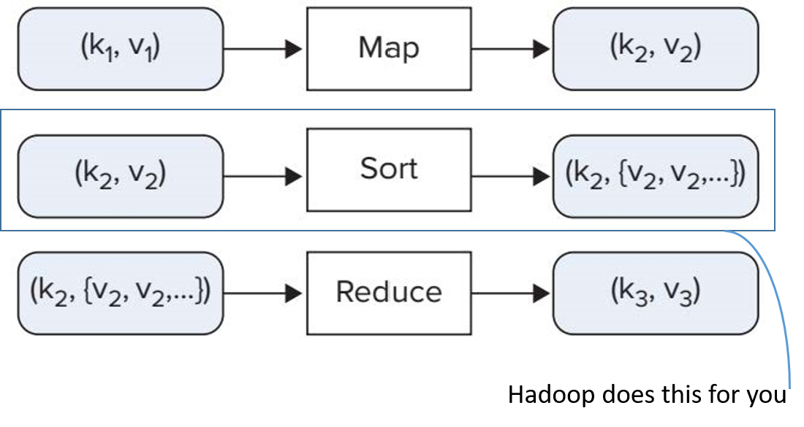
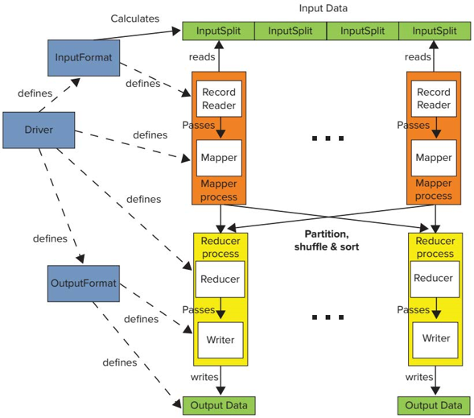

# MapReduce

-   A simple abstraction for distributed data processing

-   Invented by Google

-   Two operations
    -   Map: think of it as a transformation either 1:1 or 1:M that will be applied to each element of your data
    -   Reduce: think of it as a form of aggregating or compacting the data M:1
-   Hadoop provides the open source implementation of that model

-   It was believed that all sorts of large-scale data processing can be tackled by MapReduce, [this is not true as you will see in future lectures]{style="color: red"}

## Overview

-   You need to implement map, reduce or both
-   Map
    -   Can be used to split elements,
    -   Can be used to filter elements
-   Reduce
    -   To compute aggregates
    -   To combine results

## Overview

-   You need to implement map, reduce or both
-   Map
    -   Can be used to split elements,
    -   Can be used to filter elements
-   Reduce
    -   To compute aggregates
    -   To combine results

## Workflow

## Example: Word Count

### Word Count Mapper

### Word Count Mapper

### Word Count Combiner (optional) (local reducer)

Combiners run locally on the node where the mapper runs. They can be used to reduce the number of records emitted to the next phase

### Word Count Partitioning/Shuffling/Sorting

-   Partitioning

    -   Distributes the key-space to the number of reducers available.

        -   Number of reducers need not be the same as number of mappers

        -   Assume two reducers

    -   Makes sure that same keys go to the same reducer

    -   Usually implemented via a hash function

-   Shuffling

    -   Preparing partitioned keys for the reduce step

-   Sorting

    -   Transforms (k,v1), (k,v2), (k,v3) (kx,{v1,v2,v3})

### Word Count Reducer

There will be two files written to the specified output path. The number is equivalent to the number of reducers.

## Other Uses for MapReduce

-   Reduce phase is optional in a MapReduce job

-   Running face-recognition on millions of images

    -   Map-only job

    -   Input (Image ID, Image)

    -   Output (Image ID, list of features)

    -   Features are loaded to distributed cache

    -   The results of each mapper will be written in a separate file in the output folder

    -   What to do if we want all results in a single file?

        -   Add a single reducer

        -   However, this will come with a large overhead as shuffle and sort will be invoked
