# MongoDB


## History and Motivation

  - An open source and document-oriented database.
  - Data is stored in JSON-like documents.
  - Designed with both scalability and developer agility.
  - Dynamic schemas.
  - Automatic data sharding

## What MongoDB is :

- An In-Memory [[Document Databases]]
- Strong consistency (**C**)
- *Tuneably* available (**~~A~~**)
- Horizontal Scalable  (**P**)

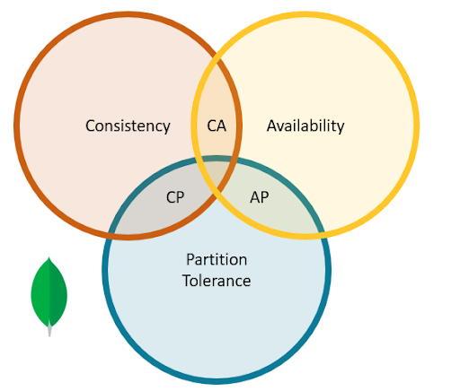

## What MongoDB is not 

- Always Available[^91]
- No Schemas
- No transactions
- No joins
- Max docuement size of 16MB[^92]


[^91]: Larger documents handled with GridFS

[^92]: there will always be downtime when (i) the new leader is getting elected or (ii) the client driver disconnects from the leader

## Use Cases

-  Capture **game** events, scaling to meet high-write workloads.
-  Financial Services:  Risk Analytics & Reporting, Trade Repository
-  manufacturing, automotive, retail, and energy
-   fast-changing sensor data captured from multiple devices and experiments

## When to consider MongoDB 

- When you  need high availability of data
- when you need fast and instant data recovery
- when do not want to sustain schema migration costs


### Advantages
- Full featured indexes
- Sophisticated query language
- Easy mapping to object oriented code
- Native language drivers in all popular language
- Simple to setup and manage
- Operates at in-memory speed wherever possible
- Auto-sharding built in
- Dynamically add / remove capacity with no downtime

---
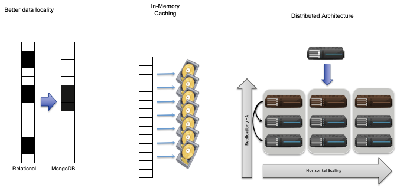

### Terminology: SQL vs MongoDB

|     SQL   Terms/Concepts                   |     MongoDB   Terms/Concepts                 |
|--------------------------------------------|----------------------------------------------|
|     database                               |     database                                 |
|     table                                  |     collection                               |
|     row                                    |     document                                 |
|     column                                 |     field                                    |
|     index                                  |     index                                    |
|     table   joins (e.g. select queries)    |     embedded   documents and linking         |
|     Primary   keys                         |     _id   field is always the primary key    |
|     Aggregation  (e.g. group by)           |     aggregation pipeline             |


## Data Model

### Structure of a JSON-document:

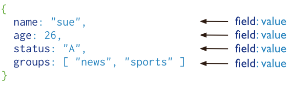

The value of  field:
    - Native data types
    - Arrays
    - Other documents
    
### Collections  of  Documents

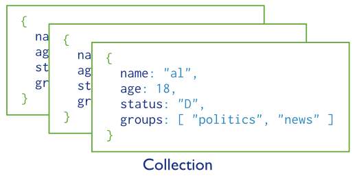

> Rule: Every document must have an _id.

### Embedded documents:

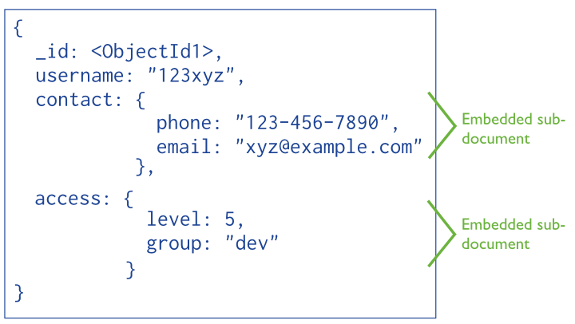

### Reference documents

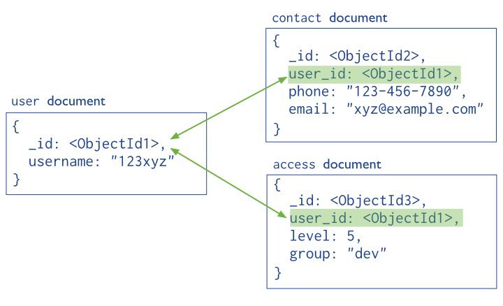

### Storage: BSON Format

- Binary-encoded serialization of JSON-like documents optimized for space and speed
- BSON types are a superset of JSON types[^94]
- Zero or more key/value pairs are stored as a single entity[^93]
- Large entities are prefixed with a length field to facilitate scanning


[^93]: Each entry consists of a field name, a data type, and a value

[^94]: JSON does not have a date or a byte array type, for example

# Operations


### Create
Create a database

```
use database_name
```

Create a collection

```
db.createCollection(name, options)
```

### Insert 

```python
db.<collection_name>.insert({"name": "nguyen". "age": 24, "gender": "male"})
```

```python
db.employee.insert({
    name: "sally",
    salary: 15000,
    designation: "MTS",
    teams: [ "cluster-management" ]
})`
```

### Read
```
  db.<collection_name>.find().pretty()
```
  
```python
db.employee              #collection
    .find( { 
    salary: {$gt:18000}, #condition
        {name:1}         #projection
    }) 
.sort({salary:1})        #modifier
```  


### Update

```python

db.employee #collection
.update(
 {salary:{$gt:18000}}, #Update Criteria
 {$set: {designation: "Manager"}}, #Update Action 
 {multi: true} #Update Option 
)
```

^ Multi-option allows multiple document update

### Delete

```python
db.employee.remove(
     {salary:{$lt:10000}}, #Remove Criteria
)
```

### Aggregates

SQL-like aggregation functionality

Pipeline documents from a collection pass through an aggregation pipeline

Expressions produce output documents based on calculations performed on input documents

Example:

```python
db.parts.aggregate( 
    {$group : {_id: type, totalquantity : 
    { $sum: quanity}
}})
```

---
[.column]
#### Save


```python
db.employee.save(
    {  _id:ObjectId('string_id'),
       "name": "ben", 
       "age": 23, 
       "gender": 
       "male"
})
```

[.column]

#### Drop

  - Drop a database
  - 
```python
Drop it: db.dropDatabase()
```
  
  - Drop a collection:
 
```python
db.<collection_name>.drop()
 ```

### Mapping to SQL

|     SQL   Statement                                                |     MongoDB   commands                        |
|--------------------------------------------------------------------|-----------------------------------------------|
|     SELECT   *      FROM   table                                   |     db.collection.find()                      |
|     SELECT   *      FROM   table     WHERE   artist = ‘Nirvana’    |     db.collection.find({Artist:”Nirvana”})    |
|     SELECT*     FROM   table     ORDER   BY Title                  |     db.collection.find().sort(Title:1)        |
|     DISTINCT                                                       |     .distinct()                               |
|     GROUP   BY                                                     |     .group()                                  |
|     >=,   <                                                        |     $gte,   $lt                               |


### Comparison Operators

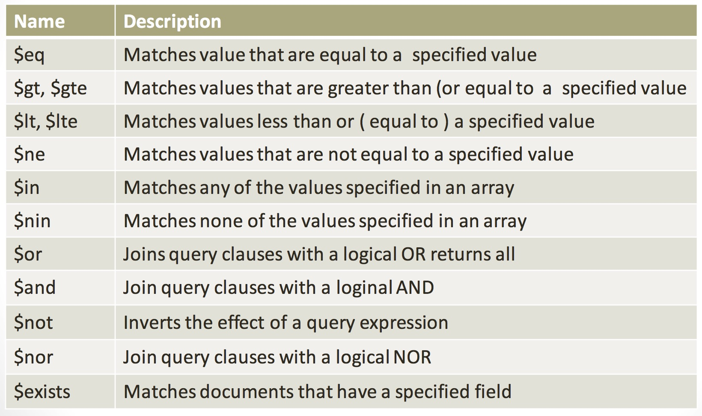

[source](https://docs.mongodb.org/manual/reference/operator/query)


### Indexes

- B+ tree indexes
- An index is automatically created on the _id field (the primary key)
- Users can create other indexes to improve query performance or to enforce Unique values for a particular field
- Supports single field index as well as Compound index
- Like SQL order of the fields in a compound index matters
- If you index a field that holds an array value, MongoDB creates separate index entries for every element of the array

### Sparse Indexes

- Sparse_- property of an index ensures that the index only contain entries for documents that have the indexed field. (so ignore records that do not have the field defined)

- If an index is both unique and sparse – then the system will reject records that have a duplicate key value but allow records that do not have the indexed field defined

## Architecture

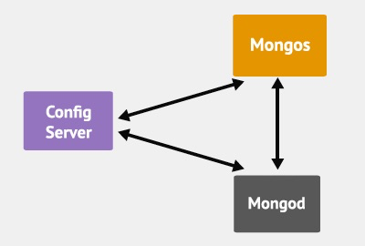

- Mongod – Database instance

- Mongos - Sharding processes:
  - Like a database router processes all requests
  - Decides how many and which *mongod* should receive the query
  - No local data
  - Collects the results, and sends it back to the client.

- Config Server
  – Stores cluster chunk ranges and locations
  – Can have only 1 or 3 (production must have 3)

### Mongod and Mongos

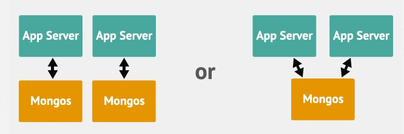

### Client

- Mongo – an interactive shell ( a client)
- Fully functional JavaScript environment for use with a MongoDB
- You can have one mongos for the whole system no matter how many mongods you have
- OR you can have one local mongos for every client if you wanted to minimize network latency.

## Replication
For redundancy MongoDB provides asynchronous replication. 

Only one database node is in charge of write operations at any given time (called primary server/node). 

Read operations may go to this same server for strong consistency semantics or to any of its replica peers if eventual consistency is sufficient.

### Master Slave Replication

Consists of two servers out of one which takes the role of a master handling write requests and replicating those operations to the second server, the slave.


[.column]

### Replica Sets

Consists of groups of MongoDB nodes that work together to provide automated failover.

^ Replica Sets are described as an "an elaboration on the existing master/slave replication, adding **automatic failover** and automatic recovery of member nodes"

## Partitioning
- called Sharding in MongoDB
- User defines shard key for partitioning
- Shard key defines range of data
- Key space is like points on a line
- Range is a segment of that line

### What is a Shard?

- Shard is a node of the cluster
- Shard can be a single mongod or a replica set
- Default max chunk size: 64mb
- MongoDB automatically splits & migrates chunks when max reached

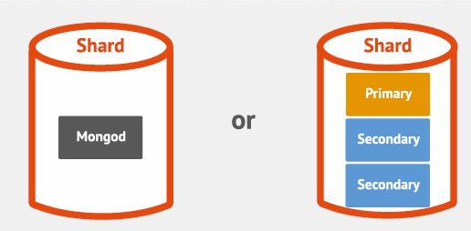

### Auto-sharding

- Minimal effort required
  - Enable Sharding for a database
  - Shard collection within database
  - Decide Sharding Strategy

### MongoDB Sharding Strategies

- Ranged
- Hashed
- Tag-aware

---
#### Range Sharding

- Splits shards based on sub-range of a key (or also multiple keys combined)
  - Simple Shard Key: {deviceId}
  - Composite Shard Key: {deviceId, timestamp}


---
#### Hash Sharding

- MongoDB apples a MD5 hash on the key when a hash shard key is used:
  - Hash Shard Key(deviceId) = MD5(deviceId)
  - Ensures data is distributed randomly within the range of MD5 values


---
#### Tag Sharding

Tag-aware sharding allows subset of shards to be tagged, and assigned to a sub-range of the shard-key.

Example: Sharding User Data belong to users from 100 “regions”

Collection: Users, Shard Key: {uId, regionCode}

Tag based on macro regions

---
#### Tag Sharding Example

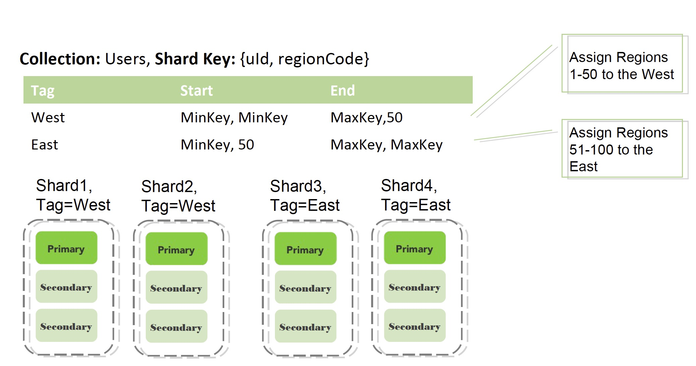

---
#### Which Sharding to use?

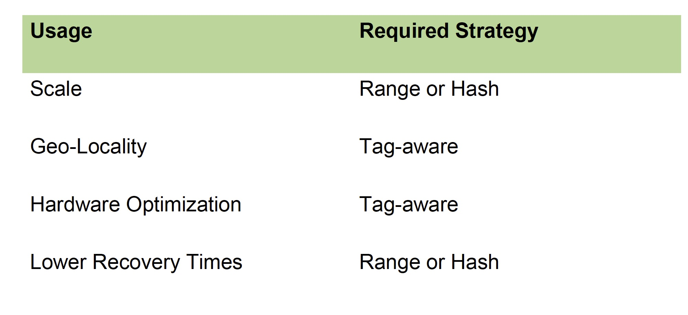

### Routing and Balancing

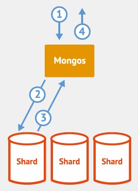

- Queries routed to specific shards
- MongoDB balances cluster
- MongoDB migrates data to new nodes


### MongoDB Security

- SSL
  - between client and server
  - Intra-cluster communication
- Authorization at the database level
  - Read Only/Read+Write/Administrator


### References

- [Mongodb.com](http://www.mongodb.com/nosql-explained)
- No SQL Distilled by P. Sadalage and M. Fowler
- MongoDB Applied Design Patters by R. Copeland
- The Definitive Guide to MongoDB by Plugge, Membry and Hawkins


