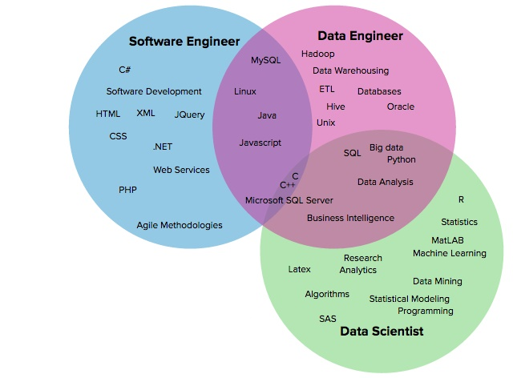
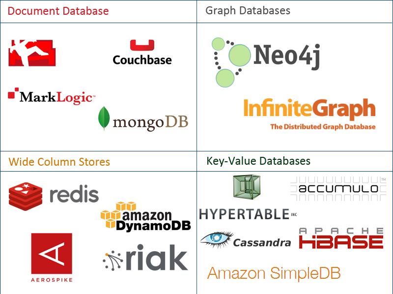
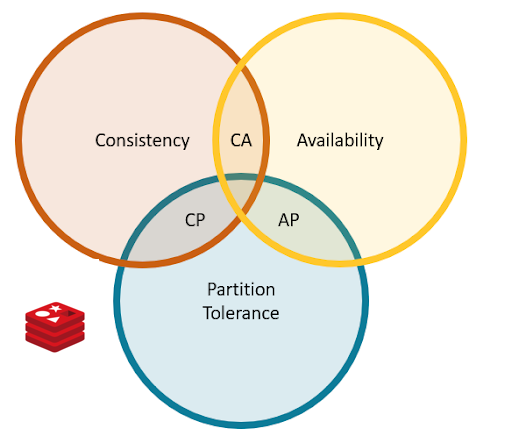

footer:  [Riccardo Tommasini](http://rictomm.me) - riccardo.tommasini@ut.ee - @rictomm 
slide-dividers: #, ##, ###
slidenumbers: true
autoscale: true
build-lists: true
theme: Plain Jane

# Data Engineering
#### LTAT.02.007
#### Ass Prof. Riccardo Tommasini
#### Assistants: [Fabiano Spiga](mailto:),  [Mohamed Ragab](mailto:mohamed.ragab@ut.ee),  [Hassan Eldeeb](mailto:hassan.eldeeb@ut.ee)

[.column]

[.column]
#### [https://courses.cs.ut.ee/2020/dataeng](https://courses.cs.ut.ee/2020/dataeng)
####[Forum](https://piazza.com/ut.ee/fall2020/ltat02007/home) 
####[Moodle](https://moodle.ut.ee/course/view.php?id=10457)

[.column]
 

## Data Engineering and Data Engineer

 

> Data engineering is a set of operations aimed at creating interfaces and mechanisms for the flow and access of information[^03].

---

# Data Modelling

### CAP Theorem (Brewer’s Theorem)

It is impossible for a distributed computer system to simultaneously provide all three of the following guarantees:

- **Consistency**: ???
- **Availability**: ???
- **Partition tolerance**: ???

### CAP Theorem (Brewer’s Theorem)
[.build-lists: false]

It is impossible for a distributed computer system to simultaneously provide all three of the following guarantees:

- **Consistency**: all nodes see the same data at the same time
- **Availability**: ???
- **Partition tolerance**:???

### CAP Theorem (Brewer’s Theorem)
[.build-lists: false]
It is impossible for a distributed computer system to simultaneously provide all three of the following guarantees:

- **Consistency**: all nodes see the same data at the same time
- **Availability**: Node failures do not prevent other survivors from continuing to operate (a guarantee that every request receives a response whether it succeeded or failed)
- **Partition tolerance**: ???

### CAP Theorem (Brewer’s Theorem)
[.build-lists: false]
It is impossible for a distributed computer system to simultaneously provide all three of the following guarantees:

- **Consistency**: all nodes see the same data at the same time
- **Availability**: Node failures do not prevent other survivors from continuing to operate (a guarantee that every request receives a response whether it succeeded or failed)
- **Partition tolerance**: the system continues to operate despite arbitrary partitioning due to network failures (e.g., message loss)

### Data Replication
  
> Replication means keeping a copy of the same data on multiple machines that are connected via a network

^ 
- Ask about the reasons for Replication
	- Increase data locality
	- Fault tolerance
	- Concurrent processing (read queries)

### Data Partitioning (Sharding)

 > breaking a large database down into smaller ones

^ 
- For very large datasets, or very high query throughput, that is not sufficient
- The main reason for wanting to partition data is scalability

### We Talked about Workloads

^ 
- **OLTP** systems are usually expected to be **highly available** and to process transactions with low latency, since they are often critical to the operation of the business.
- **OLAP** queries are often written by business analysts, and feed into reports that help the management of a company make better decisions (business intelligence).

## Data Modelling for Databases

### [[Relational Algebra]] (On Practice)

is a procedural language consisting of a six basic operations that take one or two relations as input and produce a new relation as their result:

- select: σ
- project: ∏
- union: ∪
- set difference: –
- Cartesian product: x
- rename: ρ

### [[Relational Algebra]] Visualized

---

### Refresh on ACID Properties

- ACID, which stands for Atomicity, Consistency, Isolation, and Durability[^11]
- **Atomicity** refers to something that cannot be broken down into smaller parts.
	- It is not about concurrency (which comes with the I)
- **Consistency** (overused term), that here relates to the data *invariants* (integrity would be a better term IMHO)
- **Isolation** means that concurrently executing transactions are isolated from each other.
	- Typically associated with serializability, but there weaker options.
- **Durability** means (fault-tolerant) persistency of the data, once the transaction is completed.

### Cardinality Visualized

## Data Modelling for Data Warehouse (Briefly)

^ 
- Works in phases related to the aforementioned levels of abstractions
- Less diversity in the data model, usually relational in the form of a star schema (also known as dimensional modeling[^41]).
- Redundancy and incompleteness are not avoided, fact tables often have over 100 columns, sometimes several hundreds.
- Optimized for OLAP

### Star Schema

- A **fact table** contains the numeric measures produced by an operational measurement event in the real world. 

- A **single fact** table row has a one-to-one relationship to a measurement event as described by the fact table’s grain.

- **Dimensions** provide contex to business process events, e.g.,  who, what, where, when, why, and how. 

### A note on Storage

- Data warehouse typically interact with OLTP database to expose one or more OLAP system. 
- Such OLAP system adopt storage optimized for analytics, i.e., Column Oriented
- The column-oriented storage layout relies on each column file containing the rows in the same order.
- Not just relational data, e.g., Apache Parquet

## Data Modelling for Big Data

### Big Data

### Challenges [^014]

<!-- Joke About Growing number of Vs -->

[^014]:[Lanely, 2001](x-bdsk://laney20013d)

---
###  Paradigm Shift

---
[.slide-transition: push(vertical, 0.3)]

---
[.slide-transition: push(vertical, 0.3)]

---
[.slide-transition: push(vertical, 0.3)]

---
[.slide-transition: push(vertical, 0.3)]

 
[.slide-transition: reveal(top)]

### From Schema on Write

- Focus on the modelling a schema that can accommodate all needs
- Bad impact on those analysis that were not envisioned

^
 - Extract Transform Load
 - Some analyses may no longer be performed because the data were lost at writing time,

### To Schema on Read

- Load data first, ask question later
- All data are kept, the minimal schema need for an analysis is applied when needed
- New analyses can be introduced in any point in time

### NoSQL
- **Queryability**: need for specialized query operations that are not well supported by the relational model
- **Schemaless**:  desire for a more dynamic and expressive data model than relational
- **Object-Relational Mismatch**: translation between the objects in the application code and the database model

---

### Kinds of NoSQL (2/4)

NoSQL solutions fall into four major areas:

- **Key-Value Store**
	- A key that refers to a payload (actual content / data)
	- Examples: MemcacheDB, Azure Table Storage, Redis, HDFS

- **Column Store** 
	- Column data is saved together, as opposed to row data
	- Super useful for data analytics
	- Examples: Hadoop, Cassandra, Hypertable

### Kinds of NoSQL (4/4)

- **Document / XML / Object Store**
	- Key (and possibly other indexes) point at a serialized object
	- DB can operate against values in document
	- Examples: MongoDB, CouchDB, RavenDB

- **Graph Store**
	- Nodes are stored independently, and the relationship between nodes (edges) are stored with data
	- Examples: AllegroGraph, Neo4j

### ACID vs. BASE trade-off

**No general answer** to whether your application needs an ACID versus BASE consistency model.

Given **BASE** ’s loose consistency, developers **need to** be more knowledgeable and **rigorous** about **consistent** data if they choose a BASE store for their application.

Planning around **BASE** limitations can sometimes be a major **disadvantage** when compared to the simplicity of ACID transactions.

A fully **ACID** database is the perfect fit for use cases where data **reliability** and **consistency** are essential.

### Redis
- is an In-Memory [[Key-Value Store]]
- Strong consistency (**C**)
- *Tuneably* available (**~~A~~**)
- Horizontal Scalable  (**P**)

### What to remember
- Data Model: Hash Table
- Data Types: ASCII and Collections
- Operations: Lookups and Iterations
- Replication: Master-Slaves(read only)
- Partitioning: Client/Proxy/Query Router
- Architecture
	- Standalone
	- Sentinel
	- Cluster

### MongoDB

- An In-Memory [[Document Databases]]
- Strong consistency (**C**)
- *Tuneably* available (**~~A~~**)
- Horizontal Scalable  (**P**)

### What to remember
- Data Model: JSON
- Storage: BSON
- Operations: iterations
- Replication: Replica Sets
- Partitioning: Sharding
- Architecture
	- Mongod
	- Mongos
	- Config Server

### Cassandra

- A Wide [[Column Oriented Database]]
- *tuneably* consistent (**~~C~~**)
- very fast in writes
- highly avaeng
- ailable (**A**)
- fault tolerant (**P**)
-  linearly scalable, elastic scalability
- Cassandra is very good at writes, okay with reads. 

### What to remember
- Data Model: KeySpace, Rows, Column Families
- Storage: Commit Log, SSTables, Bloom Filters
- Operations: ~~SQL~~ (CQL!)
	- Different Concistency Levels for reads and writes
- Replication: Replication factor
	- Simple vs Network Topology
- Partitioning: Order Preserving 
- Architecture: Gossip Protocol

### GraphDBs (Neo4J) 

- Back to Centralized Architecture
	- Relationsip First
- Storage
	- Native vs Non Native
- Graph Pattern Matching
	- Union
	- Projection
	- Different
	- Optional
	- Filter
- Navigational Queries (Paths)

## Questions Template
---
- What are the three levels of data modeling
	- A) Conceptual, Logical, Physical
	- B) Perceptual, Latent, Physical
	- C) Coherent, Logical, Phenomenal

---

- What are the three levels of data modeling
	- A) **Conceptual, Logical, Physical**
	- B) Perceptual, Latent, Physical
	- C) Coherent, Logical, Phenomenal

---

- What is a fact table
	- A) a table that contains the descriptive attributes used by BI applications for filtering and grouping the facts
	- B) a table with a one-to-one relationship to a measurement event as described by the fact table’s grain.
	- C) a table that contains the numeric measures produced by an operational measurement event in the real world.

---

- What is a fact table
	- A) a table that contains the descriptive attributes used by BI applications for filtering and grouping the facts
	- B) a table with a one-to-one relationship to a measurement event as described by the fact table’s grain.
	- C) **a table that contains the numeric measures produced by an operational measurement event in the real world.**

---

What of the following are the valid ADT to represent graphs 
- A) Edge List
- B) Adjacency List
- C) Adjacency Incident
- D) Edge Matrix

---
What of the following are the motivations behind the NoSQL movement
	-  need for greater scalability than relational databases can't offer
	-  need for specialized query operations
	-  need for a more dynamic and expressive data model  
	-  the Object-Relational Mismatch

---

What of the following are the motivations behind the NoSQL movement
	-  **need for greater scalability than relational databases can't offer**
	-  **need for specialized query operations**
	-  **need for a more dynamic and expressive data model  **
	-  **the Object-Relational Mismatch**

---
What of the following are the valid ADT to represent graphs 
- A) **Edge List**
- B) **Adjacency List**
- C) Adjacency Incident
- D) Edge Matrix