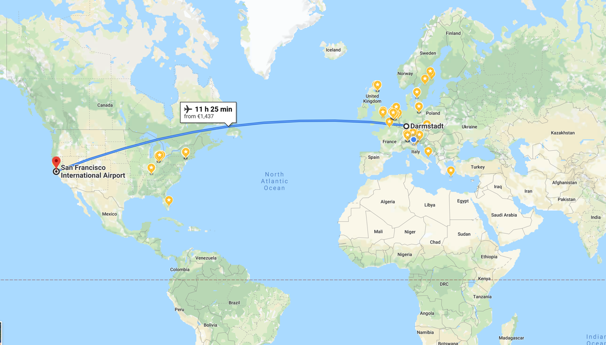
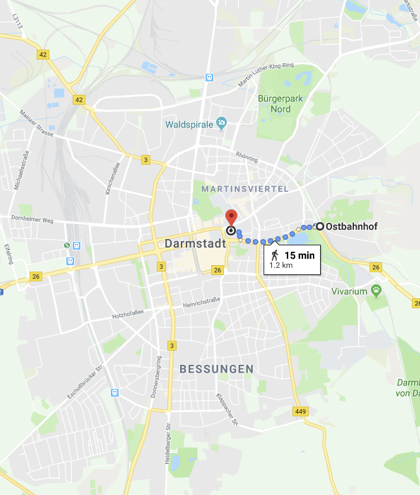
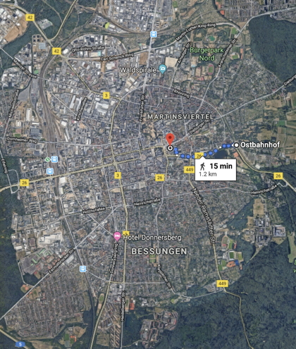
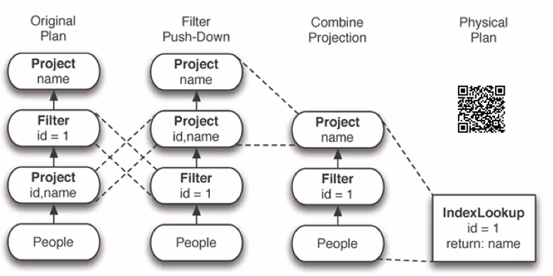
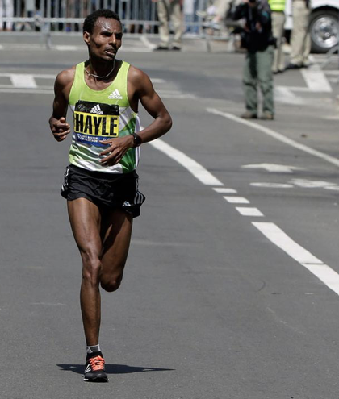

footer:  [Riccardo Tommasini](http://rictomm.me) - riccardo.tommasini@ut.ee - @rictomm - 
slidenumbers: true
<!-- : #course, #topic, #LTAT.02.007 -->

### Querying the Data
[.text: text-scale(2.0)]

Generic term that describes data manipulation.

A query is a request for data or information from a database.

### Programming with Streams: Declarative Languages 

*The key idea of declarative programming is that a program is a theory
in some suitable logic, and the computation is deduction from the
theory*
																									-- J.W. Lloyd

### Declarative Languages: Why? 

-  Writing the optimal solution is as hard as solving the problem (e.g.
  JOIN optimisation)

-  We want to enhance programmer productivity by adding Domain-Specific
  abstraction (e.g. streams)

-  We want to limit the expressiveness of the languages to ensure some
  nice property (e.g. decidability)

### Declarative Languages: Why? 

### Declarative Languages: Why 

### Declarative Languages: Parsing 
-  Obtaining the Declarative Program/Query

-  verify it is is syntactically valid

-  creating an abstract syntax tree

### Declarative Languages: Parsing 

### Declarative Languages: Planning (Logical)

-  Obtaining the AST of the program/query
-  verify all the preconditions hold
-  apply optimizations
-  errors: statistics not updated, wrong decision
-  generates logical plan.

### Declarative Languages: Planning (Logical)

### Declarative Languages: Planning (Physical) 
-  Obtaining the logical plan of the program/query
-  verify all the preconditions
-  errors: table not exists
-  generates physical plan

### Declarative Languages: Planning (Physical) 

### Example of Physical Plan Optimization

### Declarative Languages: Executing 
-  obtain physical plan of the query
-  load it for execution
-  run!

### Declarative Languages: Errors 

-  Input not compliant to the expected one
-  table dropped while long-running
-  network fail (fixable)
-  node fail (fixable)

### Extras
- [[Functional Programming]]
