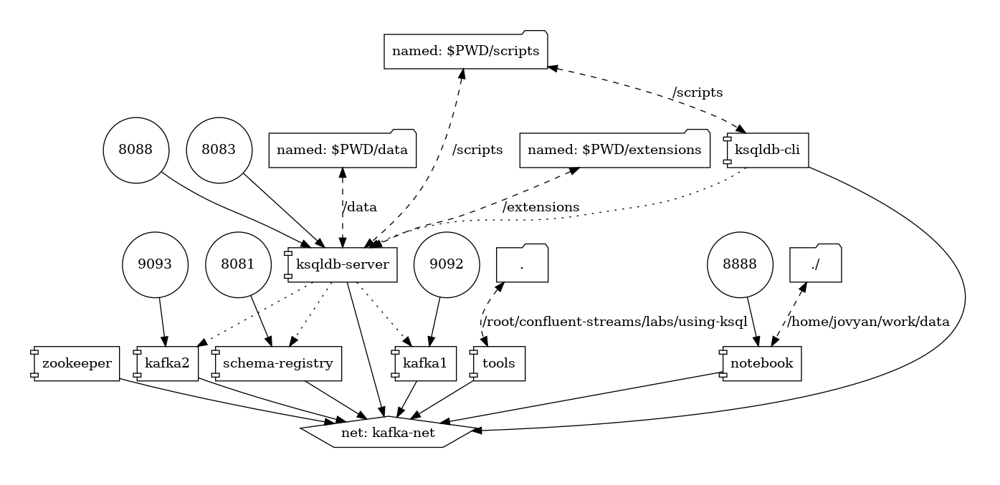

# Kafka Streams/KSQL Practice and Homework


### ASSIGNMENT !!!!!

- [README](./students/README.md)

## Setup

```mvn clean generate-sources```

```

Start the containers ```docker-compose up -d```



## Tools

SSH to the Tools container

```docker exec -it tools /bin/bash```

Run the following command to create the topic ```example_topic```.

```kafka-topics --bootstrap-server kafka1:9092 --partitions 2 --create --topic example_topic ```

## Cleanup

Stop the containers ```docker-compose down```

Delete all the volumes ```docker volume rm $(docker volume ls -q)```

## Kafka Streams

## KSQL

### KSQL-CLI

SSH to the KSQL-DB CLI container ```docker exec -it ksqldb-cli /bin/bash```

Connect to the KSQL-CLI server ```ksql http://ksqldb-server:8088```

### LOAD UDFs

Write your UDFs in the [KSQL-UDFs Project](./ksql-udfs/).

```mvn clean package```

Copy the jar with dependency in [target](./ksql-udfs/target/*jar-with-dependencies.jar) into the extensions folder


