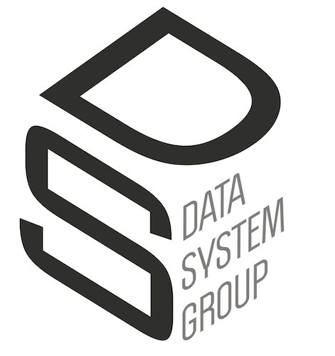

# Data Wrangling:
## Repository for the Data Engineering Course (LTAT.02.007)




This branch contains four notebooks:
1. Introduction to data wrangling using pandas.
2. Introduction to data cleaning.
3. Introduction to machine learning.
4. Introduction to data augmentation.


To run these notebooks, you can use docker, google colab, etc. The requirements are in environment.yml

In the following I will show you how to use conda. you can install miniconda from [this link](https://docs.conda.io/en/latest/miniconda.html), if you don't have miniconda nor anaconda installed on your system

### create a new conda environment and install the dependencies and packages from environment.yml

```
# navigate to the folder containing the environment.yml
conda env create -f environment.yml
```
### activate the new virtual environment

```
conda activate wrangling
```

### To be able to select a conda environment as the kernel in Jupyter

```
python3 -m ipykernel install --user --name wrangling --display-name "Python3 (wrangling)"
```
