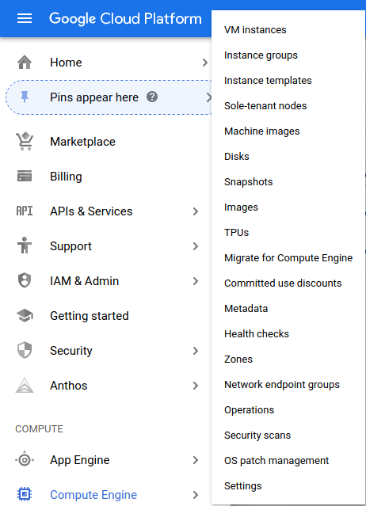
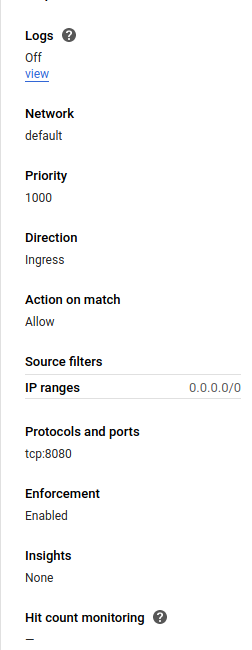

# Hey there.

Ok, so, hypothetically speaking, let's say that you don't have any debian-based linux distribution.

In that case, you can use google cloud in order to create a 24/7 debian virtual machine.

here's how to do that:

### Step 1 - 

go to [google cloud](console.cloud.google.com) and register, put your credit card there(the first 300 USD in cloud costs are for free, during the first 12 months, and they will warn you if you exceed it)

### Step 2 -

On console.cloud.google.com, with your newly created account, click on "Compute Engine" on the left side of the screen.

Now, create your virtual machine, with DEBIAN as the OS. Get one whose specs cost at max 30 bucks a month.

### Step 3 - most complex one

Ok, so, now you have your shiny debian vm. 

The next step is to set up the firewall rules so whenever you deploy the airflow server you won't be frustrated out of your mind trying to figure out how to access it.

#### Step 3.1 -

On the same side navbar where you found compute engine, find VPC network. It should be under networking.

#### Step 3.2 - 

After finding VPC network, click on firewall.

#### Step 3.3 -

Now, select create firewall rule

#### Step 3.4 - 

Make sure your firewall rule looks like this:

### Step 4 -

Test it.

Go to your compute engine public ip's port 8080.

You should see the airflow webserver.