footer:  [Riccardo Tommasini](http://rictomm.me) - riccardo.tommasini@ut.ee - @rictomm 
slide-dividers: #, ##, ###
slidenumbers: true
autoscale: true
build-lists: true
theme: Plain Jane

# Data Engineering
#### LTAT.02.007
#### Ass Prof. Riccardo Tommasini
#### Assistants: [Fabiano Spiga](mailto:),  [Mohamed Ragab](mailto:mohamed.ragab@ut.ee),  [Hassan Eldeeb](mailto:hassan.eldeeb@ut.ee)

[.column]


[.column]
#### [https://courses.cs.ut.ee/2020/dataeng](https://courses.cs.ut.ee/2020/dataeng)
####[Forum](https://piazza.com/ut.ee/fall2020/ltat02007/home) 
####[Moodle](https://moodle.ut.ee/course/view.php?id=10457)

[.column]
 

---

# Talk Announcement
#### Thursday 19th Lecture Time!

Herminio works as a consultant in IOVIO a Consulting Firm with specialization in Data Projects. In his career Herminio has already worked in more than 50 countries, in all continents, and lived in 13. His career was shaped in the lines of General Electric Nuclear Energy, with a devotion to innovation and quality for mission critical applications. In his professional path he has run through the implementation of data quality solutions around the globe for a wide range of industries including Financial Institutions, Automobile, Insurance, Farma, Mining, Health and Bioengineering.

His enthusiasm to close the gap between academia and industry, has given him the opportunity to share his experience in seminars in collaboration with the University of Valencia, the Politecnido di Milano and the Polytechnic of Zurich.

Today, established in Zurich, Switzerland; he splits his time between his family, friends and nature.

[video teaser](https://www.youtube.com/watch?v=0c3rem3WMGco)


# Data Velocity[^19]

[^19]: Data velocity represents the speed at which data are consumed and insights are produced.

### Data Volume & Velocity

Nowadays, we produce massive amount of data.

And we produce them fast...

...the picture on the right shows what was happening in a single minute of internet traffic in 2015

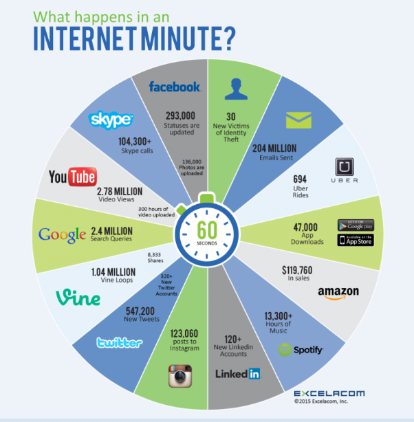

---
# Moreover, in 2015...

IBM reported that T-Mobile processed more than 17 billion events, including text messages, phone calls, and internet traffic. 

According to Hitachi, the amount of data generated by a Level 2[^18] connected vehicle exceeded 25GB per hour.

Bombardier showcased its C Series jetliner which is fitted with 5,000 sensors that generate up to 10 GB of data per second. 

[^18]: [only a limited set of automated functions](https://www.tuxera.com/blog/autonomous-cars-300-tb-of-data-per-year/)

^
All the examples above require to ingest data as they arrive and analyse them quickly. Ideally, data should be continuously processed as they are produced.

---

Today?

---

According to Statista[^17] 75.44 billion of IoT devices will be installed worldwide by 2025.

The avionics of a modern commercial jets outputs 10 terabytes (TB) of data, per engine, during every half hour of operation. 

and the Web...

[^17]: [source](https://www.statista.com/statistics/471264/iot-number-of-connected-devices-worldwide/)

---

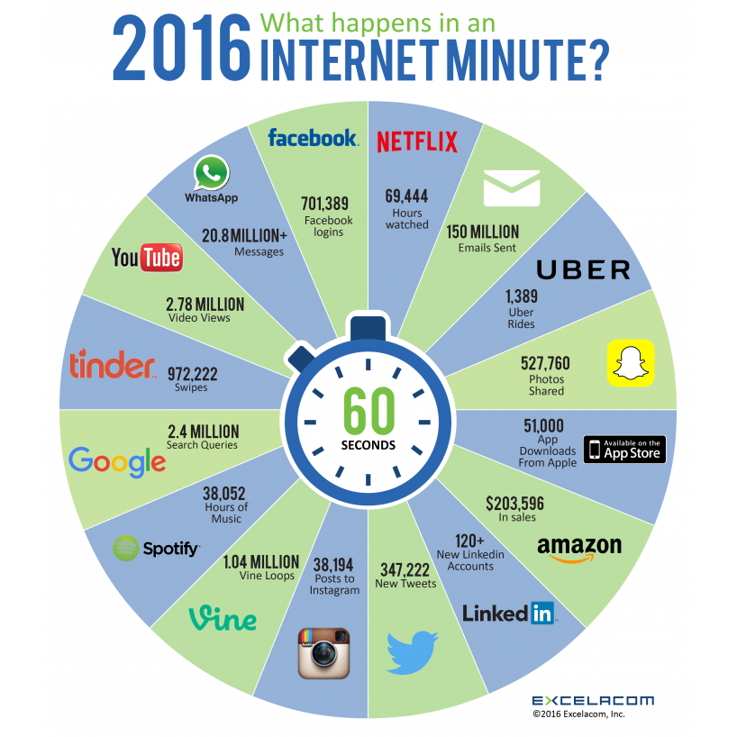

---
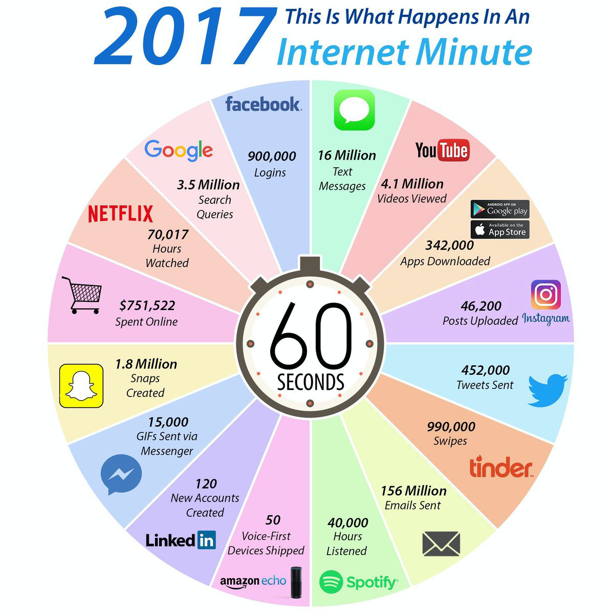

---
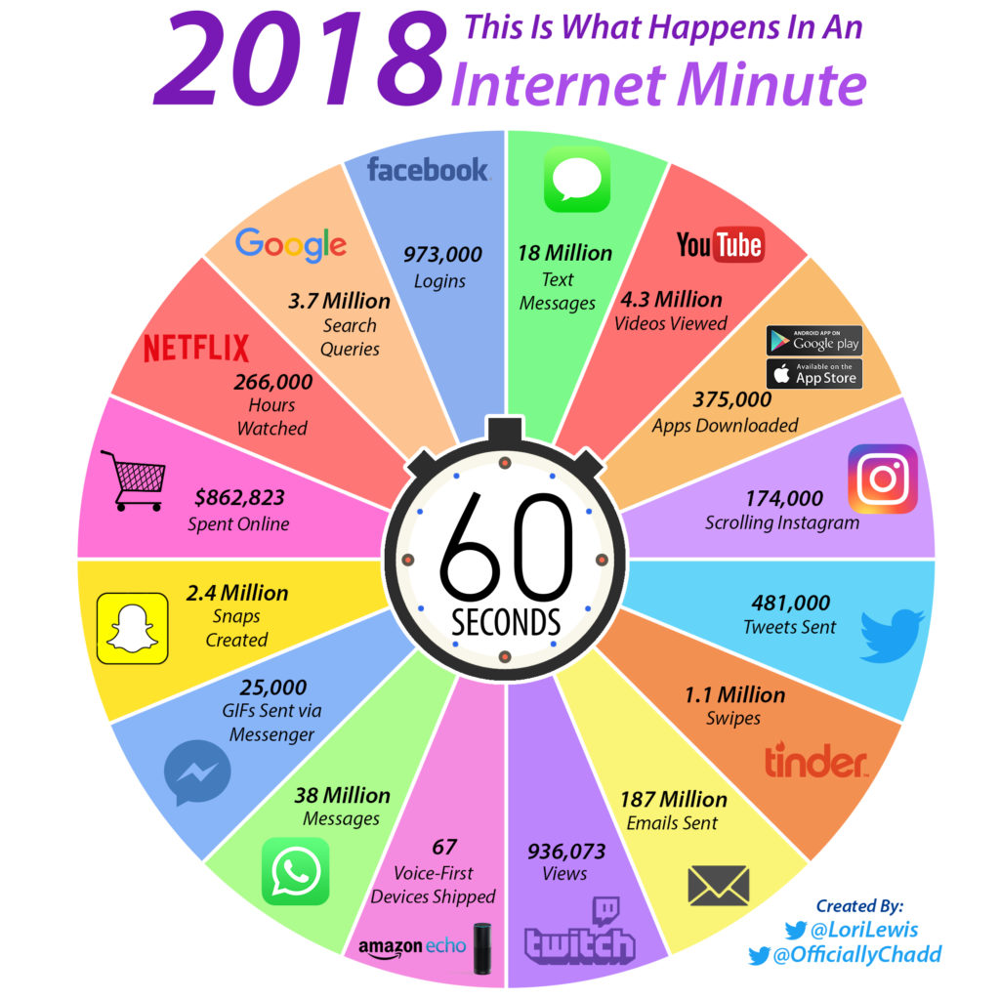

---
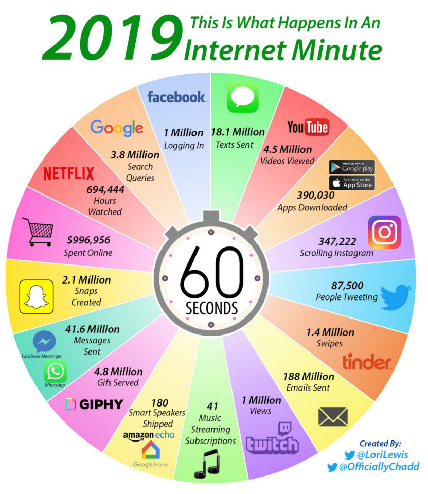

---
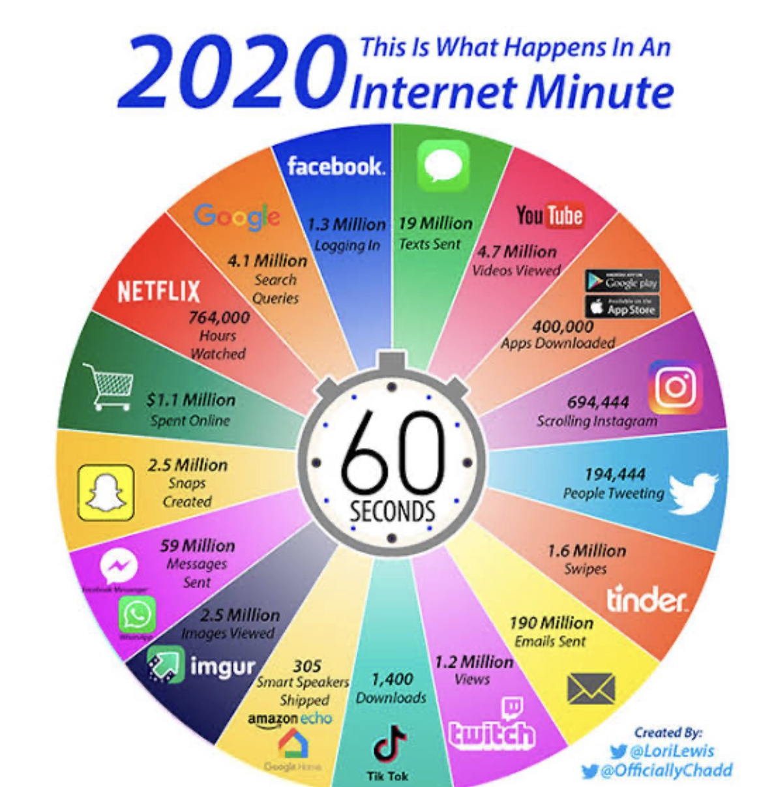

---


### Traditional Approach

We have addressed the Volume aspect of big Data

-  Static large data sets
-  Partitioned across different nodes
-  Processing jobs eventually terminate

### Big Data  Technologies (1st Gen)

[.column]

Ingestion (Storage)

- HDFS
- S3 
- Flume 

[.column]

Processing  (Batch)

- MapReduce (Hadoop)
- Hive
- Spark

### So What?

In many applications domains, the traditional data processing infrastructures are challenged:

[.column]
- Electronic trading
- Network monitoring
- Fraud detection

[.column]

- Social network analysis
- IoT Applications
- Smart cities
	

### … Excel At Historical Descriptive Analysis	

[.footer: E. Della Valle, M. Balduini, & R. Tommasini - Influx Days - Virtual - SF 2020]

- What is the average time to failure for the different brands of turbine in use?
<br>
- What is the maximum delay of the public transport per city district?
<br>
- Which content features are correlated to high impact posts?


---
[.footer: E. Della Valle, M. Balduini, & R. Tommasini - Influx Days - Virtual - SF 2020]

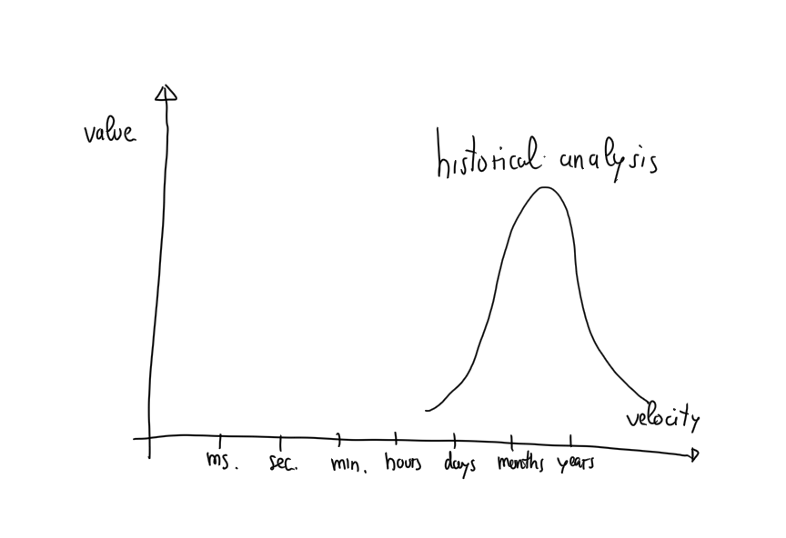

### … Struggling With Prescriptive Analysis

[.footer: E. Della Valle, M. Balduini, & R. Tommasini - Influx Days - Virtual - SF 2020]
	
- What is the expected time to failure when that turbine starts to vibrate as detected in the last 10 minutes? 
<br>
- Can I get to that meeting in the next 15 min using public transport?
<br>
-  Who is driving the discussion about the top 10 emerging topics?


---

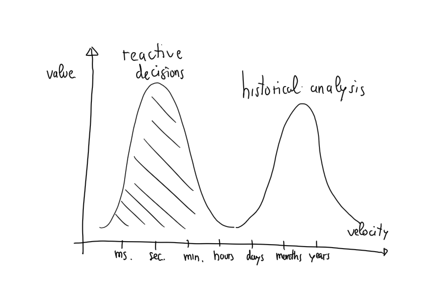

---

### Decision Framework


## Stream Processing


### What for?

Three interesting characteristics distinguish streams from the data:

-  Data Streams are unbounded or infinite
-  Data Streams are ordered, typically time-wise.
-  Data are shared in active way, i.e., push model vs pull. is controlled by the source


### Where are the streams?
 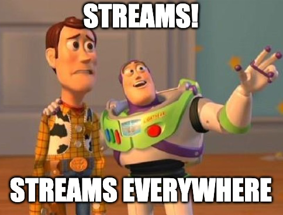

Several sources share data in a streaming form.

-  Stream from clusters, e.g., traces, metrics, and logs.
-  Stream from social media, e.g., Twitter feeds.
-  Stream from news, e.g., GDELT and Google news.
-  Stream from sensor networks, e.g., from smart cities.


### Data Streams

A stream is an unbounded sequence of data. Typically it is modeled as a sequence of pairs $$(o,i)$$, where $$o$$ is an document/tuple/graph and $$i$$ is a timestamp.

$$(o1,1), (o2,2), (o3,3), (o4,4),(o5,5), (oi,i) .....$$


### How to Process Streams?

Due to the *unbounded* nature of stream, traditional processing techniques are not adequate. 
Moreover, stream analysis typically has strict time constrains.

Thus, **Stream processing** requires a paradigm shift, i.e.,  from data at rest and post-hoc analyses, to process data **in-motion** and in-motion insights.


### 8 Requirements for Stream Processing[^1]

[.column]

-  Keep the data moving
  -  Prefer active (push) data sharing
-  Declarative Access
  -  E.g., streamSQL, CQL
-  Handle imperfections
  -  Late, missing, unordered items
-  Predictable outcomes
  -  Consistency, event-time processing

[.column]

-  Integrate stored and streaming data
  -  Hybrid stream and batch
-  Data safety and availability
  -  Fault tolerance
-  Partitioning and Scaling
  -  Distributed processing
-  Instantaneous response
  -  Low latency

---

[.footer: ]


### Stream Processing State of the Art

[.column] 

Stream Analytics (SA) (Our focus)
-  Obtain aggregates over streaming data within time boundaries

Event Processing (EP)

-  Interested in sequences of event, called composite events, defined using regular expressions

[.column] 

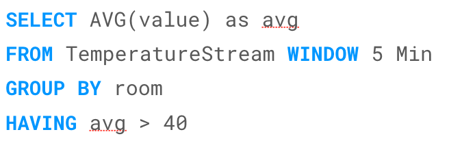 
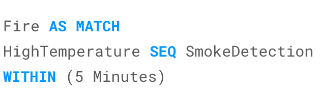


---
[.footer: ]


# Dimensions to Consider

Five dimensions are important when considering stream processing engines for big data.

[.column]

- Notions of Time
- Continuous Processing
- Architectural View
- Fault Tolerance
- Programming Model

[.column]
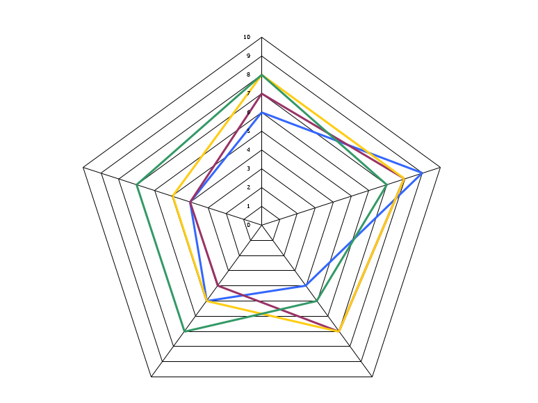

## Different Notions of Time (1/2)
In the SP literature, many notion of time have been proposed. For sake of simplicity, we use the nomenclature suggested by Tyler Akidau [^2].
-  **Ingestion time**: the time at which a stream element arrives in the system
-  **Processing time**: the time at which an operator in the processing pipeline reads the stream element
-  **Event time**: The original time at which the data was generated

NB: in the following we ignore ingestion time without loss of generality.

### Different Notions of Time (2/2)

For both ingestion and processing time, the progress of time is controlled by stream processing engine and the data ordering is strictly monotonic. 

On the other hand, event time is controlled by the source. Thus, the data ordering is only monotonic. Indeed, in event-time, it is possible to have late arriving elements and element occurring simultaneously.

Depending on the type of processing one needs to do, late arrivals may be taken into account.

### Event Time vs Processing Time (1/2)

Ideally, one would like the data to reach the system when they are generated in the real world.

However, this is *physically* not possible, due to the network delay.

Moreover, in a distributed system, where the components are connected to a *non-reliable* network, events can arrive late, i.e., out of order.

### Event Time vs Processing Time (2/2)[^2]

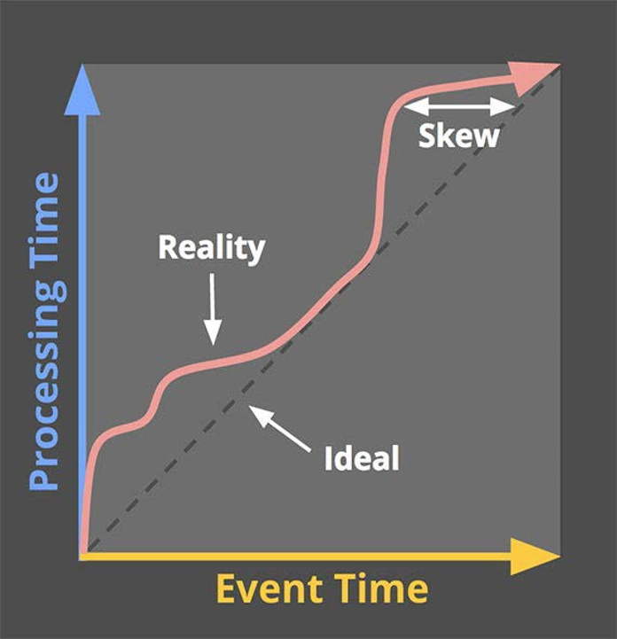

## Continuous Processing (1/2)


The infinite nature of streams requires a change of paradigm in the way we process data.

Continuous semantics: the results of a continuous query is the set of data that would be returned if the query were executed at every instant in time[^3].

### Continuous Processing (2/2)

[.column]

-  The Stream is filled with the elements of the answer that are produced and never changed;
-  The Store is filled with parts of the answer that may change in the future;
-  The Scratch is used to store data that are not part of the answer but are used to compute it;
-  The Throw is used to store unneeded tuples.

[.column]

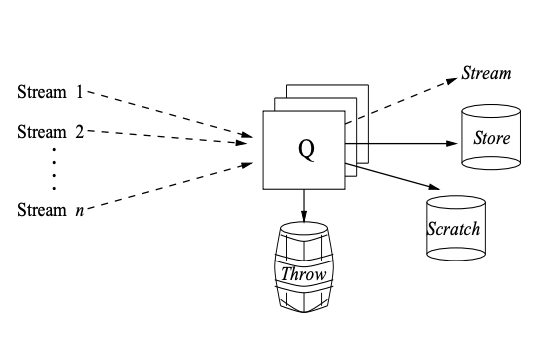

### Dealing With Unboundedness: Window Operators[^2]

[.column]

-  Time windows
  -  Sliding
  -  Tumbling
-  Tuple windows
  -  Also called physical windows
-  Data-driven windows
	-  Session windows


[.column]

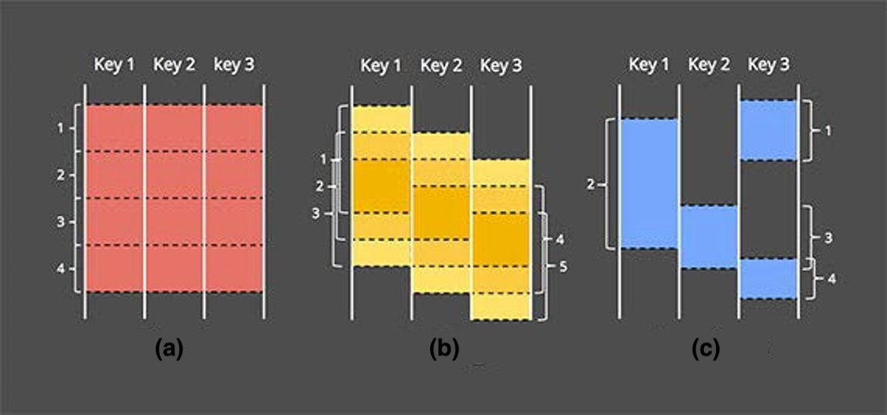

### Time-Based Window Operator (1/2)

A time-based sliding window operator consists of two parameter $$W=P(\omega,\beta)$$ where:
-  $$\omega$$ represents the window width;
-  $$\beta$$ is called sliding parameter.

For each point in time, the time-based sliding window operator defines a set of windows.

$$\mathcal{W}=(<o,c>| c>o, |c-o|=\omega, |o-o'|=|c-c'|=beta )$$

### Time-Based HOPPING Window Operator

---


---


---


---


---


---


---


### Windowing in Processing Time

-  elements' timestamps are controlled by the system
-  time progresses according to system's internal clock
-  no chance for out of order or late arrival

### Windowing in Processing Time[^2]


[source](https://www.slideshare.net/VadimSolovey/dataflow-a-unified-model-for-batch-and-streaming-data-processing)

### Windowing in Event Time

-  Windows are based on timestamp info in the stream
-  Buffering is needed to deal with late arrivals
-  Needs an external time progress indicator

### Windowing in Event Time[^2]


[source](https://www.slideshare.net/VadimSolovey/dataflow-a-unified-model-for-batch-and-streaming-data-processing)

### Data Driven Windowing[^2]

-  Windows are based on data semantics
-  Buffering is needed to deal with late arrivals
-  Needs an external time progress indicator

### Data Driven Windowing[^2]


### Example Windowed Aggregation

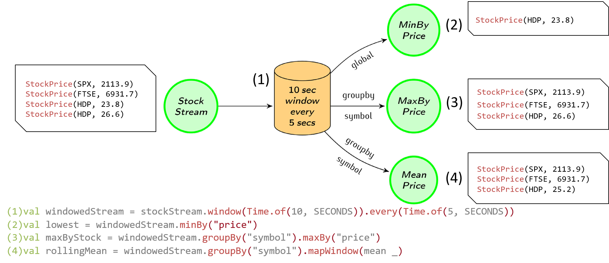

[source](https://www.slideshare.net/VadimSolovey/dataflow-a-unified-model-for-batch-and-streaming-data-processing)


## Architectural Approaches to Stream Processing (1/2)

The architecture of Information Flow Processing (IFP) system defined by Cugola and Margara in[^4].


### Architectural Approaches to Stream Processing (2/2)

Two SP architectures had big industrial tractions:

- The Lambda Architecture, which combines streaming and batch processing.
-  The Kappa Architecture, which relies on fault-tolerant stream log.

### Lambda Architecture[^17]

The lambda architecture is used when approximate results are needed quickly and more accurate results can come later. 

Moreover, it is suitable for cases where pure stream processing is not fault tolerant and more accurate results require to wait for late arrivals.


[^17]: Courtesy of Emanuele Della Valle/Marco Balduini

### Kappa Architecture[^17]

The Kappa architecture was designed to address the limitation of the lambda architecture. 

It leverages only a speed layer but it relies on a fault-tolerant stream storage, e.g., a distributed log. 

The Kappa architecture is simpler to maintain and less costly to operate than the lambda architecture.

### Kappa Architecture


# Programming with Streams

Stream processing frameworks hide execution details from the programmers, and manage them in the background.

There are different abstraction levels that a programmer can use to express streaming computations.


## SQL-like Languages

Prominent batch-processing solutions provide SQL interfaces e.g., Hive,
PIG, SparkSQL. The reasons include the access to a wider audience and
all the benefits of declarative languages. Similarly, Stream Processing
systems are migrating towards SQL-like languages. Can you guess what
kind of extensions they have? Exactly! Window Operators!


### Continuous Query Language 

The infinite nature of streams requires a change of paradigm in the way we process data. A first approach to this is given by the Continuous
Query Language (CQL)[^5]


### Core Abstractions

A **Stream** S is a possibly infinite multi-set of elements <s,t> where s is a tuple belonging to the schema of S and t is a timestamp.

**Relation** R is a mapping from each time instant in T to a finite but unbounded bag of tuples belonging to the schema of R.

### Operator Families

CQL includes three families of operators that reconcile stream processing with traditional relational algebra

-  Stream-to-Relation operators
-  Relation-to-Relation operators
-  Relation-to-Stream operators

---

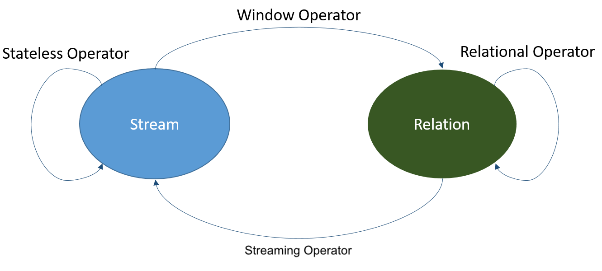

---
### Stream-to-Relation Operators

- Time-based Window Operators
- Count based Window operators
- Data Driven window operators

###  Relation-to-Relation Operators

- Extension of relational algebra

### Relation-to-Stream operators

- Rstream: streams out all data in the last step
- Istream: streams out data in the last step that wasn’t on the previous step, i.e. streams out what is new
- Dstream: streams out data in the previous step that isn’t in the last step, i.e. streams out what is old

## KSQL-DB


### Core Abstractions
### Core Operations

### DDL(Data Definition Language) Statements

[.column]


```sql

CREATE STREAM ratings (
	rating_idlong,
	user_idint,
	stars int,
	route_idint,
	rating_timelong,
	channel varchar,
	message varchar)
WITH(
	value_format='JSON', 
	kafka_topic='ratings');
```

[.column]

```sql

CREATE TABLE users ( 
	uid int, 
	name varchar, 
	elite varchar
	 )
WITH(
	Key= 'uid', 
	value_format='JSON', 
	kafka_topic='mysql-users');

```

### DML(Data Manipulation Language) Aggregation & Windows

[.column]

- Tumbling
- Hopping
- Session

- COUNT
- SUM
- MIN
- MAX

[.column]

#### TUMBLING

```sql

SELECT uid, name, count(*) as rating_count
FROM vip_poor_ratings
WINDOW TUMBLING(size 2 minutes)
GROUPBY uid, name;

```

#### HOPPING

```sql

SELECT uid, name, count(*) as rating_count
FROM vip_poor_ratings
WINDOW HOPPING(size 1 minutes) ADVANCED BY 30 SECONDS
GROUPBY uid, name;

```

---

### DML Statements: JOINs
[.column]
- Join
	- Stream-Stream
	- **Stream-Table**
	- Table-Table

[.column]

```sql

CREATE STREAM vip_poor_ratings AS
SELECT uid, name, elite,
stars, route_id, rating_time, message
FROM poor_ratingsr LEFT JOIN users u ON r.user_id= u.uid
WHERE u.elite= 'P';

```

### Traditional Table-Table Joins

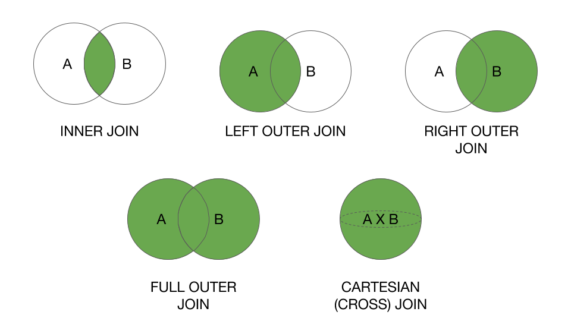
### Stream-Table Joins

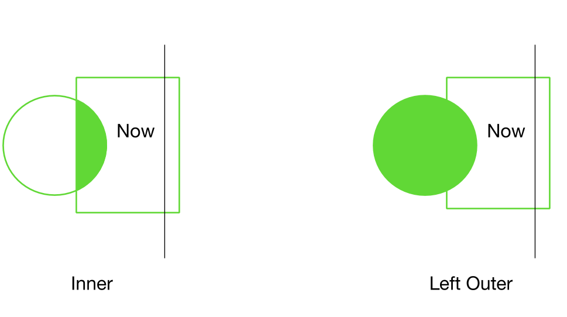

### Stream-Stream Joins
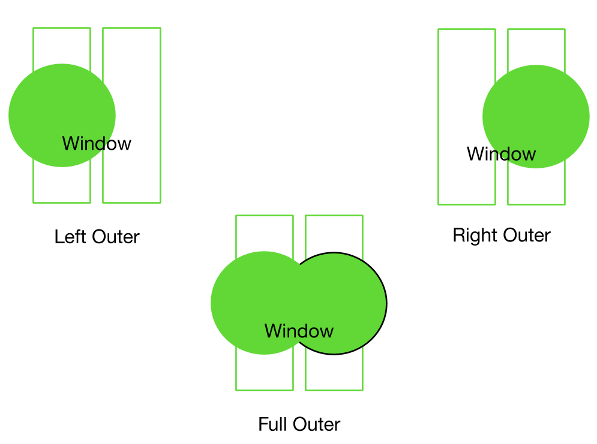

## Functional Languages


Stream Processing frameworks  offer functional APIs to directly write streaming programs.

Function programming provides a mechanism for the representation of Streaming Transformation using higher-order function such as filter, maps, and flatmaps.

Functional APIs are still declarative. However, they give more freedom to the developer who needs to design specialized operations, e.g., aggregations.

### Reference Model[^6]

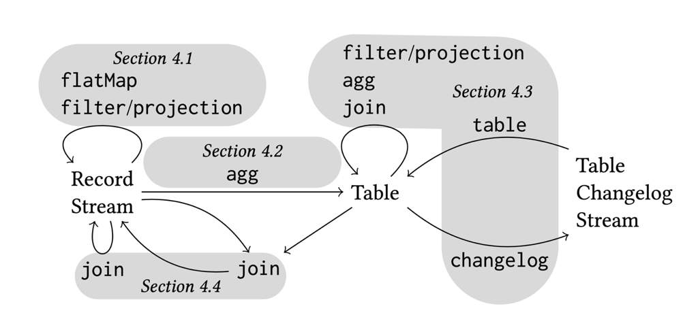

### Design Space

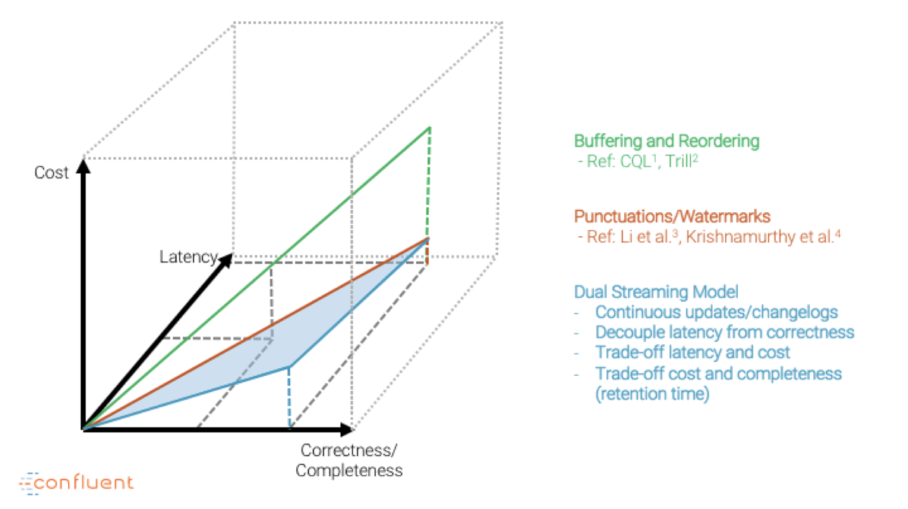

### Intuition


###  Trasformations

[.column]

#### Stateless
- map
- flatMap
- filter

[.column]

#### Stateful 
- join 
	- based on the partitioning key, not relational equijoin
- aggregation, 
	- requires key selection

---

| Operator                            						| Input 1 | Input 2 | Output  |
|-------------------------------------|---------|---------|---------|
| filter/mapValue                                   | KStream |         | KStream |
|filter/mapValue                                    | KTable  |         | KTable  |
| map, flatMap                                      | KStream |         | KStream |
| groupBy ->  agg                                 | KStream |         | KTable  |
| groupBy ->  agg                                 | KTable   |         | KTable  |
| groupBy + windowBy -> agg             |KStream|         | KTable  |
| inner-/left/outer-join                          |KStream| KStream | KStream |
| inner-/left/outer-join                          | KTable  | KTable  | KTable  |
| inner-/left-join                                    |KStream| KTable  | KStream |

---
## Kafka Stream

```java


KStream<String, String> textLines = 
	builder.stream("TextLinesTopic");

KTable<String, Long> wordCounts = textLines
.flatMapValues(textLine -> 
	Arrays.asList(
		textLine
		.toLowerCase()
		.split("\\W+")))
.groupBy((key, word) -> word)
.count("Counts");
    
wordCounts.to(
	Serdes.String(),
	Serdes.Long(), 
	"WordsWithCountsTopic");
	
```

### Core Abstractions

- KStream is an abstraction of a record stream (of key-value pairs) INSERT ONLY
- KTable is an abstraction of a changelog stream. Data records are interpreted as 
	- "UPDATE" of the last value for the same record key
	- "INSERT" if a given key doesn't exist yet "DELETE" or tombstone if the record value is null
- GlobalKTable is similar to a KTable but is fully replicated per KafkaStreams instance

--- 


```java

KStream<String, String> textLines = 
	builder.stream("people-places");

KTable<String, String> wherenow = 
	.groupByKey()
	.reduce((oldPlace, newPlace) -> newPlace);
 
```
---


```java

KStream<String, String> textLines = 
	builder.stream("people-places");

KTable<String, Long> wherenow = 
	.groupByKey()
	.count()
 
```


## Programming with Streams: Dataflow


-  As dataflow networks were the first type of streaming programs to appear in the literature.
-  A dataflow network represents a program as nodes, i.e.,  operators, and edges, i.e., data streams.
-  Nodes can only communicate with each other by their input and output connections.
-  Languages for dataflow programming offer programmers the primitives to implement custom business logic as topologies of nodes.

### Logical Dataflow 

-  What programmer design is actually the logical dataflow plan.
-  A stream processing system distributes a dataflow graph across multiple machines.
-  The system is also responsible for managing the partitioning of data, the network communication, as well as program recovery in case of machine failure.
-  In dataflow programming, the programmers can control the degree of parallelism and, thus, part of the physical execution.

### Physical Dataflow Network


### Dataflow Programming: Stateful Operators

-  Unlike a simple operator such as ```filter```, certain operators need to keep mutable state.

-  For instance, an operator that ```Count``` all the occurrence of a certain event must keep a state of the current counts.

-  In the the word counting example, counting the word occurrences received by an operator, requires storing the words received thus far along with their respective counts.

## The Dataflow Model[^2]

The model provides a framework to answer four questions:

-  **What** results are we computing?
-  **Where** in event-time are they computed?
-  **When** in processing time are they materialized?
-  **How** do results are reported ?

### PCollection[^2]

-  A ```PCollection <T>``` is potentially **unbounded** collection of data Type ```T``` , initially created from backing data stores like a file or a websocket.
-  Each element has an Event time timestamp and a processing time timestamp.

```java

PCollection<String> raw = IO.read(...);
PCollection<KV<String, Integer>> input = raw.apply(ParDo.of(new ParseFn());
PCollection<KV<String, Integer>> scores = input.apply(Sum.integersPerKey());
  
```

^ Summation pipeline. Key/value data are read from an I/O source, with String (e.g., team name) as the key and Integer (e.g., individual team member scores) as the values. The values for each key are then summed together to generate per-key sums (e.g., total team score) in the output collection.

### PTransformations

`PTransforms` transform `PCollections` into other `PCollections`

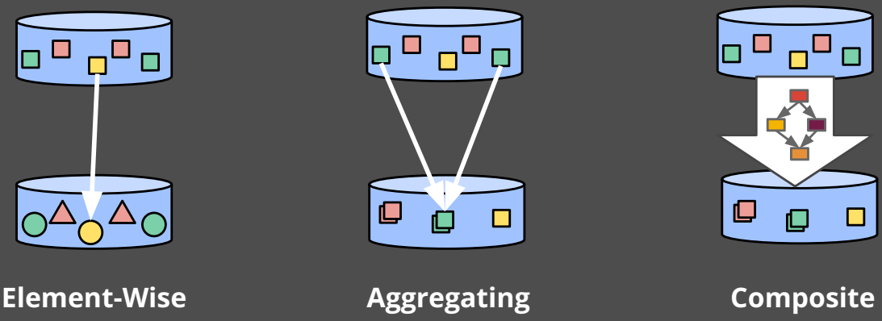

### Where: Windowing Over Event-Time

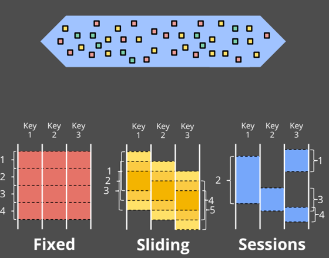

### When in Processing Time?

-  Triggers control when results are materialized

  -  Watermark trigger

  -  Processing time trigger

  -  Count trigger

  -  Delta trigger (not supported by Dataflow)

-  Multiple triggers

  -  **Early**: useful to get early results, e.g., a 24-hours window

  -  **On**: At the window closure time

  -  **Late**: Responding to late arrivals

### Trigger at Watermark


### How to Refine Results?

  -  **Discarding**: report the results for the latest firing only
  -  **Accumulating**: add to the previous result (requires state)
  -  **Accumulating** and Retracting: remove the last update, put the new value

## Kafka Streams: Processor API

```java

KStream<..> stream1 = builder.stream("topic1");
KStream<..> stream2 = builder.stream("topic2");

KStream<..> joined = stream1.leftJoin(stream2, ...);

KTable<..> aggregated = joined.aggregateByKey(...); 
aggregated.to(”topic3”);
```

```java

builder
	.addSource("Source1", "topic1")
	.addSource("Source2", "topic2")
	
	.addProcessor("Join", MyJoin:new, "Source1", "Source2") 
	.addProcessor("Aggregate", MyAggregate:new, "Join")
	.addStateStore(Stores.persistent().build(), "Aggregate")
	
	.addSink("Sink", "topic3", "Aggregate")

```

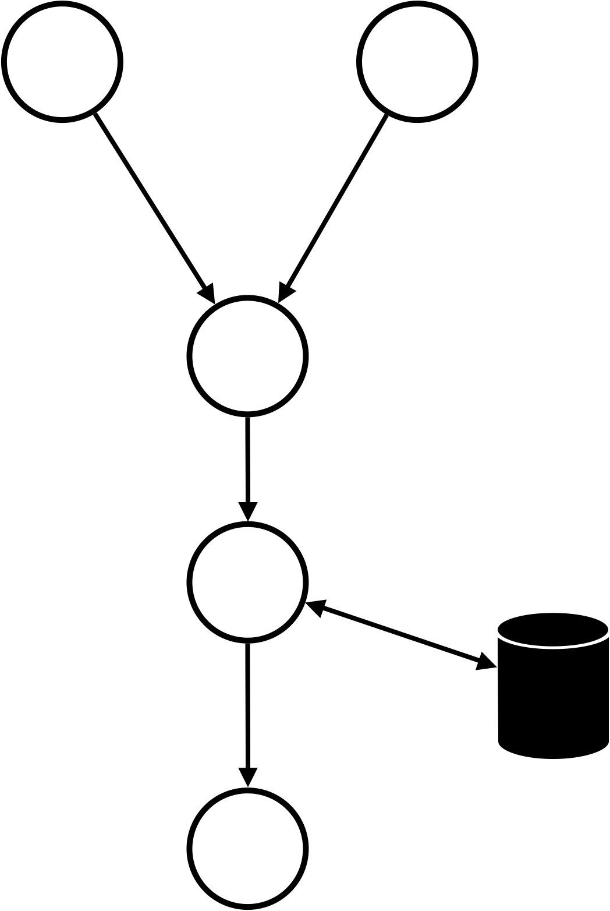

---
### Sources

```java

KStream<..> stream1 = builder.stream("topic1");
KStream<..> stream2 = builder.stream("topic2");
```
	
```java
builder
	.addSource(
		"Source1",
		"topic1")
	.addSource(
		"Source2",
		"topic2")
```


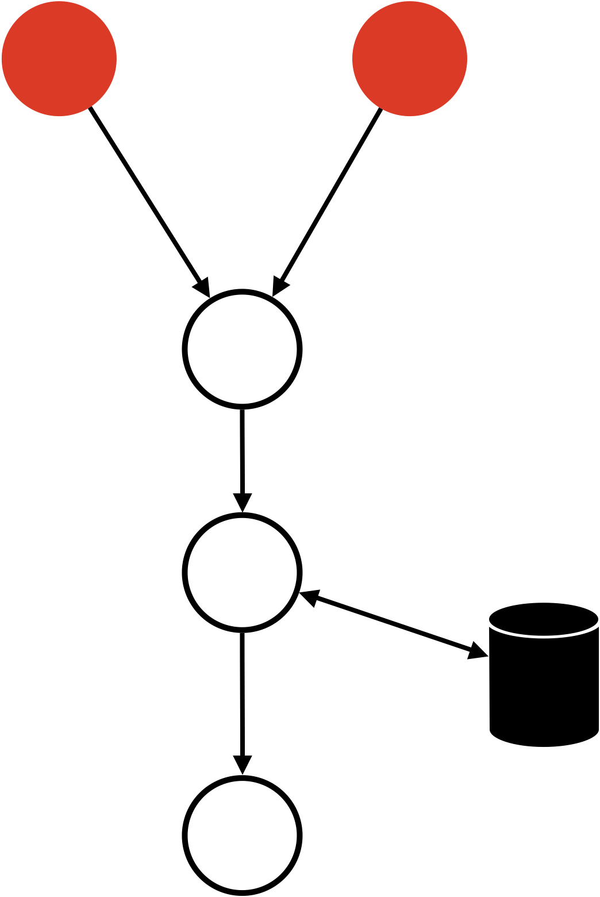

### Join

<br>

```java

KStream<..> joined = 
	stream1.leftJoin(stream2, ...Fn);

```

<br>

```java

builder.addProcessor(
	"Join",
	MyJoin:new,
	"Source1", 
	"Source2") 

```


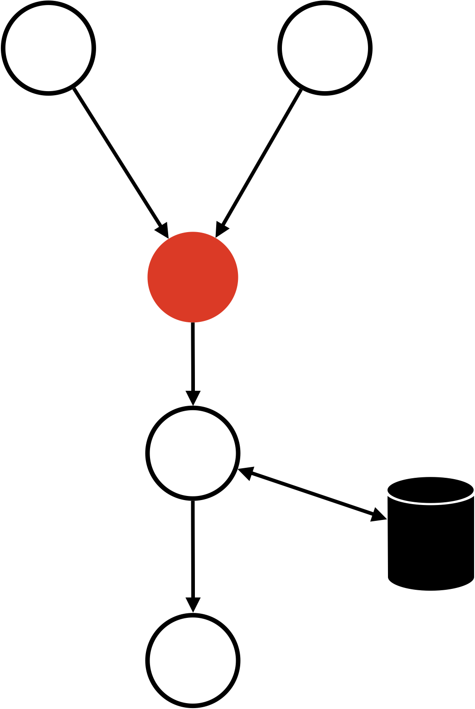

### Stateful Aggregation

```java

KTable<..> aggregated = 
	joined.aggregateByKey(...); 

```
<br>

```java

builder
	.addProcessor(
		"Aggregate", 
		MyAggregate:new, "
		Join")
	.addStateStore(
		Stores.persistent().build(), 
		"Aggregate")

```

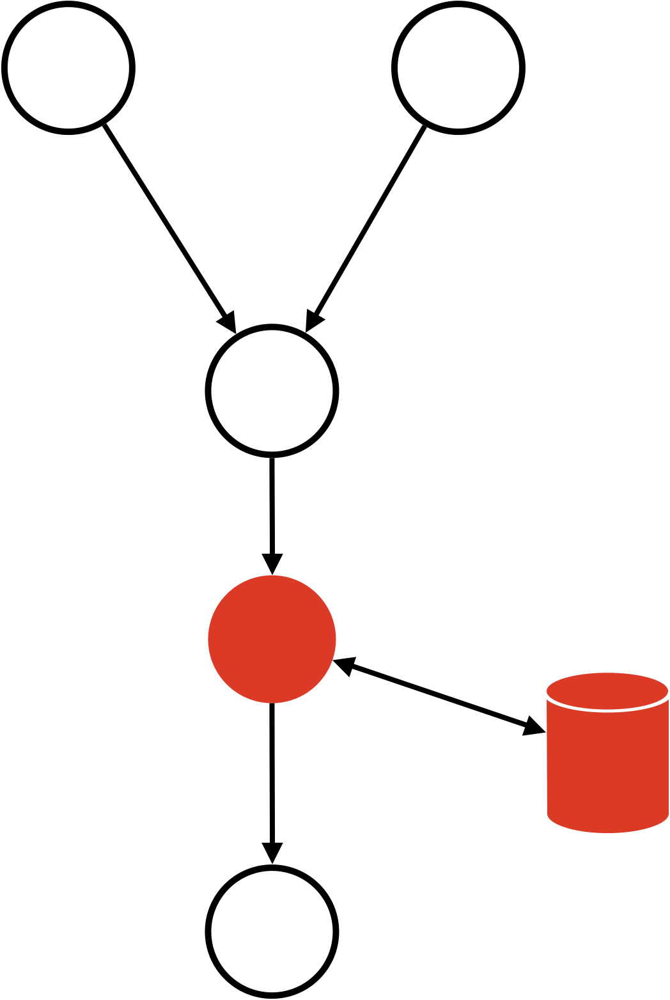

### Sink
```java

aggregated.to(”topic3”);

```

```java

	builder.addSink(”Sink”, ”topic3”, ”Aggregate”)
```

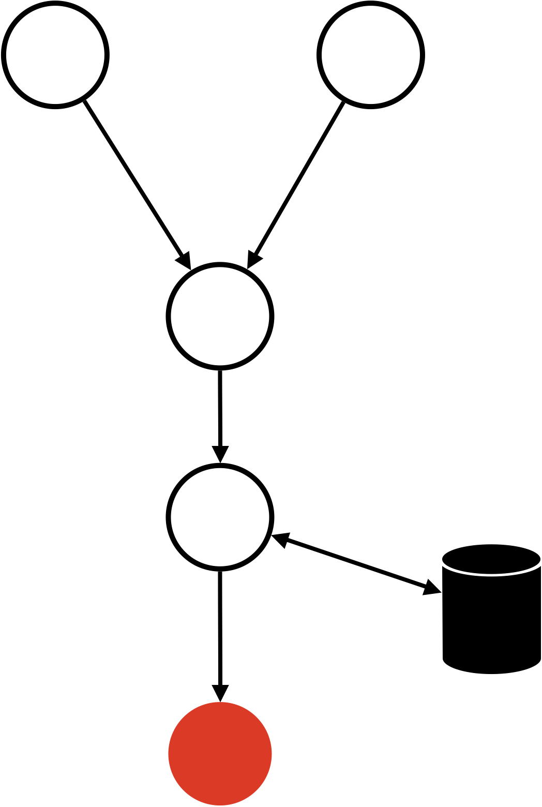

## Actor Model                


Starting from the seminal work of Hewitt et al., actors were thought as a model for concurrency computing. This theory became the foundation of several programming languages.

### Actors

[.column]

-  Actors are lightweight objects that encapsulate a *state* and a *behavior*.

-  They share no mutable state among them, and in fact the only way to communicate is through asynchronous message passing.

-  To manage the incoming messages, each actor has a mailbox.

[.column]

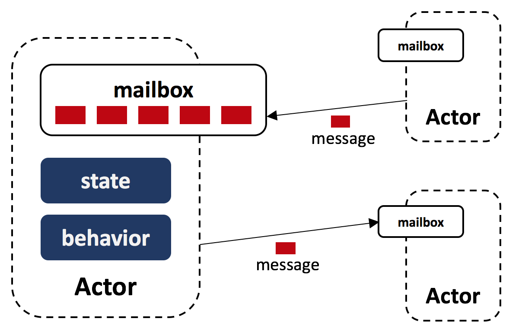

### Actor Model And Stream Processing Execution

Immutable state, no-sharing and asynchronous processing are common requirements for this Stream Processing systems, e.g., Flink or Storm. 

The asynchronous message-passing communication that governs actor interactions is a key feature that allows providing a loose-coupled architecture where blocking operators are avoided.

Indeed, these characteristics are particularly interesting for stream processing systems, especially for those where high scalability and parallel processing of streams are needed. 

### Actor Model: Partitioning

Partitioning strategies determine the allocation of records between the
parallel tasks of two connected logical operators.

-  **Random partitioning**: each output record of a task is shipped to a uniformly random assigned task of a receiving operator. 

-  **Broadcast partitioning**: send records to every parallel task of the next operator.

-  **Partitioning by key**: guarantees that records with the same key (e.g., declared by the user) are sent to the same parallel task of consuming operators

-  **User defined partitioning functions**:(e.g., geo-partitioning or machine learning model selection ).

### Open-Source Systems Overview

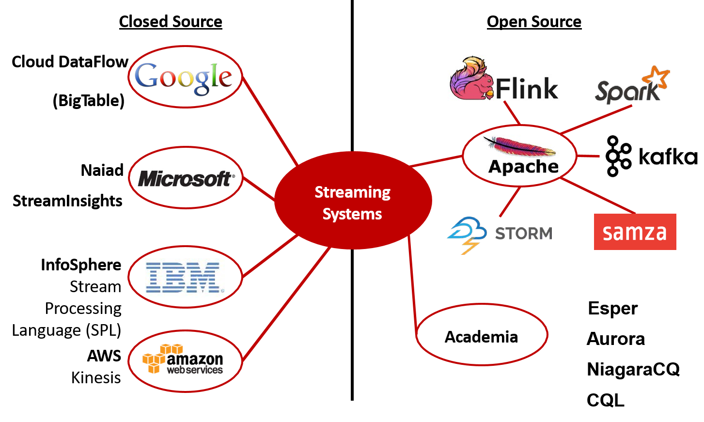

### Large-Scale Data Stream Processing on Commodity Clusters

- Some of the first open source SPs for commodity clusters were
  `Yahoo! S4`[^7] and `Twitter Storm`[^8].

- The more systems provide richer semantics and higher-level programming abstractions for data streams in order to simplify the writing of data stream analysis applications. Examples of such systems are `Apache Flink`[^9], `Beam`[^10] , `Samza`[^11], `Spark Streaming`[^12], `APEX`[^13], and `Kafka Streams`[^14].

### **The End**


[^1]: Stonebraker, Michael, Ugur Cetintemel, and Stan Zdonik. "*The 8 requirements of real-time stream processing*." ACM Sigmod Record 34.4 (2005): 42-47

[^2]: Akidau, Tyler, et al. The dataflow model: a practical approach to balancing correctness, latency, and cost in massive-scale, unbounded, out-of-order data processing.(2015).
  
[^3]: Terry, Douglas, et al. "Continuous queries over append-only databases." Acm Sigmod Record 21.2 (1992): 321-330. 

[^4]: Cugola, Gianpaolo, and Alessandro Margara. "Processing flows of  information: From data stream to complex event processing." ACM Computing Surveys (2012).

[^5]: Arasu, A., Babu, S., & Widom, J. (2006). The CQL continuous query language: semantic foundations and query execution. The VLDB Journal, 15(2), 121-142.

[^6]: Sax, Matthias J., et al. "Streams and tables: Two sides of the same coin." Proceedings of the International Workshop on Real-Time Business Intelligence and Analytics. 2018.

[^7]: [S4](http://incubator.apache.org/projects/s4.html)

[^8]: [Storm](http://storm.apache.org/)

[^9]: [Flink](https://flink.apache.org/)

[^10]: [Beam](https://beam.apache.org/)

[^11]: [Samza](http://samza.apache.org/)

[^12]: [SparkStreaming](https://spark.apache.org/streaming/)

[^13]: [Apex](https://apex.apache.org/)

[^14]: [Kafka Streams](https://kafka.apache.org/documentation/streams/)

[^15]: Courtesy of Emanuele Della Valle/Daniele Dell'Aglio

