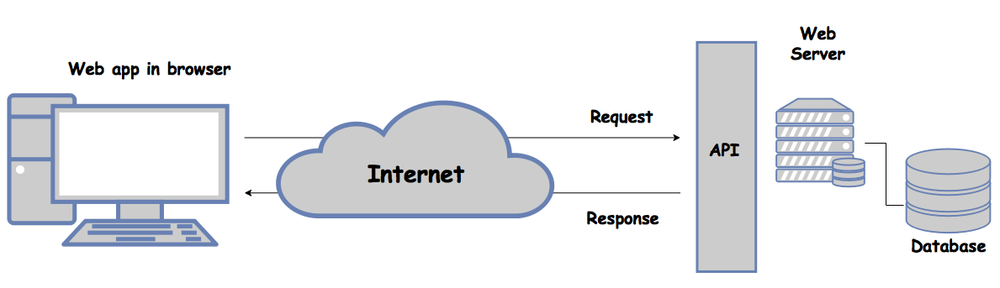

### Web API 

> An API that uses the HTTP protocol. Non standard/unpredictable URL format.

E.g., ```POST http://example.com/getUserData.do?user=1234```

---
### Representational state transfer (REST) 


---

### Overview 

- A set of constraints that inform an architecture
	- Resource Identification
	- Uniform Interface
	- Self-Describing Messages
	- Stateless Interactions	
- Claims: scalability, mashup-ability, usability, accessibility


### RESTful API

> Resource based WebAPI. Standard/predictable URL format.

E.g., ```GET http://example.com/user/1234```

|     VERB      |     Collection                 |     Item                           |
|---------------|--------------------------------|------------------------------------|
|     POST      |     Create   a new item.       |     Not used                       |
|     GET       |     Get   list of elements.    |     Get the selected item.         |
|     PUT       |     Not used                   |     Update the selected item.      |
|     DELETE    |     Not used                   |     Delete   the selected item.    |

### Design Space

The RESTful API uses the available HTTP verbs to perform CRUD operations based on the “context”:
Collection: A set of items (e.g.: /users)
Item: A specific item in a collection (e.g.: /users/{id})


