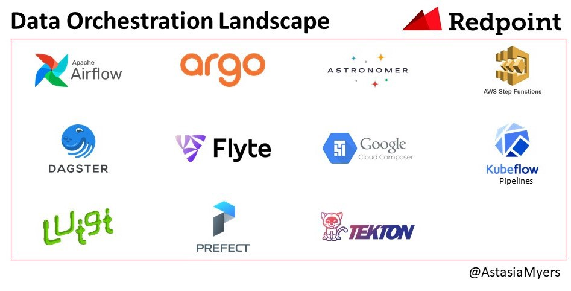

# From Data Pipeline to Data Orchestrator

## Recap of History of Data Transformation

- First generation 
- Data Warehouse SQL-Based ETL 
- Big Data Pipeline (Java)
    + Map Reduce
    + FlumeJava
- Workflow Engines

### Workflow Engines

- The first generation of solutions focused on being task-driven, 
- They decouple the task management from the task process. 
- They have limited knowledge of the data the task is processing.

