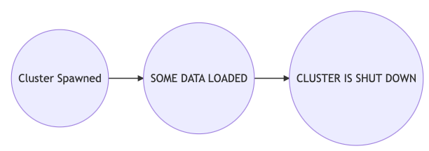
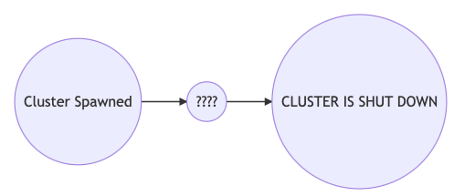

footer:  [Riccardo Tommasini](http://rictomm.me) - riccardo.tommasini@ut.ee - @rictomm 
slide-dividers: #, ##, ###
slidenumbers: true
autoscale: true
build-lists: true
theme: Plain Jane

# Data Engineering
#### LTAT.02.007
#### Ass Prof. Riccardo Tommasini
#### Assistants: [Fabiano Spiga](mailto:),  [Mohamed Ragab](mailto:mohamed.ragab@ut.ee),  [Hassan Eldeeb](mailto:hassan.eldeeb@ut.ee)

[.column]


[.column]
#### [https://courses.cs.ut.ee/2020/dataeng](https://courses.cs.ut.ee/2020/dataeng)
####[Forum](https://piazza.com/ut.ee/fall2020/ltat02007/home) 
####[Moodle](https://moodle.ut.ee/course/view.php?id=10457)

[.column]
 

## WrapUp


## Data Engineer


## Exam

- you need to have completed 5/8 assigment by monday
- you cannot do if you did not do the first midterm
- there will a final the week 11/01

### MCQ as usual

5% can be taken from part 1 (1 or 2 questiosn)

95% from the second part

### Exercises

### Apache Airflow

- Given a scenario

1.  A cluster is spawned
2. Some data are loaded
3. A cluster is shout down



### Apache Airflow

- Given a DAG



- Qualify the operator type (Bash, PostgresOperator ecc)
- determine the trigger rules 


## Apache Kafka


- Given a Scenario:

    - We want to monitor the status of Z smart buildings. Each building has X floors and each floor has Y rooms.

    - The gorverment requires to monitor how many people are having contacts to reduce the spread of COVID-19

    - Rooms are equipped with sensors that detected people entering the rooms.
    **For simplicity, we assume that they are going to stay in the room for 15 minutes**
    - **TASKS: Count the number of people in each room, and floor.**

### Choose the Topics

- 5 topics, one for each building , one for counting per floor and one per room
- 3 topics, one for ingestion, one for counting per floor and one per room
- 6 topics, one for ingestion, one for each building, one for counting per floor and one per room
- Other:

### Choose the Partitions

- If you have the ingestion topic
	- X partitions
	- Z partitions
	- X*Y*Z  partitions (total number of rooms)
	- Y*X partitions
	- Y partitions
	- I do not have an ingestion topic
- If you have the building topic	
	- All the same partitions: X
	- all the same partitions: Y
	- all the same partitions: Z
	- All different partitions
- For count-by-floor topic
	- X partitions
	- Y partitions
	- Z partitions
	- Other
- If you have the count-by-room topic
	- X partitions
	- Y partitions
	- Z partitions
	- Other

**Justification**

## KSQL/Kafka Streams

Given the topics: observation_topic and capacity_topics

### Stream and Table

- Stream and Stream
- Stream and Table
- Table and Stream
- Table and Table

## Tasks

### Task 0

- Create the STREAM/TABLE ```OBSERVATIONS``` from the observations topic 
- Create the STREAM/TABLE ```CAPACITIES``` from the capacities topic

```sql
CREATE STREAM OBSERVATIONS (NAME VARCHAR, EMAIL VARCHAR, CITY VARCHAR, ID INTEGER, TIMESTAMP INTEGER) WITH (kafka_topic='observations', value_format='avro');
```

```sql
CREATE TABLE CAPACITIES (ROOM INTEGER, FLOOR INTEGER, BUILDING INTEGER, CAPACITY INTEGER, AUTHOR VARCHAR, TIMESTAMP INTEGER)
  WITH (kafka_topic='capacities', value_format='AVRO');
```


### Task 1

Count the number of people for each room
- CREATE A STREAM/TABLE called ```NUMPEPROOM``` that contains the count
- Provide the topology for the KSQL/KStreams program using [https://zz85.github.io/kafka-streams-viz/](https://zz85.github.io/kafka-streams-viz/)

```sql
CREATE TABLE NUMPEPROOM AS 
SELECT room, COUNT(*) AS COUNT, 
FROM OBSERVATIONS 
GROUP BY ROOM 
EMIT CHANGES;
```

### Task 2

Count the number of people for each room every 15 seconds
- tumbling in processing time every 15 seconds; 
    - create a stream/table called ```NUMPEPROOM15S``` 
    - Provide the topology for the KSQL/KStreams program

```sql
CREATE TABLE NUMPEPROOM15S AS SELECT room COUNT(*), 
FROM OBSERVATIONS WINDOW TUMBLING (SIZE 15 SECONDS)
GROUP BY ROOM 
EMIT CHANGES;
```


### Task 3

Identify the rooms that contains more people than the allowed ones (capacity)

- Perform the calculation rolling count (no window)
  + Create a stream/table called ```ANOMALIESROLL``` 
  + Provide the topology for the KSQL/KStreams program


```sql
CREATE TABLE ANOMALIESROLL AS 
SELECT x
FROM  NUMPEPROOM T JOIN CAPCITES C ON T.ROOM = C.ROOM 
WHERE T.COUNT > C.CAPACITY
GROUP BY x 
EMIT CHANGES;```
```


## SALUTATIONS


## Stress


### THAT's ALL FOLKS

