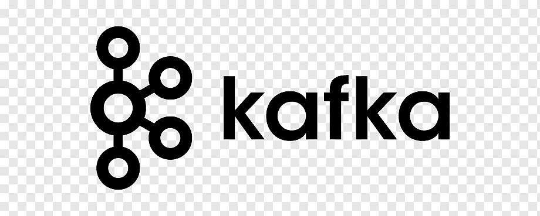
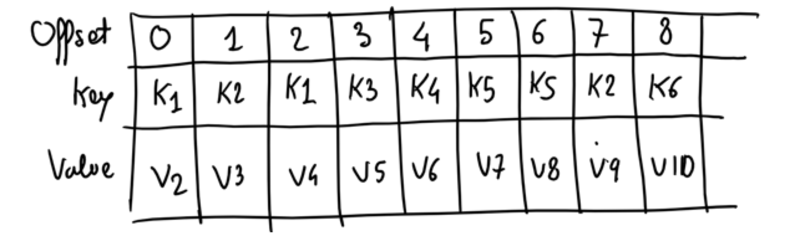
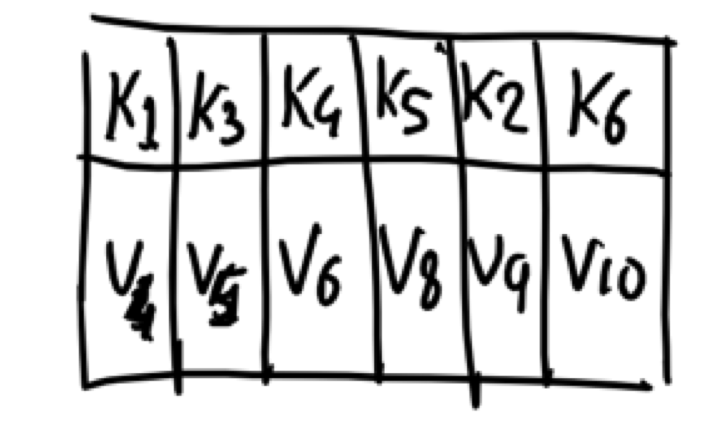
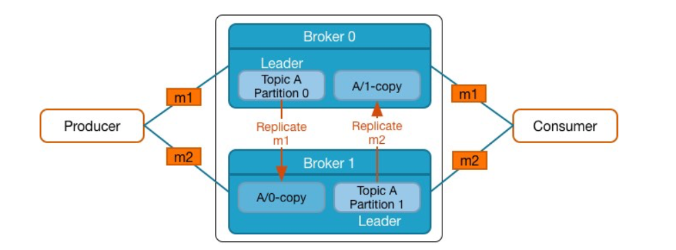

## Apache Kafka[^3]

### An overview

### Motivation

Data pipelines start with a small number of systems to integrates. A single ETL (extract, transform, load) process move data from the source to the interested applications.

### Motivation

But data pipeline grow over time. Adding new system causes the need of new ETL process. The code-base grows together with data formats and services.

### Motivation

Things end up messy when sources and sinks are coupled!

### An alternative: Publish/Subscribe

PubSubs decouple data sources and their consumers making communication
asynchronous and processing scalable.

### An alternative: Publish/Subscribe

PubSubs organize messages logically so that it is easier for the
interested consumers to access.

### Apache Kafka

Apache Kafka is an horizontally scalable, fault-tolerant,
publish-subscribe system. It can process over 1 trillion messages
without neglecting durability, i.e., it persists data on disk.

### Kafka Conceptual View

- **Messages**, the basic unit in Kafka, are organized in **Topics**
- **Producers** write messages topics
- **Consumers** read messages by from topics

### Kafka Conceptual View: Example

### Kafka Logical View

- **Messages** are key-value pairs
- **Brokers** are the main component inside the Kafka Cluster.
- **Producers** write messages to a certain broker
- **Consumers** read messages by from a certain broker

### Kafka Physical View

- **Topics** are partitioned across brokers using the message **Key**.
- Typically, **Producers** has the message key to determine the partition. Also they serialize the message
- **Consumers** read messages by from brokers and de-serialize them

### Kafka Physical View: Zoom In

### Topics Partitions

Producers shard data over a set of Partitions

- Each Partition contains a subset of the Topic's messages
- Typically, the message key is used to determine which Partition a message is assigned to
- Each Partition is an ordered, immutable log of messages

### Topics Partitions and Distributed Consumption

- Different Consumers can read data from the same Topic
- Multiple Consumers can be combined into a Consumer Group
  - Consumer Groups provide scaling capabilities
  - Each Consumer is assigned a subset of Partitions for consumption

^ By default, each Consumer will receive all the messages in the Topic

### Apache Kafka[^2]

## Internals

### Messages and Metadata

Messages are arbitrary Key-Value pairs enriched with metadata:

- Offset
- Timestamp
- Compression type
- Magic byte
- Optional message headers API

^ 

- There is not restriction on what each of Key-Value can be
- Application teams can add custom key-value paired metadata to messages
- Additional fields to support batching, exactly once semantics, replication protocol

### Commit Log

### Topics Partitions: Physical View

Each Partition is stored on the Broker's disk as one or more log files
Each message in the log is identified by its offset number

### Topics Partitions: Physical View

Messages are always appended. Consumers can consume from different offset. Brokers are single thread to guarantee consistency

### Topics Partitions: Load Balancing

Producers use a partition strategy to assign each message a partition

- To ensure load balancing across the Brokers
- To allow user-specified key

### Topics Partitions: Partition Strategy

You can customize the partition strategy, but! 

- it must ensure load balancing across the Brokers too, i.e.,
    hash(key) % number\_of\_partitions
- if key is not specified, messages are sent to Partitions on a
    round-robin basis

### Important: About Ordering

If there are multiple Partitions, you will not get total ordering across all messages when reading data

### Log Retention

- Duration default: messages will be retained for seven days

- Duration is configurable per Broker by setting
  
  - a time period
  - a size limit

- Topic can override a Broker's retention policy

^ When cleaning up a log
    -   the default policy is delete
    -   An alternate policy is compact

### Log Compaction

A compacted log retains at least the last known message value for each key within the partition.

[.column]

#### Before

[.column]

#### After

### Fault Tolerance via a Replicated Log

- Kafka maintains replicas of each partition on other Brokers in the
  cluster
  - Number of replicas is configurable
- One Broker is the leader for that Partition
  - All writes and reads go to and from the leader
  - Other Brokers are followers
- Replication provides fault tolerance in case a Broker goes down

### Replicas in Practice

### Important: Clients do not Access Followers

It is important to understand that Producers and Consumers only
write/read to/from the leader

- Replicas only exist to provide reliability in case of Broker failure
- If a leader fails, the Kafka cluster will elect a new leader from among the followers

### Clients do not Access Followers

In Figure, m1 hashes to partition 0 and m2 hashes to partition 1

### Delivery Semantics

- At least once
  - Messages are never lost but may be redelivered
- At most once
  - Messages are lost but never redelivered
- Exactly once
  - Messages are delivered once and only once

### Zookeeper

- ZooKeeper is a centralized service that stores configurations for
  distributed applications

- Kafka Brokers use ZooKeeper for a number of important internal
  features
  
  - Cluster management
  
  - Failure detection and recovery
  
  - Access Control List (ACL) storage

### Quiz

Provide the correct relationship - 1:1, 1:N, N:1, or N:N -

- Broker to Partition - ?

- Key to Partition - ?

- Producer to Topic - ?

- Consumer Group to Topic - ?

- Consumer (in a Consumer Group) to Partition - ?

### Quiz

Provide the correct relationship - 1:1, 1:N, N:1, or N:N -

- Broker to Partition - N:N

- Key to Partition - N:1

- Producer to Topic - N:N

- Consumer Group to Topic - N:N

- Consumer (in a Consumer Group) to Partition - 1:N

[^1]: Slides are based on content from Cloudera and Confluent
	
[^2]: Slides are based on content from Cloudera and Confluent

[^3]: [KafkaPaper](x-bdsk://kreps2011kafka)
