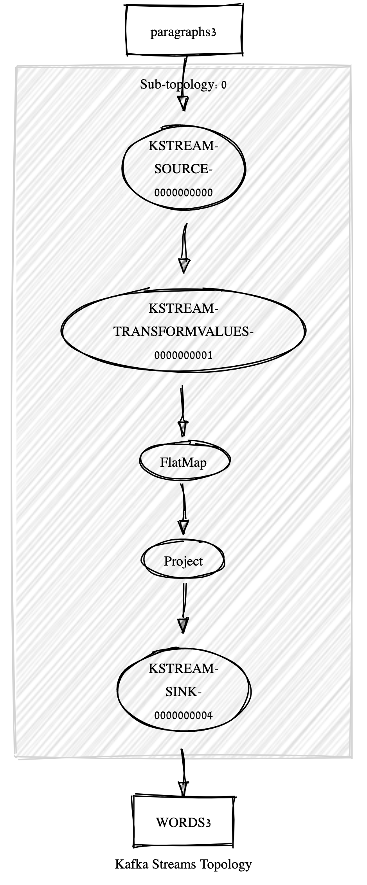
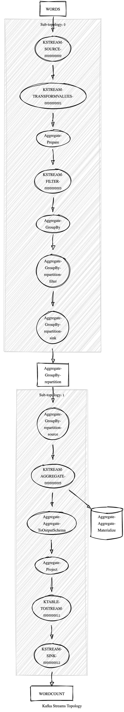

# Exercise 1: Wordcount


## Learning Goals

- User Defined Functions
- Rolling Average

## Before

```bash
kafka-topics --bootstrap-server kafka1:9092 --partitions 2 --create --topic paragraphs 
```

Run [Json Sentence Producer](ksql/JsonSentenceProducer.java)

## KSQL

```sql
CREATE STREAM paragraphs (title VARCHAR KEY, paragraph VARCHAR)
WITH (kafka_topic='paragraphs', value_format='json');
 ```

```sql
DESCRIBE paragraphs;
```
```
Name                 : PARAGRAPHS
 Field     | Type
------------------------------------
 TITLE     | VARCHAR(STRING)  (key)
 PARAGRAPH | VARCHAR(STRING)
------------------------------------
```

Splitting words

```sql
CREATE STREAM words AS 
SELECT title AS title, SPLIT_STRING(paragraph) AS word FROM paragraphs EMIT CHANGES;
```
SHOW QUERIES:

```
Query ID            | Query Type | Status    | Sink Name   | Sink Kafka Topic | Query String
-----------------------------------------------------------------------------------------------------------------------------------------------------------------------------
 CSAS_WORDS_5       | PERSISTENT | RUNNING:1 | WORDS      | WORDS           | CREATE STREAM WORDS WITH (KAFKA_TOPIC='WORDS', PARTITIONS=2, REPLICAS=1) AS SELECT   PARAGRAPHS.TITLE TITLE, SPLIT_STRING(PARAGRAPHS3.PARAGRAPH) WORD FROM PARAGRAPHS EMIT CHANGES;
```

```sql 
EXPLAIN CSAS_WORDS_5
```

```
Execution plan
--------------
 > [ SINK ] | Schema: TITLE STRING KEY, WORD STRING | Logger: CSAS_WORDS_5.WORDS
		 > [ PROJECT ] | Schema: TITLE STRING KEY, WORD STRING | Logger: CSAS_WORDS_5.Project
				 > [ FLAT_MAP ] | Schema: TITLE STRING KEY, PARAGRAPH STRING, ROWTIME BIGINT, TITLE STRING, KSQL_SYNTH_0 STRING | Logger: CSAS_WORDS_5.FlatMap
						 > [ SOURCE ] | Schema: TITLE STRING KEY, PARAGRAPH STRING, ROWTIME BIGINT, TITLE STRING | Logger: CSAS_WORDS_5.KsqlTopic.Source
```

```
Processing topology
-------------------
Topologies:
   Sub-topology: 0
    Source: KSTREAM-SOURCE-0000000000 (topics: [paragraphs])
      --> KSTREAM-TRANSFORMVALUES-0000000001
    Processor: KSTREAM-TRANSFORMVALUES-0000000001 (stores: [])
      --> FlatMap
      <-- KSTREAM-SOURCE-0000000000
    Processor: FlatMap (stores: [])
      --> Project
      <-- KSTREAM-TRANSFORMVALUES-0000000001
    Processor: Project (stores: [])
      --> KSTREAM-SINK-0000000004
      <-- FlatMap
    Sink: KSTREAM-SINK-0000000004 (topic: WORDS)
      <-- Project
```



```SQL
CREATE TABLE wordcount AS 
SELECT word as word, count(word) as count FROM words GROUP BY word;
```

```
DESCRIBE wordcount;

Name                 : wordcount
 Field | Type
----------------------------------------
 WORD  | VARCHAR(STRING)  (primary key)
 COUNT | BIGINT
 
 ```

Notably, word becomes the primary key of the table.

SHOW QUERIES:

```
Query ID            | Query Type | Status    | Sink Name   | Sink Kafka Topic | Query String
-----------------------------------------------------------------------------------------------------------------------------------------------------------------------------
 CSAS_WORDS_5       | PERSISTENT | RUNNING:1 | WORDS      | WORDS           | CREATE STREAM WORDS WITH (KAFKA_TOPIC='WORDS', PARTITIONS=2, REPLICAS=1) AS SELECT   PARAGRAPHS.TITLE TITLE, SPLIT_STRING(PARAGRAPHS3.PARAGRAPH) WORD FROM PARAGRAPHS PARAGRAPHS EMIT CHANGES;
 CTAS_WORDCOUNT_13  | PERSISTENT | RUNNING:1 | WORDCOUNT  | WORDCOUNT       | CREATE TABLE WORDCOUNT WITH (KAFKA_TOPIC='WORDCOUNT', PARTITIONS=2, REPLICAS=1) AS SELECT   WORDS.WORD WORD,   COUNT(*) COUNT FROM WORDS WORDS GROUP BY WORDS.WORD EMIT CHANGES;
```

```sql
Explain CTAS_WORDCOUNT_13
```

#### Execution plan
``` 
 > [ SINK ] | Schema: WORD STRING KEY, COUNT BIGINT | Logger: CTAS_WORDCOUNT3_15.WORDCOUNT3
		 > [ PROJECT ] | Schema: WORD STRING KEY, COUNT BIGINT | Logger: CTAS_WORDCOUNT3_15.Aggregate.Project
				 > [ AGGREGATE ] | Schema: WORD STRING KEY, WORD STRING, ROWTIME BIGINT, KSQL_AGG_VARIABLE_0 BIGINT | Logger: CTAS_WORDCOUNT_15.Aggregate.Aggregate
						 > [ GROUP_BY ] | Schema: WORD STRING KEY, WORD STRING, ROWTIME BIGINT | Logger: CTAS_WORDCOUNT3_15.Aggregate.GroupBy
								 > [ PROJECT ] | Schema: TITLE STRING KEY, WORD STRING, ROWTIME BIGINT | Logger: CTAS_WORDCOUNT3_15.Aggregate.Prepare
										 > [ SOURCE ] | Schema: TITLE STRING KEY, WORD STRING, ROWTIME BIGINT, TITLE STRING | Logger: CTAS_WORDCOUNT_15.KsqlTopic.Source
```
c
### Processing topology
-------------------
Topologies:
   Sub-topology: 0
    Source: KSTREAM-SOURCE-0000000000 (topics: [WORDS])
      --> KSTREAM-TRANSFORMVALUES-0000000001
    Processor: KSTREAM-TRANSFORMVALUES-0000000001 (stores: [])
      --> Aggregate-Prepare
      <-- KSTREAM-SOURCE-0000000000
    Processor: Aggregate-Prepare (stores: [])
      --> KSTREAM-FILTER-0000000003
      <-- KSTREAM-TRANSFORMVALUES-0000000001
    Processor: KSTREAM-FILTER-0000000003 (stores: [])
      --> Aggregate-GroupBy
      <-- Aggregate-Prepare
    Processor: Aggregate-GroupBy (stores: [])
      --> Aggregate-GroupBy-repartition-filter
      <-- KSTREAM-FILTER-0000000003
    Processor: Aggregate-GroupBy-repartition-filter (stores: [])
      --> Aggregate-GroupBy-repartition-sink
      <-- Aggregate-GroupBy
    Sink: Aggregate-GroupBy-repartition-sink (topic: Aggregate-GroupBy-repartition)
      <-- Aggregate-GroupBy-repartition-filter

  Sub-topology: 1
    Source: Aggregate-GroupBy-repartition-source (topics: [Aggregate-GroupBy-repartition])
      --> KSTREAM-AGGREGATE-0000000005
    Processor: KSTREAM-AGGREGATE-0000000005 (stores: [Aggregate-Aggregate-Materialize])
      --> Aggregate-Aggregate-ToOutputSchema
      <-- Aggregate-GroupBy-repartition-source
    Processor: Aggregate-Aggregate-ToOutputSchema (stores: [])
      --> Aggregate-Project
      <-- KSTREAM-AGGREGATE-0000000005
    Processor: Aggregate-Project (stores: [])
      --> KTABLE-TOSTREAM-0000000011
      <-- Aggregate-Aggregate-ToOutputSchema
    Processor: KTABLE-TOSTREAM-0000000011 (stores: [])
      --> KSTREAM-SINK-0000000012
      <-- Aggregate-Project
    Sink: KSTREAM-SINK-0000000012 (topic: WORDCOUNT)
      <-- KTABLE-TOSTREAM-0000000011


