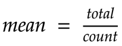

# Exercise 3: Rolling Temperature Average using Kafka Streams.

Calculating the average temperature per room.



This suggests we need to keep a local  count and then a total sum finally divide it.
*Clearly a stateful computation* Can we do this in one-pass?

- Let's introduce a helper structure Tuple (Long,Long)
- We can group across the stream per key


## Dependencies

[Exercise 2](../ee.ut.cs.dsg.dsg.ksql.exercise2/Readme.md).

## Learning Goals

- understand continuous computations

```bash
bin/kafka-topics --bootstrap-server kafka1:9092 --create \
                      --partitions 2 \
                      --replication-factor 1 \
                      --topic temperature
```


```
Topologies:
   Sub-topology: 0
    Source: KSTREAM-SOURCE-0000000000 (topics: [temperature])
      --> KSTREAM-MAPVALUES-0000000001
    Processor: KSTREAM-MAPVALUES-0000000001 (stores: [])
      --> KSTREAM-AGGREGATE-0000000003
      <-- KSTREAM-SOURCE-0000000000
    Processor: KSTREAM-AGGREGATE-0000000003 (stores: [KSTREAM-AGGREGATE-STATE-STORE-0000000002])
      --> KTABLE-MAPVALUES-0000000004
      <-- KSTREAM-MAPVALUES-0000000001
    Processor: KTABLE-MAPVALUES-0000000004 (stores: [])
      --> KTABLE-TOSTREAM-0000000005
      <-- KSTREAM-AGGREGATE-0000000003
    Processor: KTABLE-TOSTREAM-0000000005 (stores: [])
      --> KSTREAM-PRINTER-0000000006
      <-- KTABLE-MAPVALUES-0000000004
    Processor: KSTREAM-PRINTER-0000000006 (stores: [])
      --> none
      <-- KTABLE-TOSTREAM-0000000005
```