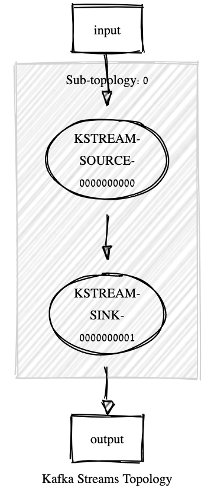

# Exercise 0: Piping one topic into another

In this ice breaker exercise we just
read from an input topic and write from an ouput topic.

## Before Starting
```bash
bin/kafka-topics --bootstrap-server localhost:9092 --create --topic input 

bin/kafka-topics --bootstrap-server localhost:9092 --create --topic output
```

```bash
bin/kafka-console-producer --broker-list localhost:9092 \
                                --property parse.key=true \
                                --property key.separator=, \
                                --topic input
                                
```

Writing 1,A 2,B 3,C

```bash
bin/kafka-console-consumer --bootstrap-server localhost:9092 \
    --from-beginning --property print.key=true \
    --topic output
                                
```

## Learning Goals

- break the ice with Kafka Streams
- Configurations
- Concept of topology

### Notes

- What is a Serde?
- Why does the program do not terminate?
- What about partitioning?


Remember that Kafka Streaming uses an underlying dataflow API? 
The following figure shows how the topology looks like



```
Topologies:
   Sub-topology: 0
    Source: KSTREAM-SOURCE-0000000000 (topics: [input])
      --> KSTREAM-SINK-0000000001
    Sink: KSTREAM-SINK-0000000001 (topic: output)
      <-- KSTREAM-SOURCE-0000000000
```