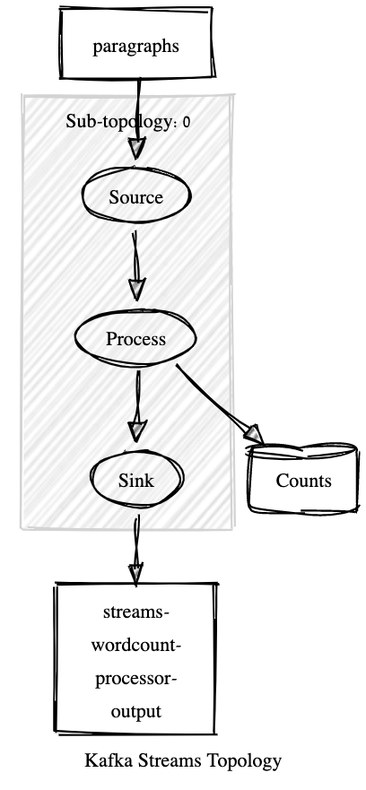

# Exercise 11: Wordcount

## Before Starting
```bash
bin/kafka-topics --bootstrap-server localhost:9092 --create --topic paragraphs 

bin/kafka-topics --bootstrap-server localhost:9092 --create --topic wordcount-processor-out

bin/kafka-topics --bootstrap-server localhost:9092 --create --topic wordcount-streams-out
```

## A uses the Processor API

If you did the homework you now recall we used an in-memory hashmap to keep the count
of the words.

In Kafka Stream there are helper structure that provide the same functionality called
State Storage.

We now see how to create a processor, i.e., a computational node that processes the paragraphs
and split them into words to write into the store.

Two main state-storage

- persistent:
  -  The recommended store type for most use cases.
  - Stores its data on local disk.
  - Storage capacity: managed local state can be larger than the memory (heap space) of an application instance, but must fit into the available local disk space.
  - RocksDB settings can be fine-tuned, see RocksDB configuration.
  - Available store variants: time window key-prefVal store, session window key-prefVal store.
  
- in-memory (used here):
  - Stores its data in memory.
  - Storage capacity: managed local state must fit into memory (heap space) of an application instance.
  - Useful when application instances run in an environment where local disk space is either not available or local disk space is wiped in-between app instance restarts.

[More on State Store](https://kafka.apache.org/10/documentation/streams/developer-guide/processor-api.html#state-stores)


The following figure shows the state store *Counts* where the application
persists the count.


```
Topologies:
   Sub-topology: 0
    Source: Source (topics: [paragraphs])
      --> Process
    Processor: Process (stores: [Counts])
      --> Sink
      <-- Source
    Sink: Sink (topic: streams-wordcount-processor-output)
      <-- Process

```
## B uses Kafka Streams API

We create a KStream out of the *paragraph* topic and, using a flatmap operation
we are going to split words into sentences.

In order to count this time we can perform an aggregation, groping by the 
new prefVal *word* and turn the KStream into a KTable.


Notice the different topology this time.

- There is an intermediate topic 
- there is an state storage with the same name.

Kafka Stream uses backups the KTable with a persistant
state storage based on a topic.


```
Kafka Streams Topology Visualizer
Converts an ASCII Kafka Topology description into a hand drawn diagram. Github link.
Input Kafka Topology update
Topologies:
   Sub-topology: 0
    Source: KSTREAM-SOURCE-0000000000 (topics: [paragraphs])
      --> KSTREAM-FLATMAPVALUES-0000000001
    Processor: KSTREAM-FLATMAPVALUES-0000000001 (stores: [])
      --> KSTREAM-KEY-SELECT-0000000002
      <-- KSTREAM-SOURCE-0000000000
    Processor: KSTREAM-KEY-SELECT-0000000002 (stores: [])
      --> KSTREAM-FILTER-0000000006
      <-- KSTREAM-FLATMAPVALUES-0000000001
    Processor: KSTREAM-FILTER-0000000006 (stores: [])
      --> KSTREAM-SINK-0000000005
      <-- KSTREAM-KEY-SELECT-0000000002
    Sink: KSTREAM-SINK-0000000005 (topic: KSTREAM-AGGREGATE-STATE-STORE-0000000003-repartition)
      <-- KSTREAM-FILTER-0000000006

  Sub-topology: 1
    Source: KSTREAM-SOURCE-0000000007 (topics: [KSTREAM-AGGREGATE-STATE-STORE-0000000003-repartition])
      --> KSTREAM-AGGREGATE-0000000004
    Processor: KSTREAM-AGGREGATE-0000000004 (stores: [KSTREAM-AGGREGATE-STATE-STORE-0000000003])
      --> KTABLE-TOSTREAM-0000000008
      <-- KSTREAM-SOURCE-0000000007
    Processor: KTABLE-TOSTREAM-0000000008 (stores: [])
      --> KSTREAM-PRINTER-0000000010, KSTREAM-SINK-0000000009
      <-- KSTREAM-AGGREGATE-0000000004
    Processor: KSTREAM-PRINTER-0000000010 (stores: [])
      --> none
      <-- KTABLE-TOSTREAM-0000000008
    Sink: KSTREAM-SINK-0000000009 (topic: wordcount-stream-out)
      <-- KTABLE-TOSTREAM-0000000008
Output Sketch Diagram
>
```