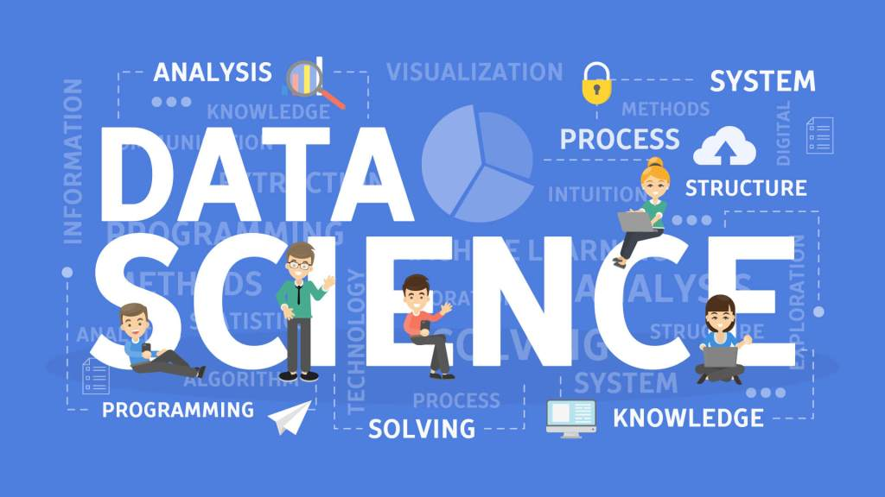
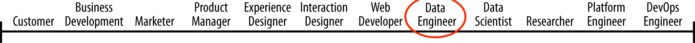
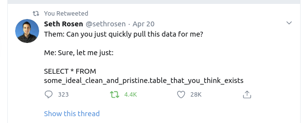
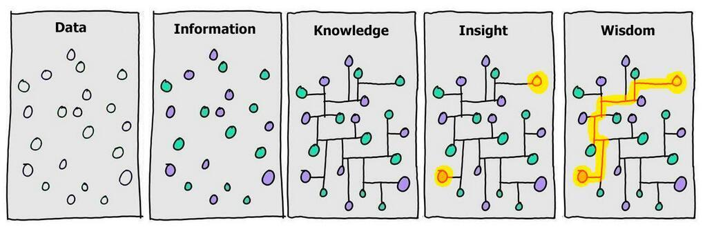
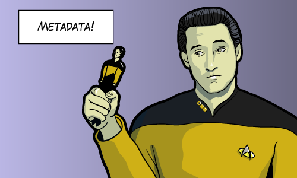
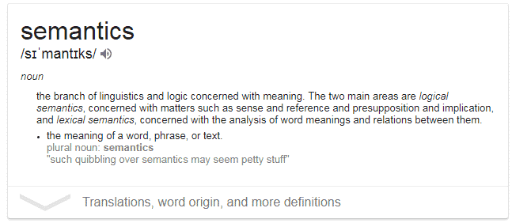
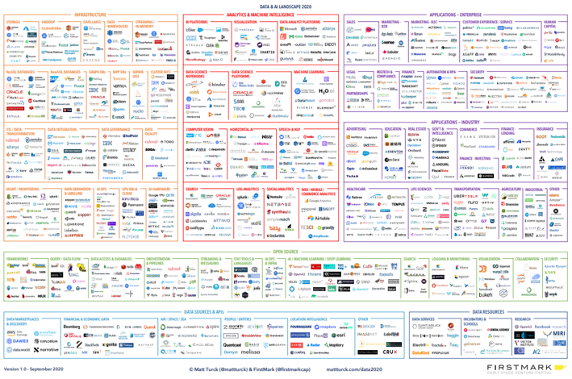
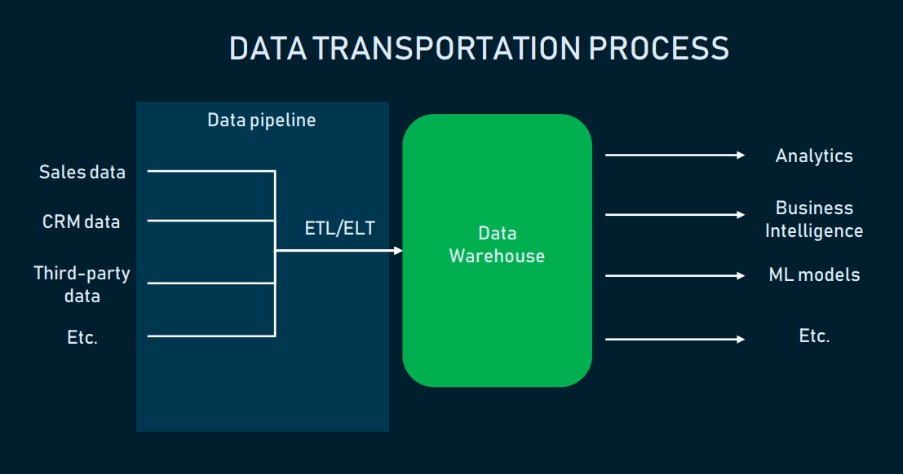

footer:  [Riccardo Tommasini](http://rictomm.me) - riccardo.tommasini@ut.ee - @rictomm 
slide-dividers: #, ##, ###
slidenumbers: true
autoscale: true
build-lists: true
theme: Plain Jane

# Data Engineering
## LTAT.02.007
#### Prof. Ahmed Awad 
#### Ass. Prof Riccardo Tommasini
##### TAs:   Kristo Raun, Fabiano Spiga, Mohamed Ragab

[.column]

[.column]
#### [dataeng](https://courses.cs.ut.ee/2020/dataeng)

####[Moodle](https://moodle.ut.ee/course/view.php?id=10457)

[.column]
 

---

---

### Course Intro

   

- Lectures
	- Mostly F2F in 1037 with recording
	- Some will be online (especially delivered by Riccardo). We will use the Zoom link announced on Moodle

- Practice
	- All online, using the same zoom link announced on Moodle. Will be recorded
- Grading

	- 60% on 4 MCQs
	- 40% on course project
	- Assignments are meant to help you work on your project and to get feedback
	- SQL Assessment
	- More details on course page

[https://courses.cs.ut.ee/2020/dataeng](https://courses.cs.ut.ee/2020/dataeng)

---

### Quote

> “A scientist can discover a new star,  but he cannot make one. 
He would have to ask an engineer to do it for him.”
– Gordon Lindsay Glegg

---

### Data Science is...[^01]

...refining crude oil

^ 
- Discovering what we don’t know from data 
- Obtaining predictive, actionable insight from data
- Creating Data Products that have business impact now 
- Communicating relevant business stories from data 
- Building confidence in decisions that drive business value 

[^01]:[Source](https://thedatascientist.com/data-science-considered-own-discipline/)

### Data Engineering is...

...build the refinery.

### Roles in a Data Science Project[^02] 

 
 

[^02]: http://emanueledellavalle.org/slides/dspm/ds4biz.html#25 

---
### Roles in a Data Science Project[^02] 

 
 

## Data Engineer

### The Data Engineer

 
 
A dedicated specialist that maintain data available and usable by others (Data Scientists).[^03]

Data engineers set up and operate the organization’s data infrastructure preparing it for further analysis by data analysts and scientists.[^03]

Data engineering field could be thought of as a superset of business intelligence and data warehousing that brings more elements from software engineering.[^04] 
 
[^03]:[What is Data Engineering](https://medium.com/datadriveninvestor/what-is-data-engineering-explaining-the-data-pipeline-data-warehouse-and-data-engineer-role-1a4b182e0d16)
 
[^04]: [Source: The Rise of Data Engineer](https://www.freecodecamp.org/news/the-rise-of-the-data-engineer-91be18f1e603/)

### Data Engineering

 

> Data engineering is a set of operations aimed at creating interfaces and mechanisms for the flow and access of information[^03].

---

<iframe border=0 frameborder=0 height=250 width=550
 src="https://twitframe.com/show?url=https://twitter.com/sethrosen/status/1252291581320757249?s=20"></iframe>
 

 
---

---

### Netflix's Perspective[^05]

[^05]: [Netflix Innovation](https://netflixtechblog.com/notebook-innovation-591ee3221233)
 

^ 
- a data engineer might create a new aggregate of a dataset containing trillions of streaming events 
-  analytics engineer might use that aggregate in a new report on global streaming quality 
-  a data scientist might build a new streaming compression model reading the report

^ each of these workflows has multiple overlapping tasks:

---
### Data Bricks

---
### Google's Two-Cents
 
 

[.background-color: #ffffff]

 ---
###  The Knowledge Scientist[^06]

[^06]: [The Manifesto](https://www.knowledgescientist.org/)

 ---

# Philosophy of (Data) Science[^07]
 

^ Nowdays we deal with a number of data from different domains.

[^07]: [Data as Fact](https://en.wikipedia.org/wiki/DIKW_pyramid#Data_as_fact)

--- 

# What is Data?	

---

---

### Oxford Dictionary

 

*Data \[__uncountable, plural__\] facts or information, especially when examined and used to find out things or to make decisions.* [^08]

[^08]:[Def](https://www.oxfordlearnersdictionaries.com/definition/english/data)

### Wikipedia
Data (treated as singular, plural, or as a mass noun) is any sequence of one or more symbols given meaning by specific act(s) of interpretation [^09]

[^09]: [Data in Computing](https://en.wikipedia.org/wiki/Data_(computing))

---
[.background-color: #ffffff] <!-- deckset -->

### DIKW Pyramid

--- 
### Graph View

---

### Data about data

---

### Data Semantics

---

## Big Data 

<!-- ### Refining Crude Oil

-->

### Challenges [^014]

<!-- Joke About Growing number of Vs -->

[^014]:[Lanely, 2001](x-bdsk://laney20013d)

---
###  Paradigm Shift

---
[.slide-transition: push(vertical, 0.3)]

---
[.slide-transition: push(vertical, 0.3)]

---
[.slide-transition: push(vertical, 0.3)]

---
[.slide-transition: push(vertical, 0.3)]

 
[.slide-transition: reveal(top)]

### New Roles
 
In the context of Big Data, a data engineer must focus on **distributed systems**, and **programming languages** such as Java and Scala.

 
 
### New Tasks

Since data lake are taking data from a wide range of systems, data can be in **structured** or **unstructured** formats, and usually **not clean**, e.g., with missing fields, mismatched data types, and other data-related issues.

Therefore  data engineers are challenged with the task of wrangling, cleansing, and integrating data.

### New Systems [^source1]

[^source1]: [https://www.saagie.com/blog/our-extended-big-data-ai-recap/](https://www.saagie.com/blog/our-extended-big-data-ai-recap/)

# Infrastructure

---
## Databases Management System

A database is **an organized collection of structured information, or data**, typically stored electronically in a computer system

Several kind of DBSMs exist. We will survey some of them. It is interesting to know that Edgar F. Codd defined 12+1 rules that make a DBMS relational [linke](https://reldb.org/c/index.php/twelve-rules/)

### Data Warehouse: A Traditional Approach: 

> A data warehouse is a copy of transaction data specifically structured for query and analysis. — [Ralph Kimball](https://en.wikipedia.org/wiki/Ralph_Kimball)

 
> A data warehouse is a subject-oriented, integrated, time-variant and non-volatile collection of data in support of management’s decision making process.-- [Bill Inmon](https://en.wikipedia.org/wiki/Bill_Inmon)

^ 
- A data warehouse is a central repository where raw data is transformed and stored in query-able forms.[^03]
- Data Warehouse are still relevant today and their maintenance is part of Data Engineers' resposibilities.
- The warehouse is created with structure and model first before the data is loaded and it is called schema-on-write.

###  Data Warehouse vs Data Bases

Surprisingly, Data Warehouse isn’t a regular database. 

[.column]

- A database normalizes data separating them into tables and avoiding redundancies 
- It supports arbitrary workload and complex queries 
- do not store multiple versions of data 
 
[.column]

- a Data Warehouse uses few tables to improve performance and analytic.
- a Data Warehouse allows simple queries 
- supports versioning for complex analysis

### Data Lake
A Data lake is a vast pool of raw data (i.e., data as they are natively, unprocessed). A data lake stands out for its high agility as it isn’t limited to a warehouse’s fixed configuration[^03].

---

[Full Inforgraphic](../attachments/emc_understanding_data_lakes_infographic.pdf)

^ 
- In Data Lake, the raw data is loaded as-is, when the data is used it is given structure, and it is called schema-on-read.
- Data Lake gives engineers the ability to easily change.
- In practice, Data Lake is a commercial term so don't sweat it.

---

### Data Lake vs Data Warehouse

  

[.column]

- **Structured Data**
- **Schema On Write**
- **Data Pipelines: Extract-Transform-Load**
- **Processing Model: Batch**

[.column]

- **Unstructured Data**
- **Schema on Read**
- **Data Pipelines: Extract-Load-Transform**
- **Processing Model: Streaming**

## Data Pipeline

 A Data pipeline is a sum of tools and processes for performing data integration[^03]
 
 Constructing data pipelines is the core responsibility of data engineering.

^  While data warehouse concerns the storage of data, data pipeline ensures the consumption and handling of it. 

### Data pipelines for moving data

- data wrangling 
- data integration
- data transformation

---

### Transporting data from sources into a warehouse[^010]

[^010]:[Source](https://www.altexsoft.com/blog/datascience/what-is-data-engineering-explaining-data-pipeline-data-warehouse-and-data-engineer-role/)

### Two Paradigms (and a half): SQL- v.s. JVM-Centric Pipelines[^011]

- **SQL-centric Pipelines** uses SQL dialects from Presto or Hive.  Pipelines (ETLs) are defined in a declarative way, and almost everything centers around SQL and tables. 

^ 
- PROs: SQL is easier to learn and can rely on good optimizers
- CONSs: 
	- Writing UDFs is troublesome because one has to write it in a different language (e.g. Java or Python)	
	- testing can be a lot more challenging due to this. 

- **JVM-centric Pipelines** uses languages like Java or Scala and often involves thinking data transformation in an imperative manner, e.g. in terms of key-value pairs. 

^ PROs: 
	- Writing User Defined Functions (UDFs) is less painful;
	- and testing jobs is relatively easy;
   CONs: Requires strong programming skills

* Drag & Drop...

[^011]: we are focusing on ETL

### Skill Set: SQL mastery[^03]

If english is the language of business, SQL is the language of data.  

- SQL/DML/DDL primitives are simple enough that it should hold no secrets to a data engineer. Beyond the declarative nature of SQL, she/he should be able to read and
- understand database execution plans, and have an understanding of what
all the steps are, 
- understand how indices work, 
- understand the different join algorithms 

### Skill Set: Data modeling[^03]

For a data engineer, entity-relationship modeling should be a cognitive reflex, along with a clear understanding of normalization, and have a sharp intuition around denormalization tradeoffs. 

The data engineer should be familiar with dimensional modeling and the related concepts and lexical field.

--- 

---

### Engineers Shouldn’t (only) Write (SQL-based) ETL[^012]

- Unless you need to process over many petabytes of data, or you’re ingesting hundreds of billions of events a day, most technologies have evolved to a point where they can trivially scale to your needs.

- Unless you need to push the boundaries of what these technologies are capable of, you probably don’t need a highly specialized team of dedicated engineers to build solutions on top of them. 

[^012]: [JeffMagnusson, 2016](https://multithreaded.stitchfix.com/blog/2016/03/16/engineers-shouldnt-write-etl/)

### If Not (only) ETL, Then…What?[^013]

Data Engineers are still a critical part of any high-functioning data team.
- managing and optimizing core data infrastructure,
- building and maintaining custom ingestion pipelines,
- supporting data team resources with design and performance optimization, and
- building non-SQL transformation pipelines.

^ Instead of building ingestion pipelines that are available off-the-shelf and implementing SQL-based data transformations, here’s what your data engineers should be focused on:

[^013]:[TristanHandy, 2019](https://www.kdnuggets.com/2019/01/role-data-engineer-changing.html)

	
	