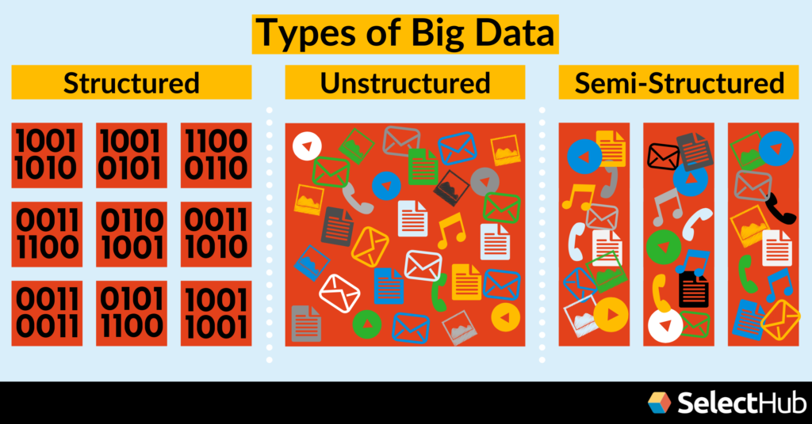
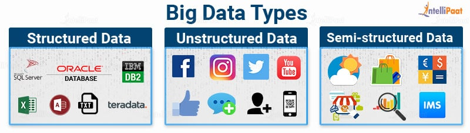
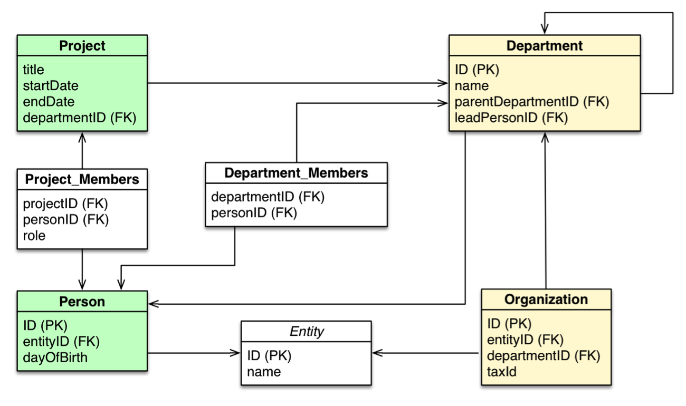
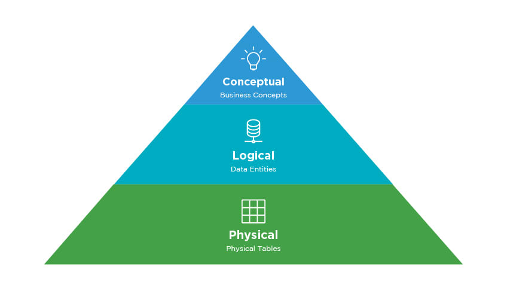

footer:  [Riccardo Tommasini](http://rictomm.me) - riccardo.tommasini@ut.ee - @rictomm 
slide-dividers: #, ##, ###
slidenumbers: true
autoscale: true
build-lists: true
theme: Plain Jane

# Data Engineering
**LTAT.02.007**
**Prof. Ahmed Awad**
**Ass. Prof Riccardo Tommasini**
**TAs:   Kristo Raun, Fabiano Spiga, Mohamed Ragab**

[.column]


[.column]
#### [dataeng](https://courses.cs.ut.ee/2020/dataeng)

#### [Moodle](https://moodle.ut.ee/course/view.php?id=10457)

[.column]
 

---

# Data Ingestion


---

## Definition
<br>
<br>
Data ingestion is the process of filling data to the warehouse/lake.

---
## Data Ingestion Examples 

- Maintaining a [Distributed File System](systems/HDFS.md)
- Using a [Distributed Message Queue](systems/Apache%20Kafka.md)
- Using a [Publishing Subscribe System](Publishing%20Subscribe%20System)

---

## Pills

- Receiving data
- Routing data
- Storing data

---

## Receiving Data

- number of sources
- latency and throughput
- access right for the warehouse


---

## Routing data

- with and without transformation
- number of data marts
- schema on read/write


---
## Storing data

- data format selection (schema on write?)
- compaction and space requirements
- sharing, replication, and partitioning


---

## Two Schools

[.column]

- Batch
- Pull
- Query-Based

[.column]

- Streaming
- Push
- Dataflow based

---

## What Data?



---



---

## A Note on [Data Integration](Data%20Integration.md)

- often requires a definition of an integration schema
- very hard in presence of too many data sources
- in practice, relies extensively on ETLs.

---

# Data Modeling

It is the process of defining the structure of the data for the purpose of communicating[^11] or to develop an information systems[^12].

[^11]: between functional and technical people to show data needed for business processes

[^12]: between components of the information system, how data is stored and accessed.

##  What is a data model? 

A data model represents the structure and the integrity of the data elements of a (single) applications [2](x-bdsk://DBLP:journals/sigmod/SpynsMJ02) 

Data models provide a framework for data to be used within information systems by giving specific definitions and formats.

The literature of data management is rich of data models that aim at providing increased expressiveness to the modeler and capturing a richer set of semantics.

--- 

<br>

> Data models are perhaps the most important part of developing software. They have such a profound effect not only on how the software is written, but also on how we think about the problem that we are solving[^13].
> --Martin Kleppmann

[^13]:[Designing Data-Intensive Applications](https://dataintensive.net/)

### Any Example?



---


### Level of Data Modeling

**Conceptual**: The data model defines *WHAT* the system contains.

^ Conceptual model is typically created by Business stakeholders. The purpose is to organize, scope and define business concepts and rules. Definitions are most important this level.

**Logical**: Defines *HOW* the system should be implemented regardless of the DBMS. 

^ Logical model is typically created by Data Architects. The purpose is to developed technical map of rules and data structures. Business rules, relationships, attribute become visible. Conceptual definitions become metadata.

**Physical**: This Data Model describes *HOW* the information system will be implemented using a specific technology [^14].

^ Physical model is typically created by DBA and developers. The purpose is actual implementation of the database. Trade-offs are explored by in terms of data structures and algorithms.


[^14]: [physical](https://www.databass.dev/)

### A Closer Look[^15]


[^15]: [slides](https://www.slideshare.net/Dataversity/data-modeling-for-big-data) & [video](https://www.dataversity.net/ldm-webinar-data-modeling-big-data/) by Donna Burbank

^ The variety of data available today encourages the design and development of dedicated data models and query languages that can improve both BI as well as the engineering process itself.

---


---

### Conceptual

- Semantic Model (divergent)
	- Describes an enterprise in terms of the language it uses (the jargon).
	- It also tracks inconsistencies, i.e., semantic conflicts 

- Architectural Model (convergent)
	- More fundamental, abstract categories across enterprise 


### Logical 

Already bound to a technology, it typically refers already to implementation details

- Relational
- Hierarchical
- Key-Value
- Object-Oriented
- Graph

^ Since it has a physical bias, you might be tempted to confuse this with the physical model, but this is wrong. 

### Physical

The physical level describes how data are **Stored** on a device.

- Data formats
- Distribution
- Indexes
- Data Partitions
- Data Replications

<br>

...and you are in the Big Data World

### A Question


> Why should you, ~~an application developer~~ a data engineer, care how the database handles storage and retrieval internally?
--Martin Kleppmann

I mean, you’re probably not going to implement your own storage engine from scratch...

---
### The Students


---
### But...
- You do need to select a storage engine that is appropriate for your application, from the many that are available
- You need to tune a storage engine to perform well on your kind of workload
- You are going to experiment with different access patterns and data formats

Therefore, you must have a rough idea of what the storage engine is doing under the hood 

---
### Also the Students


# Data Formats

- In memory, data are kept in objects, structs, lists, arrays, hash tables, trees, and so on. These data structures are optimized for efficient access and manipulation by the CPU (typically using pointers).
- On Disk (or over the network), data are encoded into a self-contained sequence of bytes (for example, a JSON document). 

### Encoding and decoding

Encoding is the  translation from the in-memory representation to a byte sequence (also known as serialization or marshalling)

Decoding is the reverse translation from the byte sequence to a memory layout (also known as parsing, deserialization, unmarshalling)

The encoding is often tied to a particular programming language, and reading the data in another language is very difficult

### Memory vs Disk

Data layout is much less important in memory than on disk. 

An efficient disk-resident data structure must allow quick access to it, i.e., find a way to serialize and deserialize data rapidly and in a compacted way.

In general, pointers do not make sense outside memory, thus the sequence-of-bytes representation looks quite different from the data structures that are normally used in memory.

### Popular (textual) File Formats

JSON 
- has a schema
-	cannot distinguish between  integers and floating-point numbers
- have good support for Unicode character string
- do not support sequences of bytes without a character encoding
XML
- has a schema
-  cannot distinguish between a number and a string 
- have good support for Unicode character string
- do not support sequences of bytes without a character encoding
CSV
-  cannot distinguish between a number and a string 
-  does not have any schema

### Avro

Avro is a binary encoding format that uses a schema to specify the structure of the data being encoded.

Avro's encoding consists only of values concatenated together, and the
there is nothing to identify fields or their datatypes in the byte sequence.

---
#### Avro Schema Definition
<br>
<br>

```python
record Person {     
 string userName;
 union { null, long } favoriteNumber = null;     
 array<string>        interests; 
}
```

---
#### Example


[Source](https://www.oreilly.com/library/view/designing-data-intensive-applications/9781491903063/ch04.html)

---
#### Encoding and Decoding

- Encoding requires the writer's schema
- Decoding requires the reader’s schema.
- Avro does not require that the writer’s schema and the reader’s schema are the same, they only need to be **compatible**

---
#### Schema Evolution Rules 

- If the code reading the data encounters a field that appears in the writer’s schema but not in the reader’s schema, it is ignored. 
- If the code reading the data expects some field, but the writer’s schema does not contain a field of that name, it is filled in with a default value declared in the reader’s schema.

---
#### Compatibility
- forward compatibility: there is a new version of the writer's schema and an old version of the reader's schema
- backwards compatibility: there is a new version of the reader's schema and an old version of the writer's schema

### Worth Mentioning[^13]

- Apache Thrift and Protocol Buffers are binary encoding libraries	
	-  require a schema for any data that is encoded.
	-  come with a code generation tool that takes a schema definitions to reproduce the  schema in various programming languages

[.column]
```c
struct Person {   
		1: required string userName,   
		2: optional i64    favoriteNumber,
		3: optional list<string> interests 
}
```

[.column]
```c
message Person {
	required string user_name       = 1;     
	optional int64  favorite_number = 2;     
	repeated string interests       = 3; 
}
```

## Indexing

- Indices are critical for efficient processing of queries in (any kind of) databases.
- basic idea is trading some computational cost for space, i.e., materialize a convenient data structure to answer a set of queries.
- The caveat is that we must maintain indexes up-to-date upon changes

^ 
- Without indices, query cost will blow up quickly making the database unusable
- databases don’t usually index everything by default

### Basics Terms
	
- Ordered indices. Based on a sorted ordering of the values.
- Hash indices. Using an hash-function that assigns values across a range of buckets.
- Primary Index: denotes an index on a primary key
- Secondary Index: denotes an index on non primary values


## Data Replication

> Replication means keeping a copy of the same data on multiple machines that are connected via a network


### Reasons for Replication

- Increase data locality
- Fault tolerance
- Concurrent processing (read queries)

^ 
- To keep data geographically close to your users (and thus reduce access latency)
- To allow the system to continue working even if some of its parts have failed (and thus increase availability) 
- To scale out the number of machines that can serve read queries (and thus increase read throughput)

### Approaches

- Synchronous vs Asynchronous Replication
	- The advantage of synchronous replication is that the follower is guaranteed to have an up-to-date copy 
	- The advantage of asynchronous replication is that follower's availability is not a requirement (cf CAP Theorem)

- Leader - Follower (Most common cf Kafka)


### Leaders and Followers

- One of the replicas is designated as the leader
- Write requests go to the leader
- leader sends data to followers for replication
- Read request may be directed to leaders or followers


---


Source is [^13]

### Caveats

<br>
<br>
Only one: handling changes to replicated data is extremely hard.

## Data Partitioning (Sharding)

 > breaking a large database down into smaller ones

^ For very large datasets, or very high query throughput, that is not sufficient

### Reasons for Partitioning

- The main reason for wanting to partition data is scalability[^13]

^ 
- Different partitions can be placed on different nodes in a shared-nothing cluster
- Queries that operate on a single partition can be independently executed. Thus, throughput can be scaled by adding more nodes.


### What to know 

- If some partitions have more data or queries than others the partitioning is **skewed**
- A partition with disproportionately high load is called a **hot spot**
- For reaching maximum scalability (linear) partitions should be balanced

Let's consider some partitioning strategies, for simplicity we consider Key,Value data.

### Partitioning Strategies

- **Round-robin** randomly assigns new keys to the partitions. 
	- Ensures an even distribution of tuples across nodes; 
- **Range partitioning** assigns a contiguous key range to each node. 
	- Not necessarily balanced, because data may not be evenly distributed
- **Hash partitioning** uses a hash function to determine the target partition. 	- If the hash function returns i, then the tuple is placed

# Data Ingestion Systems

---

## Hadoop Distributed File System (HDFS)[^12]

-   Abstracts physical location (Which node in the cluster) from the application
-   Partition at ingestion time
-   Replicate for high-availability and fault tolerance


[^12]: Inspired by [Google File System](https://static.googleusercontent.com/media/research.google.com/en/archive/gfs-sosp2003.pdf)


### Motivation
   -   Partition and distribute a single file across different machines
   -   Favor larger partition sizes
   -   Data replication
   -   Local processing (as much as possible)

### Motivation
   -   Reading sequentially versus (random access and writing)
   -   No updates on files
   -   No local caching

### HDFS Conceptual View[^13]


[^13]: Figure 2-1 in book Professional Hadoop Solutions

### HDFS Logical View: Data Node
- It  stores the received blocks in a local file system;
- It forwards that portion of data to the next DataNode in the list.
-   The operation is repeated by the next receiving DataNode until the last node in the replica set receives data.

### HDFS Logical View: Name Node

-   A single node that keeps the metadata of HDFS
    -   Keeps the metedata in memory for fast access
    -   Periodically flushes to the disk (FsImage file) for durability
    -   Name node maintains a daemon process to handle the requests and to receive heartbeats from other data nodes

^
    -  In some high-availability setting, there is a secondary name node
	- As a name node can be accessed concurrently, a logging mechanism similar to databases is used to track the updates on the catalog.

### HDFS Physical View: Files
-   A single large file is partitioned into several blocks
    -   Size of either 64 MB or 128MB
    -   Compare that to block sizes on ordinary file systems
    -   This is why sequential access is much better as the disk will make less numbers of seeks

^ Question: What would be the costs/benefits if we use smaller block sizes?

### Writing to HDSF

-   When a client is writing data to an HDFS file, this data is first written to a local file.
-   When the local file accumulates a full block of data, the client consults the NameNode to get a list of DataNodes that are assigned to host replicas of that block.
-   The client then writes the data block from its local storage to the first DataNode in 4K portions.

### Writing a File to HDSF Cont.

-   This DataNode stores data locally without sending it any further
-   If one of the DataNodes fails while the block is being written, it is removed from the pipeline
-   The NameNode re-replicates it to make up for the missing replica caused by the failed DataNode
-   When a file is closed, the remaining data in the temporary local file is pipelined to the DataNodes
-   If the NameNode dies before the file is closed, the file is lost.

### Replica Placement

-   Replica placement is crucial for reliability of HDFS
    -   Should not place the replicas on the same rack
-   All decisions about placement of partitions/replicas are made by the NameNode
-   NameNode tracks the availability of Data Nodes by means of Heartbeats
    -   Every 3 seconds, NameNode should receive a heartbeat and a block report from each data node
    -   Block report allows verifying the list of stored blocks on the data node
    -   Data node with a missing heartbeat is declared dead, based on the catalog, replicas missing on this node are made up for through NameNode sending replicas to other available data nodes


### HDFS High-availability

-   Each NameNode is backed-up with a slave other NameNode that keeps a copy of the catalog

-   The slave node provides a failover replacement of the primary NameNode

-   Both nodes must have access to a shared storage area

-   Data nodes have to send heartbeats and block reports to both the master and slave NameNodes.


## Apache Kafka[^1]

 

An overview

### Motivation

Data pipelines start with a small number of systems to integrates. A single ETL (extract, transform, load) process move data from the source to the interested applications. 


### Motivation

But data pipeline grow over time. Adding new system causes the need of new ETL process. The code-base grows together with data formats and services. 


### Motivation

Things end up messy when sources and sinks are coupled! 


### An alternative: Publish/Subscribe

PubSubs decouple data sources and their consumers making communication asynchronous and processing scalable.


### An alternative: Publish/Subscribe

PubSubs organize messages logically so that it is easier for the interested consumers to access. 


### Apache Kafka

Apache Kafka is an horizontally scalable, fault-tolerant, publish-subscribe system. It can process over 1 trillion messages without neglecting durability, i.e., it persists data on disk.


### Kafka Conceptual View

-   **Messages**, the basic unit in Kafka, are organized in **Topics**

-   **Producers** write messages topics

-   **Consumers** read messages by from topics


### Kafka Conceptual View: Example


---


### Kafka Logical View

-   **Messages** are key-value pairs

-   **Brokers** are the main component inside the Kafka Cluster.

-   **Producers** write messages to a certain broker

-   **Consumers** read messages by from a certain broker


### Kafka Physical View

-   **Topics** are partitioned across brokers using the message **Key**.

-   Typically, **Producers** has the message key to determine the partition. Also they serialize the message

-   **Consumers** read messages by from brokers and de-serialize them


### Kafka Physical View: Zoom In


---


### Topics Partitions

Producers shard data over a set of Partitions

-   Each Partition contains a subset of the Topic's messages

-   Typically, the message key is used to determine which Partition a message is assigned to

-   Each Partition is an ordered, immutable log of messages

### Topics Partitions and Distributed Consumption

-   Different Consumers can read data from the same Topic

    -   By default, each Consumer will receive all the messages in the Topic

-   Multiple Consumers can be combined into a Consumer Group

    -   Consumer Groups provide scaling capabilities

    -   Each Consumer is assigned a subset of Partitions for consumption


### Apache Kafka[^1]

 

Internals

### Messages and Metadata

Messages are Key-Value pairs and there is not restriction on what each of them can be.

Additionally, messages are enriched with metadata:

-   Offset

-   Timestamp

-   Compression type

-   Magic byte

-   Optional message headers API

-   Application teams can add custom key-value paired metadata to messages

-   Additional fields to support batching, exactly once semantics, replication protocol


### Topics Partitions: Physical View

Each Partition is stored on the Broker's disk as one or more log files Each message in the log is identified by its offset number


### Topics Partitions: Physical View

Messages are always appended. Consumers can consume from different offset. Brokers are single thread to guarantee consistency 


### Topics Partitions: Load Balancing

Producers use a partition strategy to assign each message a partition

-   To ensure load balancing across the Brokers

-   To allow user-specified key

You can customize the partition strategy, but!

-   it must ensure load balancing across the Brokers too, i.e., hash(key) % number\_of\_partitions

-   if key is not specified, messages are sent to Partitions on a round-robin basis

### Important: About Ordering

If there are multiple Partitions, you will not get total ordering across all messages when reading data 


### Log Retention

-   Duration default: messages will be retained for seven days

-   Duration is configurable per Broker by setting

    -   a time period

    -   a size limit

-   Topic can override a Broker's retention policy

-   When cleaning up a log

    -   the default policy is delete

    -   An alternate policy is compact

### Log Compaction

A compacted log retains at least the last known message value for each key within the Partition Before After 


### Fault Tolerance via a Replicated Log

-   Kafka maintains replicas of each partition on other Brokers in the cluster

    -   Number of replicas is configurable

-   One Broker is the leader for that Partition

    -   All writes and reads go to and from the leader

    -   Other Brokers are followers

-   Replication provides fault tolerance in case a Broker goes down


### Important: Clients do not Access Followers

It is important to understand that Producers and Consumers only write/read to/from the leader

-   Replicas only exist to provide reliability in case of\
    Broker failure

-   If a leader fails,\
    the Kafka cluster will\
    elect a new leader\
    from among the followers


In the diagram, m1 hashes to Partition 0 and m2 hashes to Partition 1

### Delivery Semantics

-   At least once

    -   Messages are never lost but may be redelivered

-   At most once

    -   Messages are lost but never redelivered

-   Exactly once

    -   Messages are delivered once and only once

### Zookeeper

-   ZooKeeper is a centralized service that stores configurations for distributed applications

-   Kafka Brokers use ZooKeeper for a number of important internal features

    -   Cluster management

    -   Failure detection and recovery

    -   Access Control List (ACL) storage

### Quiz

Provide the correct relationship - 1:1, 1:N, N:1, or N:N -

-   Broker to Partition - ?

-   Key to Partition - ?

-   Producer to Topic - ?

-   Consumer Group to Topic - ?

-   Consumer (in a Consumer Group) to Partition - ?

### Quiz

Provide the correct relationship - 1:1, 1:N, N:1, or N:N -

-   Broker to Partition - N:N

-   Key to Partition - N:1

-   Producer to Topic - N:N

-   Consumer Group to Topic - N:N

-   Consumer (in a Consumer Group) to Partition - 1:N