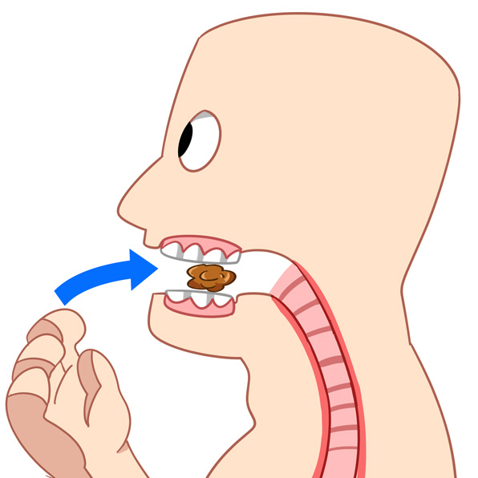
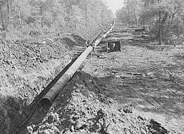
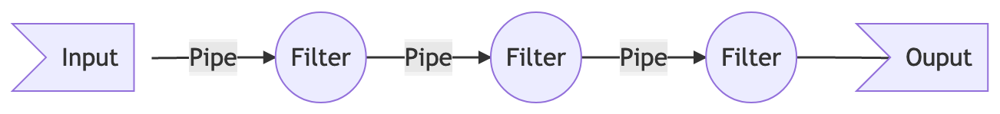

footer:  [Riccardo Tommasini](http://rictomm.me) - riccardo.tommasini@ut.ee - @rictomm 
slide-dividers: #, ##, ###
slidenumbers: true
autoscale: true
build-lists: true
theme: Plain Jane

# Data Engineering
## LTAT.02.007
#### Prof. Ahmed Awad 
#### Ass. Prof Riccardo Tommasini
##### TAs:   Kristo Raun, Fabiano Spiga, Mohamed Ragab

[.column]

[.column]
#### [dataeng](https://courses.cs.ut.ee/2020/dataeng)

####[Moodle](https://moodle.ut.ee/course/view.php?id=10457)

[.column]
 

---

# Data Lifecycle[^dl1]

---

[^dl1]: Curtesy of Herminio Velazquez

---

### A 30000ft view

- Data Collection 
- Data Wrangling
	-  Data Shaping
	-  Data Cleansing
	-  Data Augmenting
- Data Analysis

![[./flying-blind.jpg]]

---

## [Data Collection](Data%20Collection.md)

- We call Data Collection (aka Acquisition) the process of finding and accessing new data sources
- Happens **outside** the data warehouse/lake and may involve different organizations
- Not to be confused with [[synonimns/Data Ingestion]], which is the process of filling our Data Warehouse/Lake with new data

---

### Data Collection Examples 

- Reading Files
- [Data Crawling](Data%20Crawling.md)
- [Accessing Databases](Accessing%20Databases)
- [Calling Web API](Web%20API.md)
- [Consuming WebSockets](Consuming%20WebSockets)

---

###  Not to be confused with [Data Ingestion](Data%20Ingestion.md)

- Maintaining a [Distributed File System](Distributed%20File%20System)
- Using a [Distributed Message Queue](Distributed%20Message%20Queue)
- Using a [Publishing Subscribe System](Publishing%20Subscribe%20System)

---
### Data Source Selection Criteria

[.column]

- Credibility
- Completeness
- Accurateness
- Verifiability
- Currency
- Accessibility

[.column]

- Compliance
- Cost
- Legal issues
- Security
- Storage
- Provenance

---
## Data Wrangling

The process of transforming “raw” data into data that can be analyzed to generate valid actionable insights

Data scientists spend more time preparing data than analyzing them.

---

### Isn’t data science sexy?

---

### Data Wrangling: an Iterative process

- Understand
- Explore
- Transform
- Augment
- Visualize

---

## Data Processing

[.column]

#### Pre 

- [Data Cleansing](Data%20Cleansing.md)
- [Data Integration](Data%20Integration.md)
- [Data Reduction](Data%20Reduction.md)

[.column]

#### Post

- [Data Tranformation](Data%20Tranformation)
- [Data Enrichment](Data%20Enrichment.md)
- [Data Summarization](Data%20Summarization.md)

---

### Data Cleansing

**Data cleansing** or ** data scrubbing**  is the act of **detecting and correcting (or removing corrupt or inaccurate records)**  from a dataset.

The term refers to identifying incomplete, incorrect, inaccurate, partial or irrelevant parts of the data and then replacing, modifying, filling in or deleting this dirty data.	

---

#### Why is Data “Dirty” ?

[.column]

- Dummy Values
- Absence of Data
- Multipurpose Fields
- Cryptic Data
- Contradicting Data

[.column]

- Shared Field Usage
- Inappropriate Use of Fields
- Violation of Business Rules
- Non-Unique Identifiers
- Data Integration Problems

---

### [Data Integration](Data%20Integration.md)

Data integration systems aims at providing a uniform access to a set of heterogeneous data sources. 

Data integration systems aims at bridging the heterogeneity between the sources and produce a uniform query interface.

---

#### Why data needs to be integrated?

Data sources can differ on the data model (relational, hierarchical, semi-structured), on the schema level, or on the query-processing capabilities.

In a data integration architecture, these sources are queried by using a global schema, also called mediated schema, which provides a virtual view of the underlying sources.

---

#### Data integration strategies 

Mappings are functions that link each source schema to the ICM.

They are also expressed using formal languages, and implemented into software (wrappers), which contains the data access logic.

Two main strategies:
	- Global As View (GAV): The ICM is expressed in terms for the data source schemas
	- Local As View (LAV): The ICM is expressed independently for the data source schemas

---

### Data Reduction

Obtain a reduced representation of the data set that is much smaller in volume but yet produces the same (or almost the same) analytical results

---

#### Why data reduction?

A database/data warehouse may store terabytes of data. Complex data analysis may take a very long time to run on the complete data set.

---

#### Data reduction strategies 
- Dimensionality reduction, e.g., remove unimportant attributes 
	- Wavelet transforms 
	- Principal Components Analysis (PCA) 
	-  Feature subset selection, feature creation 
-  Numerosity reduction (some simply call it: Data Reduction) 
	-   Regression 
	-   Histograms, clustering, sampling 
	-   Data cube aggregation

### [[Data Enrichment]]/[[Data Agumentation]]

**Data enrichment** refers to the process of appending or otherwise enhancing collected data with relevant context obtained from additional sources.

**Data agumentation**  in data analysis are techniques used to increase the amount of data by adding slightly modified copies of already existing data or newly created synthetic data from existing data.

---

#### Why we need Data Enrichment/Augumentation

Data analytics tasks are often data or knowledge intensive.

Data intensive analytical tasks require to increase the amount of available data, e.g., for boosting the model training

Knowledge intensive tasks require contextual domain knowledge to increase the accuracy of the result.

### Data Transformation

**Data Transformation** refers to the process changing the shape of the data, typically for migrating data from one data system to another

 **Data transformation** is the process of converting data from one format or structure into another format or structure. It is a fundamental aspect of most [data integration](https://en.wikipedia.org/wiki/Data_integration "Data integration")[[1]](https://en.wikipedia.org/wiki/Data_transformation#cite_note-cio.com-1) and [data management](https://en.wikipedia.org/wiki/Data_management "Data management") tasks such as [data wrangling](https://en.wikipedia.org/wiki/Data_wrangling "Data wrangling"), [data warehousing](https://en.wikipedia.org/wiki/Data_warehousing "Data warehousing"), [data integration](https://en.wikipedia.org/wiki/Data_integration "Data integration") and application integration.
 
---

#### Why we need Data Transformation

Different analytical tasks (e.g., queries) result either simpler to write or more efficient to run once executed within highly specialized systems.

Data transformation is often used to reshape data into forms that are more convenient.

### Strategies for Data Transformation

- Batch

- Streaming 

### Data Summarization/Visualization

**Data Summarization** refers to the process of aggregating data to reach an higher level of abstraction. DS is tightly coupled with **Data Visualization**, i.e., the process of representing data in a form that is more easy to understand for the data scientist. 

## Data Analysis

- Statistical
- Machine Learning
- Query Based

---

## Data Pipelines

A **data pipeline** is a set of data processing elements connected in series, where the output of one element is the input of the next one. 

**Data pipelines** are used to shape, organizes, and moves data to a destination for storage, insights, and analysis.

Modern data pipeline generalize the notion of ETL (extract, transform, load) to include data ingestion, integration, and movement across any cloud architecture and add additional layers of resiliency against failure.

### Data pipelines Then

The concept of a pipeline began from the good old Unix "Pipe" symbol (|). 

The output of one "process" (on left side of the pipe) to be given as "input" to another process (which was on the right side of the pipe).

### Elements of a Data Pipeline  

**Pipes** are connectors  which send data from one component (filter) to another.

**Filters** do actual data "processing" (transformation/cleansing/scrubbing/munging... whatever)

**Input** or **Source** is the actual data source (database output/text file/SQL resultset/raw text)

**Output** or **Sink** is the final output at the end of this chain.

The elements of a pipeline are often executed in parallel or in time-sliced fashion; in that case, some amount of buffer **storage** is often inserted between elements.

---
### Basic Operations of Data Pipelines 

 

- access information of different data sources
- extract discrete data elements of the source data
- copy extracted data from a data source to another
- transform data 
	- correct errors in data elements extracted from source data
	- standardize data in data elements based on field type
- join or merge (in a rule-driven way) with other data sources

---
 
### Big Data Pipeline[^1]

The big data world brings additional challenges, i.e., volume, variety and velocity, which forced a paradigm shift in data architectures.

[^1]: henceforth referred as data pipelines only

## Big Data Pipeline - Batch

[[MapReduce]]

[[FlumeJava]]

[[Apache Airflow]]

## Big Data Pipeline - Streaming

Typically represented as Direct Acyclic Graphs (DAG)

Data pipelines open up the possibility of creating "workflows" which can help reuse, modularize and componentize data flows. 

## Data pipeline components

- **Storage and Ingestion Layers**, e.g., HDFS
	- Storage layers nowadays typically support [[polyglot persistence]].
	- Message Buses that help move chunks of data (sometimes at blazing speeds) from one system to another, e.g., Kafka, RabbitMQ, Kinesis
	- Serialization Frameworks, e.g., Protocol Buffers, Avro,
- **(Event Stream) Processing frameworks**, e.g., Kafka Streams, Flink
	- JVM Based
	- SQL Based
- **Workflow Management Tools** that supervise the processes which run inside your data pipelines, e.g., Airflow, Luigi, Dagster
  	-  "orchestrating" systems
  	-  "choreographing" systems
- **Query layer**, e.g., NoSQL Datamarts
- **Analytics layer** (out of scope)

--- 

## Project

The 2021 Data Engineering course features a project.

Goal of the Project: Design and implement a data pipeline using Apache Airflow 

2021 Project Theme: **Internet Memes**

### Project Structure and Assignments

Project will focus on the Processing Phase, i.e., ingestion, cleansing, and then query-based analyses 

During the course, you'll be assigned simple tasks in Airflow, which will be the base for your project!

You can complete the project points step by step and ASK FOR FEEDBACKS early!

---
### Project Structure Details

Every project must feature:

1. An initial pipeline where data are loaded from file (provided) and cleaned
2. A second pipeline where data are loaded into an ingestion system and then cleaned and processed
3. A third pipeline where a relational view is built on the data to perform some analysis
4. A fourth pipeline where data are enriched (use your creativity) 
5. A fifth pipeline where a graph view is built on the data to facilitate some analysis

Natural language analyses will be provided to be implemented at point 3 and 5, a base example using the images (which are not stored) will be included in 4. 

### Project Requirements and Grades

**Project Grading (using standard univ points)**

- 1-3: Up to D 
- 4: Up to C 
- 5: Up to B

**How to get to A?**
- Re-implementing the pipeline as a streaming pipeline
- Presenting original work: new analysis, innovative solution

**Extra Points (Until December 2021)**
- Fix and improve course material (via github)
- Helping colleagues by supporting the classes
- Being active in class

### Project Submission

- Moodle (code and reports)
- Reports can be done on Github as project documentation
- Final Presentation

