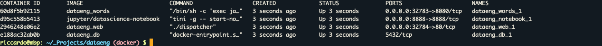

footer:  [Riccardo Tommasini](http://rictomm.me) - riccardo.tommasini@ut.ee - @rictomm 
slide-dividers: #, ##, ###
slidenumbers: true
autoscale: true
build-lists: true
theme: Plain Jane

# Data Engineering
## LTAT.02.007
#### Prof. Ahmed Awad 
#### Ass. Prof Riccardo Tommasini
##### TAs:   Kristo Raun, Fabiano Spiga, Mohamed Ragab

[.column]


[.column]
#### [dataeng](https://courses.cs.ut.ee/2020/dataeng)

####[Moodle](https://moodle.ut.ee/course/view.php?id=10457)

[.column]
 

---

# Docker 101

---

## A shipping container system for applications


---

## Eliminate the matrix from hell


---


## Our training environment

- If you are attending #DataEng
  - docker is an easy way to deploy various technologies without
  affecting your local environment
  - you don't have to worry about networking
  - you need to take care of persistence though
- For testing purposes  use [Play with Docker](https://www.play-with-docker.com/) to instantly get a training environment


---

# Our first containers


---

## Objectives

At the end of this lesson, you will have:

* Seen Docker in action.

* Started your first containers.

* Understood what is an image.

* What is a layer.

* The various image namespaces.

* How to search and download images.

* Image tags and when to use them.

---

## Hello World

In your Docker environment, just run the following command:

```bash
$ docker run busybox echo hello world
hello world
```

(If your Docker install is brand new, you will also see a few extra lines,
corresponding to the download of the `busybox` image.)

---

## That was our first container!

* We used one of the smallest, simplest images available: `busybox`.

* `busybox` is typically used in embedded systems (phones, routers...)

* We ran a single process and echo'ed `hello world`.

---

## A more useful container

Let's run a more exciting container:

```bash
$ docker run -it ubuntu
root@04c0bb0a6c07:/#
```

* This is a brand new container.

* It runs a bare-bones, no-frills `ubuntu` system.

* `-it` is shorthand for `-i -t`.

  * `-i` tells Docker to connect us to the container's stdin.

  * `-t` tells Docker that we want a pseudo-terminal.

---

## Do something in our container

Try to run `figlet` in our container.

```bash
root@04c0bb0a6c07:/# figlet hello
bash: figlet: command not found
```

Alright, we need to install it.

---

## Install a package in our container

We want `figlet`, so let's install it:

```bash
root@04c0bb0a6c07:/# apt-get update
...
Fetched 1514 kB in 14s (103 kB/s)
Reading package lists... Done
root@04c0bb0a6c07:/# apt-get install figlet
Reading package lists... Done
...
```

One minute later, `figlet` is installed!

---

## Try to run our freshly installed program

The `figlet` program takes a message as parameter.

```bash
root@04c0bb0a6c07:/# figlet hello
 _          _ _       
| |__   ___| | | ___  
| '_ \ / _ \ | |/ _ \ 
| | | |  __/ | | (_) |
|_| |_|\___|_|_|\___/ 
```

Beautiful! .emoji[😍]

---


## Counting packages in the container

Let's check how many packages are installed there.

```bash
root@04c0bb0a6c07:/# dpkg -l | wc -l
190
```

* `dpkg -l` lists the packages installed in our container

* `wc -l` counts them

How many packages do we have on our host?

---


## Counting packages on the host

Exit the container by logging out of the shell, like you would usually do.

(E.g. with `^D` or `exit`)

```bash
root@04c0bb0a6c07:/# exit
```

Now, try to:

* run `dpkg -l | wc -l`. How many packages are installed?

* run `figlet`. Does that work?

---


## Comparing the container and the host

Exit the container by logging out of the shell, with `^D` or `exit`.

Now try to run `figlet`. Does that work?

(It shouldn't; except if, by coincidence, you are running on a machine where figlet was installed before.)

---

## Host and containers are independent things

* We ran an `ubuntu` container on an Linux/Windows/macOS host.

* They have different, independent packages.

* Installing something on the host doesn't expose it to the container.

* And vice-versa.

* Even if both the host and the container have the same Linux distro!

* We can run *any container* on *any host*.

  (One exception: Windows containers cannot run on Linux machines; at least not yet.)

---

## Where's our container?

* Our container is now in a *stopped* state.

* It still exists on disk, but all compute resources have been freed up.

* We will see later how to get back to that container.

---

## Starting another container

What if we start a new container, and try to run `figlet` again?
 
```bash
$ docker run -it ubuntu
root@b13c164401fb:/# figlet
bash: figlet: command not found
```

* We started a *brand new container*.

* The basic Ubuntu image was used, and `figlet` is not here.

---

## Where's my container?

* Can we reuse that container that we took time to customize?

  *We can, but that's not the default workflow with Docker.*

* What's the default workflow, then?

  *Always start with a fresh container.*
  <br/>
  *If we need something installed in our container, build a custom image.*

* That seems complicated!

  *We'll see that it's actually pretty easy!*

* And what's the point?

  *This puts a strong emphasis on automation and repeatability. Let's see why ...*

---

## Local development with Docker

* With Docker, the workflow looks like this:

  * create container image with our dev environment

  * run container with that image

  * work on project

  * when done, shut down container

  * next time we need to work on project, start a new container

  * if we need to tweak the environment, we create a new image

* We have a clear definition of our environment, and can share it reliably with others.

* Let's see in the next chapters how to bake a custom image with `figlet`!

---
# Build first Image


---
## What is an image?

* Image = files + metadata

* These files form the root filesystem of our container.

* The metadata can indicate a number of things, e.g.:

  * the author of the image
  * the command to execute in the container when starting it
  * environment variables to be set
  * etc.

* Images are made of *layers*, conceptually stacked on top of each other.

* Each layer can add, change, and remove files and/or metadata.

* Images can share layers to optimize disk usage, transfer times, and memory use.

---

## Example for a Java webapp

Each of the following items will correspond to one layer:

* CentOS base layer
* Packages and configuration files added by our local IT
* JRE
* Tomcat
* Our application's dependencies
* Our application code and assets
* Our application configuration

---


## The read-write layer


---

## Differences between containers and images

* An image is a read-only filesystem.

* A container is an encapsulated set of processes,

  running in a read-write copy of that filesystem.

* To optimize container boot time, *copy-on-write* is used
  instead of regular copy.

* `docker run` starts a container from a given image.

---


## Multiple containers sharing the same image


---

## Comparison with object-oriented programming

* Images are conceptually similar to *classes*.

* Layers are conceptually similar to *inheritance*.

* Containers are conceptually similar to *instances*.

---

## Wait a minute...

If an image is read-only, how do we change it?

* We don't.

* We create a new container from that image.

* Then we make changes to that container.

* When we are satisfied with those changes, we transform them into a new layer.

* A new image is created by stacking the new layer on top of the old image.

---

## A chicken-and-egg problem

* The only way to create an image is by "freezing" a container.

* The only way to create a container is by instantiating an image.

* Help!


---

## Creating the first images

There is a special empty image called `scratch`.

* It allows to *build from scratch*.

The `docker import` command loads a tarball into Docker.

* The imported tarball becomes a standalone image.
* That new image has a single layer.

Note: you will probably never have to do this yourself.

---

## Creating other images

`docker commit`

* Saves all the changes made to a container into a new layer.
* Creates a new image (effectively a copy of the container).

`docker build` **(used 99% of the time)**

* Performs a repeatable build sequence.
* This is the preferred method!

We will explain both methods in a moment.

---

## Images namespaces

There are three namespaces:

* Official images

    e.g. `ubuntu`, `busybox` ...

* User (and organizations) images

    e.g. `jpetazzo/clock`

* Self-hosted images

    e.g. `registry.example.com:5000/my-private/image`

Let's explain each of them.

---

## Root namespace

The root namespace is for official images.

They are gated by Docker Inc.

They are generally authored and maintained by third parties.

Those images include:

* Small, "swiss-army-knife" images like busybox.

* Distro images to be used as bases for your builds, like ubuntu, fedora...

* Ready-to-use components and services, like redis, postgresql...

* Over 150 at this point!

---

## User namespace

The user namespace holds images for Docker Hub users and organizations.

For example:

```bash
jpetazzo/clock
```

The Docker Hub user is:

```bash
jpetazzo
```

The image name is:

```bash
clock
```

---

## Showing current images

Let's look at what images are on our host now.

```bash
$ docker images
REPOSITORY       TAG       IMAGE ID       CREATED         SIZE
fedora           latest    ddd5c9c1d0f2   3 days ago      204.7 MB
centos           latest    d0e7f81ca65c   3 days ago      196.6 MB
ubuntu           latest    07c86167cdc4   4 days ago      188 MB
redis            latest    4f5f397d4b7c   5 days ago      177.6 MB
postgres         latest    afe2b5e1859b   5 days ago      264.5 MB
alpine           latest    70c557e50ed6   5 days ago      4.798 MB
debian           latest    f50f9524513f   6 days ago      125.1 MB
busybox          latest    3240943c9ea3   2 weeks ago     1.114 MB
training/namer   latest    902673acc741   9 months ago    289.3 MB
jpetazzo/clock   latest    12068b93616f   12 months ago   2.433 MB
```

---

## Downloading images

There are two ways to download images.

* Explicitly, with `docker pull`.

* Implicitly, when executing `docker run` and the image is not found locally.

---

## Pulling an image

```bash
$ docker pull debian:jessie
Pulling repository debian
b164861940b8: Download complete
b164861940b8: Pulling image (jessie) from debian
d1881793a057: Download complete
```

* As seen previously, images are made up of layers.

* Docker has downloaded all the necessary layers.

* In this example, `:jessie` indicates which exact version of Debian
  we would like.

  It is a *version tag*.

---

## Image and tags

* Images can have tags.

* Tags define image versions or variants.

* `docker pull ubuntu` will refer to `ubuntu:latest`.

* The `:latest` tag is generally updated often.

---

## When to (not) use tags

[.column]
#### Don't specify tags:

* When doing rapid testing and prototyping.
* When experimenting.
* When you want the latest version.

[.column]
#### Do specify tags:

* When recording a procedure into a script.
* When going to production.
* To ensure that the same version will be used everywhere.
* To ensure repeatability later.

This is similar to what we would do with `pip install`, `npm install`, etc.

---

## Section summary

We've learned how to:

* Understand images and layers.
* Understand Docker image namespacing.
* Search and download images.

---


# Building Docker images with a Dockerfile

---

## Objectives

We will build a container image automatically, with a `Dockerfile`.

At the end of this lesson, you will be able to:

* Write a `Dockerfile`.

* Build an image from a `Dockerfile`.

---

## `Dockerfile` overview

* A `Dockerfile` is a build recipe for a Docker image.

* It contains a series of instructions telling Docker how an image is constructed.

* The `docker build` command builds an image from a `Dockerfile`.

---

## Writing our first `Dockerfile`

Our Dockerfile must be in a **new, empty directory**.

1. Create a directory to hold our `Dockerfile`.

```bash
$ mkdir myimage
```

2. Create a `Dockerfile` inside this directory.

```bash
$ cd myimage
$ vim Dockerfile
```

Of course, you can use any other editor of your choice.

---

## Type this into our Dockerfile...

```dockerfile
FROM ubuntu
RUN apt-get update
RUN apt-get install figlet
```

* `FROM` indicates the base image for our build.

* Each `RUN` line will be executed by Docker during the build.

* Our `RUN` commands **must be non-interactive.**
  <br/>(No input can be provided to Docker during the build.)

* In many cases, we will add the `-y` flag to `apt-get`.

---

## Build it!

Save our file, then execute:

```bash
$ docker build -t figlet .
```

* `-t` indicates the tag to apply to the image.

* `.` indicates the location of the *build context*.

We will talk more about the build context later.

To keep things simple for now: this is the directory where our Dockerfile is located.

---

## What happens when we build the image?
[.column]

The output of `docker build` looks like this:


```bash
docker build -t figlet .
Sending build context to Docker daemon  2.048kB
Step 1/3 : FROM ubuntu
 ---> f975c5035748
Step 2/3 : RUN apt-get update
 ---> Running in e01b294dbffd
(...output of the RUN command...)
Removing intermediate container e01b294dbffd
 ---> eb8d9b561b37
Step 3/3 : RUN apt-get install figlet
 ---> Running in c29230d70f9b
(...output of the RUN command...)
Removing intermediate container c29230d70f9b
 ---> 0dfd7a253f21
Successfully built 0dfd7a253f21
Successfully tagged figlet:latest
```

[.column]

* The output of the `RUN` commands has been omitted.
* Let's explain what this output means.

---

## Sending the build context to Docker

```bash
Sending build context to Docker daemon 2.048 kB
```

* The build context is the `.` directory given to `docker build`.

* It is sent (as an archive) by the Docker client to the Docker daemon.

* This allows to use a remote machine to build using local files.

* Be careful (or patient) if that directory is big and your link is slow.

* You can speed up the process with a [`.dockerignore`](https://docs.docker.com/engine/reference/builder/[[dockerignore-file]]) file 

  * It tells docker to ignore specific files in the directory

  * Only ignore files that you won't need in the build context!

---

## Executing each step

```bash
Step 2/3 : RUN apt-get update
 ---> Running in e01b294dbffd
(...output of the RUN command...)
Removing intermediate container e01b294dbffd
 ---> eb8d9b561b37
```

* A container (`e01b294dbffd`) is created from the base image.

* The `RUN` command is executed in this container.

* The container is committed into an image (`eb8d9b561b37`).

* The build container (`e01b294dbffd`) is removed.

* The output of this step will be the base image for the next one.

---

## The caching system

If you run the same build again, it will be instantaneous. Why?

* After each build step, Docker takes a snapshot of the resulting image.

* Before executing a step, Docker checks if it has already built the same sequence.

* Docker uses the exact strings defined in your Dockerfile, so:

  * `RUN apt-get install figlet cowsay ` 
    <br/> is different from
    <br/> `RUN apt-get install cowsay figlet`
  
  * `RUN apt-get update` is not re-executed when the mirrors are updated

You can force a rebuild with `docker build --no-cache ...`.

---

## Running the image

The resulting image is not different from the one produced manually.

```bash
$ docker run -ti figlet
root@91f3c974c9a1:/# figlet hello
 _          _ _       
| |__   ___| | | ___  
| '_ \ / _ \ | |/ _ \ 
| | | |  __/ | | (_) |
|_| |_|\___|_|_|\___/ 
```


Yay! .emoji[🎉]

---

#  The Container Network Model

---

### Objectives

We will learn about the CNM (Container Network Model).

At the end of this lesson, you will be able to:

* Create a private network for a group of containers.

* Use container naming to connect services together.

* Dynamically connect and disconnect containers to networks.

* Set the IP address of a container.

We will also explain the principle of overlay networks and network plugins.

---

## The Container Network Model

Docker has "networks".

We can manage them with the `docker network` commands; for instance:

```bash
$ docker network ls
NETWORK ID          NAME                DRIVER
6bde79dfcf70        bridge              bridge
8d9c78725538        none                null
eb0eeab782f4        host                host
4c1ff84d6d3f        blog-dev            overlay
228a4355d548        blog-prod           overlay
```

New networks can be created (with `docker network create`).

(Note: networks `none` and `host` are special; let's set them aside for now.)

---

## What's a network?

- Conceptually, a Docker "network" is a virtual switch

  (we can also think about it like a VLAN, or a WiFi SSID, for instance)

- By default, containers are connected to a single network

  (but they can be connected to zero, or many networks, even dynamically)

- Each network has its own subnet (IP address range)

- A network can be local (to a single Docker Engine) or global (span multiple hosts)

- Containers can have *network aliases* providing DNS-based service discovery

  (and each network has its own "domain", "zone", or "scope")

---

## Service discovery

- A container can be given a network alias

  (e.g. with `docker run --net some-network --net-alias db ...`)

- The containers running in the same network can resolve that network alias

  (i.e. if they do a DNS lookup on `db`, it will give the container's address)

- We can have a different `db` container in each network

  (this avoids naming conflicts between different stacks)

- When we name a container, it automatically adds the name as a network alias

  (i.e. `docker run --name xyz ...` is like `docker run --net-alias xyz ...`

---

## Network isolation

- Networks are isolated

- By default, containers in network A cannot reach those in network B

- A container connected to both networks A and B can act as a router or proxy

- Published ports are always reachable through the Docker host address

  (`docker run -P ...` makes a container port available to everyone)

---

## How to use networks

- We typically create one network per "stack" or app that we deploy

- More complex apps or stacks might require multiple networks

  (e.g. `frontend`, `backend`, ...)

- Networks allow us to deploy multiple copies of the same stack

  (e.g. `prod`, `dev`, `pr-442`, ....)

- If we use Docker Compose, this is managed automatically for us

---

## Single container in a Docker network


---


## Two containers on a single Docker network


---


## Two containers on two Docker networks


## Creating a network

Let's create a network called `dev`.

```bash
$ docker network create dev
4c1ff84d6d3f1733d3e233ee039cac276f425a9d5228a4355d54878293a889ba
```

The network is now visible with the `network ls` command:

```bash
$ docker network ls
NETWORK ID          NAME                DRIVER
6bde79dfcf70        bridge              bridge
8d9c78725538        none                null
eb0eeab782f4        host                host
4c1ff84d6d3f        dev                 bridge
```

---

## Placing containers on a network

We will create a *named* container on this network.

It will be reachable with its name, `es`.

```bash
$ docker run -d --name es --net dev elasticsearch:2
8abb80e229ce8926c7223beb69699f5f34d6f1d438bfc5682db893e798046863
```

---

## Communication between containers

Now, create another container on this network.

[.column]
```bash
$ docker run -ti --net dev alpine sh
root@0ecccdfa45ef:/#
```


From this new container, we can resolve and ping the other one, using its assigned name:

[.column]
```bash
/ # ping es
PING es (172.18.0.2) 56(84) bytes of data.
64 bytes from es.dev (172.18.0.2): icmp_seq=1 ttl=64 time=0.221 ms
64 bytes from es.dev (172.18.0.2): icmp_seq=2 ttl=64 time=0.114 ms
64 bytes from es.dev (172.18.0.2): icmp_seq=3 ttl=64 time=0.114 ms
^C
--- es ping statistics ---
3 packets transmitted, 3 received, 0% packet loss, time 2000ms
rtt min/avg/max/mdev = 0.114/0.149/0.221/0.052 ms
root@0ecccdfa45ef:/#
```

---

## Resolving container addresses

[.column]

Since Docker Engine 1.10, name resolution is implemented by a dynamic resolver.

Archeological note: when CNM was intoduced (in Docker Engine 1.9, November 2015)
name resolution was implemented with `/etc/hosts`, and it was updated each time
CONTAINERs were added/removed. This could cause interesting race conditions
since `/etc/hosts` was a bind-mount (and couldn't be updated atomically).

[.column]
```bash
[root@0ecccdfa45ef /]# cat /etc/hosts
172.18.0.3  0ecccdfa45ef
127.0.0.1       localhost
::1     localhost ip6-localhost ip6-loopback
fe00::0 ip6-localnet
ff00::0 ip6-mcastprefix
ff02::1 ip6-allnodes
ff02::2 ip6-allrouters
172.18.0.2      es
172.18.0.2      es.dev
```


---

# Service discovery with containers

* Let's try to run an application that requires two containers.

* The first container is a web server.

* The other one is a redis data store.

* We will place them both on the `dev` network created before.

---

## Running the web server

* The application is provided by the container image `jpetazzo/trainingwheels`.

* We don't know much about it so we will try to run it and see what happens!

Start the container, exposing all its ports:

```bash
$ docker run --net dev -d -P jpetazzo/trainingwheels
```

Check the port that has been allocated to it:

```bash
$ docker ps -l
```

---

## Test the web server

* If we connect to the application now, we will see an error page:


* This is because the Redis service is not running.
* This container tries to resolve the name `redis`.

Note: we're not using a FQDN or an IP address here; just `redis`.

---

## Start the data store

* We need to start a Redis container.

* That container must be on the same network as the web server.

* It must have the right network alias (`redis`) so the application can find it.

Start the container:

```bash
$ docker run --net dev --net-alias redis -d redis
```

---

## Test the web server again

* If we connect to the application now, we should see that the app is working correctly:


* When the app tries to resolve `redis`, instead of getting a DNS error, it gets the IP address of our Redis container.

---

## A few words on *scope*

- Container names are unique (there can be only one `--name redis`)

- Network aliases are not unique

- We can have the same network alias in different networks:
  ```bash
  docker run --net dev --net-alias redis ...
  docker run --net prod --net-alias redis ...
  ```

- We can even have multiple containers with the same alias in the same network

  (in that case, we get multiple DNS entries, aka "DNS round robin")

---

## Names are *local* to each network

Let's try to ping our `es` container from another container, when that other container is *not* on the `dev` network.

```bash
$ docker run --rm alpine ping es
ping: bad address 'es'
```

Names can be resolved only when containers are on the same network.

Containers can contact each other only when they are on the same network (you can try to ping using the IP address to verify).

---


# Docker Compose

---

### Compose for development stacks

Dockerfiles are great to build container images.

But what if we work with a complex stack made of multiple containers?

Eventually, we will want to write some custom scripts and automation to build, run, and connect
our containers together.

There is a better way: using Docker Compose.

In this section, you will use Compose to bootstrap a development environment.

---

## What is Docker Compose?

Docker Compose (formerly known as `fig`) is an external tool.

Unlike the Docker Engine, it is written in Python. It's open source as well.

The general idea of Compose is to enable a very simple, powerful onboarding workflow:

1. Checkout your code.

2. Run `docker-compose up`.

3. Your app is up and running!

---

## Compose overview

This is how you work with Compose:

* You describe a set (or stack) of containers in a YAML file called `docker-compose.yml`.

* You run `docker-compose up`.

* Compose automatically pulls images, builds containers, and starts them.

* Compose can set up links, volumes, and other Docker options for you.

* Compose can run the containers in the background, or in the foreground.

* When containers are running in the foreground, their aggregated output is shown.

Before diving in, let's see a small example of Compose in action.

---


---

## Checking if Compose is installed

If you are using the official training virtual machines, Compose has been
pre-installed.

If you are using Docker for Mac/Windows or the Docker Toolbox, Compose comes with them.

If you are on Linux (desktop or server environment), you will need to install Compose from its [release page](https://github.com/docker/compose/releases) or with `pip install docker-compose`.

You can always check that it is installed by running:

```bash
$ docker-compose --version
```

---

## Launching Our First Stack with Compose

First step: clone the source code for the app we will be working on.

```bash
$ cd
$ git clone --branch docker https://github.com/DataSystemsGroupUT/dataeng.git
...
$ cd dataeng	
```

---
## Launching Our First Stack with Compose

Second step: start your app.

```bash
$ docker-compose up
```

Watch Compose build and run your app with the correct parameters,
including linking the relevant containers together.

---


---
## Launching Our First Stack with Compose

In a new terminal

```bash
$ docker ps
```



---

## Stopping the app

When you hit `^C`, Compose tries to gracefully terminate all of the containers.

After ten seconds (or if you press `^C` again) it will forcibly kill
them.

---

## The `docker-compose.yml` file

Here is the file used in the demo:

```yaml
version: "3"

services:
  web:
    build: web
    ports:
    - 80
  db:
    build: db
  words:
    build: words
    ports:
    - 8080
```

---


## Compose file structure

A Compose file has multiple sections:

* `version` is mandatory. (We should use `"2"` or later; version 1 is deprecated.)

* `services` is mandatory. A service is one or more replicas of the same image running as containers.

* `networks` is optional and indicates to which networks containers should be connected.
  <br/>(By default, containers will be connected on a private, per-compose-file network.)

* `volumes` is optional and can define volumes to be used and/or shared by the containers.

---

## Compose file versions

* Version 1 is legacy and shouldn't be used.

  (If you see a Compose file without `version` and `services`, it's a legacy v1 file.)

* Version 2 added support for networks and volumes.

* Version 3 added support for deployment options (scaling, rolling updates, etc).

The [Docker documentation](https://docs.docker.com/compose/compose-file/)
has excellent information about the Compose file format if you need to know more about versions.

---

## Containers in `docker-compose.yml`

Each service in the YAML file must contain either `build`, or `image`.

* `build` indicates a path containing a Dockerfile.

* `image` indicates an image name (local, or on a registry).

* If both are specified, an image will be built from the `build` directory and named `image`.

The other parameters are optional.

They encode the parameters that you would typically add to `docker run`.

Sometimes they have several minor improvements.

---

## Container parameters

* `command` indicates what to run (like `CMD` in a Dockerfile).

* `ports` translates to one (or multiple) `-p` options to map ports.
  <br/>You can specify local ports (i.e. `x:y` to expose public port `x`).

* `volumes` translates to one (or multiple) `-v` options.
  <br/>You can use relative paths here.

For the full list, check: https://docs.docker.com/compose/compose-file/

---

## Compose commands

We already saw `docker-compose up`, but another one is `docker-compose build`.

It will execute `docker build` for all containers mentioning a `build` path.

It can also be invoked automatically when starting the application:

```bash
docker-compose up --build
```

Another common option is to start containers in the background:

```bash
docker-compose up -d
```

---

## Check container status

It can be tedious to check the status of your containers with `docker ps`,
especially when running multiple apps at the same time.

Compose makes it easier; with `docker-compose ps` you will see only the status of the
containers of the current stack:


```bash
$ docker-compose ps
Name                      Command             State           Ports          
----------------------------------------------------------------------------
trainingwheels_redis_1   /entrypoint.sh red   Up      6379/tcp               
trainingwheels_www_1     python counter.py    Up      0.0.0.0:8000->5000/tcp 
```

---

## Cleaning up (1)

If you have started your application in the background with Compose and
want to stop it easily, you can use the `kill` command:

```bash
$ docker-compose kill
```

Likewise, `docker-compose rm` will let you remove containers (after confirmation):

```bash
$ docker-compose rm
Going to remove trainingwheels_redis_1, trainingwheels_www_1
Are you sure? [yN] y
Removing trainingwheels_redis_1...
Removing trainingwheels_www_1...
```

---

## Cleaning up (2)

Alternatively, `docker-compose down` will stop and remove containers.

It will also remove other resources, like networks that were created for the application.

```bash
$ docker-compose down
Stopping trainingwheels_www_1 ... done
Stopping trainingwheels_redis_1 ... done
Removing trainingwheels_www_1 ... done
Removing trainingwheels_redis_1 ... done
```

Use `docker-compose down -v` to remove everything including volumes.

---

## Special handling of volumes

Compose is smart. If your container uses volumes, when you restart your
application, Compose will create a new container, but carefully re-use
the volumes it was using previously.

This makes it easy to upgrade a stateful service, by pulling its
new image and just restarting your stack with Compose.

---

## Compose project name

* When you run a Compose command, Compose infers the "project name" of your app.

* By default, the "project name" is the name of the current directory.

* For instance, if you are in `/home/zelda/src/ocarina`, the project name is `ocarina`.

* All resources created by Compose are tagged with this project name.

* The project name also appears as a prefix of the names of the resources.

  E.g. in the previous example, service `www` will create a container `ocarina_www_1`.

* The project name can be overridden with `docker-compose -p`.

