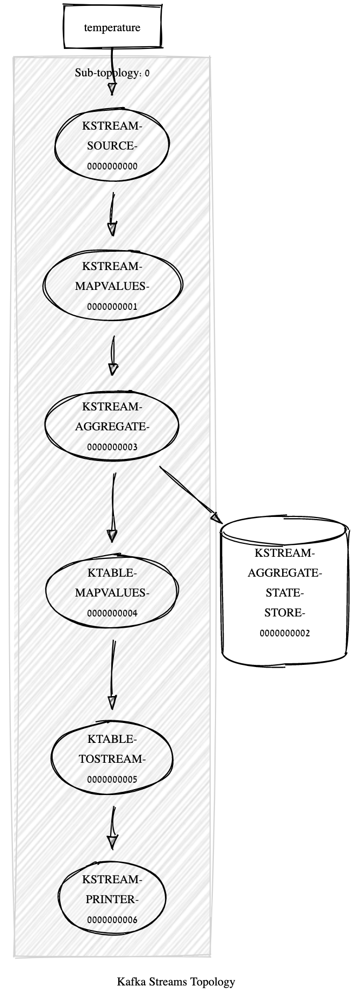

# Exercise 4: Temperature Average using Kafka Streams Window Operators.

## Before

Re-run [Premise](../exercise2/Readme.md).
Re-run [exercise 12](../exercise3/Readme.md).

or

- create a TemperatureKey and Temperature and Tuple classes
- create relative serdes
- create a temperature topic

```bash
bin/kafka-topics --bootstrap-server localhost:9092 --create \
                      --partitions 2 \
                      --replication-factor 2 \
                      --topic temperature
```

## A using processing time

We simply add a window operation to execrise 12.
This does not change the topology, i.e.,


```
Topologies:
   Sub-topology: 0
    Source: KSTREAM-SOURCE-0000000000 (topics: [temperature])
      --> KSTREAM-MAPVALUES-0000000001
    Processor: KSTREAM-MAPVALUES-0000000001 (stores: [])
      --> KSTREAM-AGGREGATE-0000000003
      <-- KSTREAM-SOURCE-0000000000
    Processor: KSTREAM-AGGREGATE-0000000003 (stores: [KSTREAM-AGGREGATE-STATE-STORE-0000000002])
      --> KTABLE-MAPVALUES-0000000004
      <-- KSTREAM-MAPVALUES-0000000001
    Processor: KTABLE-MAPVALUES-0000000004 (stores: [])
      --> KTABLE-TOSTREAM-0000000005
      <-- KSTREAM-AGGREGATE-0000000003
    Processor: KTABLE-TOSTREAM-0000000005 (stores: [])
      --> KSTREAM-PRINTER-0000000006
      <-- KTABLE-MAPVALUES-0000000004
    Processor: KSTREAM-PRINTER-0000000006 (stores: [])
      --> none
      <-- KTABLE-TOSTREAM-0000000005
```

## B using event-time

To use Event-Time we specify a timestamp extractor using 
the appropriate interface

```java
public class TemperatureTimestampExtractor implements TimestampExtractor {
       
           @Override
           public long extract(ConsumerRecord<Object, Object> record, long partitionTime) {
               if (record.prefVal() instanceof Temperature) {
                   return ((Temperature) record.prefVal()).getTimestamp();
               }
       
               throw new IllegalArgumentException("TimestampExtractor cannot recognize the record prefVal " + record.prefVal());
       
           }
       }
```

and we configure the application accordingly

```java

props.put(StreamsConfig.DEFAULT_TIMESTAMP_EXTRACTOR_CLASS_CONFIG, TemperatureTimestampExtractor.class);

```