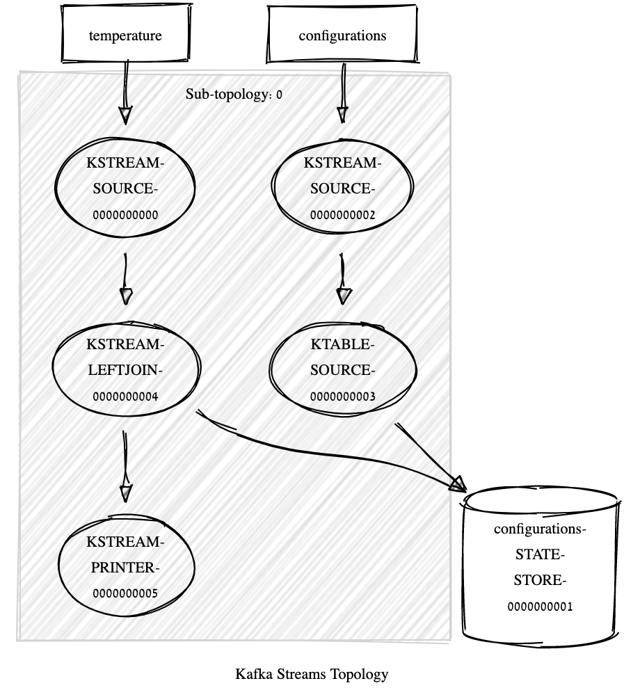

# Exercise 13: Join KStream KTable

## Before

Run [Premise](../exercise2/Readme.md).
Re-run [exercise 3](../exercise3/Readme.md).

or

- create a TemperatureKey and Temperature and Tuple classes
- create relative serdes
- create a temperature topic
- create a configuration topic co-partitioned with temperature

```bash
bin/kafka-topics --bootstrap-server localhost:9092 --create \
                      --partitions 2 \
                      --replication-factor 2 \
                      --topic configuration
```

Using the kafka stream builder we create a KTable from the configuration topic

We simply join the temperature stream and the Ktable to create an enriched stream

The topology shows how the join relies on an external state-storage.


```
Topologies:
   Sub-topology: 0
    Source: KSTREAM-SOURCE-0000000000 (topics: [temperature])
      --> KSTREAM-LEFTJOIN-0000000004
    Processor: KSTREAM-LEFTJOIN-0000000004 (stores: [configurations-STATE-STORE-0000000001])
      --> KSTREAM-PRINTER-0000000005
      <-- KSTREAM-SOURCE-0000000000
    Source: KSTREAM-SOURCE-0000000002 (topics: [configurations])
      --> KTABLE-SOURCE-0000000003
    Processor: KSTREAM-PRINTER-0000000005 (stores: [])
      --> none
      <-- KSTREAM-LEFTJOIN-0000000004
    Processor: KTABLE-SOURCE-0000000003 (stores: [configurations-STATE-STORE-0000000001])
      --> none
      <-- KSTREAM-SOURCE-0000000002
```

Question: What would happen if we update a configuration?

```java
{"location":"room0"}	{"prefVal":42,"timestamp":1584318440065,"author":"Riccardo"}
{"location":"room1"}	{"prefVal":21,"timestamp":1584318445800,"author":"John Doe"}
{"location":"room2"}	{"prefVal":33,"timestamp":1584318450806,"author":"Jane Doe"}
{"location":"room3"}	{"prefVal":24,"timestamp":1584318455811,"author":"Marvin"}
{"location":"room4"}	{"prefVal":29,"timestamp":1584318460818,"author":"Thor"}
{"location":"room1"}	{"prefVal":42,"timestamp":1584318741707,"author":"Riccardo"}
{"location":"room4"}	{"prefVal":100,"timestamp":1584318747114,"author":"Thor"}
{"location":"room2"}	{"prefVal":42,"timestamp":1584318827423,"author":"Riccardo"}
{"location":"room3"}	{"prefVal":100,"timestamp":1584318832841,"author":"Thor"}
{"location":"room2"}	{"prefVal":42,"timestamp":1584318868259,"author":"Riccardo"}
{"location":"room3"}	{"prefVal":100,"timestamp":1584318873674,"author":"Thor"}
```

```java
[KSTREAM-FILTER-0000000005]: TemperatureKey 'location' room3, RichTemperature{value=(10000,28), configuration=(1584318455811,24,Marvin)}
[KSTREAM-FILTER-0000000005]: TemperatureKey 'location' room4, RichTemperature{value=(12000,33), configuration=(1584318460818,29,Thor)}
[KSTREAM-FILTER-0000000005]: TemperatureKey 'location' room2, RichTemperature{value=(16000,34), configuration=(1584318450806,33,Jane Doe)}
[KSTREAM-FILTER-0000000005]: TemperatureKey 'location' room1, RichTemperature{value=(20000,29), configuration=(1584318445800,21,John Doe)}
[KSTREAM-FILTER-0000000005]: TemperatureKey 'location' room4, RichTemperature{value=(26000,39), configuration=(1584318460818,29,Thor)}
[KSTREAM-FILTER-0000000005]: TemperatureKey 'location' room3, RichTemperature{value=(28000,33), configuration=(1584318455811,24,Marvin)}
[KSTREAM-FILTER-0000000005]: TemperatureKey 'location' room3, RichTemperature{value=(36000,35), configuration=(1584318455811,24,Marvin)}
[KSTREAM-FILTER-0000000005]: TemperatureKey 'location' room1, RichTemperature{value=(56000,25), configuration=(1584318445800,21,John Doe)}
[KSTREAM-FILTER-0000000005]: TemperatureKey 'location' room3, RichTemperature{value=(58000,29), configuration=(1584318455811,24,Marvin)}
[KSTREAM-FILTER-0000000005]: TemperatureKey 'location' room3, RichTemperature{value=(66000,36), configuration=(1584318455811,24,Marvin)}
[KSTREAM-FILTER-0000000005]: TemperatureKey 'location' room3, RichTemperature{value=(68000,34), configuration=(1584318455811,24,Marvin)}
```