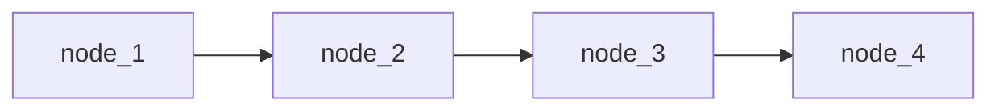
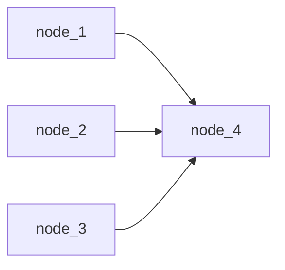
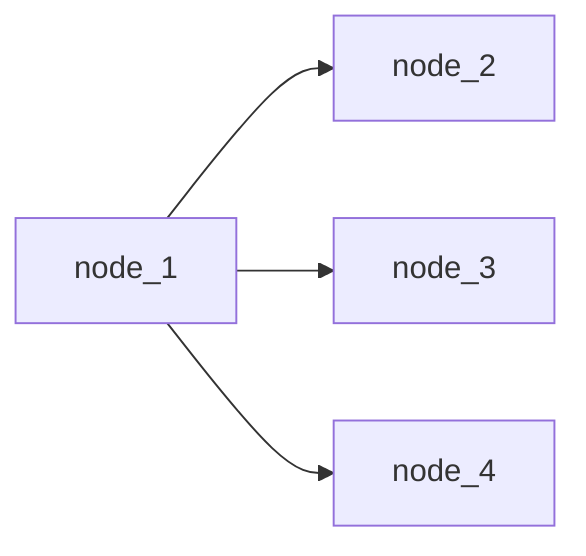

# Apache Airflow


## What Airflow is...

Apache Airflow is a dataflow orchestrator to define data engineering workflows 

Airflow allows to parallelize jobs, schedule them appropriately with dependencies and historically reprocess data when needed.

Airflow glues all the data engineering steps, i.e., ingest, transform, store.

## What Airflow is not...

A data processing tool. No processing happens in airflow, so there's no ~~need for~~ fault tolerance

Airflow does not provide any built-in workflow versioning

Airflow does not support streaming computation (talk later)[^1]

[^1]: The reason as to why Airflow does not support streaming is that there are no obvious behavior rules that could be set so that the airflow scheduler could deterministically check if it has been completed or not.


## The DAG


Airflow (and almost any orchestrato), organizes the processing in a Directed Acyclic Graph (DAG). Acyclicity is required to reduce ambiguity.

Data engineering tasks are the graph nodes,
Edges represent dependency relationships, e.g., if task 1 depends on task 2, then task 2 has to succeed.

Notably, "success" doesn't have to mean that it has been succesfully completed. It can mean that it hasn't been skipped, for instance.

## Airflow architecture

- **Web server** - nice GUI with access to the logs and most of Airflow's functionality, such as stopping and clearning DAGs.
- **Scheduler** - Puts the DAGs to action by coordinating the work to be done
- **Workers** - do the job assigned by the scheduler.


## Workflows 

Workflows are written entirely in Python

The first thing to do is to instance the DAG, declaring a dictionary with default arguments such as *start date*, *concurrency* and *schedule interval*.

```python

default_args_dict = {
    'start_date': airflow.utils.dates.days_ago(0),
    'concurrency': 1,
    'schedule_interval': None,
    'retries': 1,
    'retry_delay': datetime.timedelta(minutes=5),
}

first_dag = DAG(
    dag_id='first_dag',
    default_args=default_args_dict,
    catchup=False,
)
```


### Idiosyncrasies

If you thought it would **start** at the moment of **start**_date, you thought wrong~~, haha~~. The first task will actually start on start_date + schedule_interval.

In case you tried to run a DAG, for the first time, with a start date of let's say, 1 month ago, and a schedule interval of 5 minutes, then airflow would generate 8640 runs, which is the amount of 5 minute intervals within a month.

In case you didn't put `catchup=False` you will be in for a treat next time you start it, since airflow will re-run the DAG for $n$ schedule intervals between when you turned it off and the moment of turning it on again. 


### Backfilling


Often, we might desire to revisit the historical trends and movements. In such cases, we would need to compute metric and dimensions in the past,

Airflow has a recipe for Backfilling. You can call the command 

`backfill -s START_DATE -e END_DATE dag_id` 

from the cli, and it will rerun any DAG with the specified dates, and that way you can very effortlessly satisfy your tech lead's needs. 

## Operators

DAGs describe **how** to run a data pipeline, operators describe **what** to do in a data pipeline. 

Operators trigger data transformations, which corresponds to the **T**ransform step

### Operators: Sensors, Operators, and Transfers

- **Sensors**: waits for a certain time, external file, or upstream data source
- **Operators**: triggers a certain action (e.g. run a bash command, execute a python function, or execute a Hive query, etc)
- **Transfers**: moves data from one location to another


### DummyOperator  (1/2)

The simplest, yet not useless, operator that there is, is the dummy:

```python

task_one = DummyOperator(
    task_id='get_spreadsheet',
    dag=first_dag,
    depends_on_past=False,
)

```

Operators are declared similarly as dags, and only require two arguments at first:

* `task_id` = unique id for the operator 
* `dag` = which dag does does this operator belong to? Because there can be sub-dags, this needs to be declared explicitly. 

--- 

### DummyOperator  (2/2)

In practice, the dummy operator does nothing, but it can be used to do two things:

* sketching a dag out
* trigger rule sorcery

More often than not we would like to visualize an ETL process in the least time-wasting manner as possible. 


### Non Dummy Operators

Most of airflow's operators function in a similar way. 

* `PostgreSQL` allows you to communicate with postgres instances.
* `BashOperator` allows you to run shell scripts
* `PythonOperator` allows you to run Python code

### BashOperator

Let us define a non-dummy operator, that runs a bash command:

```python

task_one = BashOperator(
    task_id='get_spreadsheet',
    dag=first_dag,
    bash_command="curl http://www.gerbode.net/spreadsheet.xlsx --output /usr/local/airflow/data/{{ds_nodash}}.xlsx",
	trigger_rule='all_success',
	depends_on_past=False

)


```


- `bash_command`- in case you know bash, you have already figured it out that this works almost exactly as typing `bash -c "some command"`

- `depends_on_past=False` means that if it failed during the previous dag run then it won't run this time. This is important because, as we've seen, airflow can have overlapping dag runs.

---


### Python Operator

The last part we have to go over is both the briefest and most important, the Python Operator:

Very similar to the bash operator, having `task_id`, `dag`, `trigger_rule` and `depends_on_past`, as pretty much any other operator.

Python Operator takes a function as an input `python callable`, that is where the python part of the python operator lies at. The callable's arguments are given by the `op_kwargs` dictionary, which also allows you to template these arguments.


```python

task_one = PythonOperator(
    task_id='get_spreadsheet',
    dag=second_dag,
    python_callable=_get_spreadsheet,
    op_kwargs={
        "output_folder": "/usr/local/airflow/data",
        "epoch": "{{ execution_date.int_timestamp }}",
        "url": "http://www.gerbode.net/spreadsheet.xlsx"
    },
    trigger_rule='all_success',
    depends_on_past=False,
)	
```

## Task Relationships 

The directed relationships are given by the edges, and are very easily defined as follows, written at the end of the DAG file:


```python

node_1 >> node_2 >> node_3 >> node_4

```


Looks like




### Example

We want to show that the ETL process starts with `get_spreadsheet`, then its format is transmuted to a proper csv on `transmute_to_csv`, which is then filtered by time, `time_filter` to be loaded somewhere,`load`.

```python

get_spreadsheet >> transmute_to_csv >> time_filter >> load

```

Will yield the following sequential configuration:


### N-Ary Relationships

many-to-one or one-to-many relationships are encoded as lists, so you can put to code that many nodes have an edge to one node as follows:

```python

[node_1, node_2, node_3] >> node_4

```




### and one to many:

```python

node_1 >> [node_2, node_3, node_4]

```





### Example

[.column]
Let's say that you have to create an ETL process entirely done in the cloud, and we define the following tasks:

- `dataproc_start` - we use the google CreateDataProc operator in order to start a dataproc cluster that will be used to run pyspark scripts.
- `submit_ingest_one` - next up we create a data processing step to submit a pyspark job that will ingest data from somewhere, and will also be processed further. However, we want to make it so that if this fails, then whatever comes next fails as well.
- `submit_ingest_two, submit_ingest_three` - the same as `submit_ingest_one` except no other process depends on it
- `coalesce` - after all tasks have finished their execution, we would like to turn off the cluster.

[.column]

We could define that with the following edge configuration:

```python

dataproc_start >> 
	[dataproc_ingest_one, dataproc_ingest_two, dataproc_ingest_three]
dataproc_ingest_one 
	>> dataproc_create_clickout
	
[dataproc_create_clickout, 
	dataproc_ingest_two, 
		dataproc_ingest_three] >> end

```

 

## Trigger Rules

Trigger rules are, in airflow-speech, a name for how should the node at the end of the edge behave when some exit status comes out of its parents.

Trigger rules can be added to any operator with the argument `trigger_rule`, and there are quite a couple for you to choose from, out of which the following are easily exemplified:

* `all_success` - use this when you want everything to work in the most obvious way as possible, and whatever you are doing happens to be very linear.
* `all_done` - this is very often used whenever there's a cluster start or end job. For instance, let's say that irrespective of the parent tasks status, given that they have finished their execution, you would like this task to run anyways. It's commonly used to shut down a cluster.
* `none_failed` - is most often than not paired with the branching operator. Maybe you will need to send the data through a different path in the dag and thus it is acceptable to skip a chunk of it. If you want your dag execution to continue, you have to make it so that the parent tasks were either skipped or successfully completed.
* `all_failed` - ~~pair this one up with a callback so you can notify yourself of getting fired~~

---

