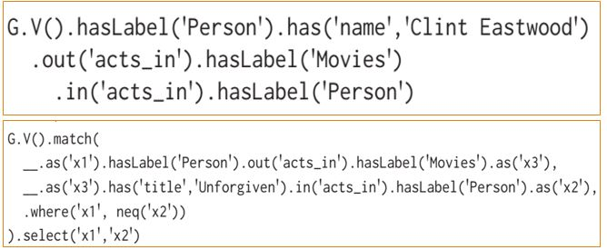

### Titan Graph DB[^3]

-   Another open-source distributed transactional graph database.

-   It that provides linear elasticity and scalability for growing data, data distribution, and replication for fault-tolerance and performance.

-   It supports ACID and different storage back-ends such as Apache HBase and Apache Cassandra.

-   Titan also uses the Gremlin query language, in which traversal operators are chained together to form path-oriented expressions to retrieve data from the graph and modify them.

### Gremlin[^5] -- The Titan DB Query Language

-   Gremlin is a query language used to retrieve data from and modify data in the graph. Gremlin is a component of Apache TinkerPop.

-   Gremlin is a path-oriented language which succinctly expresses complex graph traversals and mutation operations.

-   Gremlin is a functional language whereby traversal operators are chained together to form path-like expressions.

### Graph Patterns in Action: Gremlin

-   Although Gremlin is also specified with the property graph model in mind, it differs quite significantly from the previous two declarative languages and has a more "functional" feel.

-   Likewise, its focus is on navigational queries rather than matching patterns; however, amongst the "graph traversal" operations that it defines, we can find familiar graph pattern matching features.

-   Example: The following Gremlin traversal allows us to obtain all co-actors of *"Clint Eastwood"*.

-   Gremlin: PROJECTION this example adds a projection to return only results for the x1 and x2 variables.

